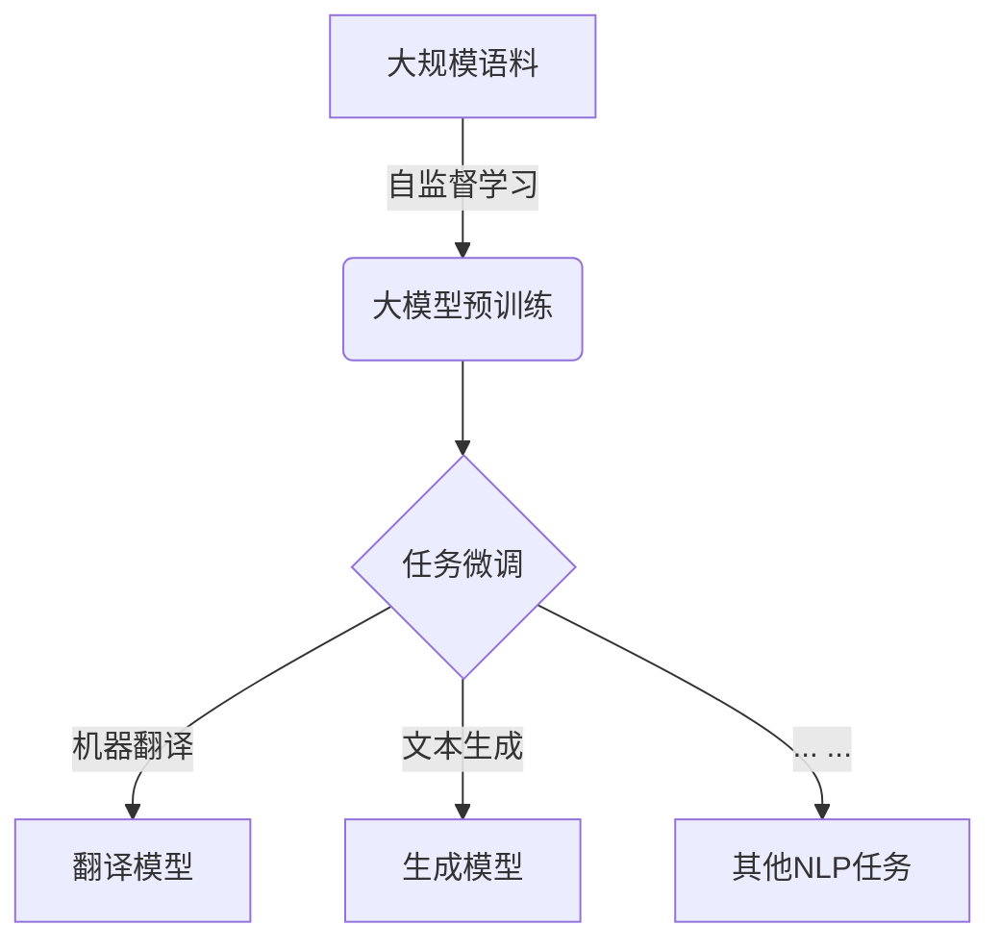

# 大模型在机器翻译中的应用：跨越语言壁垒

## 1. 背景介绍

### 1.1 语言的多样性与机器翻译的需求

在这个地球村,不同国家、不同民族之间的交流与合作日益频繁。然而,语言的差异往往构成了一道无形的障碍,阻碍着人们之间的理解与沟通。为了克服这一障碍,机器翻译技术应运而生,旨在提供高质量、实时的跨语言翻译服务。

### 1.2 机器翻译发展历程

早期的机器翻译系统主要采用基于规则的方法,依赖于语言学家手工编写的翻译规则。尽管取得了一些成果,但由于语言的复杂性和多样性,这种方法难以获得令人满意的翻译质量。

随着统计机器翻译技术的兴起,机器翻译的性能得到了显著提升。该技术基于大量的人工翻译语料,利用统计学习算法自动建模,从而实现更加准确的翻译。不过,统计机器翻译也存在一些局限性,如难以处理语义歧义和长距离依赖等问题。

### 1.3 大模型时代的到来

近年来,benefiting from大模型的发展,机器翻译技术再次迎来了飞跃式进步。大模型是一种基于深度学习的语言模型,能够从海量语料中自主学习语言知识,并应用于各种自然语言处理任务,包括机器翻译。

大模型凭借其强大的语言理解和生成能力,为机器翻译带来了全新的机遇和挑战。本文将重点探讨大模型在机器翻译领域的应用,包括核心概念、算法原理、实践案例等,旨在为读者提供一个全面而深入的视角。

## 2. 核心概念与联系

### 2.1 大模型概述

大模型是一种基于深度学习的语言模型,具有极大的参数量和计算能力。它能够从海量语料中自主学习语言知识,并应用于各种自然语言处理任务。常见的大模型包括GPT(Generative Pre-trained Transformer)、BERT(Bidirectional Encoder Representations from Transformers)等。

大模型的核心思想是通过自监督学习(Self-Supervised Learning)的方式,在大规模语料上进行预训练,获取通用的语言表示能力。之后,可以在此基础上,通过少量的任务特定数据进行微调(Fine-tuning),从而快速适应特定的自然语言处理任务。



### 2.2 大模型在机器翻译中的应用

在机器翻译领域,大模型可以作为编码器-解码器(Encoder-Decoder)模型的基础,用于源语言到目标语言的转换。编码器负责将源语言输入序列编码为语义表示,而解码器则根据该语义表示生成目标语言输出序列。

大模型预训练后获得的语言表示能力,有助于编码器更好地理解源语言的语义信息,同时也有利于解码器生成更加流畅、自然的目标语言序列。此外,大模型的多语言能力还可以支持多语种之间的无约束翻译。


## 3. 核心算法原理具体操作步骤

### 3.1 自监督预训练

大模型的预训练过程是通过自监督学习实现的,主要采用两种策略:Masked Language Modeling(MLM)和Next Sentence Prediction(NSP)。

1. **Masked Language Modeling(MLM)**

MLM的基本思想是在输入序列中随机掩蔽部分词元(token),然后让模型基于上下文预测被掩蔽的词元。通过这种方式,模型可以学习到词元之间的关系,从而获得更好的语言理解能力。

具体操作步骤如下:

1) 从语料库中随机采样一个序列作为输入
2) 在输入序列中随机选择15%的词元进行掩蔽,其中80%直接替换为[MASK]标记,10%替换为随机词元,剩余10%保持不变
3) 将掩蔽后的序列输入到模型中,模型需要预测被掩蔽的词元
4) 计算预测结果与真实标签之间的损失,并基于该损失进行模型参数更新

2. **Next Sentence Prediction(NSP)**

NSP的目标是判断两个句子是否为连续的句子对。这有助于模型捕捉句子之间的关系和语境信息。

具体操作步骤如下:

1) 从语料库中随机采样两个句子,构成一个句子对
2) 以50%的概率保留原始句子对顺序,50%的概率随机交换两个句子的顺序
3) 将句子对输入到模型中,模型需要预测两个句子是否为连续的句子对
4) 计算预测结果与真实标签之间的损失,并基于该损失进行模型参数更新

通过MLM和NSP的联合预训练,大模型可以获得丰富的语言知识,为后续的任务微调奠定基础。

### 3.2 任务微调

在完成预训练后,大模型需要针对特定的自然语言处理任务(如机器翻译)进行微调,以获得更好的性能。

以机器翻译任务为例,微调的具体步骤如下:

1) 准备机器翻译数据集,包括源语言输入和目标语言输出
2) 在预训练模型的基础上,添加一个新的输出层,用于生成目标语言序列
3) 以teacher-forcing的方式,将源语言输入和目标语言输出序列输入到模型中进行训练
4) 计算模型预测结果与真实目标语言序列之间的损失,并基于该损失进行模型参数更新
5) 在验证集上评估模型性能,直至达到预期的翻译质量

通过微调,大模型可以针对机器翻译任务进行特征化,从而获得更好的翻译性能。

## 4. 数学模型和公式详细讲解举例说明

### 4.1 Transformer模型

Transformer是大模型中广泛采用的一种模型架构,它基于自注意力(Self-Attention)机制,能够有效捕捉输入序列中的长距离依赖关系。

Transformer模型的核心思想是将序列建模问题转化为序列到序列(Sequence-to-Sequence)的映射问题。它由编码器(Encoder)和解码器(Decoder)两个子模块组成。

1. **编码器(Encoder)**

编码器的主要作用是将源语言输入序列映射为语义表示,其中每个位置的表示都依赖于整个输入序列。编码器由多个相同的层组成,每层包含两个子层:多头自注意力机制(Multi-Head Self-Attention)和前馈神经网络(Feed-Forward Neural Network)。

编码器的计算过程可以表示为:

$$H^{enc} = Encoder(X)$$

其中,X是源语言输入序列,H^{enc}是编码器输出的语义表示序列。

2. **解码器(Decoder)**

解码器的作用是根据编码器输出的语义表示序列,生成目标语言输出序列。解码器的结构与编码器类似,也由多个相同的层组成,每层包含三个子层:掩蔽的多头自注意力机制(Masked Multi-Head Self-Attention)、编码器-解码器注意力机制(Encoder-Decoder Attention)和前馈神经网络。

解码器的计算过程可以表示为:

$$Y = Decoder(H^{enc}, Y_{<t})$$

其中,Y_{<t}是解码器在时间步t之前生成的目标语言序列,Y是最终生成的完整目标语言序列。

3. **注意力机制(Attention Mechanism)**

注意力机制是Transformer模型的核心,它能够捕捉输入序列中任意两个位置之间的依赖关系。

给定一个查询向量q、键向量k和值向量v,注意力机制的计算过程如下:

$$Attention(Q, K, V) = softmax(\frac{QK^T}{\sqrt{d_k}})V$$

其中,d_k是缩放因子,用于防止内积值过大导致softmax函数的梯度较小。

多头注意力机制(Multi-Head Attention)是通过将注意力机制分成多个并行的"头"来实现的,每个"头"都会独立地学习不同的注意力表示,最后将这些表示进行拼接得到最终的注意力表示。

### 4.2 机器翻译损失函数

在机器翻译任务中,常用的损失函数是交叉熵损失(Cross-Entropy Loss),它衡量了模型预测的目标语言序列与真实序列之间的差异。

设Y'为模型预测的目标语言序列,Y为真实的目标语言序列,则交叉熵损失可以表示为:

$$\mathcal{L}(Y, Y') = -\sum_{t=1}^{T}\log P(y_t|y_{<t}, X)$$

其中,T是目标语言序列的长度,P(y_t|y_{<t}, X)表示在给定源语言输入X和之前的目标语言序列y_{<t}的条件下,正确预测第t个词元y_t的概率。

在训练过程中,我们需要最小化该损失函数,从而使模型预测的序列尽可能接近真实序列。

### 4.3 BLEU评价指标

BLEU(Bilingual Evaluation Understudy)是机器翻译领域中广泛使用的一种自动评价指标,用于衡量机器翻译输出与人工参考翻译之间的相似度。

BLEU的计算过程如下:

1) 计算n-gram精确度(n-gram Precision)

对于给定的n-gram长度N(通常取值为1到4),计算机器翻译输出中的n-gram与参考翻译中的n-gram的匹配程度。

$$P_n = \frac{\sum_{C \in \text{Candidates}} \sum_{n-gram \in C} \text{Count}_{clip}(n-gram)}{\sum_{C' \in \text{Candidates}} \sum_{n-gram' \in C'} \text{Count}(n-gram')}$$

其中,Count_{clip}(n-gram)表示n-gram在机器翻译输出中出现的次数,与参考翻译中出现次数的最小值。

2) 计算brevity penalty(BP)

BP是一个惩罚项,用于惩罚过短的机器翻译输出。

$$BP = \begin{cases}
1 & \text{if } c > r \\
e^{(1 - r/c)} & \text{if } c \leq r
\end{cases}$$

其中,c是机器翻译输出的长度,r是参考翻译的有效长度。

3) 计算BLEU分数

BLEU分数是n-gram精确度的几何平均,乘以brevity penalty。

$$BLEU = BP \cdot \exp(\sum_{n=1}^{N} w_n \log P_n)$$

其中,w_n是每个n-gram长度的权重,通常设置为相同的值。

BLEU分数的取值范围是0到1,值越高表示机器翻译输出与参考翻译越接近。

## 5. 项目实践:代码实例和详细解释说明

为了更好地理解大模型在机器翻译中的应用,我们将基于Hugging Face的Transformers库,提供一个基于BART(Bidirectional and Auto-Regressive Transformers)模型的英德翻译示例。

### 5.1 安装依赖库

```python
!pip install transformers datasets
```

### 5.2 导入所需库

```python
from transformers import BartForConditionalGeneration, BartTokenizer
import torch
```

### 5.3 加载预训练模型和分词器

```python
model = BartForConditionalGeneration.from_pretrained("facebook/bart-large")
tokenizer = BartTokenizer.from_pretrained("facebook/bart-large", src_lang="en_XX", tgt_lang="de_DE")
```

### 5.4 定义翻译函数

```python
def translate(text):
    input_ids = tokenizer.encode(text, return_tensors="pt")
    output_ids = model.generate(input_ids)[0]
    translation = tokenizer.decode(output_ids, skip_special_tokens=True)
    return translation
```

### 5.5 进行翻译

```python
text = "Hello, how are you?"
translation = translate(text)
print(f"Source: {text}")
print(f"Translation: {translation}")
```