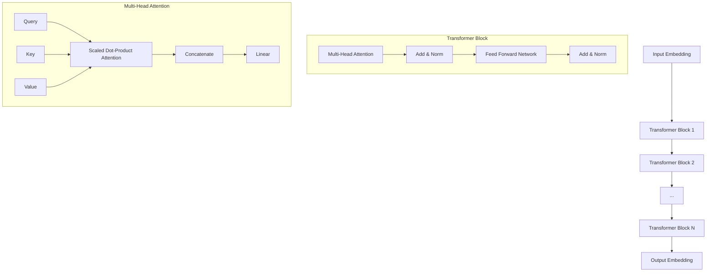

# 大规模语言模型从理论到实践 LLaMA的模型结构

## 1. 背景介绍
### 1.1 大规模语言模型的发展历程
#### 1.1.1 早期的语言模型
#### 1.1.2 Transformer的出现
#### 1.1.3 GPT系列模型的演进
### 1.2 LLaMA模型的诞生
#### 1.2.1 Meta AI的研究进展
#### 1.2.2 LLaMA模型的特点和优势
#### 1.2.3 LLaMA模型的开源计划

## 2. 核心概念与联系
### 2.1 Transformer架构
#### 2.1.1 Self-Attention机制
#### 2.1.2 Multi-Head Attention
#### 2.1.3 Feed Forward Network
### 2.2 预训练和微调
#### 2.2.1 无监督预训练
#### 2.2.2 有监督微调
#### 2.2.3 Zero-Shot和Few-Shot学习
### 2.3 LLaMA模型的关键创新点
#### 2.3.1 高效的模型架构设计
#### 2.3.2 大规模数据集的构建
#### 2.3.3 训练策略的优化

## 3. 核心算法原理具体操作步骤
### 3.1 LLaMA模型的总体架构
#### 3.1.1 Encoder-Decoder结构
#### 3.1.2 Transformer Block的堆叠
#### 3.1.3 Embedding层和Output层
### 3.2 Self-Attention的计算过程
#### 3.2.1 Query、Key、Value的计算
#### 3.2.2 Scaled Dot-Product Attention
#### 3.2.3 Mask机制的应用
### 3.3 前向传播和反向传播
#### 3.3.1 前向传播的计算流程
#### 3.3.2 反向传播和梯度更新
#### 3.3.3 优化器的选择和参数设置

## 4. 数学模型和公式详细讲解举例说明
### 4.1 Self-Attention的数学表示
#### 4.1.1 Query、Key、Value的矩阵计算
#### 4.1.2 Scaled Dot-Product Attention的公式推导
#### 4.1.3 Multi-Head Attention的数学表示
### 4.2 Feed Forward Network的数学表示
#### 4.2.1 全连接层的矩阵计算
#### 4.2.2 激活函数的选择和应用
#### 4.2.3 残差连接和Layer Normalization
### 4.3 损失函数和优化算法
#### 4.3.1 交叉熵损失函数
#### 4.3.2 AdamW优化器
#### 4.3.3 学习率调度策略

## 5. 项目实践：代码实例和详细解释说明
### 5.1 LLaMA模型的PyTorch实现
#### 5.1.1 模型结构的定义
#### 5.1.2 数据加载和预处理
#### 5.1.3 训练循环和验证
### 5.2 使用LLaMA模型进行推理
#### 5.2.1 模型加载和权重初始化
#### 5.2.2 输入数据的准备和编码
#### 5.2.3 生成结果的解码和后处理
### 5.3 LLaMA模型的微调和应用
#### 5.3.1 针对特定任务的微调策略
#### 5.3.2 Zero-Shot和Few-Shot的应用示例
#### 5.3.3 模型部署和服务化

## 6. 实际应用场景
### 6.1 自然语言理解
#### 6.1.1 文本分类
#### 6.1.2 命名实体识别
#### 6.1.3 关系抽取
### 6.2 自然语言生成
#### 6.2.1 文本摘要
#### 6.2.2 对话生成
#### 6.2.3 故事生成
### 6.3 跨语言任务
#### 6.3.1 机器翻译
#### 6.3.2 跨语言文本分类
#### 6.3.3 跨语言信息检索

## 7. 工具和资源推荐
### 7.1 开源框架和库
#### 7.1.1 PyTorch
#### 7.1.2 Transformers
#### 7.1.3 Hugging Face
### 7.2 预训练模型和数据集
#### 7.2.1 LLaMA模型的预训练权重
#### 7.2.2 常用的NLP数据集
#### 7.2.3 数据增强和预处理工具
### 7.3 模型评估和可视化
#### 7.3.1 评估指标和工具
#### 7.3.2 可视化工具和技术
#### 7.3.3 模型解释和分析方法

## 8. 总结：未来发展趋势与挑战
### 8.1 大规模语言模型的发展趋势
#### 8.1.1 模型规模的持续增长
#### 8.1.2 多模态融合和交互
#### 8.1.3 个性化和适应性调整
### 8.2 面临的挑战和问题
#### 8.2.1 计算资源和训练成本
#### 8.2.2 数据隐私和安全
#### 8.2.3 模型的可解释性和公平性
### 8.3 未来的研究方向和机遇
#### 8.3.1 更高效的模型架构设计
#### 8.3.2 无监督和自监督学习
#### 8.3.3 跨领域和跨模态的迁移学习

## 9. 附录：常见问题与解答
### 9.1 LLaMA模型与GPT系列模型的区别
### 9.2 如何选择合适的预训练模型和微调策略
### 9.3 训练大规模语言模型需要哪些硬件资源
### 9.4 如何处理训练过程中的梯度消失和梯度爆炸问题
### 9.5 大规模语言模型在实际应用中的局限性和风险

LLaMA（Large Language Model Meta AI）是由Meta AI研发的大规模语言模型，旨在通过高效的模型架构设计和大规模数据训练，实现在各种自然语言处理任务上的卓越表现。LLaMA模型基于Transformer架构，采用了多层的Encoder-Decoder结构，通过Self-Attention机制和Feed Forward Network的组合，能够有效地捕捉文本序列中的长距离依赖关系，生成连贯且语义丰富的文本。

LLaMA模型的一个关键创新点在于其高效的模型架构设计。通过引入了一些新颖的技术，如参数共享、梯度检查点和混合精度训练等，LLaMA模型在保持模型性能的同时，大幅降低了计算资源的需求和训练时间。这使得LLaMA模型能够在更短的时间内完成大规模数据集上的预训练，并在下游任务上实现快速的微调和应用。

在实际应用中，LLaMA模型展现出了强大的性能和广泛的适用性。无论是自然语言理解任务，如文本分类、命名实体识别和关系抽取，还是自然语言生成任务，如文本摘要、对话生成和故事生成，LLaMA模型都能够取得优异的结果。此外，LLaMA模型还展示了在跨语言任务上的优势，如机器翻译、跨语言文本分类和跨语言信息检索等。

尽管LLaMA模型已经取得了显著的进展，但仍然面临着一些挑战和问题。其中，计算资源和训练成本是一个重要的制约因素。训练大规模语言模型需要大量的计算资源和时间，这对于许多研究机构和企业来说是一个挑战。此外，数据隐私和安全、模型的可解释性和公平性等问题也需要引起重视和解决。

未来，大规模语言模型的发展趋势将继续向着模型规模的增长、多模态融合和个性化适应等方向发展。研究人员将探索更高效的模型架构设计，利用无监督和自监督学习方法，实现跨领域和跨模态的迁移学习。这些研究方向和机遇将推动大规模语言模型的进一步发展，为自然语言处理领域带来更多的突破和应用。

总之，LLaMA模型代表了大规模语言模型的最新进展和发展方向。通过创新的模型架构设计和大规模数据训练，LLaMA模型在各种自然语言处理任务上取得了卓越的表现。尽管仍然面临着一些挑战和问题，但LLaMA模型的出现为自然语言处理领域注入了新的活力，为未来的研究和应用开辟了广阔的前景。

作者：禅与计算机程序设计艺术 / Zen and the Art of Computer Programming