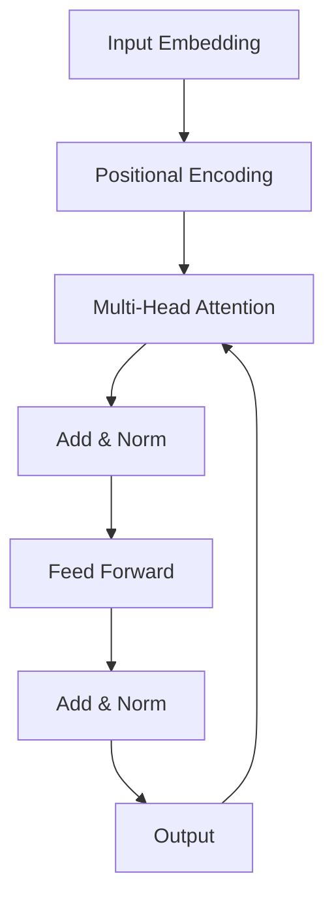

# 大规模语言模型从理论到实践 Transformer结构

## 1. 背景介绍
### 1.1 大规模语言模型的发展历程
#### 1.1.1 早期的语言模型
#### 1.1.2 神经网络语言模型的兴起
#### 1.1.3 Transformer的诞生与发展

### 1.2 Transformer在大规模语言模型中的重要性
#### 1.2.1 Transformer的优势
#### 1.2.2 Transformer在各领域的应用
#### 1.2.3 Transformer的发展前景

## 2. 核心概念与联系
### 2.1 Transformer的核心概念
#### 2.1.1 注意力机制(Attention Mechanism)
#### 2.1.2 自注意力(Self-Attention)
#### 2.1.3 多头注意力(Multi-Head Attention)
#### 2.1.4 位置编码(Positional Encoding)

### 2.2 Transformer中的关键组件
#### 2.2.1 编码器(Encoder)
#### 2.2.2 解码器(Decoder) 
#### 2.2.3 前馈神经网络(Feed-Forward Neural Network)
#### 2.2.4 残差连接与层归一化(Residual Connection & Layer Normalization)

### 2.3 Transformer与其他模型的联系与区别
#### 2.3.1 与RNN、LSTM的比较
#### 2.3.2 与卷积神经网络(CNN)的比较
#### 2.3.3 Transformer的独特优势

## 3. 核心算法原理具体操作步骤
### 3.1 自注意力机制的计算过程
#### 3.1.1 计算查询(Query)、键(Key)、值(Value)
#### 3.1.2 计算注意力权重
#### 3.1.3 加权求和获得输出

### 3.2 多头注意力的并行计算
#### 3.2.1 多头注意力的拆分
#### 3.2.2 并行计算各头的注意力
#### 3.2.3 合并多头注意力的结果

### 3.3 位置编码的生成与应用
#### 3.3.1 正弦和余弦函数位置编码
#### 3.3.2 将位置编码加入到输入表示中
#### 3.3.3 位置编码的作用与效果

## 4. 数学模型和公式详细讲解举例说明
### 4.1 自注意力的数学表示
#### 4.1.1 查询、键、值的计算公式
$$
Q = X W^Q, K = X W^K, V = X W^V
$$
其中，$X$为输入序列，$W^Q, W^K, W^V$为可学习的权重矩阵。

#### 4.1.2 注意力权重的计算公式
$$
\text{Attention}(Q, K, V) = \text{softmax}(\frac{QK^T}{\sqrt{d_k}})V
$$
其中，$d_k$为键的维度，用于缩放点积结果。

### 4.2 多头注意力的数学表示
#### 4.2.1 多头注意力的计算公式
$$
\text{MultiHead}(Q, K, V) = \text{Concat}(\text{head}_1, ..., \text{head}_h)W^O
$$
$$
\text{head}_i = \text{Attention}(QW_i^Q, KW_i^K, VW_i^V)
$$
其中，$W_i^Q, W_i^K, W_i^V$为第$i$个头的权重矩阵，$W^O$为输出的线性变换矩阵。

### 4.3 位置编码的数学表示
#### 4.3.1 正弦和余弦函数位置编码公式
$$
PE_{(pos,2i)} = \sin(pos / 10000^{2i/d_{model}})
$$
$$
PE_{(pos,2i+1)} = \cos(pos / 10000^{2i/d_{model}})
$$
其中，$pos$为位置，$i$为维度，$d_{model}$为模型的维度。

## 5. 项目实践：代码实例和详细解释说明
### 5.1 使用PyTorch实现Transformer
#### 5.1.1 编码器的实现
```python
class TransformerEncoder(nn.Module):
    def __init__(self, d_model, nhead, dim_feedforward, nlayers, dropout=0.1):
        super(TransformerEncoder, self).__init__()
        encoder_layer = nn.TransformerEncoderLayer(d_model, nhead, dim_feedforward, dropout)
        self.transformer_encoder = nn.TransformerEncoder(encoder_layer, nlayers)
        
    def forward(self, src):
        return self.transformer_encoder(src)
```

#### 5.1.2 解码器的实现
```python
class TransformerDecoder(nn.Module):
    def __init__(self, d_model, nhead, dim_feedforward, nlayers, dropout=0.1):
        super(TransformerDecoder, self).__init__()
        decoder_layer = nn.TransformerDecoderLayer(d_model, nhead, dim_feedforward, dropout)
        self.transformer_decoder = nn.TransformerDecoder(decoder_layer, nlayers)
        
    def forward(self, tgt, memory):
        return self.transformer_decoder(tgt, memory)
```

### 5.2 使用TensorFlow实现Transformer
#### 5.2.1 位置编码的实现
```python
def get_angles(pos, i, d_model):
    angle_rates = 1 / np.power(10000, (2 * (i//2)) / np.float32(d_model))
    return pos * angle_rates

def positional_encoding(position, d_model):
    angle_rads = get_angles(np.arange(position)[:, np.newaxis],
                            np.arange(d_model)[np.newaxis, :],
                            d_model)
    
    angle_rads[:, 0::2] = np.sin(angle_rads[:, 0::2])
    angle_rads[:, 1::2] = np.cos(angle_rads[:, 1::2])
    
    pos_encoding = angle_rads[np.newaxis, ...]
    
    return tf.cast(pos_encoding, dtype=tf.float32)
```

#### 5.2.2 多头注意力的实现
```python
class MultiHeadAttention(tf.keras.layers.Layer):
    def __init__(self, d_model, num_heads):
        super(MultiHeadAttention, self).__init__()
        self.num_heads = num_heads
        self.d_model = d_model
        
        assert d_model % self.num_heads == 0
        
        self.depth = d_model // self.num_heads
        
        self.wq = tf.keras.layers.Dense(d_model)
        self.wk = tf.keras.layers.Dense(d_model)
        self.wv = tf.keras.layers.Dense(d_model)
        
        self.dense = tf.keras.layers.Dense(d_model)
        
    def split_heads(self, x, batch_size):
        x = tf.reshape(x, (batch_size, -1, self.num_heads, self.depth))
        return tf.transpose(x, perm=[0, 2, 1, 3])
    
    def call(self, v, k, q, mask):
        batch_size = tf.shape(q)[0]
        
        q = self.wq(q)
        k = self.wk(k)
        v = self.wv(v)
        
        q = self.split_heads(q, batch_size)
        k = self.split_heads(k, batch_size)
        v = self.split_heads(v, batch_size)
        
        scaled_attention, attention_weights = scaled_dot_product_attention(q, k, v, mask)
        
        scaled_attention = tf.transpose(scaled_attention, perm=[0, 2, 1, 3])
        
        concat_attention = tf.reshape(scaled_attention, (batch_size, -1, self.d_model))
        
        output = self.dense(concat_attention)
        
        return output, attention_weights
```

## 6. 实际应用场景
### 6.1 机器翻译
#### 6.1.1 Transformer在机器翻译中的应用
#### 6.1.2 Transformer相比传统方法的优势
#### 6.1.3 基于Transformer的机器翻译系统案例

### 6.2 文本摘要
#### 6.2.1 Transformer在文本摘要任务中的应用
#### 6.2.2 使用Transformer生成高质量摘要
#### 6.2.3 基于Transformer的文本摘要系统案例

### 6.3 对话系统
#### 6.3.1 Transformer在对话系统中的应用
#### 6.3.2 使用Transformer构建智能对话系统
#### 6.3.3 基于Transformer的对话系统案例

## 7. 工具和资源推荐
### 7.1 开源框架和库
#### 7.1.1 PyTorch中的Transformer实现
#### 7.1.2 TensorFlow中的Transformer实现
#### 7.1.3 Hugging Face的Transformers库

### 7.2 预训练模型
#### 7.2.1 BERT(Bidirectional Encoder Representations from Transformers)
#### 7.2.2 GPT(Generative Pre-trained Transformer)
#### 7.2.3 T5(Text-to-Text Transfer Transformer)

### 7.3 学习资源
#### 7.3.1 Transformer论文解读
#### 7.3.2 在线课程与教程
#### 7.3.3 社区与论坛

## 8. 总结：未来发展趋势与挑战
### 8.1 Transformer的发展趋势
#### 8.1.1 模型规模的不断扩大
#### 8.1.2 预训练范式的演进
#### 8.1.3 跨领域应用的拓展

### 8.2 Transformer面临的挑战
#### 8.2.1 计算资源与效率问题
#### 8.2.2 模型的可解释性与可控性
#### 8.2.3 数据隐私与安全问题

### 8.3 未来研究方向
#### 8.3.1 轻量化与模型压缩
#### 8.3.2 知识增强与融合
#### 8.3.3 多模态Transformer模型

## 9. 附录：常见问题与解答
### 9.1 Transformer相比RNN、CNN的优势是什么？
### 9.2 如何理解Transformer中的自注意力机制？
### 9.3 位置编码在Transformer中的作用是什么？
### 9.4 如何处理Transformer中的长序列问题？
### 9.5 Transformer能否应用于图像、语音等其他领域？

作者：禅与计算机程序设计艺术 / Zen and the Art of Computer Programming



上图展示了Transformer的核心结构，主要包括以下几个部分：

1. 输入嵌入(Input Embedding)：将输入序列转换为向量表示。
2. 位置编码(Positional Encoding)：为模型引入序列中单词的位置信息。
3. 多头注意力(Multi-Head Attention)：通过多个注意力头并行计算，捕捉序列中不同位置之间的依赖关系。
4. 残差连接与层归一化(Add & Norm)：将注意力层的输出与输入相加，并进行层归一化，有助于模型的训练和收敛。
5. 前馈神经网络(Feed Forward)：通过两层全连接网络对特征进行非线性变换。
6. 输出(Output)：将Transformer的输出传递给下一层或用于预测。

Transformer通过堆叠多个编码器和解码器层，构建出强大的序列到序列模型。其中，编码器负责对输入序列进行编码，解码器则根据编码器的输出和之前的预测结果，生成目标序列。

Transformer的核心创新在于引入了自注意力机制，替代了传统的循环神经网络和卷积神经网络。通过自注意力机制，Transformer能够在序列的任意两个位置之间建立直接的依赖关系，无需考虑它们之间的距离。这使得Transformer能够更好地处理长距离依赖，并且计算效率更高，因为可以并行计算注意力权重。

多头注意力机制通过将注意力拆分为多个头，让模型能够在不同的子空间中捕捉不同的依赖关系。这进一步增强了模型的表达能力和泛化能力。

在实际应用中，Transformer已经在机器翻译、文本摘要、对话系统等任务中取得了显著的成果。许多先进的预训练语言模型，如BERT、GPT、T5等，都是基于Transformer结构构建的。这些模型通过在大规模语料库上进行预训练，能够学习到丰富的语言知识和上下文信息，进而在下游任务中取得优异的表现。

随着计算资源的不断增长和训练数据的不断扩大，Transformer模型的规模也在不断增大。越来越多的研究工作开始探索如何构建更加强大、高效、可解释的Transformer模型，以应对实际应用中的各种挑战。

未来，Transformer有望在更多领域得到应用，如图像、语音、视频等。同时，如何设计轻量化的Transformer模型，如何将知识融入到Transformer中，如何构建多模态Transformer模型，都是值得关注的研究方向。

总之，Transformer