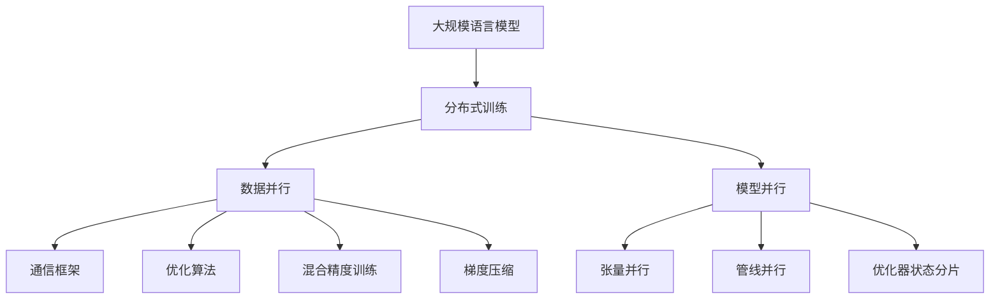
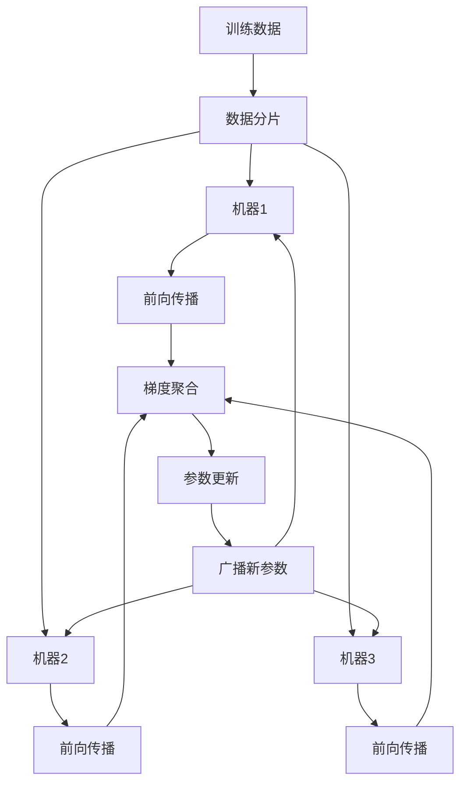
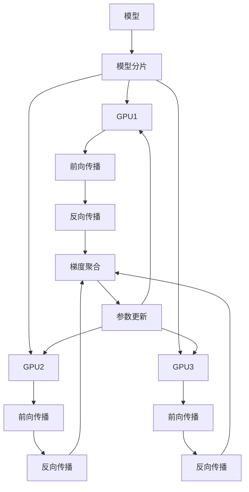
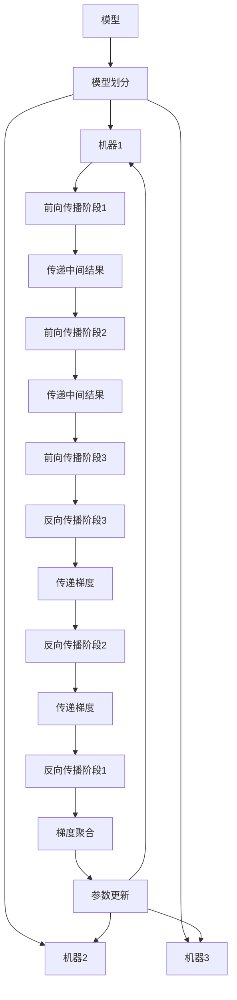

# 大规模语言模型从理论到实践 分布式训练

## 1.背景介绍

在当今的人工智能领域,大规模语言模型已经成为一个备受关注的热门话题。随着数据量的不断增长和计算能力的提高,训练大规模语言模型已经成为可能。然而,训练这些庞大的模型需要大量的计算资源,这对于单机系统来说是一个巨大的挑战。因此,分布式训练技术应运而生,它可以将训练任务分散到多台机器上,从而加速训练过程并提高效率。

分布式训练技术不仅适用于自然语言处理(NLP)领域,也可以应用于计算机视觉、语音识别等其他领域。本文将重点探讨大规模语言模型的分布式训练,介绍其背景、核心概念、算法原理、数学模型、实践案例、应用场景、工具和资源,并对未来发展趋势和挑战进行总结和展望。

## 2.核心概念与联系

### 2.1 大规模语言模型

大规模语言模型是指具有数十亿甚至上万亿参数的巨大神经网络模型,旨在从海量文本数据中学习语言的统计规律和语义信息。这些模型通常采用自注意力机制(Self-Attention)和转换器(Transformer)架构,能够捕捉长距离依赖关系,并在各种自然语言处理任务中表现出色,如机器翻译、文本生成、问答系统等。

典型的大规模语言模型包括GPT(Generative Pre-trained Transformer)、BERT(Bidirectional Encoder Representations from Transformers)、XLNet、RoBERTa等。这些模型通过预训练的方式在大量无标注数据上学习通用的语言表示,然后可以通过微调(Fine-tuning)的方式快速适应特定的下游任务。

### 2.2 分布式训练

分布式训练是指将训练任务分散到多台机器上并行执行,以加速训练过程并提高效率。在大规模语言模型的训练中,由于模型参数和数据量都非常庞大,单机系统往往无法满足计算和存储需求。因此,分布式训练技术可以有效解决这一问题。

分布式训练可以分为数据并行(Data Parallelism)和模型并行(Model Parallelism)两种主要方式。数据并行是指将训练数据划分为多个子集,每台机器处理一个子集,并定期同步梯度更新参数。模型并行则是将模型划分为多个部分,每台机器负责计算其中一部分,并通过通信进行协作。

### 2.3 核心技术

实现大规模语言模型的分布式训练需要涉及多种核心技术,包括:

- **通信框架**: 如TensorFlow、PyTorch等,提供分布式计算和通信的基础设施。
- **优化算法**: 如Adam、AdaGrad等,用于更新模型参数并加速收敛。
- **混合精度训练**: 利用低精度(如FP16)计算提高训练速度,同时保持高精度(FP32)的参数存储和更新。
- **梯度压缩**: 通过量化、稀疏化等技术压缩梯度,减少通信开销。
- **数据并行策略**: 如分块数据并行(Sharded Data Parallelism)、流水线并行(Pipeline Parallelism)等。
- **模型并行策略**: 如张量并行(Tensor Parallelism)、管线并行(Pipeline Parallelism)等。
- **优化器状态分片**: 将优化器状态(如动量、梯度平方等)划分到多个GPU上,减少内存占用。

这些技术的有机结合和优化,是实现高效分布式训练的关键。

## 3.核心算法原理具体操作步骤

### 3.1 数据并行

数据并行是分布式训练中最常见的策略,它将训练数据划分为多个子集,每台机器处理一个子集,并定期同步梯度更新参数。具体操作步骤如下:

1. **数据分片**: 将训练数据划分为多个子集,每个子集分配给一台机器。
2. **前向传播**: 每台机器在本地计算前向传播,得到损失值和梯度。
3. **梯度聚合**: 使用通信框架(如TensorFlow、PyTorch)收集所有机器的梯度,并在主机(Master)上进行求和。
4. **参数更新**: 主机使用聚合后的梯度更新模型参数,并将新参数广播给所有机器。
5. **重复训练**: 重复上述步骤,直到模型收敛或达到预设的训练轮次。

数据并行的优点是实现简单、易于扩展,但存在通信开销和内存占用的问题。为了解决这些问题,可以采用梯度压缩、混合精度训练等技术进行优化。

### 3.2 模型并行

对于超大型模型,单机内存可能无法容纳整个模型。这时,可以采用模型并行的策略,将模型划分为多个部分,每台机器负责计算其中一部分,并通过通信进行协作。常见的模型并行策略包括张量并行和管线并行。

#### 3.2.1 张量并行

张量并行将模型的张量(如权重矩阵)划分到多个GPU上,每个GPU计算该张量的一部分。具体操作步骤如下:

1. **模型分片**: 将模型的张量划分为多个部分,每个部分分配给一个GPU。
2. **前向传播**: 每个GPU计算其负责的张量部分,并与其他GPU通信以获取所需的输入数据。
3. **反向传播**: 每个GPU计算其负责的张量部分的梯度,并与其他GPU通信以获取所需的梯度数据。
4. **参数更新**: 使用聚合后的梯度更新模型参数。
5. **重复训练**: 重复上述步骤,直到模型收敛或达到预设的训练轮次。

张量并行的优点是可以支持超大型模型,但存在通信开销和负载不均衡的问题。为了解决这些问题,可以采用优化器状态分片、自动张量并行等技术进行优化。

#### 3.2.2 管线并行

管线并行将模型划分为多个阶段,每台机器负责计算其中一个阶段,并将中间结果传递给下一个阶段。具体操作步骤如下:

1. **模型划分**: 将模型划分为多个阶段,每个阶段分配给一台机器。
2. **前向传播**: 第一台机器计算第一阶段的前向传播,并将中间结果传递给下一台机器。后续机器依次计算各自阶段的前向传播。
3. **反向传播**: 最后一台机器计算最后一阶段的反向传播,并将梯度传递给上一台机器。前续机器依次计算各自阶段的反向传播。
4. **参数更新**: 使用聚合后的梯度更新模型参数。
5. **重复训练**: 重复上述步骤,直到模型收敛或达到预设的训练轮次。

管线并行的优点是可以支持超大型模型,并且通信开销较小。但它存在负载不均衡、内存占用高等问题。为了解决这些问题,可以采用自动管线并行、混合并行等技术进行优化。

## 4.数学模型和公式详细讲解举例说明

在大规模语言模型的分布式训练中,涉及到多种数学模型和公式,包括优化算法、梯度压缩、混合精度训练等。下面将对其中一些核心公式进行详细讲解和举例说明。

### 4.1 优化算法

优化算法用于更新模型参数,以最小化损失函数。常见的优化算法包括SGD(Stochastic Gradient Descent)、Momentum、AdaGrad、RMSProp、Adam等。以Adam算法为例,其更新公式如下:

$$
\begin{aligned}
m_t &= \beta_1 m_{t-1} + (1 - \beta_1) g_t \\
v_t &= \beta_2 v_{t-1} + (1 - \beta_2) g_t^2 \\
\hat{m}_t &= \frac{m_t}{1 - \beta_1^t} \\
\hat{v}_t &= \frac{v_t}{1 - \beta_2^t} \\
\theta_t &= \theta_{t-1} - \eta \frac{\hat{m}_t}{\sqrt{\hat{v}_t} + \epsilon}
\end{aligned}
$$

其中:

- $m_t$和$v_t$分别是动量和梯度平方的指数加权移动平均值
- $\beta_1$和$\beta_2$是衰减率
- $\hat{m}_t$和$\hat{v}_t$是偏差校正后的动量和梯度平方
- $\eta$是学习率
- $\epsilon$是一个小常数,用于避免除以0

Adam算法通过自适应调整每个参数的学习率,可以加速收敛并提高训练效率。

### 4.2 梯度压缩

在分布式训练中,梯度需要在多台机器之间进行通信,这可能会导致通信开销过大。梯度压缩技术可以减小梯度的大小,从而降低通信开销。常见的梯度压缩方法包括梯度量化、稀疏梯度等。

以梯度量化为例,其基本思想是将梯度值映射到一个有限的离散集合中,从而减小梯度的表示大小。具体公式如下:

$$
\begin{aligned}
\tilde{g} &= \mathcal{Q}(g, \alpha, \delta) \\
\mathcal{Q}(x, \alpha, \delta) &= \delta \cdot \left\lfloor \frac{x}{\delta} + \frac{1}{2} \right\rceil \\
\alpha &= \max(|g|, \alpha)
\end{aligned}
$$

其中:

- $g$是原始梯度
- $\tilde{g}$是量化后的梯度
- $\mathcal{Q}(\cdot)$是量化函数
- $\alpha$是动态计算的量化尺度
- $\delta$是量化间隔

通过梯度量化,可以将32位浮点数梯度压缩到8位或更低的整数表示,从而大幅减小通信开销。

### 4.3 混合精