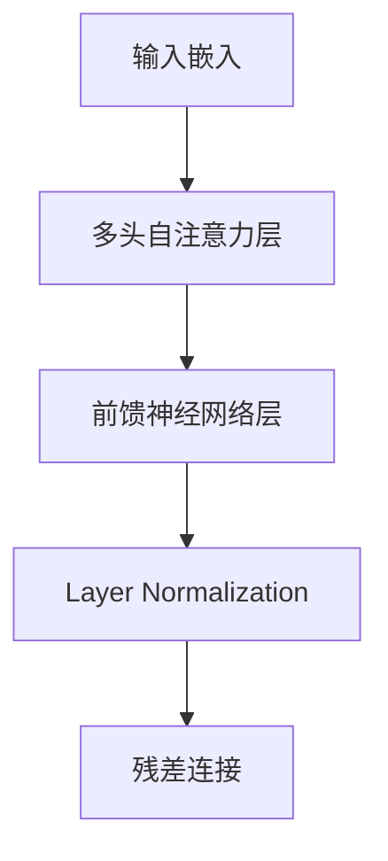

# 大规模语言模型从理论到实践 大语言模型应用

## 1. 背景介绍
### 1.1 大语言模型的兴起
近年来,随着深度学习技术的不断进步和计算能力的显著提升,大规模语言模型(Large Language Models,LLMs)在自然语言处理(NLP)领域掀起了一股革命性的浪潮。这些模型以其强大的语言理解和生成能力,在机器翻译、问答系统、文本摘要等任务上取得了前所未有的突破,引起了学术界和工业界的广泛关注。

### 1.2 大语言模型的应用前景
大语言模型不仅在NLP领域大放异彩,其潜在的应用前景更是不可限量。它们有望彻底改变人机交互的方式,让机器能够更加自然、智能地理解和回应人类的需求。同时,大语言模型也为知识图谱构建、智能搜索、智能客服等领域带来了新的机遇和挑战。

### 1.3 本文的主要内容
本文将从理论到实践,全面探讨大规模语言模型的原理、算法、应用和挑战。我们将首先介绍大语言模型的核心概念和技术基础,然后深入剖析其内部工作机制和训练方法。接着,我们将通过实际项目案例,展示如何利用大语言模型解决实际问题。最后,我们将总结大语言模型的发展趋势,并展望其未来的研究方向和应用前景。

## 2. 核心概念与联系
### 2.1 语言模型
语言模型是大语言模型的理论基础。它是一种用于描述、学习和生成自然语言的概率模型。给定一个单词序列 $w_1, w_2, ..., w_n$,语言模型的目标是估计该序列出现的概率 $P(w_1, w_2, ..., w_n)$。传统的 n-gram 语言模型利用马尔可夫假设,将序列概率分解为一系列条件概率的乘积:

$$P(w_1, w_2, ..., w_n) = \prod_{i=1}^n P(w_i|w_1, ..., w_{i-1}) \approx \prod_{i=1}^n P(w_i|w_{i-n+1}, ..., w_{i-1})$$

其中 $n$ 表示考虑的历史长度。n-gram 模型虽然简单高效,但难以捕捉长距离依赖关系,且面临数据稀疏问题。

### 2.2 神经网络语言模型
神经网络语言模型(Neural Network Language Model,NNLM)利用神经网络来学习单词之间的复杂非线性关系,克服了 n-gram 模型的局限性。NNLM 通过将单词映射为稠密向量(即词嵌入),并使用隐藏层捕捉上下文信息,从而建模单词序列的生成过程。

一个典型的 NNLM 结构如下:

### 2.3 Transformer 架构
Transformer 是一种基于自注意力机制(Self-Attention)的神经网络架构,它在机器翻译任务上取得了里程碑式的进展。与传统的循环神经网络(RNN)和卷积神经网络(CNN)不同,Transformer 完全依赖于注意力机制来建模序列之间的依赖关系,避免了 RNN 的梯度消失问题和 CNN 的局部感受野限制。

Transformer 的核心结构如下:

### 2.4 预训练与微调
预训练(Pre-training)是大语言模型的关键技术之一。它通过在大规模无标注语料上进行自监督学习,让模型掌握语言的基本规律和知识。常见的预训练任务包括语言模型、掩码语言模型(Masked Language Model,MLM)和 Next Sentence Prediction(NSP)等。

微调(Fine-tuning)则是在特定任务上对预训练模型进行二次训练的过程。通过在小规模标注数据上微调模型参数,可以快速适应下游任务,达到更好的性能。微调大大降低了任务特定数据的需求,提高了模型的泛化能力。

## 3. 核心算法原理具体操作步骤
### 3.1 Transformer 的自注意力机制
Transformer 的核心创新在于其自注意力机制。与传统的注意力机制不同,自注意力允许序列中的任意两个位置直接建立联系,而无需借助额外的信息。具体来说,自注意力分为三个步骤:

1. 计算查询(Query)、键(Key)和值(Value)。对于输入序列的每个位置,通过线性变换得到 $Q$、$K$、$V$ 矩阵:

$$Q = XW^Q, K = XW^K, V = XW^V$$

其中 $X$ 为输入序列的嵌入表示,$W^Q$、$W^K$、$W^V$ 为可学习的参数矩阵。

2. 计算注意力权重。通过查询和键的点积计算序列中不同位置之间的相似度,并用 Softmax 函数归一化得到注意力权重:

$$A = \text{Softmax}(\frac{QK^T}{\sqrt{d_k}})$$

其中 $d_k$ 为键的维度,用于缩放点积结果。

3. 加权求和。利用注意力权重对值进行加权求和,得到最终的自注意力输出:

$$\text{Attention}(Q,K,V) = AV$$

通过自注意力机制,Transformer 可以高效地捕捉序列内部的长距离依赖关系,同时并行计算不同位置的注意力。

### 3.2 多头自注意力
为了进一步提升模型的表达能力,Transformer 引入了多头自注意力(Multi-Head Attention)。它将输入序列的嵌入表示划分为多个子空间,并在每个子空间内独立地执行自注意力操作。最后,将不同头的输出拼接起来,并通过线性变换得到最终的多头自注意力输出。

多头自注意力的计算过程如下:

$$\text{MultiHead}(Q,K,V) = \text{Concat}(\text{head}_1, ..., \text{head}_h)W^O$$

$$\text{head}_i = \text{Attention}(QW_i^Q, KW_i^K, VW_i^V)$$

其中 $h$ 为头的数量,$W_i^Q$、$W_i^K$、$W_i^V$ 和 $W^O$ 为可学习的参数矩阵。

### 3.3 位置编码
由于 Transformer 不包含任何循环或卷积结构,它无法显式地建模序列的位置信息。为了引入位置信息,Transformer 使用了位置编码(Positional Encoding)。位置编码通过将位置信息映射为一个与词嵌入维度相同的向量,并将其与词嵌入相加,从而将位置信息注入到模型中。

常用的位置编码方法有正弦位置编码和学习位置编码。正弦位置编码利用正弦和余弦函数的周期性,对不同维度使用不同频率的正弦曲线:

$$\text{PE}_{(pos,2i)} = \sin(pos/10000^{2i/d_{model}})$$

$$\text{PE}_{(pos,2i+1)} = \cos(pos/10000^{2i/d_{model}})$$

其中 $pos$ 为位置索引,$i$ 为维度索引,$d_{model}$ 为词嵌入的维度。

学习位置编码则将位置编码参数化为可学习的向量,通过端到端的训练来自适应地调整位置信息。

### 3.4 前馈神经网络
除了自注意力层外,Transformer 还包含前馈神经网络(Feed-Forward Network,FFN)层。FFN 由两个全连接层组成,中间使用 ReLU 激活函数:

$$\text{FFN}(x) = \max(0, xW_1 + b_1)W_2 + b_2$$

其中 $W_1$、$W_2$、$b_1$、$b_2$ 为可学习的参数。FFN 层可以增强模型的非线性表达能力,捕捉更复杂的特征交互。

### 3.5 残差连接和层归一化
为了促进梯度的反向传播和模型的收敛,Transformer 在每个子层(自注意力层和 FFN 层)之后都使用了残差连接(Residual Connection)和层归一化(Layer Normalization)。

残差连接将子层的输入与输出相加,形成一个"短路连接",使得梯度可以直接流向前面的层:

$$x + \text{Sublayer}(x)$$

层归一化则对每个样本的隐藏状态进行归一化,使其均值为 0,方差为 1:

$$\text{LayerNorm}(x) = \frac{x-\mu}{\sqrt{\sigma^2+\epsilon}} * \gamma + \beta$$

其中 $\mu$ 和 $\sigma^2$ 分别为样本的均值和方差,$\epsilon$ 为平滑项,$\gamma$ 和 $\beta$ 为可学习的缩放和偏移参数。

## 4. 数学模型和公式详细讲解举例说明
### 4.1 Transformer 的编码器-解码器结构
Transformer 采用了编码器-解码器(Encoder-Decoder)结构,其中编码器负责将输入序列转化为隐藏表示,解码器则根据隐藏表示生成输出序列。

编码器由 $N$ 个相同的层堆叠而成,每个层包含两个子层:多头自注意力层和前馈神经网络层。编码器的输入为源语言序列的词嵌入与位置编码之和:

$$\text{Encoder}(x) = \text{FFN}(\text{MultiHead}(x)) + x$$

解码器同样由 $N$ 个相同的层堆叠而成,但除了编码器中的两个子层外,还在最底部插入了一个"编码-解码注意力"层,用于关联编码器的输出与解码器的输入。解码器在生成每个目标语言单词时,都会参考编码器的隐藏状态和之前生成的单词:

$$\text{Decoder}(y,\text{Encoder}(x)) = \text{FFN}(\text{MultiHead}(\text{MultiHead}(y), \text{Encoder}(x))) + y$$

其中 $x$ 为源语言序列,$y$ 为目标语言序列。

### 4.2 自注意力的计算过程
以编码器的自注意力层为例,详细说明自注意力的计算过程。设编码器的输入为 $X \in \mathbb{R}^{n \times d}$,其中 $n$ 为序列长度,$d$ 为嵌入维度。

1. 计算查询、键、值矩阵:

$$Q = XW^Q, K = XW^K, V = XW^V$$

其中 $W^Q, W^K, W^V \in \mathbb{R}^{d \times d_k}$ 为可学习的参数矩阵,$d_k$ 为查询/键/值的维度。

2. 计算注意力权重:

$$A = \text{Softmax}(\frac{QK^T}{\sqrt{d_k}})$$

其中 $A \in \mathbb{R}^{n \times n}$ 为注意力权重矩阵,表示序列中每个位置对其他位置的关注程度。

3. 计算自注意力输出:

$$\text{Attention}(Q,K,V) = AV$$

将注意力权重矩阵与值矩阵相乘,得到加权求和后的自注意力输出,维度为 $\mathbb{R}^{n \times d_v}$,其中 $d_v$ 为值的维度。

4. 计算多头自注意力:

$$\text{MultiHead}(Q,K,V) = \text{Concat}(\text{head}_1, ..., \text{head}_h)W^O$$

$$\text{head}_i = \text{Attention}(QW_i^Q, KW_i^K, VW_i^V)$$

将查询、键、值矩阵划分为 $h$ 个子空间,在每个子空间内独立地执行自注意力操作,得到 $h$ 个头的输出。最后,将这些输出拼接起来,并通过线性变换 $W^O \in \mathbb{R}^{hd_v \times d}$ 得到最终的多头自注意力输出,维度为 $\mathbb{R}^{n \times d}$。

### 4.3 前馈神经网络的计算过程
前馈神经网络层接收多头自注意力