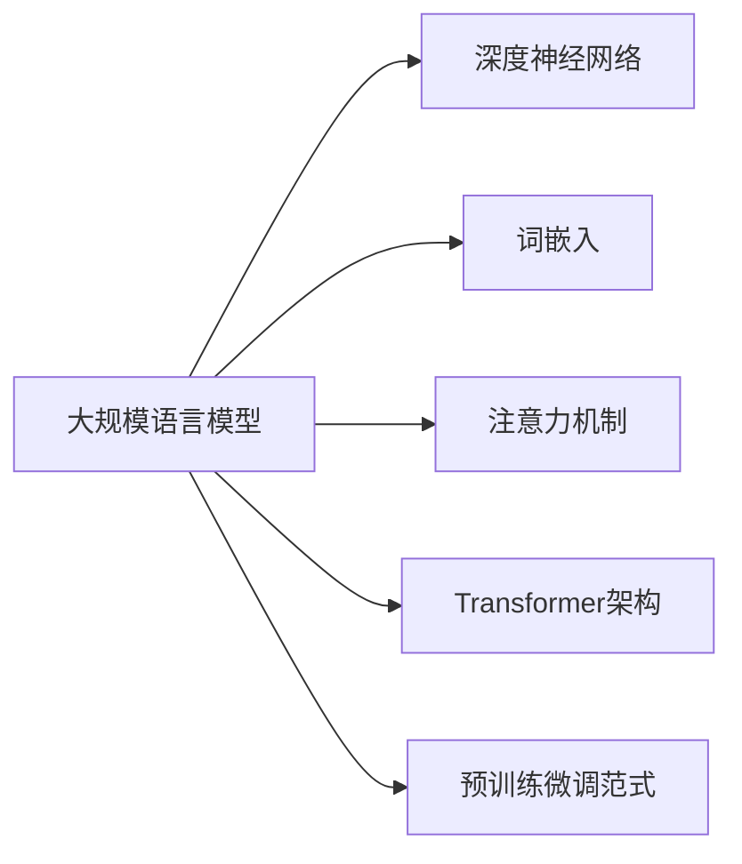

# 大规模语言模型从理论到实践 大语言模型的基本概念

## 1. 背景介绍
### 1.1 人工智能与自然语言处理的发展
人工智能(Artificial Intelligence, AI)是计算机科学的一个分支,旨在研究如何让计算机模拟人类的智能行为。自然语言处理(Natural Language Processing, NLP)是人工智能的一个重要领域,专注于让计算机理解、生成和处理人类语言。随着计算机硬件性能的提升和大数据时代的到来,NLP技术取得了长足的进步。

### 1.2 语言模型的概念与意义
语言模型(Language Model)是NLP的核心概念之一。它本质上是一个概率分布模型,用于预测给定上下文后下一个词出现的概率。通过对大量文本数据的学习,语言模型可以掌握语言的统计规律和语义信息,从而完成诸如机器翻译、文本摘要、问答系统等任务。传统的语言模型如N-gram模型,虽然简单高效,但无法捕捉长距离依赖关系。

### 1.3 大规模语言模型的兴起 
近年来,随着深度学习技术的发展,大规模语言模型(Large-scale Language Model)开始崭露头角。与传统语言模型相比,大规模语言模型通常基于深度神经网络架构,并在海量文本语料上进行预训练,从而学习到更加丰富和精准的语言表征。代表性的大规模语言模型包括BERT、GPT、XLNet等,它们在多项NLP任务上取得了突破性的进展,引领了NLP技术的新潮流。

## 2. 核心概念与联系
### 2.1 神经网络基础
大规模语言模型的核心是深度神经网络(Deep Neural Network, DNN)。DNN由多个处理层组成,每层由大量神经元构成。通过调整神经元之间的权重,DNN可以学习到输入数据的高层特征表示。常见的DNN架构包括前馈神经网络(Feedforward Neural Network)、卷积神经网络(Convolutional Neural Network, CNN)和循环神经网络(Recurrent Neural Network, RNN)等。

### 2.2 词嵌入技术
词嵌入(Word Embedding)是将词映射为实数向量的技术,旨在捕捉词之间的语义关系。通过词嵌入,语义相近的词在向量空间中的距离也更接近。主流的词嵌入模型包括Word2Vec、GloVe等。大规模语言模型在预训练过程中,通常也会学习词嵌入表示。

### 2.3 注意力机制与Transformer架构
注意力机制(Attention Mechanism)让模型能够聚焦于输入序列中的关键信息。自注意力(Self-Attention)机制进一步扩展了注意力机制,使得模型能够捕捉输入序列内部的依赖关系。Transformer架构基于自注意力机制,抛弃了RNN中的循环结构,从而实现了高效的并行计算。Transformer已成为大规模语言模型的主流架构。

### 2.4 迁移学习与预训练
迁移学习(Transfer Learning)是将已训练好的模型应用于新任务的技术。大规模语言模型通常采用两阶段训练范式:先在大规模无标注语料上进行预训练(Pre-training),学习通用的语言表征;再在特定任务的标注数据上进行微调(Fine-tuning),完成下游任务。这种预训练-微调范式大大降低了模型对标注数据的需求,提高了模型的泛化能力。



## 3. 核心算法原理具体操作步骤
### 3.1 BERT模型
BERT(Bidirectional Encoder Representations from Transformers)是Google于2018年提出的预训练语言模型。与之前的模型不同,BERT采用了双向Transformer编码器,可以融合上下文信息。BERT的预训练任务包括:

1. Masked Language Model(MLM):随机掩盖部分输入词,让模型预测被掩盖的词。
2. Next Sentence Prediction(NSP):让模型判断两个句子在原文中是否相邻。

BERT预训练的具体步骤如下:

1. 对输入文本进行WordPiece分词,加入[CLS]和[SEP]特殊标记。
2. 对输入序列进行Positional Embedding和Segment Embedding。
3. 对输入序列中的部分Token进行随机掩码处理。
4. 将处理后的输入序列送入BERT模型,通过多层Transformer编码器生成每个Token的上下文表征。
5. 取[CLS]标记对应的输出向量送入分类器,完成NSP任务。
6. 取被掩码Token对应的输出向量送入分类器,完成MLM任务。
7. 计算MLM和NSP任务的损失,并通过反向传播更新模型参数。

经过预训练的BERT模型可以应用于各种下游NLP任务,在问答、文本分类、命名实体识别等任务上取得了SOTA效果。

### 3.2 GPT模型
GPT(Generative Pre-Training)是OpenAI提出的生成式预训练语言模型。与BERT不同,GPT采用单向Transformer解码器,只能融合上文信息。GPT的预训练任务是通过最大化下一个词的概率来学习语言模型:

$$L(\theta) = \sum_i \log P(w_i|w_{i-k},...,w_{i-1};\theta)$$

其中$\theta$为模型参数,$w_i$为第$i$个词,$k$为上下文窗口大小。

GPT预训练的具体步骤如下:

1. 对输入文本进行BPE分词。
2. 将分词结果转化为词嵌入向量。
3. 将词嵌入向量序列送入GPT模型,通过多层Transformer解码器生成每个位置的输出向量。
4. 将输出向量送入全连接层,得到下一个词的概率分布。 
5. 计算语言模型的交叉熵损失,并通过反向传播更新模型参数。

预训练好的GPT模型可用于文本生成、对话系统等任务。GPT-2和GPT-3进一步扩大了模型和训练语料的规模,展现出了惊人的语言理解和生成能力。

## 4. 数学模型和公式详细讲解举例说明
### 4.1 Transformer的数学原理
Transformer的核心是自注意力机制和前馈神经网络。对于输入序列$X=(x_1,...,x_n)$,自注意力的计算过程如下:

1. 将输入$X$通过三个线性变换得到Query、Key、Value矩阵:

$$Q=XW^Q, K=XW^K, V=XW^V$$

2. 计算自注意力权重矩阵:

$$A = \text{softmax}(\frac{QK^T}{\sqrt{d_k}})$$

其中$d_k$为Key向量的维度。

3. 计算自注意力输出:

$$\text{Attention}(Q,K,V)=AV$$

4. 将自注意力输出送入前馈神经网络:

$$\text{FFN}(x)=\max(0, xW_1 + b_1)W_2 + b_2$$

通过堆叠多个自注意力层和前馈层,Transformer可以学习到高质量的上下文表征。

### 4.2 BERT的MLM任务 
在BERT的MLM任务中,假设输入词序列为$(w_1,...,w_n)$,被掩码的词位置为$i_1,...,i_m$。MLM任务的目标是最大化如下条件概率:

$$P(w_{i_1},...,w_{i_m}|w_1,...,w_{i_1-1},w_{i_1+1},...,w_{i_m-1},w_{i_m+1},...,w_n)$$

假设BERT的输出向量为$(h_1,...,h_n)$,MLM任务的损失函数定义为:

$$L_{\text{MLM}}=-\sum_{k=1}^m \log P(w_{i_k}|h_{i_k})$$

其中$P(w_{i_k}|h_{i_k})$通过Softmax层计算:

$$P(w_{i_k}=j|h_{i_k})=\frac{\exp(h_{i_k}^Te_j)}{\sum_{l=1}^V \exp(h_{i_k}^Te_l)}$$

这里$e_j$为词表中第$j$个词的One-hot向量,$V$为词表大小。

### 4.3 GPT的语言模型任务
GPT通过最大化下一个词的条件概率来学习语言模型。假设输入词序列为$(w_1,...,w_n)$,语言模型的目标是最大化如下似然函数:

$$L(\theta)=\sum_{i=1}^n \log P(w_i|w_1,...,w_{i-1};\theta)$$

其中$\theta$为GPT模型的参数。假设GPT的输出向量为$(h_1,...,h_n)$,第$i$个位置的条件概率通过Softmax层计算:

$$P(w_i=j|w_1,...,w_{i-1})=\frac{\exp(h_i^Te_j)}{\sum_{l=1}^V \exp(h_i^Te_l)}$$

GPT通过最小化交叉熵损失来优化语言模型:

$$L(\theta)=-\frac{1}{n}\sum_{i=1}^n \log P(w_i|w_1,...,w_{i-1};\theta)$$

## 5. 项目实践：代码实例和详细解释说明
下面我们通过PyTorch实现一个简单的Transformer语言模型。

```python
import torch
import torch.nn as nn

class TransformerModel(nn.Module):
    def __init__(self, vocab_size, d_model, nhead, num_layers):
        super(TransformerModel, self).__init__()
        self.embedding = nn.Embedding(vocab_size, d_model)
        self.pos_encoder = PositionalEncoding(d_model)
        encoder_layer = nn.TransformerEncoderLayer(d_model, nhead)
        self.transformer_encoder = nn.TransformerEncoder(encoder_layer, num_layers)
        self.decoder = nn.Linear(d_model, vocab_size)

    def forward(self, src):
        src = self.embedding(src) * math.sqrt(d_model)
        src = self.pos_encoder(src)
        output = self.transformer_encoder(src)
        output = self.decoder(output)
        return output
```

这里`TransformerModel`类定义了一个Transformer语言模型,主要组件包括:

- `nn.Embedding`: 将输入词转化为词嵌入向量。
- `PositionalEncoding`: 实现位置编码,将位置信息融入词嵌入中。
- `nn.TransformerEncoderLayer`: Transformer的编码器层,包含自注意力机制和前馈神经网络。
- `nn.TransformerEncoder`: Transformer的编码器,由多个编码器层组成。
- `nn.Linear`: 将Transformer的输出向量映射为每个词的概率分布。

模型的前向传播过程如下:

1. 将输入词序列`src`通过`nn.Embedding`层转化为词嵌入向量,并乘以$\sqrt{d_{\text{model}}}$以保持方差。
2. 将词嵌入向量通过`PositionalEncoding`层加入位置编码。
3. 将位置编码后的词嵌入向量送入`nn.TransformerEncoder`层,生成每个位置的上下文表征。
4. 将`nn.TransformerEncoder`的输出通过`nn.Linear`层映射为每个词的概率分布。

在训练过程中,我们通过最小化交叉熵损失来优化模型参数:

```python
criterion = nn.CrossEntropyLoss()
optimizer = torch.optim.Adam(model.parameters(), lr=learning_rate)

for epoch in range(num_epochs):
    for batch in data_loader:
        inputs, targets = batch
        outputs = model(inputs)
        loss = criterion(outputs.view(-1, vocab_size), targets.view(-1))
        
        optimizer.zero_grad()
        loss.backward()
        optimizer.step()
```

这里`criterion`为交叉熵损失函数,`optimizer`为Adam优化器。每个训练步骤的流程如下:

1. 从`data_loader`中取出一个批次的输入`inputs`和目标`targets`。
2. 将`inputs`送入模型,得到输出概率分布`outputs`。
3. 计算`outputs`和`targets`的交叉熵损失`loss`。
4. 将梯度清零,反向传播计算梯度,并更新模型参数。

以上就是使用PyTorch实现Transformer语言模型的简要流程。实际应用中,我们还需要考虑更多的实现细节,如学习率调度、梯度裁剪、模型保存与加载等。

## 6. 实际应用场景
大规模语言模型凭借其强大的语言理解和生成能力,在