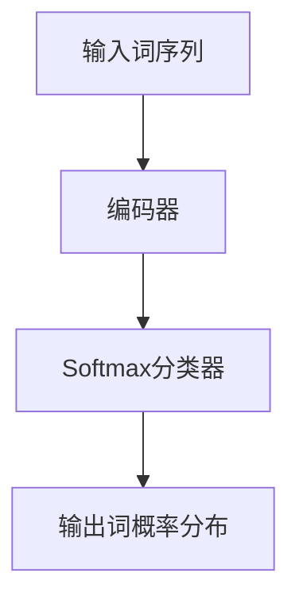
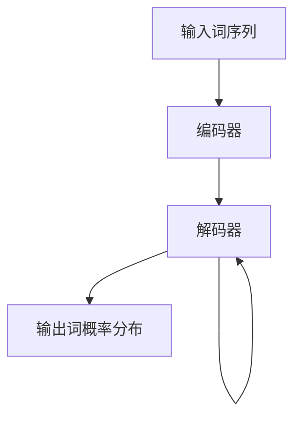
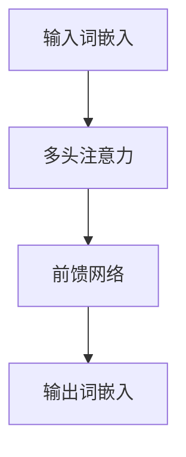

# 大规模语言模型从理论到实践 实践思考

## 1.背景介绍

### 1.1 语言模型的重要性

语言模型是自然语言处理领域的核心技术之一,在机器翻译、语音识别、对话系统等诸多应用中扮演着至关重要的角色。随着深度学习技术的快速发展,基于神经网络的语言模型取得了令人瞩目的成就,大大推动了自然语言处理技术的进步。

### 1.2 大规模语言模型的兴起

传统的基于统计方法的语言模型存在参数有限、难以捕捉长距离依赖等缺陷。而基于神经网络的语言模型能够直接从海量数据中学习语言知识,通过增大模型规模和训练数据量,可以显著提升模型的表现能力。因此,训练大规模语言模型成为了当前的研究热点。

### 1.3 大规模语言模型的挑战

尽管大规模语言模型取得了卓越的成绩,但也面临着诸多挑战,如需要海量计算资源、存在安全隐患、缺乏可解释性等。如何高效训练大规模模型、确保模型的安全性和可解释性是亟待解决的关键问题。

## 2.核心概念与联系

### 2.1 语言模型的基本概念

语言模型的本质是计算一个句子或者词序列的概率,即 $P(w_1, w_2, ..., w_n)$,其中 $w_i$ 表示句子中的第 i 个词。根据链式法则,该概率可以分解为:

$$P(w_1, w_2, ..., w_n) = \prod_{i=1}^{n}P(w_i|w_1, ..., w_{i-1})$$

语言模型的目标就是估计上述条件概率。

### 2.2 神经网络语言模型

神经网络语言模型将上述条件概率建模问题转化为一个分类问题。具体来说,对于句子的第 i 个位置,模型需要根据上文 $w_1, ..., w_{i-1}$ 预测下一个词 $w_i$。这可以通过神经网络对上文进行编码,然后将编码后的向量输入到一个 Softmax 分类器,得到下一个词的概率分布。



### 2.3 自回归语言模型

自回归语言模型是一种特殊的神经网络语言模型,它利用了序列数据的自回归性质,即当前时刻的输出不仅依赖于之前的输入,也依赖于之前的输出。这种结构使得模型可以很好地捕捉长距离依赖关系。



### 2.4 transformer 模型

Transformer 是一种全新的基于注意力机制的序列建模架构,不依赖于循环和卷积操作,从而避免了梯度消失和计算瓶颈的问题。Transformer 的核心组件是多头注意力机制,它能够有效地捕捉序列中任意两个位置之间的长距离依赖关系。



## 3.核心算法原理具体操作步骤

### 3.1 transformer 模型的工作原理

Transformer 模型主要由编码器(Encoder)和解码器(Decoder)两部分组成。编码器将输入序列编码为一系列连续的向量表示,解码器则根据这些向量表示生成输出序列。

#### 3.1.1 编码器(Encoder)

编码器由 N 个相同的层组成,每一层包含两个子层:多头注意力机制(Multi-Head Attention)和前馈全连接网络(Feed-Forward Network)。

1. **多头注意力机制**

   多头注意力机制是 Transformer 的核心,它能够捕捉输入序列中任意两个位置之间的依赖关系。具体来说,对于序列中的每个单词,注意力机制会计算它与其他单词的关联程度,并据此生成该单词的表示向量。

   ```mermaid
   graph TD
       A[输入词嵌入] --> B[Scaled Dot-Product Attention]
       B --> C[Multi-Head合并]
       C --> D[Add & Norm]
       D --> E[前馈网络]
       E --> F[Add & Norm]
       F --> G[输出]
   ```

2. **前馈全连接网络**

   前馈全连接网络是一个简单的多层感知机,对每个位置的向量进行独立的非线性映射,以引入更高阶的特征。

3. **层归一化与残差连接**

   为了更好地训练模型,Transformer 在每个子层之后使用了层归一化(Layer Normalization)和残差连接(Residual Connection)。

#### 3.1.2 解码器(Decoder)

解码器的结构与编码器类似,也由 N 个相同的层组成,每一层包含三个子层:

1. **掩码多头注意力机制**

   这一子层与编码器中的多头注意力机制类似,但增加了一个掩码操作,使得每个位置的单词只能关注之前的单词,避免出现未来信息泄露。

2. **编码器-解码器注意力机制**

   该子层会将解码器的输出与编码器的输出进行注意力计算,以捕捉输入序列和输出序列之间的依赖关系。

3. **前馈全连接网络**

   与编码器中的前馈网络相同。

#### 3.1.3 位置编码

由于 Transformer 不使用循环或卷积操作,因此需要一种方法来注入序列的位置信息。位置编码就是为了达到这一目的,它将位置信息编码成一个向量,并将其加到输入的词嵌入上。

### 3.2 transformer 模型的训练

Transformer 模型的训练过程与传统的神经网络模型类似,采用监督学习的方式,最小化模型在训练数据上的损失函数。常用的损失函数包括交叉熵损失和最大似然估计损失等。

对于机器翻译任务,模型的输入是源语言句子,输出是目标语言句子。训练数据是大量的源语言-目标语言句子对。模型的目标是最大化训练数据中目标语言句子的条件概率。

对于语言模型任务,模型的输入和输出都是同一种语言的句子。训练数据是大量的句子序列。模型的目标是最大化训练数据中句子的似然概率。

由于 Transformer 模型的参数量通常很大,因此需要大量的训练数据和计算资源。此外,还需要一些技巧来防止过拟合,如dropout、权重衰减等正则化方法。

### 3.3 transformer 模型的推理

在推理阶段,Transformer 模型根据输入序列生成相应的输出序列。对于机器翻译任务,给定源语言句子,模型生成对应的目标语言句子。对于语言模型任务,给定句子的开头,模型生成句子的下文。

推理过程是自回归的,即模型每次生成一个单词,然后将这个单词作为输入,继续生成下一个单词。具体来说:

1. 将输入序列输入编码器,得到编码后的向量表示。
2. 将开始符号(`<bos>`)输入解码器,结合编码器的输出,生成第一个单词。
3. 将第一个单词作为输入,结合编码器的输出,生成第二个单词。
4. 重复步骤3,直到生成终止符号(`<eos>`)或达到最大长度。

在推理过程中,还可以采用一些策略来提高输出质量,如束搜索(Beam Search)、顶端采样(Top-K Sampling)、核采样(Nucleus Sampling)等。

## 4.数学模型和公式详细讲解举例说明

### 4.1 注意力机制(Attention Mechanism)

注意力机制是 Transformer 模型的核心,它能够捕捉输入序列中任意两个位置之间的依赖关系。具体来说,对于序列中的每个单词,注意力机制会计算它与其他单词的关联程度,并据此生成该单词的表示向量。

#### 4.1.1 Scaled Dot-Product Attention

Scaled Dot-Product Attention 是 Transformer 中使用的注意力机制,它的计算过程如下:

给定一个查询向量 $\boldsymbol{q}$、键向量 $\boldsymbol{K}$ 和值向量 $\boldsymbol{V}$,注意力机制首先计算查询向量与所有键向量的点积,得到未缩放的分数向量 $\boldsymbol{s}$:

$$\boldsymbol{s} = \boldsymbol{q}\boldsymbol{K}^T$$

然后对分数向量进行缩放,以解决较长输入序列时出现的梯度较小的问题:

$$\text{Attention}(\boldsymbol{q}, \boldsymbol{K}, \boldsymbol{V}) = \text{softmax}(\frac{\boldsymbol{s}}{\sqrt{d_k}})\boldsymbol{V}$$

其中 $d_k$ 是键向量的维度,用于对点积进行缩放。

最后,将注意力权重与值向量相乘,得到注意力输出。

#### 4.1.2 Multi-Head Attention

Multi-Head Attention 是将多个注意力机制的输出进行拼接,以捕捉不同的依赖关系。具体来说,对于每个注意力头,它会学习一个独立的线性投影,将输入映射到查询、键和值向量,然后计算 Scaled Dot-Product Attention。最后,将所有注意力头的输出拼接起来,并经过一个线性变换,得到最终的注意力输出。

$$\begin{aligned}
\text{MultiHead}(\boldsymbol{Q}, \boldsymbol{K}, \boldsymbol{V}) &= \text{Concat}(\text{head}_1, \dots, \text{head}_h)\boldsymbol{W}^O\\
\text{where}\  \text{head}_i &= \text{Attention}(\boldsymbol{Q}\boldsymbol{W}_i^Q, \boldsymbol{K}\boldsymbol{W}_i^K, \boldsymbol{V}\boldsymbol{W}_i^V)
\end{aligned}$$

其中 $\boldsymbol{W}_i^Q \in \mathbb{R}^{d_\text{model} \times d_q}$、$\boldsymbol{W}_i^K \in \mathbb{R}^{d_\text{model} \times d_k}$、$\boldsymbol{W}_i^V \in \mathbb{R}^{d_\text{model} \times d_v}$ 和 $\boldsymbol{W}^O \in \mathbb{R}^{hd_v \times d_\text{model}}$ 是可学习的线性变换矩阵。

### 4.2 位置编码(Positional Encoding)

由于 Transformer 不使用循环或卷积操作,因此需要一种方法来注入序列的位置信息。位置编码就是为了达到这一目的,它将位置信息编码成一个向量,并将其加到输入的词嵌入上。

对于序列中的第 $i$ 个位置,它的位置编码向量 $\boldsymbol{p}_i$ 由下式给出:

$$\begin{aligned}
\boldsymbol{p}_{i, 2j} &= \sin\left(\frac{i}{10000^{\frac{2j}{d_\text{model}}}}\right)\\
\boldsymbol{p}_{i, 2j+1} &= \cos\left(\frac{i}{10000^{\frac{2j}{d_\text{model}}}}\right)
\end{aligned}$$

其中 $j$ 是位置编码向量的维度索引,取值范围为 $[0, \frac{d_\text{model}}{2})$。

通过这种方式,位置编码向量能够编码序列中每个位置的相对位置信息,并且具有很好的几何特性。

### 4.3 自注意力掩码(Self-Attention Mask)

在解码器的自注意力机制中,需要防止每个位置的单词关注到未来的单词,从而避免未来信息泄露。这可以通过在计算注意力分数时添加一个掩码向量来实现。

具体来说,对于序列中的第 $i$ 个位置,它只能关注之前的单词,即第 $1$ 到第 $i-1$ 个位置。因此,我们可以构造一个掩码向量 $\boldsymbol{m}$,其中:

$$\boldsymbol{