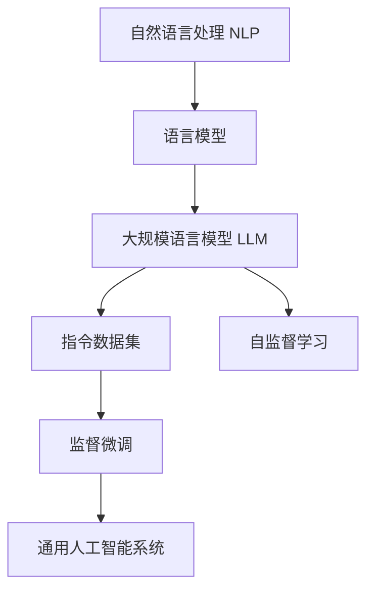
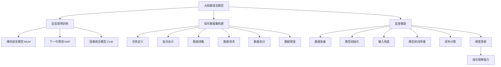

# 大规模语言模型从理论到实践 开源指令数据集

## 1. 背景介绍

### 1.1 人工智能的新时代

近年来,人工智能(AI)技术取得了长足的进步,尤其是在自然语言处理(NLP)领域。大规模语言模型凭借其强大的语言理解和生成能力,已经在各种应用场景中发挥着越来越重要的作用,如智能问答、机器翻译、文本摘要、内容创作等。

随着计算能力的不断提升和海量数据的积累,训练大规模语言模型成为可能。这些模型通过在大量文本数据上进行自监督学习,学习到了丰富的语言知识和上下文信息,从而具备了出色的语言理解和生成能力。

### 1.2 指令数据集的重要性

然而,尽管大规模语言模型展现出了惊人的能力,但它们往往缺乏明确的任务定义和指令理解能力。为了更好地利用语言模型的潜力,指令数据集(Instruction Dataset)应运而生。指令数据集为语言模型提供了一组结构化的任务指令和相应的输入输出示例,使模型能够学习如何理解和执行各种指令。

通过在指令数据集上进行监督微调(Supervised Fine-tuning),语言模型可以获得更强的任务理解和执行能力,从而更好地服务于实际应用场景。指令数据集不仅扩展了语言模型的应用范围,也为开发更加通用和可控的人工智能系统奠定了基础。

### 1.3 开源指令数据集的意义

随着指令数据集在学术界和工业界的广泛应用,开源指令数据集的重要性日益凸显。开源不仅有利于促进科研成果的共享和验证,也有助于推动整个人工智能社区的快速发展。

开源指令数据集可以吸引更多的研究人员和开发者参与其中,共同探索和解决语言模型的各种挑战,如指令理解、任务执行、多模态交互等。同时,开源也有助于提高数据集的质量和多样性,从而使训练出的语言模型更加鲁棒和通用。

本文将深入探讨大规模语言模型在指令数据集上的理论和实践,介绍开源指令数据集的构建方法、核心算法原理,以及在实际应用中的案例和挑战。我们希望通过这篇文章,能够为读者提供一个全面的视角,了解指令数据集在推动人工智能发展中的重要作用。

## 2. 核心概念与联系

### 2.1 自然语言处理(NLP)

自然语言处理(Natural Language Processing, NLP)是人工智能的一个重要分支,旨在让计算机能够理解和生成人类可理解的自然语言。NLP技术广泛应用于机器翻译、智能问答、文本摘要、情感分析等领域。

### 2.2 语言模型(Language Model)

语言模型是NLP中的一个核心概念,它通过学习大量文本数据,捕捉语言的统计规律和上下文信息,从而能够预测下一个单词或词序列出现的概率。语言模型是许多NLP任务的基础,如机器翻译、文本生成等。

### 2.3 大规模语言模型(Large Language Model, LLM)

大规模语言模型是指具有数十亿甚至上万亿参数的巨大神经网络模型,通过在海量文本数据上进行自监督学习,获得了强大的语言理解和生成能力。著名的大规模语言模型包括GPT-3、PaLM、Chinchilla等。

### 2.4 指令数据集(Instruction Dataset)

指令数据集是一种特殊的数据集,它包含了一组结构化的任务指令和相应的输入输出示例对。指令数据集旨在让语言模型学习理解和执行各种指令,从而扩展其应用范围,提高任务执行能力。

### 2.5 自监督学习(Self-Supervised Learning)

自监督学习是一种无需人工标注的机器学习范式,它通过设计合理的预训练任务,让模型从原始数据中自动学习有用的表示。自监督学习是训练大规模语言模型的关键技术之一。

### 2.6 监督微调(Supervised Fine-tuning)

监督微调是指在自监督预训练的基础上,利用有标注的数据集对模型进行进一步的监督式训练,以使模型获得特定任务的能力。在指令数据集上进行监督微调,可以赋予语言模型更强的指令理解和执行能力。

### 2.7 Mermaid 流程图

上图展示了这些核心概念之间的联系。自然语言处理(NLP)是一个广阔的领域,语言模型是其中的核心概念。大规模语言模型(LLM)通过自监督学习获得了强大的语言能力,但缺乏明确的任务定义和指令理解能力。指令数据集为语言模型提供了结构化的任务指令和示例,通过监督微调,语言模型可以获得更强的任务执行能力,从而为构建通用人工智能系统奠定基础。

## 3. 核心算法原理具体操作步骤

### 3.1 大规模语言模型的自监督预训练

大规模语言模型的训练通常分为两个阶段:自监督预训练和监督微调。在自监督预训练阶段,模型通过设计合理的预训练任务,从海量文本数据中学习丰富的语言知识和上下文信息。

常见的自监督预训练任务包括:

1. **掩码语言模型(Masked Language Modeling, MLM)**: 随机掩码部分输入词,模型需要预测被掩码的词。
2. **下一句预测(Next Sentence Prediction, NSP)**: 给定两个句子,模型需要判断第二个句子是否为第一个句子的下一句。
3. **因果语言模型(Causal Language Modeling, CLM)**: 给定前面的词序列,模型需要预测下一个词。

以 GPT 模型为例,其采用了因果语言模型的预训练任务。具体操作步骤如下:

1. 从大量文本数据中采样连续的词序列作为输入。
2. 将输入词序列输入到 Transformer 解码器中。
3. 对于每个位置的词,模型需要预测下一个词的概率分布。
4. 计算预测概率和真实词之间的交叉熵损失,并通过梯度下降算法更新模型参数。

通过在海量文本数据上反复训练,模型可以学习到丰富的语言知识和上下文信息,从而获得强大的语言理解和生成能力。

### 3.2 指令数据集的构建

指令数据集的构建过程包括以下几个关键步骤:

1. **任务定义**: 明确指定需要执行的任务类型,如问答、文本生成、文本分类等。
2. **指令设计**: 为每个任务设计合理的指令格式,指令应该清晰、简洁、易于理解。
3. **数据采集**: 根据指令格式,采集或构造大量的输入输出示例对。
4. **数据清洗**: 对采集的数据进行清洗和标注,剔除低质量数据。
5. **数据划分**: 将数据集划分为训练集、验证集和测试集。
6. **数据增强**: 通过一些技术(如数据扩增、翻译等)来丰富和扩展数据集。

以 InstructGPT 数据集为例,其包含了 28 种不同的任务类型,如问答、文本生成、文本分类等。每个任务都有清晰的指令格式,并提供了大量的输入输出示例对。

### 3.3 监督微调

在自监督预训练的基础上,我们可以利用指令数据集对语言模型进行监督微调,以赋予其更强的指令理解和执行能力。监督微调的具体操作步骤如下:

1. **数据准备**: 从指令数据集中采样输入输出示例对,构建训练数据。
2. **模型初始化**: 使用自监督预训练的语言模型作为初始模型。
3. **输入构造**: 将指令和输入数据拼接成模型可接受的输入格式。
4. **模型前向传播**: 将构造的输入传递给语言模型,获得输出序列。
5. **损失计算**: 计算模型输出和真实输出之间的损失(如交叉熵损失)。
6. **梯度更新**: 通过反向传播算法计算梯度,并使用优化器更新模型参数。

通过在指令数据集上反复训练,语言模型可以学习理解各种指令,并根据输入生成正确的输出,从而获得更强的任务执行能力。

### 3.4 Mermaid 流程图

上图展示了大规模语言模型从理论到实践的核心算法原理和具体操作步骤。首先,语言模型通过自监督预训练任务(如MLM、NSP、CLM)在海量文本数据上进行预训练,获得初步的语言能力。然后,构建指令数据集,包括任务定义、指令设计、数据采集、清洗、划分和增强等步骤。最后,利用指令数据集对预训练模型进行监督微调,通过数据准备、模型初始化、输入构造、前向传播、损失计算和梯度更新等步骤,使模型获得更强的指令理解和执行能力。

## 4. 数学模型和公式详细讲解举例说明

### 4.1 语言模型的数学表示

语言模型旨在学习一个概率分布 $P(X)$,用于估计一个词序列 $X = (x_1, x_2, ..., x_n)$ 出现的概率。根据链式法则,我们可以将 $P(X)$ 分解为:

$$P(X) = P(x_1, x_2, ..., x_n) = \prod_{t=1}^{n} P(x_t | x_1, ..., x_{t-1})$$

其中 $P(x_t | x_1, ..., x_{t-1})$ 表示在给定前面的词序列 $(x_1, ..., x_{t-1})$ 的条件下,第 $t$ 个词 $x_t$ 出现的条件概率。

语言模型的目标是最大化训练数据的对数似然:

$$\mathcal{L}(\theta) = \sum_{X \in \mathcal{D}} \log P_\theta(X)$$

其中 $\mathcal{D}$ 表示训练数据集, $\theta$ 表示模型参数。

### 4.2 Transformer 模型

Transformer 是一种广泛应用于语言模型的神经网络架构,它完全基于注意力机制,不需要递归或卷积操作。Transformer 的核心组件是多头自注意力(Multi-Head Attention)和前馈神经网络(Feed-Forward Neural Network)。

对于一个长度为 $n$ 的输入序列 $X = (x_1, x_2, ..., x_n)$,多头自注意力的计算过程如下:

1. 将输入序列 $X$ 线性映射到查询(Query)、键(Key)和值(Value)向量:

$$
\begin{aligned}
Q &= XW^Q \\
K &= XW^K \\
V &= XW^V
\end{aligned}
$$

其中 $W^Q, W^K, W^V$ 分别是可学习的权重矩阵。

2. 计算注意力分数:

$$\text{Attention}(Q, K, V) = \text{softmax}\left(\frac{QK^\top}{\sqrt{d_k}