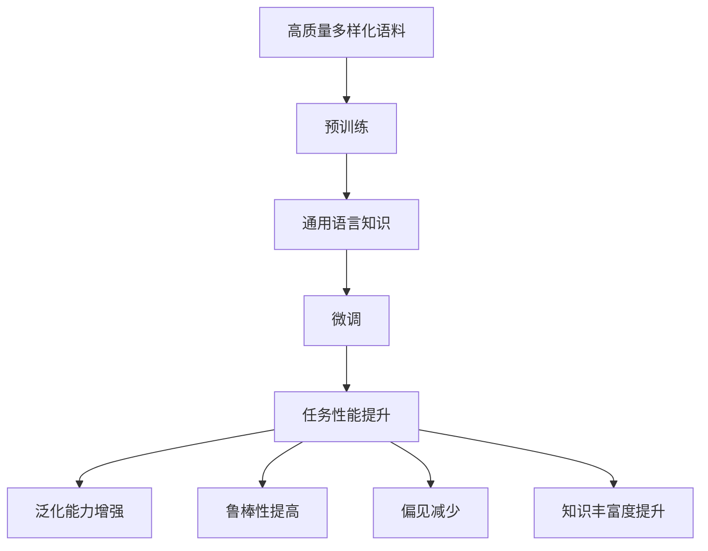

# 大规模语言模型从理论到实践 数据多样性

## 1.背景介绍
### 1.1 大规模语言模型的兴起
近年来,随着深度学习技术的飞速发展,自然语言处理(NLP)领域取得了突破性的进展。其中,大规模语言模型(Large Language Models, LLMs)的出现标志着NLP进入了一个新的时代。从2018年Google推出BERT,到2019年OpenAI发布GPT-2,再到2020年GPT-3横空出世,LLMs以其强大的语言理解和生成能力,在各种NLP任务上取得了超越人类的表现,引起了学术界和工业界的广泛关注。

### 1.2 LLMs面临的挑战
尽管LLMs取得了瞩目的成就,但它们在实际应用中仍然面临诸多挑战。其中最为关键的一点,就是训练数据的多样性问题。由于LLMs通常在海量的无标注语料上进行预训练,因此训练数据的质量和多样性直接影响了模型的泛化能力和鲁棒性。如何在保证数据质量的同时,尽可能地扩大数据的覆盖范围,成为了LLMs走向实用化的一大难题。

### 1.3 本文的主要内容
本文将围绕"大规模语言模型从理论到实践"这一主题,重点探讨数据多样性问题。我们将首先介绍LLMs的核心概念和原理,然后深入分析数据多样性对LLMs性能的影响,并给出提高数据多样性的具体方法。此外,我们还将结合实际项目,讨论如何在工程实践中应对数据多样性挑战。最后,我们将展望LLMs的未来发展趋势,并总结全文的主要内容。

## 2.核心概念与联系
### 2.1 大规模语言模型的定义
大规模语言模型是指参数量达到亿级甚至千亿级别的深度学习语言模型。与传统的语言模型不同,LLMs通常采用Transformer等高容量的神经网络结构,在海量语料上进行自监督学习,从而习得强大的语言理解和生成能力。代表性的LLMs包括BERT、GPT系列、XLNet、RoBERTa等。

### 2.2 预训练和微调
LLMs的训练通常分为两个阶段:预训练和微调。在预训练阶段,模型在大规模无标注语料上进行自监督学习,学习通用的语言知识和表征。在微调阶段,模型在特定任务的有标注数据上进行监督学习,进一步提升在该任务上的性能。预训练使得LLMs能够有效地利用无标注数据,而微调则赋予了LLMs针对具体任务的专门能力。

### 2.3 数据多样性的重要性
数据多样性指训练语料在主题、体裁、风格等方面的丰富程度。对于LLMs而言,数据多样性至关重要,主要体现在以下几个方面:

1. 泛化能力:多样化的训练数据有助于提高模型的泛化能力,使其能够适应不同领域和场景下的语言应用。

2. 鲁棒性:接触更广泛的语言现象,可以提高模型对语言变体、错误和噪声的容忍度,增强其鲁棒性。

3. 减少偏见:多样化的数据有助于减少模型学习到的社会偏见和刻板印象,提高其公平性。

4. 知识丰富度:涵盖更多领域的语料,可以扩充模型的知识体系,使其具备更全面的语言理解能力。

下图展示了数据多样性与LLMs性能的关系:



## 3.核心算法原理具体操作步骤
### 3.1 无监督数据筛选
为了获取高质量的多样化语料,首要任务是对海量的无标注数据进行筛选。主要步骤如下:

1. 数据清洗:去除噪声、重复、错误等低质量数据。
2. 语言识别:自动判别语种,选取目标语言的数据。
3. 领域分类:使用文本分类模型对数据进行领域划分,选取覆盖面广的子集。
4. 质量评估:使用语言模型对数据进行质量打分,优先选取高质量数据。

### 3.2 数据增强技术
为了进一步提高数据的多样性,可以采用数据增强技术,人工生成变体数据。常用的方法包括:

1. 回译:将文本翻译到另一种语言,再翻译回来,生成表达形式不同但语义相近的样本。
2. 同义替换:使用知识库或词嵌入,替换句中的词语,生成语义相似的样本。
3. 插入/删除:在句中随机插入或删除词语,增加语言变体。
4. 句法转换:改变句子的语法结构,如主被动、陈述疑问等,生成句法多样的样本。

### 3.3 主动学习
主动学习是一种降低标注成本、提高数据效率的方法。其核心思想是:

1. 从无标注数据池中选取对模型提升最大的样本让人工标注。
2. 将标注后的样本加入训练集,更新模型。
3. 重复上述过程,直到达到性能瓶颈。

主动学习的关键是样本选择策略,常见的有:

- 不确定度采样:选择模型最不确定的样本。
- 密度加权:选择密度高的区域中不确定度高的样本。
- 强化学习:将样本选择建模为强化学习问题,学习最优策略。

## 4.数学模型和公式详细讲解举例说明
### 4.1 语言模型的概率公式
语言模型的目标是学习语言的概率分布。给定一个长度为$n$的文本序列$x=(x_1,\ldots,x_n)$,语言模型的概率公式为:

$$P(x)=\prod_{i=1}^n P(x_i|x_1,\ldots,x_{i-1})$$

其中,$P(x_i|x_1,\ldots,x_{i-1})$表示在给定前$i-1$个词的条件下,第$i$个词是$x_i$的条件概率。

以"我爱自然语言处理"这个句子为例,语言模型的概率计算过程如下:

$$\begin{aligned}
P(\text{我爱自然语言处理}) &= P(\text{我})\cdot P(\text{爱}|\text{我})\cdot P(\text{自然}|\text{我爱}) \\
&\quad \cdot P(\text{语言}|\text{我爱自然}) \cdot P(\text{处理}|\text{我爱自然语言})
\end{aligned}$$

可以看到,语言模型本质上是在估计一系列条件概率的乘积。

### 4.2 Transformer的注意力机制
Transformer是构建LLMs的核心架构,其关键是自注意力机制(Self-Attention)。对于一个长度为$n$的输入序列$X\in \mathbb{R}^{n\times d}$,自注意力的计算过程为:

$$\begin{aligned}
Q &= XW_Q, \quad K=XW_K, \quad V=XW_V \\
\text{Attention}(Q,K,V) &= \text{softmax}(\frac{QK^T}{\sqrt{d_k}})V
\end{aligned}$$

其中,$Q,K,V$分别表示查询、键、值矩阵,$W_Q,W_K,W_V$为可学习的参数矩阵。$\frac{QK^T}{\sqrt{d_k}}$计算查询和键的相似度,$\text{softmax}$将相似度归一化为注意力权重,最后通过与值矩阵$V$加权求和,得到注意力输出。

直观地说,自注意力机制可以学习序列中任意两个位置之间的依赖关系,捕捉全局的上下文信息,从而建模长距离依赖。这是Transformer相比RNN/CNN的显著优势。

### 4.3 BERT的预训练目标
BERT是NLP领域里程碑式的LLM,其预训练采用了两个任务:

1. 掩码语言模型(Masked Language Modeling, MLM):随机掩盖一定比例(如15%)的词语,让模型根据上下文预测被掩盖词。
2. 下一句预测(Next Sentence Prediction, NSP):给定两个句子,让模型判断它们是否前后相接。

MLM任务的损失函数定义为被掩盖位置的交叉熵:

$$\mathcal{L}_{\text{MLM}}=-\sum_{i\in \mathcal{M}}\log P(x_i|\hat{x}_{\backslash \mathcal{M}})$$

其中,$\mathcal{M}$为掩码位置的集合,$\hat{x}_{\backslash \mathcal{M}}$表示被掩码词以外的上下文。

NSP任务的损失函数为二分类交叉熵:

$$\mathcal{L}_{\text{NSP}}=-y\log P(y=1|\text{sen}_1,\text{sen}_2)-(1-y)\log P(y=0|\text{sen}_1,\text{sen}_2)$$

其中,$y\in\{0,1\}$表示两个句子是否相接。

最终,BERT的预训练损失为两个任务损失的加权和:

$$\mathcal{L}=\mathcal{L}_{\text{MLM}}+\lambda \mathcal{L}_{\text{NSP}}$$

通过这两个任务,BERT可以学习到丰富的语言知识,在下游任务上取得了突破性的进展。

## 5.项目实践：代码实例和详细解释说明
下面我们通过一个实际项目,演示如何使用PyTorch实现BERT模型,并在自定义数据集上进行预训练和微调。

### 5.1 数据准备
首先,我们需要准备预训练和微调所需的数据集。这里我们使用维基百科中文语料作为预训练数据,使用THUCNews新闻分类数据集作为微调数据。

```python
# 加载维基百科语料
with open('wiki.txt', 'r', encoding='utf-8') as f:
    wiki_data = f.readlines()

# 加载THUCNews数据集
from datasets import load_dataset
thucnews = load_dataset('thucnews', split='train')
```

### 5.2 BERT模型实现
接下来,我们使用PyTorch实现BERT模型。核心代码如下:

```python
import torch
import torch.nn as nn

class BertEmbedding(nn.Module):
    def __init__(self, vocab_size, embed_size, max_len, dropout):
        super().__init__()
        self.token_embed = nn.Embedding(vocab_size, embed_size)
        self.pos_embed = nn.Embedding(max_len, embed_size)
        self.norm = nn.LayerNorm(embed_size)
        self.dropout = nn.Dropout(dropout)
        
    def forward(self, input_ids):
        seq_len = input_ids.size(1)
        pos = torch.arange(seq_len, device=input_ids.device)
        
        token_embed = self.token_embed(input_ids)
        pos_embed = self.pos_embed(pos)
        
        embed = token_embed + pos_embed
        embed = self.norm(embed)
        embed = self.dropout(embed)
        return embed

class BertSelfAttention(nn.Module):
    def __init__(self, hidden_size, num_heads, dropout):
        super().__init__()
        self.num_heads = num_heads
        self.head_size = hidden_size // num_heads
        
        self.query = nn.Linear(hidden_size, hidden_size)
        self.key = nn.Linear(hidden_size, hidden_size)
        self.value = nn.Linear(hidden_size, hidden_size)
        
        self.dropout = nn.Dropout(dropout)
        self.out = nn.Linear(hidden_size, hidden_size)
        
    def forward(self, hidden_states, attention_mask):
        batch_size = hidden_states.size(0)
        
        query = self.query(hidden_states)
        key = self.key(hidden_states)
        value = self.value(hidden_states)
        
        query = query.view(batch_size, -1, self.num_heads, self.head_size).transpose(1, 2)
        key = key.view(batch_size, -1, self.num_heads, self.head_size).transpose(1, 2)
        value = value.view(batch_size, -1, self.num_heads, self.head_size).transpose(1, 2)
        
        scores = torch.matmul(query, key.transpose(-2, -1)) / (self.head_size ** 0.5)
        scores = scores.masked_fill(attention_mask==0, -1e9)
        
        attn_weights