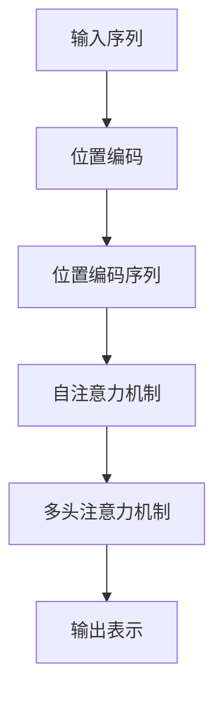

# 大规模语言模型从理论到实践 语境学习

## 1.背景介绍

### 1.1 语言模型的重要性

语言是人类交流和传递信息的重要工具,也是人工智能领域的核心研究课题之一。随着深度学习技术的不断发展,大规模语言模型(Large Language Model,LLM)已经成为自然语言处理(Natural Language Processing,NLP)领域的主导范式。LLM通过在海量文本数据上进行预训练,能够捕捉语言的丰富语义和上下文信息,从而在下游任务中表现出惊人的泛化能力。

语言模型在人工智能的诸多应用场景中扮演着关键角色,例如机器翻译、对话系统、问答系统、文本摘要、内容生成等。准确高效的语言模型不仅能提升人机交互的自然性和流畅性,还有助于挖掘文本数据中蕴含的丰富信息,推动人工智能技术在各行业的落地应用。

### 1.2 语境学习的重要性

语境(Context)是理解语言的关键所在。同一个词语或句子在不同语境下可能会有完全不同的含义和用法。因此,语境学习对于语言模型准确捕捉语义信息至关重要。传统的语言模型通常基于n-gram或LSTM等技术,缺乏对长距离语境依赖的建模能力。而大规模语言模型通过自注意力(Self-Attention)机制和多头注意力(Multi-Head Attention),能够更好地捕捉长距离的语义依赖关系,从而更准确地理解语境信息。

随着模型规模和训练数据的不断增长,语境学习的重要性也日益凸显。准确把握语境不仅能提高语言理解和生成的质量,还能避免模型在特定语境下产生不当或有害的输出,从而提升模型的安全性和可靠性。

## 2.核心概念与联系

### 2.1 自注意力机制(Self-Attention)

自注意力机制是大规模语言模型中的核心创新,它允许模型在编码序列时,每个位置的表示都能够直接关注到整个序列的其他位置,从而捕捉长距离的依赖关系。

在传统的序列模型(如RNN和LSTM)中,序列的每个位置都是通过前一个隐状态来计算的,这种链式结构使得它们难以有效地捕捉长距离的依赖关系。而自注意力机制则通过计算序列中每对位置之间的相关性分数,直接建立它们之间的关联,从而更好地捕捉长距离依赖。

自注意力机制的数学表达式如下:

$$\mathrm{Attention}(Q, K, V) = \mathrm{softmax}(\frac{QK^T}{\sqrt{d_k}})V$$

其中 $Q$ 表示查询(Query)向量, $K$ 表示键(Key)向量, $V$ 表示值(Value)向量。通过计算查询向量 $Q$ 与所有键向量 $K$ 的点积,然后除以缩放因子 $\sqrt{d_k}$ 并应用 softmax 函数,我们可以得到一个注意力分数向量。该向量与值向量 $V$ 相乘,即可获得加权后的表示,充分融合了序列中其他位置的信息。

自注意力机制为大规模语言模型提供了强大的语境建模能力,使其能够更好地理解长距离的语义依赖关系,从而提高语言理解和生成的质量。

### 2.2 多头注意力机制(Multi-Head Attention)

多头注意力机制是在自注意力机制的基础上进一步改进和扩展。它将查询、键和值向量进行线性投影,得到多组不同的表示,然后在每组表示上并行地执行自注意力操作,最后将这些注意力结果进行拼接和线性变换,得到最终的多头注意力表示。

多头注意力机制的数学表达式如下:

$$\mathrm{MultiHead}(Q, K, V) = \mathrm{Concat}(head_1, ..., head_h)W^O$$
$$\text{where } head_i = \mathrm{Attention}(QW_i^Q, KW_i^K, VW_i^V)$$

其中 $W_i^Q$、$W_i^K$、$W_i^V$ 和 $W^O$ 都是可学习的线性投影矩阵。多头注意力机制允许模型从不同的表示子空间中捕捉不同的语义信息,从而提高了模型的表示能力和泛化性能。

多头注意力机制为大规模语言模型带来了更强大的语境建模能力,使其能够更准确地捕捉复杂的语义依赖关系,从而在各种自然语言处理任务中取得了卓越的表现。

### 2.3 位置编码(Positional Encoding)

由于自注意力机制本身没有对序列位置信息进行建模,因此需要引入位置编码来赋予序列元素位置信息。位置编码通常是一个固定的向量,它根据序列位置的不同而有所不同,并被添加到序列的输入表示中。

常见的位置编码方法包括:

1. 学习位置嵌入向量
2. 正弦/余弦位置编码

其中,正弦/余弦位置编码是一种固定的、可学习的位置编码方式,它利用正弦和余弦函数来构建位置编码向量,数学表达式如下:

$$PE_{(pos, 2i)} = \sin(pos / 10000^{2i / d_{model}})$$
$$PE_{(pos, 2i+1)} = \cos(pos / 10000^{2i / d_{model}})$$

其中 $pos$ 表示序列位置, $i$ 表示维度索引, $d_{model}$ 表示模型维度。这种位置编码方式能够很好地捕捉序列的位置信息,并被广泛应用于大规模语言模型中。

通过位置编码,大规模语言模型能够更好地捕捉序列的位置信息,从而提高了对语义的理解能力。

上图展示了大规模语言模型中位置编码、自注意力机制和多头注意力机制之间的关系。输入序列首先经过位置编码,得到包含位置信息的序列表示。然后该表示被输入到自注意力机制中,捕捉序列内部的长距离依赖关系。最后,多头注意力机制对自注意力的结果进行融合,得到最终的输出表示,用于下游任务。

## 3.核心算法原理具体操作步骤  

大规模语言模型的核心算法原理主要包括两个部分:预训练(Pre-training)和微调(Fine-tuning)。

### 3.1 预训练(Pre-training)

预训练是大规模语言模型学习通用语言表示的关键步骤。在这个阶段,模型在大量未标注的文本数据上进行训练,目标是最大化语言模型的概率,即给定前面的词,预测下一个词的概率。

预训练的具体操作步骤如下:

1. **数据预处理**:首先需要对大量原始文本数据进行预处理,包括分词、过滤噪声数据、构建词表等。

2. **模型初始化**:初始化大规模语言模型的参数,包括词嵌入矩阵、自注意力层、前馈神经网络层等。

3. **掩码语言模型(Masked Language Modeling,MLM)**: 这是预训练的主要目标之一。具体操作是,在输入序列中随机掩码一部分词(通常是15%),然后让模型基于上下文预测被掩码的词。这样可以让模型学习到双向的语境信息。

4. **下一句预测(Next Sentence Prediction,NSP)**: 另一个预训练目标是判断两个句子是否为连续的句子对。这个目标可以让模型学习到更长距离的语义依赖关系。

5. **损失函数**:将MLM和NSP的损失函数相加,作为预训练的总损失函数。

6. **优化算法**:使用适当的优化算法(如Adam)来最小化损失函数,不断更新模型参数。

7. **训练过程**:在大量文本数据上反复执行上述步骤,直到模型收敛或达到预设的训练步数。

经过预训练,大规模语言模型可以学习到通用的语言表示,捕捉丰富的语义和语境信息。这为后续的下游任务微调奠定了基础。

### 3.2 微调(Fine-tuning)

微调是将预训练好的大规模语言模型应用到特定的下游任务中。在这个阶段,模型会在带有监督信号的任务数据上进行进一步的训练,以适应特定任务的需求。

微调的具体操作步骤如下:

1. **任务数据准备**:根据下游任务的性质,准备带有监督信号(如标签)的任务数据集。

2. **输入表示**:将任务数据转换为模型可以接受的输入表示,通常是词序列或者序列对。

3. **输出表示**:根据任务的性质,设计合适的输出表示。例如,对于文本分类任务,输出可以是分类标签的概率分布;对于序列生成任务,输出可以是生成的词序列。

4. **微调目标**:设计合适的微调目标函数,例如交叉熵损失函数用于分类任务,或者自回归语言模型损失函数用于生成任务。

5. **微调过程**:在任务数据上进行训练,优化微调目标函数。在这个过程中,大部分模型参数会被微调,但也可以选择冻结部分参数(如词嵌入层)以提高效率。

6. **评估**:在验证集或测试集上评估模型的性能,根据任务指标(如准确率、F1分数等)进行模型选择和超参数调优。

7. **部署**:将微调好的模型部署到实际的应用系统中,用于处理新的输入数据。

通过微调,大规模语言模型可以将通用的语言表示知识迁移到特定的下游任务中,从而显著提高任务性能。同时,微调也可以根据任务需求,让模型学习到特定领域的知识和语义信息。

## 4.数学模型和公式详细讲解举例说明

在大规模语言模型中,自注意力机制和多头注意力机制是最核心的数学模型,我们将详细讲解它们的原理和公式。

### 4.1 自注意力机制(Self-Attention)

自注意力机制的核心思想是,在计算序列的每个位置的表示时,都要关注到整个序列的其他位置,并根据它们的相关性赋予不同的权重。具体来说,对于序列中的第 $i$ 个位置,我们需要计算它与序列中其他所有位置 $j$ 的相关性分数 $e_{ij}$,然后通过 softmax 函数得到一个注意力权重向量 $\alpha_i$。最后,将注意力权重向量与序列的值向量 $V$ 相乘,即可得到第 $i$ 个位置的注意力表示 $z_i$。

自注意力机制的数学表达式如下:

$$e_{ij} = f(x_i, x_j)$$
$$\alpha_i = \mathrm{softmax}(e_i) = \frac{1}{\sum_k e^{e_{ik}}} \begin{bmatrix} e^{e_{i1}} \\ \vdots \\ e^{e_{iN}} \end{bmatrix}$$
$$z_i = \sum_{j=1}^N \alpha_{ij} (W_V x_j)$$

其中,函数 $f$ 可以是任何相似度函数,通常使用缩放点积相似度:

$$f(x_i, x_j) = \frac{x_i^T x_j}{\sqrt{d_k}}$$

这里 $d_k$ 是缩放因子,用于防止点积值过大导致梯度消失或爆炸。$W_V$ 是一个可学习的线性变换矩阵,用于将输入向量 $x_j$ 映射到值空间。

自注意力机制的一个重要优势是,它可以同时捕捉序列中任意两个位置之间的依赖关系,而不受距离的限制。这使得它在建模长距离依赖方面具有显著的优势。

让我们通过一个具体的例子来理解自注意力机制的计算过程。假设我们有一个长度为 4 的