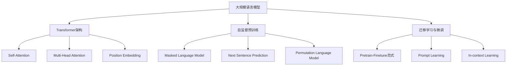

# 大规模语言模型从理论到实践 通用数据

## 1. 背景介绍
### 1.1 大规模语言模型的发展历程
#### 1.1.1 早期的语言模型
#### 1.1.2 神经网络语言模型的兴起 
#### 1.1.3 Transformer的革命性突破
### 1.2 大规模语言模型的意义与应用前景
#### 1.2.1 自然语言处理领域的里程碑
#### 1.2.2 推动人工智能走向通用人工智能
#### 1.2.3 在各行各业的广泛应用前景

## 2. 核心概念与联系
### 2.1 语言模型的定义与分类
#### 2.1.1 统计语言模型
#### 2.1.2 神经网络语言模型 
#### 2.1.3 大规模预训练语言模型
### 2.2 大规模语言模型的关键技术
#### 2.2.1 Transformer架构
#### 2.2.2 自监督预训练
#### 2.2.3 迁移学习与微调
### 2.3 大规模语言模型与其他AI技术的联系
#### 2.3.1 与计算机视觉的结合
#### 2.3.2 与语音识别的融合
#### 2.3.3 与知识图谱的互补



## 3. 核心算法原理具体操作步骤
### 3.1 Transformer的核心原理
#### 3.1.1 Self-Attention的计算过程
#### 3.1.2 Multi-Head Attention的并行机制
#### 3.1.3 Feed Forward Network的非线性变换
### 3.2 自监督预训练的具体实现
#### 3.2.1 Masked Language Model的训练过程
#### 3.2.2 Next Sentence Prediction的训练方法
#### 3.2.3 Permutation Language Model的改进
### 3.3 模型优化与改进技巧  
#### 3.3.1 残差连接与Layer Normalization
#### 3.3.2 Dropout与L2正则化
#### 3.3.3 学习率调度与Warmup策略

## 4. 数学模型和公式详细讲解举例说明
### 4.1 Transformer的数学表示
#### 4.1.1 Self-Attention的矩阵计算
$$Attention(Q,K,V) = softmax(\frac{QK^T}{\sqrt{d_k}})V$$
#### 4.1.2 Multi-Head Attention的数学描述  
$$MultiHead(Q,K,V) = Concat(head_1,...,head_h)W^O$$
$$head_i = Attention(QW_i^Q, KW_i^K, VW_i^V)$$
#### 4.1.3 Position Embedding的数学编码
### 4.2 语言模型的概率公式推导
#### 4.2.1 基于Softmax的语言模型
$$P(w_1, ..., w_n) = \prod_{i=1}^{n}P(w_i|w_1,...,w_{i-1})$$
#### 4.2.2 Masked Language Model的数学表达
$$P_{MLM}(w_i|w_{-i}) = \frac{exp(e(w_i)^Te(w_{-i}))}{\sum_{w'\in V}exp(e(w')^Te(w_{-i}))}$$
#### 4.2.3 Next Sentence Prediction的数学形式
### 4.3 损失函数与优化算法
#### 4.3.1 交叉熵损失函数
$$L_{CE} = -\sum_{i=1}^{n}y_ilog(p_i)$$
#### 4.3.2 AdamW优化算法
#### 4.3.3 学习率调度策略

## 5. 项目实践：代码实例和详细解释说明
### 5.1 使用Hugging Face的Transformers库
#### 5.1.1 加载预训练模型
```python
from transformers import BertModel, BertTokenizer

model = BertModel.from_pretrained('bert-base-uncased') 
tokenizer = BertTokenizer.from_pretrained('bert-base-uncased')
```
#### 5.1.2 文本编码与Embedding
```python
inputs = tokenizer("Hello world!", return_tensors="pt")
outputs = model(**inputs)
```
#### 5.1.3 下游任务微调
### 5.2 使用PyTorch从头开始训练
#### 5.2.1 定义Transformer模型结构
#### 5.2.2 数据预处理与Dataloader构建
#### 5.2.3 模型训练与评估
### 5.3 模型部署与推理优化
#### 5.3.1 使用ONNX加速推理
#### 5.3.2 基于TensorRT的部署
#### 5.3.3 模型量化与蒸馏

## 6. 实际应用场景
### 6.1 智能问答与对话系统
#### 6.1.1 基于BERT的FAQ问答
#### 6.1.2 使用GPT构建开放域对话系统
#### 6.1.3 个性化对话生成
### 6.2 文本分类与情感分析
#### 6.2.1 基于BERT的文本分类
#### 6.2.2 使用RoBERTa进行情感分析
#### 6.2.3 多标签文本分类
### 6.3 命名实体识别与关系抽取
#### 6.3.1 基于BERT的命名实体识别  
#### 6.3.2 使用GPT进行实体关系抽取
#### 6.3.3 低资源场景下的迁移学习

## 7. 工具和资源推荐
### 7.1 开源框架与库
#### 7.1.1 Hugging Face Transformers
#### 7.1.2 Fairseq与PARL
#### 7.1.3 AllenNLP与FastNLP 
### 7.2 预训练模型与Benchmark
#### 7.2.1 BERT家族模型
#### 7.2.2 GPT系列模型
#### 7.2.3 GLUE与SuperGLUE基准测试
### 7.3 数据集与语料库
#### 7.3.1 WikiText与BookCorpus
#### 7.3.2 Common Crawl语料库
#### 7.3.3 行业垂直领域数据集

## 8. 总结：未来发展趋势与挑战
### 8.1 大规模语言模型的发展趋势 
#### 8.1.1 模型规模与性能的持续提升
#### 8.1.2 多模态语言模型的崛起
#### 8.1.3 语言模型的通用化与普适化
### 8.2 面临的挑战与问题
#### 8.2.1 计算资源与训练成本的瓶颈
#### 8.2.2 数据偏见与模型公平性问题
#### 8.2.3 可解释性与可控性的提升
### 8.3 未来研究方向与展望
#### 8.3.1 模型轻量化与移动端部署
#### 8.3.2 结合因果推理与常识推理
#### 8.3.3 探索更高效的预训练范式

## 9. 附录：常见问题与解答
### 9.1 如何选择合适的预训练模型？
### 9.2 如何处理低资源语言的迁移学习？
### 9.3 大规模语言模型是否会替代传统的NLP技术？
### 9.4 如何平衡模型性能与推理速度？
### 9.5 大规模语言模型在垂直行业的应用前景如何？

作者：禅与计算机程序设计艺术 / Zen and the Art of Computer Programming