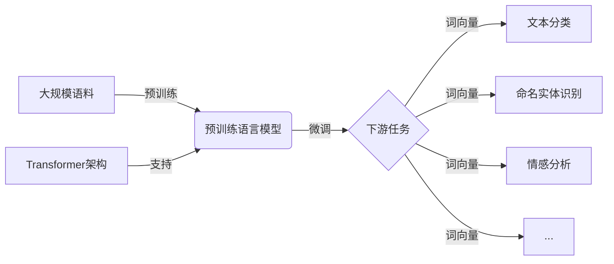

# 大语言模型 (Large Language Models, LLM) 原理与代码实例讲解

## 1. 背景介绍
### 1.1 大语言模型的兴起
近年来,随着深度学习技术的快速发展,自然语言处理(NLP)领域取得了突破性进展。其中,大语言模型(Large Language Models, LLM)的出现标志着NLP进入了一个新的时代。LLM通过在海量文本数据上进行预训练,学习到了丰富的语言知识和通用语言表示,展现出了惊人的语言理解和生成能力,受到学术界和工业界的广泛关注。

### 1.2 大语言模型的应用价值
LLM为NLP领域带来了革命性的变化。它们不仅可以用于传统的NLP任务如文本分类、命名实体识别、情感分析等,还能够应用于更加复杂和开放的场景,如对话系统、文本摘要、问答系统、机器翻译等。LLM强大的语言生成能力使其在内容创作、虚拟助手等领域也有广阔的应用前景。

### 1.3 本文的目的和结构
本文旨在深入探讨大语言模型的原理,并通过代码实例帮助读者更好地理解和应用LLM。全文分为9个部分:1)背景介绍;2)核心概念与联系;3)核心算法原理具体操作步骤;4)数学模型和公式详细讲解举例说明;5)项目实践:代码实例和详细解释说明;6)实际应用场景;7)工具和资源推荐;8)总结:未来发展趋势与挑战;9)附录:常见问题与解答。通过本文的学习,读者将全面掌握LLM的理论基础和实践技能。

## 2. 核心概念与联系
### 2.1 大语言模型的定义
大语言模型是一类基于深度学习的语言模型,通过在大规模文本语料上进行预训练,学习语言的统计规律和语义表示。与传统语言模型相比,LLM的参数量更大(通常在亿级以上),训练数据更加海量(TB级别),因此能够捕捉更加丰富和细粒度的语言知识。

### 2.2 预训练和微调
- 预训练(Pre-training):在大规模无标注语料上进行自监督学习,通过掩码语言建模(Masked Language Modeling,MLM)等任务,让模型学习通用的语言表示。预训练是LLM的关键,使其能够学习到语言的本质特征。
- 微调(Fine-tuning):在预训练的基础上,针对特定的下游任务(如文本分类)进行监督学习,通过少量标注数据对模型进行调优,使其适应具体任务。微调使LLM能够快速适应不同的应用场景。

### 2.3 Transformer 架构
Transformer 是当前大语言模型的主流架构。它采用了自注意力机制(Self-Attention),能够捕捉词与词之间的长距离依赖关系。与传统的循环神经网络(RNN)和卷积神经网络(CNN)相比,Transformer 在并行计算和长序列建模方面有着明显优势,大大提升了训练和推理效率。

### 2.4 词向量(Word Embedding)
词向量是将词映射为连续实值向量的技术。通过词向量,可以将离散的词符号转化为语义空间中的点,使得语义相近的词在向量空间中距离更近。LLM在预训练过程中学习词向量表示,并将其作为下游任务的输入特征,极大地提升了模型的语义理解能力。

### 2.5 核心概念之间的联系
下图展示了大语言模型的核心概念之间的联系:



预训练语言模型在大规模语料上学习通用语言知识,并使用 Transformer 架构提取特征。在此基础上,针对具体任务进行微调,输出任务所需的词向量表示,最终完成各类下游 NLP 任务。

## 3. 核心算法原理具体操作步骤
### 3.1 预训练阶段
#### 3.1.1 数据准备
- 收集大规模无标注文本语料,如维基百科、新闻、图书等。
- 对文本进行清洗和预处理,如去除HTML标签、特殊字符、标点符号等。
- 使用字节对编码(Byte Pair Encoding, BPE)或 WordPiece 等方法对文本进行分词,得到子词单元(subword units)序列。

#### 3.1.2 模型构建
- 构建 Transformer 编码器,设置层数、注意力头数、隐藏层大小等超参数。
- 初始化词向量矩阵和位置编码。
- 定义掩码语言建模(MLM)任务的损失函数,随机掩盖一定比例的词,让模型预测被掩盖的词。

#### 3.1.3 模型训练
- 将语料划分为训练集和验证集。
- 使用 Adam 优化器,设置学习率、批大小等超参数。
- 对训练数据进行随机打乱和批次化处理。
- 在每个批次中,随机掩码词并计算 MLM 损失。
- 反向传播损失,更新模型参数。
- 定期在验证集上评估模型性能,保存最优模型。

### 3.2 微调阶段
#### 3.2.1 任务定义
- 根据具体的下游任务,如文本分类、命名实体识别等,准备相应的标注数据集。
- 定义任务的输入和输出格式,如分类任务的类别标签。

#### 3.2.2 模型调整
- 在预训练模型的基础上,根据任务需要调整模型结构,如添加分类器、序列标注层等。
- 初始化新增参数,冻结或微调预训练参数。

#### 3.2.3 模型训练
- 将任务数据划分为训练集、验证集和测试集。
- 使用预训练模型的词向量作为输入,fine-tune 模型参数。
- 计算任务相关的损失函数,如交叉熵损失。
- 反向传播损失,更新模型参数。
- 定期在验证集上评估模型性能,选择最优模型。

#### 3.2.4 模型评估
- 在测试集上评估模型的性能指标,如准确率、F1值等。
- 分析模型的预测结果,识别错误样本和改进方向。

## 4. 数学模型和公式详细讲解举例说明
### 4.1 Transformer 的自注意力机制
Transformer 的核心是自注意力机制,它能够捕捉词与词之间的依赖关系。对于输入序列 $X=(x_1,\dots,x_n)$,自注意力的计算过程如下:

1. 计算查询矩阵 $Q$、键矩阵 $K$ 和值矩阵 $V$:
$$ Q = XW^Q, K = XW^K, V = XW^V $$
其中 $W^Q, W^K, W^V$ 是可学习的参数矩阵。

2. 计算注意力权重:
$$ A = \text{softmax}(\frac{QK^T}{\sqrt{d_k}}) $$
其中 $d_k$ 是键向量的维度,用于缩放点积结果。

3. 计算注意力输出:
$$ \text{Attention}(Q,K,V) = AV $$

举例说明:假设有一个句子 "The cat sat on the mat",通过自注意力机制,可以学习到词与词之间的关系,如 "cat" 和 "sat" 的主谓关系,"on" 和 "mat" 的介词宾语关系等。

### 4.2 掩码语言建模(MLM)
MLM 是 LLM 预训练的常用任务,通过随机掩盖部分词并让模型预测被掩盖的词,使模型学习上下文信息。给定输入序列 $X=(x_1,\dots,x_n)$,MLM 的损失函数定义为:

$$ \mathcal{L}_{\text{MLM}} = -\sum_{i=1}^n m_i \log p(x_i|X_{\backslash i}) $$

其中 $m_i$ 是掩码指示变量,若 $x_i$ 被掩盖则为1,否则为0;$p(x_i|X_{\backslash i})$ 是模型预测 $x_i$ 的概率。

举例说明:对于句子 "The cat [MASK] on the mat",模型需要根据上下文预测 [MASK] 位置最可能的词,如 "sat","slept" 等,从而学习到词与词之间的语义关系。

### 4.3 微调的损失函数
在微调阶段,损失函数根据具体任务而定。以文本分类任务为例,常用的损失函数是交叉熵损失:

$$ \mathcal{L}_{\text{cls}} = -\sum_{i=1}^N \sum_{c=1}^C y_{ic} \log p(c|x_i) $$

其中 $N$ 是样本数量,$C$ 是类别数量,$y_{ic}$ 是样本 $x_i$ 的真实类别标签(one-hot 形式),$p(c|x_i)$ 是模型预测样本 $x_i$ 属于类别 $c$ 的概率。

举例说明:对于一个二分类任务,模型在微调后输出样本属于正类的概率为0.8,负类的概率为0.2,而样本的真实标签为正类,则交叉熵损失为:

$$ \mathcal{L}_{\text{cls}} = -[1 \cdot \log(0.8) + 0 \cdot \log(0.2)] = 0.223 $$

通过最小化该损失函数,模型可以学习到样本与类别之间的对应关系。

## 5. 项目实践:代码实例和详细解释说明
下面以 PyTorch 为例,展示如何实现一个基于 Transformer 的大语言模型,并应用于文本分类任务。

### 5.1 预训练阶段
#### 5.1.1 数据准备
```python
import torch
from transformers import BertTokenizer

# 加载预训练的分词器
tokenizer = BertTokenizer.from_pretrained('bert-base-uncased')

# 读取文本数据
with open('corpus.txt', 'r', encoding='utf-8') as f:
    corpus = f.readlines()

# 对文本进行编码
encoded_inputs = tokenizer(corpus, return_tensors='pt', max_length=512, truncation=True, padding='max_length')
```

#### 5.1.2 模型构建
```python
from transformers import BertForMaskedLM

# 加载预训练的 BERT 模型
model = BertForMaskedLM.from_pretrained('bert-base-uncased')
```

#### 5.1.3 模型训练
```python
from torch.utils.data import DataLoader, RandomSampler
from transformers import AdamW, get_linear_schedule_with_warmup

# 设置超参数
batch_size = 32
epochs = 3
learning_rate = 2e-5
warmup_steps = 1000

# 创建数据加载器
train_dataloader = DataLoader(encoded_inputs, sampler=RandomSampler(encoded_inputs), batch_size=batch_size)

# 设置优化器和学习率调度器
optimizer = AdamW(model.parameters(), lr=learning_rate)
scheduler = get_linear_schedule_with_warmup(optimizer, num_warmup_steps=warmup_steps, num_training_steps=len(train_dataloader)*epochs)

# 训练模型
model.train()
for epoch in range(epochs):
    for batch in train_dataloader:
        input_ids = batch['input_ids']
        attention_mask = batch['attention_mask']
        labels = batch['input_ids'].clone()
        
        # 随机掩码 15% 的词
        rand = torch.rand(labels.shape)
        mask_arr = (rand < 0.15) * (labels != 101) * (labels != 102)
        labels[~mask_arr] = -100
        
        outputs = model(input_ids, attention_mask=attention_mask, labels=labels)
        loss = outputs.loss
        
        loss.backward()
        optimizer.step()
        scheduler.step()
        optimizer.zero_grad()
        
    print(f'Epoch {epoch+1} loss: {loss.item():.3f}')

# 保存预训练模型
model.save_pretrained('pretrained_model')
```

### 5.2 微调阶段
#### 5.2.1 任务定义
```python
# 读取文本分类数据
with open('train.txt', 'r', encoding='utf-8') as f:
    train_data = f.readlines()
    
with open('test.txt', 'r', encoding='utf-8') as