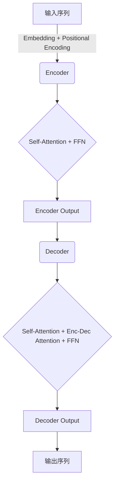

# 大语言模型(Large Language Models) - 原理与代码实例讲解

## 1.背景介绍

在过去几年中,大型语言模型(Large Language Models,LLMs)在自然语言处理(NLP)领域取得了令人瞩目的进展。这些模型通过在大量文本数据上进行预训练,学习捕捉语言的统计规律和语义关联,从而获得了广泛的知识和语言理解能力。

LLMs可以被视为一种"通用"的语言智能,能够在各种NLP任务中表现出色,如文本生成、机器翻译、问答系统、文本摘要等。与传统的基于规则或统计方法形成鲜明对比,LLMs采用了基于深度学习的端到端方法,通过自监督学习捕捉语言的内在规律,从而避免了人工特征工程的复杂性。

随着计算能力和数据量的不断增长,LLMs的规模也在不断扩大。从2018年发布的Transformer模型,到2020年的GPT-3,再到2022年的PaLM和Chinchilla等,模型参数量已经从数十亿增长到数万亿。这些越来越庞大的模型展现出了更强的语言理解和生成能力,但同时也带来了诸多挑战,如效率、可解释性、偏见和安全性等问题。

## 2.核心概念与联系

### 2.1 自注意力机制(Self-Attention)

自注意力机制是Transformer等LLMs的核心,它允许模型捕捉输入序列中任意两个位置之间的依赖关系。不同于RNN等序列模型,自注意力机制通过计算查询(Query)、键(Key)和值(Value)之间的相似性,对序列中的每个位置分配注意力权重,从而捕捉长距离依赖关系。

$$\mathrm{Attention}(Q, K, V) = \mathrm{softmax}\left(\frac{QK^T}{\sqrt{d_k}}\right)V$$

其中$Q$、$K$、$V$分别表示查询、键和值,通过缩放点积注意力机制计算注意力权重。

### 2.2 Transformer架构

Transformer是第一个完全基于自注意力机制的序列到序列模型,它由编码器(Encoder)和解码器(Decoder)组成。编码器捕捉输入序列的上下文信息,解码器则基于编码器的输出和前一步生成的token,预测下一个token。



### 2.3 预训练与微调(Pretraining & Finetuning)

LLMs通常采用两阶段训练策略:首先在大规模无标注语料上进行自监督预训练,学习通用的语言表示;然后在特定的有标注数据集上进行微调(Finetuning),将预训练模型迁移到下游任务。这种策略可以显著提高模型的泛化性能,并降低对大量标注数据的依赖。

### 2.4 生成式预训练任务

常见的生成式预训练任务包括:

- **Causal Language Modeling**: 给定文本前缀,预测下一个token。
- **Masked Language Modeling**: 随机掩码部分token,预测被掩码的token。
- **Next Sentence Prediction**: 判断两个句子是否相邻。

## 3.核心算法原理具体操作步骤  

### 3.1 Transformer编码器(Encoder)

Transformer编码器的核心是多头自注意力(Multi-Head Self-Attention)和前馈神经网络(Feed-Forward Network,FFN)。

1. **输入表示**:将输入token序列通过Embedding层和位置编码(Positional Encoding)转换为向量表示。

2. **多头自注意力**:对输入序列进行自注意力计算,捕捉序列内元素之间的依赖关系。

   - 将输入$X$线性投影到查询$Q$、键$K$和值$V$:
     $$Q=XW_Q,\ K=XW_K,\ V=XW_V$$
   - 计算缩放点积注意力权重:
     $$\mathrm{Attention}(Q, K, V) = \mathrm{softmax}\left(\frac{QK^T}{\sqrt{d_k}}\right)V$$
   - 多头注意力通过并行计算$h$个注意力头,再将结果拼接:
     $$\mathrm{MultiHead}(Q, K, V) = \mathrm{Concat}(\mathrm{head}_1, ..., \mathrm{head}_h)W^O$$

3. **残差连接与层规范化**:对多头注意力的输出进行残差连接和层规范化,保持梯度稳定。

4. **前馈神经网络**:对规范化后的向量通过两层全连接网络进行变换,引入非线性。

5. **残差连接与层规范化**:与注意力层类似,对FFN输出进行残差连接和层规范化。

上述过程对输入序列进行编码,产生编码器输出$C$,送入解码器进行解码。

### 3.2 Transformer解码器(Decoder)

解码器的结构与编码器类似,但增加了编码器-解码器注意力(Encoder-Decoder Attention)机制。

1. **输入表示**:将输出序列token通过Embedding层和位置编码转换为向量表示。

2. **掩码多头自注意力**:对当前时间步之前的输出进行自注意力计算,忽略未来信息。

3. **编码器-解码器注意力**:将编码器输出$C$作为键$K$和值$V$,解码器输入作为查询$Q$,计算注意力权重。

4. **前馈神经网络**:与编码器类似,引入非线性变换。

5. **残差连接与层规范化**

6. **输出投影**:将最终输出通过线性层和softmax,得到下一个token的概率分布。

以上步骤逐步生成输出序列,直至生成结束标记或达到最大长度。

## 4.数学模型和公式详细讲解举例说明

### 4.1 自注意力(Self-Attention)

自注意力机制是Transformer的核心,它通过计算查询(Query)、键(Key)和值(Value)之间的相似性,对序列中的每个位置分配注意力权重,从而捕捉长距离依赖关系。

具体来说,给定一个长度为$n$的序列$X=\{x_1, x_2, ..., x_n\}$,我们首先将其线性投影到查询$Q$、键$K$和值$V$:

$$Q=XW_Q,\ K=XW_K,\ V=XW_V$$

其中$W_Q$、$W_K$、$W_V$是可学习的投影矩阵。

然后,我们计算查询$Q$和所有键$K$的缩放点积,得到注意力分数矩阵:

$$\mathrm{Attention}(Q, K) = \mathrm{softmax}\left(\frac{QK^T}{\sqrt{d_k}}\right)$$

其中$d_k$是键的维度,用于缩放点积以避免过大的值导致softmax梯度饱和。

接下来,将注意力分数矩阵与值$V$相乘,得到加权和作为注意力输出:

$$\mathrm{Attention}(Q, K, V) = \mathrm{Attention}(Q, K)V$$

对于长度为$n$的序列,自注意力的计算复杂度为$\mathcal{O}(n^2d)$,其中$d$是向量维度。为了提高计算效率,Transformer采用了多头注意力(Multi-Head Attention)机制。

### 4.2 多头注意力(Multi-Head Attention)

多头注意力通过并行计算$h$个注意力头,每个头对整个序列计算自注意力,然后将所有头的输出拼接起来:

$$\mathrm{head}_i = \mathrm{Attention}(QW_i^Q, KW_i^K, VW_i^V)$$
$$\mathrm{MultiHead}(Q, K, V) = \mathrm{Concat}(\mathrm{head}_1, ..., \mathrm{head}_h)W^O$$

其中$W_i^Q$、$W_i^K$、$W_i^V$和$W^O$都是可学习的投影矩阵。多头注意力允许模型从不同的子空间捕捉不同的依赖关系,提高了模型的表达能力。

### 4.3 位置编码(Positional Encoding)

由于自注意力机制没有捕捉序列顺序的能力,Transformer引入了位置编码,将序列的位置信息编码到输入向量中。位置编码可以是学习的或预定义的,一种常用的预定义位置编码如下:

$$\begin{aligned}
\mathrm{PE}_{(pos, 2i)} &= \sin\left(\frac{pos}{10000^{2i/d_\text{model}}}\right) \\
\mathrm{PE}_{(pos, 2i+1)} &= \cos\left(\frac{pos}{10000^{2i/d_\text{model}}}\right)
\end{aligned}$$

其中$pos$是token的位置,$i$是维度索引。位置编码与输入向量相加,使模型能够区分不同位置的token。

### 4.4 缩放点积注意力(Scaled Dot-Product Attention)

在计算自注意力时,我们使用了缩放点积注意力机制。具体来说,给定查询$Q$、键$K$和值$V$,注意力输出计算如下:

$$\mathrm{Attention}(Q, K, V) = \mathrm{softmax}\left(\frac{QK^T}{\sqrt{d_k}}\right)V$$

其中$d_k$是键的维度。缩放操作$\frac{1}{\sqrt{d_k}}$可以避免点积过大导致softmax梯度饱和的问题。

### 4.5 前馈神经网络(Feed-Forward Network)

除了多头自注意力子层,Transformer的编码器和解码器还包含前馈神经网络子层,它由两个线性变换和一个ReLU激活函数组成:

$$\mathrm{FFN}(x) = \max(0, xW_1 + b_1)W_2 + b_2$$

前馈网络为每个位置的表示引入了非线性变换,提高了模型的表达能力。

### 4.6 层规范化(Layer Normalization)

为了避免内部协变量偏移(Internal Covariate Shift)问题,Transformer采用了层规范化(Layer Normalization)操作,而非批量规范化。具体来说,对于输入$x$,层规范化的计算如下:

$$\mu = \frac{1}{H}\sum_{i=1}^{H}x_i \qquad \sigma^2 = \frac{1}{H}\sum_{i=1}^{H}(x_i - \mu)^2$$
$$\mathrm{LN}(x) = \gamma \odot \frac{x - \mu}{\sqrt{\sigma^2 + \epsilon}} + \beta$$

其中$H$是隐藏维度的大小,$\gamma$和$\beta$是可学习的缩放和偏移参数,用于保留表示的平均值和方差。

层规范化在Transformer的每个子层之后都会被应用,有助于梯度的传播和模型的收敛。

## 5.项目实践:代码实例和详细解释说明

以下是一个使用PyTorch实现的简化Transformer模型示例,包括编码器(Encoder)和解码器(Decoder)的核心组件。为了简化说明,我们省略了一些辅助功能(如位置编码、掩码等)。

```python
import torch
import torch.nn as nn
import math

# 缩放点积注意力
class ScaledDotProductAttention(nn.Module):
    def __init__(self, d_k):
        super().__init__()
        self.d_k = d_k

    def forward(self, Q, K, V):
        scores = torch.matmul(Q, K.transpose(-2, -1)) / math.sqrt(self.d_k)
        attn = torch.softmax(scores, dim=-1)
        context = torch.matmul(attn, V)
        return context

# 多头注意力
class MultiHeadAttention(nn.Module):
    def __init__(self, d_model, num_heads):
        super().__init__()
        self.num_heads = num_heads
        self.head_dim = d_model // num_heads

        self.W_q = nn.Linear(d_model, d_model)
        self.W_k = nn.Linear(d_model, d_model)
        self.W_v = nn.Linear(d_model, d_model)
        self.W_o = nn.Linear(d_model, d_model)

        self.attention = ScaledDotProductAttention(self.head_dim)

    def forward(self, Q, K, V):
        batch_size = Q.size(0)

        q = self.W_q(Q).view(batch_size, -1, self.num_heads, self.head_dim).transpose