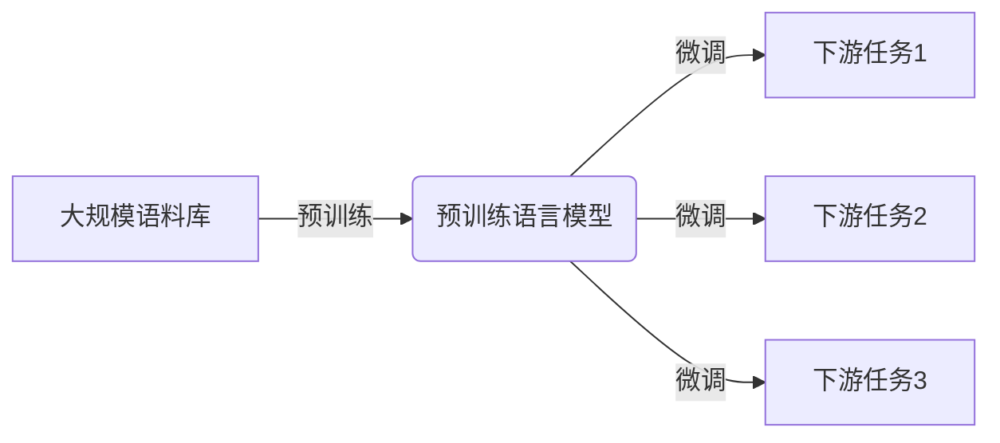
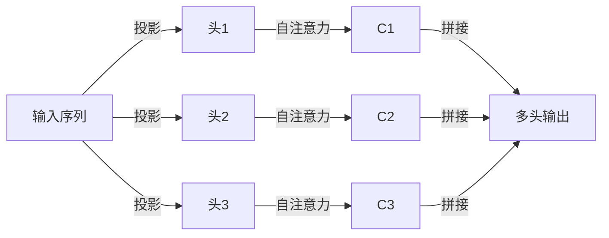

# 大语言模型原理与工程实践：基于上下文学习的推理策略

## 1. 背景介绍

### 1.1 语言模型的重要性

语言模型是自然语言处理领域的核心技术之一,广泛应用于机器翻译、语音识别、问答系统、文本生成等多个领域。随着深度学习技术的快速发展,基于神经网络的语言模型取得了巨大的进步,尤其是大型语言模型(Large Language Model,LLM)的出现,极大地推动了自然语言处理技术的发展。

### 1.2 大语言模型的兴起

近年来,benefiting from 海量数据、强大的计算能力和新型神经网络架构的支持,大型语言模型取得了突破性的进展。代表性模型包括 GPT(Generative Pre-trained Transformer)、BERT(Bidirectional Encoder Representations from Transformers)、XLNet、T5(Text-to-Text Transfer Transformer)等,这些模型通过在大规模语料库上进行预训练,学习到了丰富的语言知识,展现出了强大的语言理解和生成能力。

### 1.3 上下文学习的重要性

然而,传统的语言模型主要关注单词或短语之间的局部关系,缺乏对长期依赖和全局上下文的建模能力。而上下文学习(Contextual Learning)技术的出现,使得语言模型能够更好地捕捉长距离依赖关系,理解语义上下文,从而提高了模型的性能和泛化能力。

## 2. 核心概念与联系

### 2.1 自注意力机制(Self-Attention)

自注意力机制是上下文学习的核心技术,它允许模型在计算表示时,直接捕获输入序列中任意两个位置之间的关系,而不再局限于捕获局部相邻的依赖关系。这种全局依赖建模能力使得模型能够更好地理解长距离上下文信息。


### 2.2 transformer 架构

Transformer 是第一个完全基于自注意力机制的序列到序列模型,它抛弃了传统的 RNN 和 CNN 结构,使用多头自注意力层和前馈神经网络层构建了一种全新的架构。Transformer 架构在机器翻译等任务上取得了卓越的表现,成为了大型语言模型的主流架构。


### 2.3 预训练与微调(Pre-training & Fine-tuning)

大型语言模型通常采用预训练与微调的范式。在预训练阶段,模型在大规模无监督语料库上进行自监督学习,获得通用的语言表示能力。在微调阶段,预训练模型在特定的下游任务上进行有监督的微调,使模型能够适应特定任务的需求。这种范式大大提高了模型的泛化能力和训练效率。



## 3. 核心算法原理具体操作步骤

### 3.1 自注意力机制计算过程

自注意力机制的计算过程包括以下几个步骤:

1. 将输入序列 $X = (x_1, x_2, \dots, x_n)$ 映射到查询(Query)、键(Key)和值(Value)向量空间,得到 $Q = (q_1, q_2, \dots, q_n)$、$K = (k_1, k_2, \dots, k_n)$ 和 $V = (v_1, v_2, \dots, v_n)$。

2. 计算查询和键之间的相似度分数矩阵 $S$:

$$S = QK^T$$

其中 $S_{ij}$ 表示第 $i$ 个查询向量与第 $j$ 个键向量之间的相似度分数。

3. 对相似度分数矩阵 $S$ 进行缩放和软最大化操作,得到注意力权重矩阵 $A$:

$$A = \text{softmax}(\frac{S}{\sqrt{d_k}})$$

其中 $d_k$ 是键向量的维度,用于防止较大的值导致梯度饱和。

4. 将注意力权重矩阵 $A$ 与值向量 $V$ 相乘,得到加权和表示 $Z$:

$$Z = AV$$

$Z$ 就是自注意力机制的输出,它捕捉了输入序列中任意两个位置之间的依赖关系。

### 3.2 多头自注意力机制

为了捕捉不同子空间的依赖关系,transformer 引入了多头自注意力机制。它将查询、键和值向量分别投影到不同的子空间,并在每个子空间内计算自注意力,最后将所有子空间的结果拼接起来。



### 3.3 位置编码

由于自注意力机制没有捕捉序列顺序信息的能力,transformer 在输入嵌入中引入了位置编码,为每个位置赋予一个唯一的向量表示,从而使模型能够捕捉序列的位置信息。

### 3.4 预训练任务

常见的预训练任务包括:

- **掩码语言模型(Masked Language Modeling, MLM)**: 随机掩码输入序列中的一部分词,模型需要预测被掩码的词。
- **下一句预测(Next Sentence Prediction, NSP)**: 判断两个句子是否连续出现。
- **因果语言模型(Causal Language Modeling, CLM)**: 给定前缀,模型需要预测后续的词。
- **序列到序列预训练(Sequence-to-Sequence Pre-training)**: 将源序列映射到目标序列,例如机器翻译等任务。

通过这些预训练任务,模型学习到了丰富的语言知识和上下文理解能力。

## 4. 数学模型和公式详细讲解举例说明

### 4.1 自注意力计算公式

自注意力机制的数学计算过程可以用以下公式表示:

$$\begin{aligned}
Q &= XW^Q\\
K &= XW^K\\
V &= XW^V\\
S &= QK^T\\
A &= \text{softmax}(\frac{S}{\sqrt{d_k}})\\
Z &= AV
\end{aligned}$$

其中:

- $X \in \mathbb{R}^{n \times d}$ 是输入序列,长度为 $n$,每个词嵌入维度为 $d$。
- $W^Q, W^K, W^V \in \mathbb{R}^{d \times d_k}$ 是投影矩阵,将输入映射到查询、键和值空间。
- $Q, K, V \in \mathbb{R}^{n \times d_k}$ 分别是查询、键和值向量序列。
- $S \in \mathbb{R}^{n \times n}$ 是相似度分数矩阵。
- $A \in \mathbb{R}^{n \times n}$ 是注意力权重矩阵。
- $Z \in \mathbb{R}^{n \times d_k}$ 是自注意力的输出序列。

让我们以一个简单的例子来说明自注意力机制的计算过程。假设输入序列为 $X = (x_1, x_2, x_3)$,其中 $x_1, x_2, x_3$ 是词嵌入向量。我们将其投影到查询、键和值空间:

$$\begin{aligned}
Q &= (q_1, q_2, q_3)\\
K &= (k_1, k_2, k_3)\\
V &= (v_1, v_2, v_3)
\end{aligned}$$

接下来,计算相似度分数矩阵 $S$:

$$S = \begin{pmatrix}
q_1 \cdot k_1 & q_1 \cdot k_2 & q_1 \cdot k_3\\
q_2 \cdot k_1 & q_2 \cdot k_2 & q_2 \cdot k_3\\
q_3 \cdot k_1 & q_3 \cdot k_2 & q_3 \cdot k_3
\end{pmatrix}$$

对 $S$ 进行缩放和软最大化操作,得到注意力权重矩阵 $A$:

$$A = \text{softmax}(\frac{S}{\sqrt{d_k}})$$

最后,将注意力权重矩阵 $A$ 与值向量 $V$ 相乘,得到自注意力的输出序列 $Z$:

$$Z = \begin{pmatrix}
a_{11}v_1 + a_{12}v_2 + a_{13}v_3\\
a_{21}v_1 + a_{22}v_2 + a_{23}v_3\\
a_{31}v_1 + a_{32}v_2 + a_{33}v_3
\end{pmatrix}$$

其中,每个输出向量 $z_i$ 是输入序列中所有向量的加权和,权重由相应的注意力分数 $a_{ij}$ 决定。这样,自注意力机制就捕捉了输入序列中任意两个位置之间的依赖关系。

### 4.2 多头自注意力计算公式

多头自注意力机制的计算公式如下:

$$\begin{aligned}
\text{MultiHead}(Q, K, V) &= \text{Concat}(head_1, \dots, head_h)W^O\\
\text{where } head_i &= \text{Attention}(QW_i^Q, KW_i^K, VW_i^V)
\end{aligned}$$

其中:

- $Q, K, V$ 分别是查询、键和值序列。
- $W_i^Q, W_i^K, W_i^V$ 是第 $i$ 个头的投影矩阵。
- $\text{Attention}(\cdot)$ 是单头自注意力函数。
- $W^O$ 是输出投影矩阵,将多个头的结果拼接在一起。

以一个简单的例子来说明多头自注意力的计算过程。假设有 $h=2$ 个头,输入序列为 $X = (x_1, x_2, x_3)$。首先,将输入序列投影到每个头的查询、键和值空间:

$$\begin{aligned}
Q_1 &= (q_1^1, q_2^1, q_3^1), \quad K_1 = (k_1^1, k_2^1, k_3^1), \quad V_1 = (v_1^1, v_2^1, v_3^1)\\
Q_2 &= (q_1^2, q_2^2, q_3^2), \quad K_2 = (k_1^2, k_2^2, k_3^2), \quad V_2 = (v_1^2, v_2^2, v_3^2)
\end{aligned}$$

然后,在每个头内计算自注意力:

$$\begin{aligned}
head_1 &= \text{Attention}(Q_1, K_1, V_1)\\
head_2 &= \text{Attention}(Q_2, K_2, V_2)
\end{aligned}$$

最后,将所有头的结果拼接在一起,并进行输出投影:

$$\text{MultiHead}(Q, K, V) = \text{Concat}(head_1, head_2)W^O$$

通过多头自注意力机制,模型能够从不同的子空间捕捉不同的依赖关系,提高了模型的表示能力。

## 5. 项目实践：代码实例和详细解释说明

以下是使用 PyTorch 实现自注意力和多头自注意力机制的示例代码:

```python
import torch
import torch.nn as nn
import math

class ScaledDotProductAttention(nn.Module):
    """
    Scaled Dot-Product Attention
    """
    def __init__(self, d_k):
        super().__init__()
        self.d_k = d_k

    def forward(self, Q, K, V):
        scores = torch.matmul(Q, K.transpose(-2, -1)) / math.sqrt(self.d_k)
        attn = torch.softmax(scores, dim=-1)
        context = torch.matmul(attn, V)
        return context

class MultiHeadAttention(nn.Module):
    """
    Multi-Head Attention
    """
    def __init__(self, d_model, num