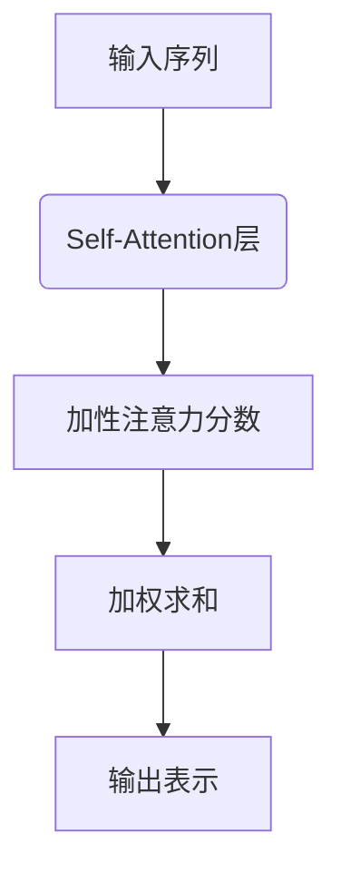
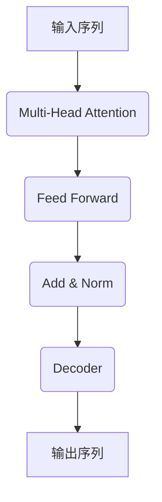
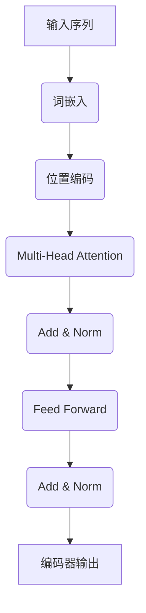
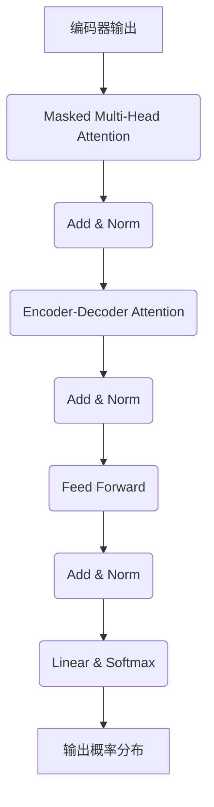
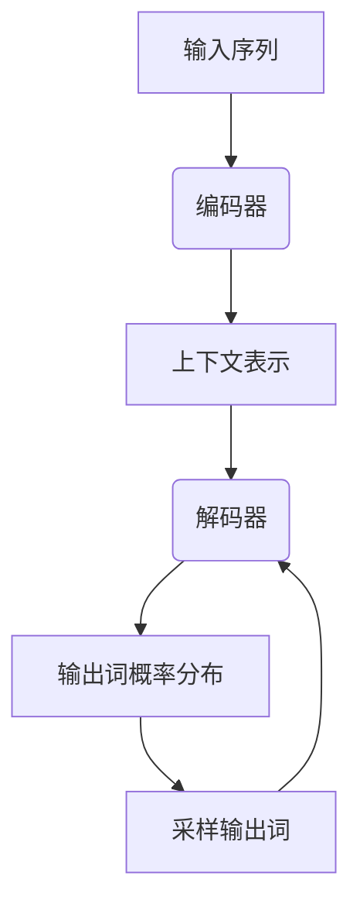
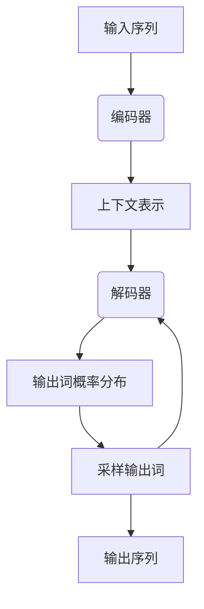

# 大语言模型原理与工程实践：大语言模型为什么这么强

## 1. 背景介绍

### 1.1 人工智能的新时代

随着计算能力的不断提高和大数据时代的到来，人工智能技术取得了长足的进步。其中,大型语言模型(Large Language Model,LLM)的出现,标志着人工智能进入了一个新的里程碑。

### 1.2 大语言模型的兴起

大语言模型是一种基于深度学习的自然语言处理(NLP)模型,能够从海量文本数据中学习语言知识和模式。通过预训练的方式,模型可以获得广泛的语言理解和生成能力,为各种自然语言处理任务提供强大的基础模型。

### 1.3 大语言模型的影响力

近年来,以GPT(Generative Pre-trained Transformer)、BERT(Bidirectional Encoder Representations from Transformers)和PaLM(Pathways Language Model)为代表的大语言模型取得了令人瞩目的成就,在自然语言处理、对话系统、问答系统、文本生成等领域表现出色,推动了人工智能技术的快速发展。

## 2. 核心概念与联系

### 2.1 自注意力机制(Self-Attention)

自注意力机制是大语言模型的核心组成部分,它允许模型捕捉输入序列中任意两个位置之间的关系,从而更好地建模长距离依赖。这种机制使得模型能够有效地处理长序列输入,提高了语言理解和生成的质量。



### 2.2 transformer架构

Transformer是一种全新的基于注意力机制的序列到序列模型架构,它完全放弃了传统的循环神经网络和卷积神经网络结构,使用多头自注意力层和前馈神经网络层构建了一种全新的网络结构。这种架构具有并行计算能力,能够更好地利用硬件加速,从而支持训练大规模语言模型。



### 2.3 预训练与微调

大语言模型通常采用两阶段训练策略:预训练和微调。在预训练阶段,模型会在大规模无标注文本数据上进行自监督学习,获得通用的语言表示能力。在微调阶段,预训练模型会在特定的下游任务数据上进行进一步训练,使模型适应具体的应用场景。这种策略可以充分利用大规模无标注数据,并将通用语言知识转移到特定任务中,提高了模型的性能和泛化能力。

### 2.4 语义理解与生成

大语言模型不仅能够理解输入的自然语言,还能够生成连贯、流畅的自然语言输出。这种双向能力源于模型在预训练阶段同时学习了语言理解和生成的知识。通过掌握语言的语义和逻辑结构,模型可以更好地捕捉语言的深层含义,从而实现高质量的语言交互。

## 3. 核心算法原理具体操作步骤

### 3.1 transformer编码器

Transformer编码器的主要作用是将输入序列映射到一系列连续的表示向量。具体操作步骤如下:

1. 将输入序列通过嵌入层映射为嵌入向量序列。
2. 对嵌入向量序列进行位置编码,注入序列位置信息。
3. 通过多个编码器层对位置编码后的序列进行编码:
    - 多头自注意力子层捕捉输入序列中元素之间的依赖关系。
    - 前馈全连接子层对每个位置的表示进行独立的非线性转换。
    - 残差连接和层归一化保证梯度传播的稳定性。
4. 最终输出编码器最后一层的输出,作为输入序列的上下文表示。



### 3.2 transformer解码器

Transformer解码器的主要作用是根据编码器的输出和输入序列生成目标序列。具体操作步骤如下:

1. 将输出序列通过嵌入层映射为嵌入向量序列。
2. 对嵌入向量序列进行位置编码,注入序列位置信息。
3. 通过多个解码器层对位置编码后的序列进行解码:
    - 掩码多头自注意力子层捕捉当前位置之前的输出元素之间的依赖关系。
    - 编码器-解码器注意力子层关联输入序列和输出序列的表示。
    - 前馈全连接子层对每个位置的表示进行独立的非线性转换。
    - 残差连接和层归一化保证梯度传播的稳定性。
4. 对解码器最后一层的输出进行线性投影和softmax操作,生成下一个词的概率分布。
5. 根据概率分布对词进行采样,得到下一个输出词。
6. 将新生成的词附加到输出序列,重复步骤3-5,直到生成完整序列或达到最大长度。



### 3.3 自回归语言模型

自回归语言模型是大语言模型的一种重要形式,它可以根据前文上下文生成连续的文本序列。具体操作步骤如下:

1. 将输入序列通过编码器编码,获取上下文表示。
2. 将上下文表示传递给解码器,生成第一个输出词的概率分布。
3. 根据概率分布对第一个输出词进行采样。
4. 将采样的第一个词作为解码器的新输入,生成第二个输出词的概率分布。
5. 重复步骤3-4,逐步生成完整的输出序列。



### 3.4 序列到序列模型

序列到序列模型是大语言模型的另一种重要形式,它可以将一个输入序列转换为另一个输出序列,常用于机器翻译、文本摘要等任务。具体操作步骤如下:

1. 将输入序列通过编码器编码,获取上下文表示。
2. 将上下文表示和目标序列的起始符号传递给解码器。
3. 解码器根据上下文表示和前一步生成的输出,生成下一个输出词的概率分布。
4. 根据概率分布对下一个输出词进行采样。
5. 重复步骤3-4,直到生成完整的输出序列或达到最大长度。



## 4. 数学模型和公式详细讲解举例说明

### 4.1 自注意力机制

自注意力机制是大语言模型中的核心组成部分,它允许模型捕捉输入序列中任意两个位置之间的关系。给定一个输入序列 $X = (x_1, x_2, \dots, x_n)$,自注意力机制计算每个位置 $i$ 的输出表示 $y_i$ 如下:

$$y_i = \sum_{j=1}^n \alpha_{ij}(x_jW^V)$$

其中,
- $W^V$ 是一个可学习的值向量映射矩阵
- $\alpha_{ij}$ 是注意力分数,表示位置 $i$ 对位置 $j$ 的注意力权重,计算方式如下:

$$\alpha_{ij} = \frac{e^{s_{ij}}}{\sum_{k=1}^n e^{s_{ik}}}$$

$$s_{ij} = (x_iW^Q)(x_jW^K)^T$$

- $W^Q$ 和 $W^K$ 分别是可学习的查询向量映射矩阵和键向量映射矩阵

通过这种机制,模型可以自适应地为每个位置分配注意力权重,从而捕捉长距离依赖关系。

### 4.2 多头注意力机制

为了进一步提高模型的表示能力,Transformer引入了多头注意力机制。具体来说,对于每个注意力头 $h$,我们计算一个独立的注意力表示 $\text{head}_h$:

$$\text{head}_h = \text{Attention}(X W_h^Q, X W_h^K, X W_h^V)$$

其中 $W_h^Q$、$W_h^K$ 和 $W_h^V$ 分别是第 $h$ 个注意力头的查询、键和值映射矩阵。然后,将所有注意力头的输出进行拼接和线性变换,得到最终的多头注意力输出:

$$\text{MultiHead}(X) = \text{Concat}(\text{head}_1, \dots, \text{head}_H) W^O$$

其中 $H$ 是注意力头的数量,而 $W^O$ 是一个可学习的线性变换矩阵。

多头注意力机制允许模型从不同的表示子空间捕捉不同的依赖关系,从而提高了模型的表示能力和性能。

### 4.3 位置编码

由于自注意力机制没有捕捉序列顺序的能力,Transformer引入了位置编码来注入序列位置信息。对于序列中的每个位置 $i$,我们计算一个位置嵌入向量 $\text{PE}_{(i)}$,并将其加到输入嵌入向量中:

$$X' = X + \text{PE}$$

位置嵌入向量 $\text{PE}_{(i)}$ 是根据位置 $i$ 的正弦和余弦函数计算的,具体如下:

$$\text{PE}_{(i,2j)} = \sin(i/10000^{2j/d_\text{model}})$$
$$\text{PE}_{(i,2j+1)} = \cos(i/10000^{2j/d_\text{model}})$$

其中 $j$ 是维度索引,而 $d_\text{model}$ 是模型的嵌入维度大小。通过这种方式,位置编码可以为每个位置提供唯一的位置信息,使模型能够有效地建模序列顺序。

## 5. 项目实践:代码实例和详细解释说明

为了更好地理解大语言模型的原理和实现,我们将使用PyTorch框架构建一个简化版的Transformer模型,并在机器翻译任务上进行训练和测试。

### 5.1 数据准备

我们使用广为人知的多语种平行语料库WMT'14 English-German数据集进行实验。数据集包含约400万个英德语句对,我们将其划分为训练集、验证集和测试集。

```python
import torchtext

# 加载数据集
dataset = torchtext.datasets.Multi30k(root='./data', exts=('.en', '.de'), split=('train', 'valid', 'test'))

# 构建词表
src_vocab = torchtext.vocab.build_vocab_from_iterator(map(lambda x: x.src, dataset[0]), specials=['<unk>', '<pad>', '<bos>', '<eos>'])
tgt_vocab = torchtext.vocab.build_vocab_from_iterator(map(lambda x: x.tgt, dataset[0]), specials=['<unk>', '<pad>', '<bos>', '<eos>'])

# 构建数据迭代器
train_iter, valid_iter, test_iter = torchtext.data.BucketIterator.splits(
    (dataset[0], dataset[1], dataset[2]),
    batch_sizes=(128, 256, 256),
    sort_key=lambda x: len(x.src),
    device=device
)
```

### 5.2 模型架构

我们将实现一个简化版的Transformer模型,包括编码器、解码器和多头注意力机制