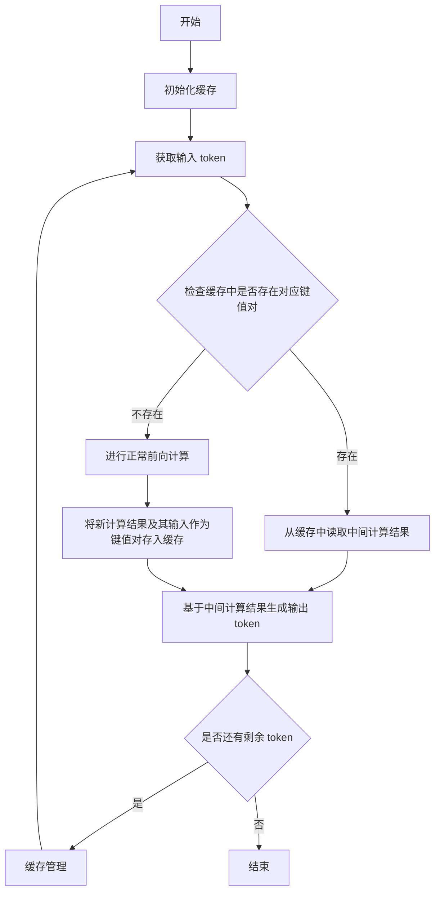

# 大语言模型原理与工程实践：大语言模型推理工程降低计算量：KV-Cache

## 1. 背景介绍

### 1.1 大语言模型的兴起

近年来,大型语言模型(Large Language Models, LLMs)在自然语言处理(NLP)领域掀起了一场革命。这些模型通过在海量文本数据上进行预训练,学习了丰富的语言知识和上下文信息,展现出令人惊叹的语言生成和理解能力。

代表性的大语言模型包括 GPT-3、BERT、XLNet 等,它们在机器翻译、文本摘要、问答系统、内容生成等多个任务中表现出色,推动了 NLP 技术的飞速发展。

### 1.2 计算资源需求激增

然而,大语言模型的强大能力是以巨大的计算资源为代价的。以 GPT-3 为例,它拥有 1750 亿个参数,在训练过程中消耗了数十亿次浮点运算。如此庞大的模型不仅需要大量 GPU 资源进行训练,在推理阶段也需要消耗大量计算资源。

随着模型规模的不断扩大,计算资源的需求也在持续增长。这不仅带来了高昂的硬件成本,也加剧了能源消耗和碳排放,对环境造成了负面影响。因此,如何在保持模型性能的同时降低计算资源需求,成为了一个亟待解决的挑战。

### 1.3 KV-Cache: 降低推理计算量的解决方案

为了应对这一挑战,研究人员提出了一种名为 KV-Cache 的技术,旨在降低大语言模型推理阶段的计算量。KV-Cache 利用键值缓存(Key-Value Cache)的思想,将模型的中间计算结果缓存起来,避免重复计算,从而显著减少计算资源的消耗。

本文将深入探讨 KV-Cache 的原理、实现方式以及在大语言模型推理中的应用,为读者提供一个全面的理解和实践指南。

## 2. 核心概念与联系

### 2.1 大语言模型的推理过程

为了理解 KV-Cache 的工作原理,我们首先需要了解大语言模型在推理阶段的计算过程。

大语言模型通常采用基于 Transformer 的编码器-解码器架构,其中编码器将输入序列编码为上下文表示,解码器则根据上下文表示生成输出序列。在推理过程中,模型需要对每个输入token进行前向计算,得到其对应的上下文表示,然后基于上下文表示进行预测。

这个过程涉及大量的矩阵乘法和非线性变换操作,计算量随着输入序列长度和模型规模的增加而急剧增长。因此,如何减少这些重复计算,降低计算量,就成为了一个关键问题。

### 2.2 键值缓存(Key-Value Cache)

键值缓存是一种常见的缓存技术,它将计算结果与其输入建立映射关系,并将这些映射关系存储在缓存中。当需要重复计算相同的输入时,可以直接从缓存中获取结果,避免重复计算。

键值缓存广泛应用于各种场景,如 Web 服务器缓存、数据库查询缓存等,它可以显著提高系统的响应速度和吞吐量。

### 2.3 KV-Cache 在大语言模型推理中的应用

KV-Cache 将键值缓存的思想应用于大语言模型的推理过程中。具体来说,它将模型的中间计算结果(如注意力分数、前馈网络输出等)作为值,将对应的输入(如token embedding、位置编码等)作为键,将它们存储在缓存中。

在推理过程中,当模型需要计算某个输入的中间结果时,它首先检查缓存中是否存在对应的键值对。如果存在,就直接从缓存中读取结果,避免重复计算;如果不存在,则进行正常计算,并将结果存入缓存,供后续使用。

通过这种方式,KV-Cache 可以有效地重用模型的中间计算结果,从而显著降低推理过程的计算量,提高推理效率和资源利用率。

## 3. 核心算法原理具体操作步骤

### 3.1 KV-Cache 的基本工作流程

KV-Cache 的基本工作流程如下:

1. **初始化**: 创建一个空的键值缓存,用于存储模型的中间计算结果。

2. **前向计算**: 对于每个输入token,模型首先检查缓存中是否存在对应的键值对。

   - 如果存在,直接从缓存中读取中间计算结果,跳过计算步骤。
   - 如果不存在,进行正常的前向计算,得到中间计算结果。

3. **缓存更新**: 将新计算的中间结果及其对应的输入作为键值对存储到缓存中。

4. **输出生成**: 基于最终的中间计算结果,模型生成输出token。

5. **缓存管理**: 在缓存达到容量上限时,采用合适的缓存替换策略(如 LRU、LFU 等)淘汰旧的键值对,为新的计算结果腾出空间。

该流程在模型推理的每一步都会重复执行,持续更新和利用缓存中的中间计算结果。

### 3.2 关键技术细节

实现 KV-Cache 涉及以下几个关键技术细节:

1. **键值对的构造**:
   - **键(Key)**: 通常由输入token 的 embedding、位置编码等信息构成,需要确保相同输入对应相同的键。
   - **值(Value)**: 存储模型的中间计算结果,如注意力分数、前馈网络输出等。

2. **缓存查找**:
   - 高效的哈希表或其他数据结构,用于快速查找缓存中是否存在特定的键值对。
   - 可以考虑基于局部敏感哈希(Locality Sensitive Hashing, LSH)等技术,提高查找效率。

3. **缓存替换策略**:
   - 当缓存达到容量上限时,需要淘汰旧的键值对,为新的计算结果腾出空间。
   - 常用的替换策略包括最近最少使用(LRU)、最少使用(LFU)等。
   - 可以根据具体场景和需求,设计更加复杂的替换策略。

4. **缓存分区**:
   - 将缓存分成多个独立的分区,每个分区只缓存特定类型的中间计算结果。
   - 可以提高缓存命中率,并降低缓存管理的开销。

5. **并行计算与缓存访问**:
   - 充分利用多核 CPU 和 GPU 的并行计算能力,同时进行模型计算和缓存访问。
   - 需要注意线程安全问题,避免竞态条件和数据竞争。

通过上述技术细节的优化,KV-Cache 可以在大语言模型的推理过程中高效地重用中间计算结果,从而显著降低计算量。

### 3.3 KV-Cache 的工作流程图

下面是 KV-Cache 在大语言模型推理过程中的工作流程图:

该流程图清晰地展示了 KV-Cache 在大语言模型推理过程中的工作原理。对于每个输入 token,模型首先检查缓存中是否存在对应的键值对。如果存在,直接从缓存中读取中间计算结果;如果不存在,进行正常计算,并将新的结果存入缓存。在所有 token 处理完毕后,根据需要进行缓存管理,为下一轮计算做准备。

通过这种方式,KV-Cache 可以有效地重用模型的中间计算结果,从而显著降低推理过程的计算量,提高推理效率和资源利用率。

## 4. 数学模型和公式详细讲解举例说明

### 4.1 注意力机制(Attention Mechanism)

注意力机制是 Transformer 模型的核心组件,也是 KV-Cache 重点优化的对象之一。我们先来回顾一下注意力机制的数学原理。

给定一个查询向量 $\boldsymbol{q}$、键向量 $\boldsymbol{K} = [\boldsymbol{k}_1, \boldsymbol{k}_2, \ldots, \boldsymbol{k}_n]$ 和值向量 $\boldsymbol{V} = [\boldsymbol{v}_1, \boldsymbol{v}_2, \ldots, \boldsymbol{v}_n]$,注意力机制的计算过程如下:

1. 计算查询向量与每个键向量的相似度分数:

$$
e_i = \boldsymbol{q} \cdot \boldsymbol{k}_i
$$

2. 对相似度分数进行 softmax 归一化,得到注意力权重:

$$
\alpha_i = \frac{\exp(e_i)}{\sum_{j=1}^{n} \exp(e_j)}
$$

3. 根据注意力权重对值向量进行加权求和,得到注意力输出:

$$
\text{Attention}(\boldsymbol{q}, \boldsymbol{K}, \boldsymbol{V}) = \sum_{i=1}^{n} \alpha_i \boldsymbol{v}_i
$$

这个过程涉及大量的矩阵乘法和指数运算,计算量随着序列长度 $n$ 的增加而线性增长。

### 4.2 KV-Cache 对注意力机制的优化

KV-Cache 可以有效地缓存注意力机制的中间计算结果,从而减少重复计算。具体来说:

1. **键(Key)**: 将查询向量 $\boldsymbol{q}$ 和键向量 $\boldsymbol{K}$ 作为键。
2. **值(Value)**: 将注意力权重 $\boldsymbol{\alpha} = [\alpha_1, \alpha_2, \ldots, \alpha_n]$ 和注意力输出 $\text{Attention}(\boldsymbol{q}, \boldsymbol{K}, \boldsymbol{V})$ 作为值。

在推理过程中,如果缓存中存在对应的键值对,就可以直接读取注意力权重和注意力输出,避免重复计算相似度分数和加权求和操作。

例如,假设我们有一个输入序列 "The quick brown fox jumps over the lazy dog",其中 "The"、"fox" 和 "the" 这三个 token 在不同位置出现。由于它们具有相同的 token embedding,因此在计算注意力时,它们对应的查询向量和键向量是相同的。

在传统的注意力计算中,我们需要为每个 "The"、"fox" 和 "the" 分别计算注意力权重和注意力输出,这涉及大量重复计算。但是,使用 KV-Cache 后,只需要计算一次,就可以将结果缓存起来,后续遇到相同的查询向量和键向量时,直接从缓存中读取结果,从而大大减少了计算量。

### 4.3 KV-Cache 在其他组件中的应用

除了注意力机制,KV-Cache 还可以应用于大语言模型中的其他组件,如前馈网络(Feed-Forward Network)、层归一化(Layer Normalization)等。

以前馈网络为例,其数学表达式为:

$$
\text{FFN}(\boldsymbol{x}) = \max(0, \boldsymbol{x}\boldsymbol{W}_1 + \boldsymbol{b}_1)\boldsymbol{W}_2 + \boldsymbol{b}_2
$$

其中 $\boldsymbol{W}_1$、$\boldsymbol{W}_2$、$\boldsymbol{b}_1$、$\boldsymbol{b}_2$ 分别为权重矩阵和偏置向量。

在 KV-Cache 中,我们可以将输入向量 $\boldsymbol{x}$ 作为键,将前馈网络的输出 $\text{FFN}(\boldsymbol{x})$ 作为值,从而缓存中间计算结果,避免重复计算。

通过上述方