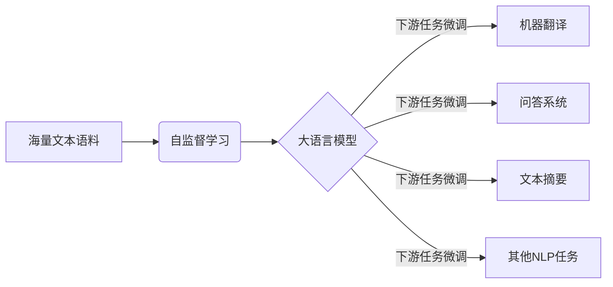
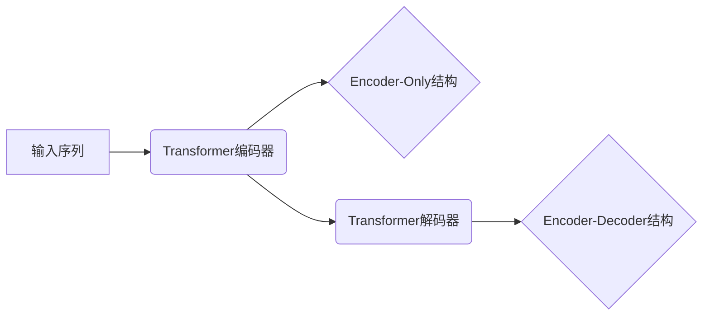
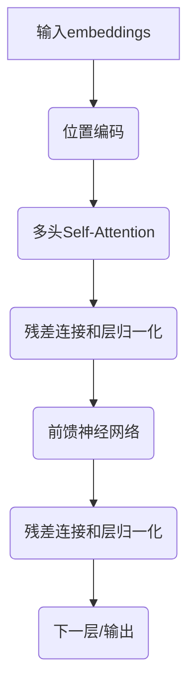
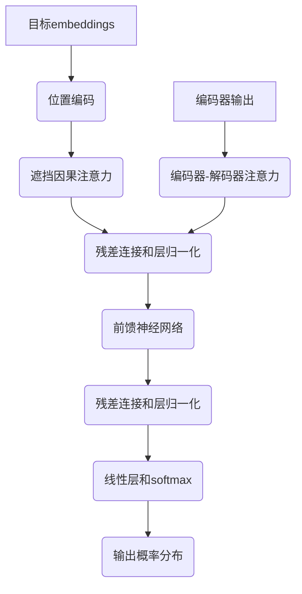

# 大语言模型原理与工程实践：大语言模型的缩放定律

## 1.背景介绍

### 1.1 大语言模型的兴起

近年来,大型语言模型(Large Language Model,LLM)在自然语言处理(NLP)领域掀起了一场革命。这些模型通过在海量文本数据上进行预训练,学习了丰富的语言知识和上下文信息,展现出令人惊叹的语言理解和生成能力。

大语言模型的兴起可以追溯到2018年,当时谷歌发布了Transformer模型,为序列到序列(Seq2Seq)任务建立了新的基线。随后,OpenAI提出了GPT(Generative Pre-trained Transformer)模型,将Transformer应用于通用语言表示学习,取得了突破性进展。

### 1.2 大语言模型的影响

大语言模型在多个NLP任务上取得了state-of-the-art的表现,如机器翻译、问答系统、文本摘要、语义分析等,极大推动了NLP技术的发展。此外,大语言模型还在自然语言生成、对话系统、知识库构建等领域展现出巨大潜力。

大语言模型的出现也带来了一些挑战和争议。一方面,训练这些庞大的模型需要消耗大量的计算资源,存在一定的环境影响;另一方面,大语言模型存在潜在的偏见风险,其生成的内容可能包含有害或不当信息。因此,如何更高效、更环保、更公平地训练和应用大语言模型,成为当前研究的重点课题。

## 2.核心概念与联系

### 2.1 大语言模型的核心思想

大语言模型的核心思想是利用自监督学习(Self-Supervised Learning)的方式,从海量的文本语料中学习通用的语言表示。具体来说,模型会尝试预测被掩码(Masked)或删除的词元(Token),从而捕捉上下文语义信息。



### 2.2 模型架构

大语言模型通常采用基于Transformer的编码器-解码器(Encoder-Decoder)结构或仅编码器(Encoder-only)结构。前者常用于生成类任务,如机器翻译、文本生成等;后者则适用于理解类任务,如文本分类、序列标注等。



### 2.3 预训练目标

常见的大语言模型预训练目标有:

- 掩码语言模型(Masked Language Modeling, MLM):模型需要预测被掩码的词元。
- 下一句预测(Next Sentence Prediction, NSP):判断两个句子是否为连续句子。
- 因果语言模型(Causal Language Modeling, CLM):基于前文预测后续词元。

通过预训练,模型学习到丰富的语义和上下文知识,为后续的下游任务微调奠定基础。

## 3.核心算法原理具体操作步骤  

### 3.1 Transformer编码器

Transformer编码器是大语言模型的核心部件,主要由多层Self-Attention和前馈神经网络(Feed-Forward Neural Network)组成。

1. **输入表示**:将输入序列的词元映射为embeddings。

2. **位置编码**:因Transformer没有递归或卷积结构,需要注入序列位置信息。

3. **多头Self-Attention**:计算序列中每个词元与其他词元的注意力权重,捕捉长距离依赖关系。

   $$\mathrm{Attention}(Q,K,V)=\mathrm{softmax}(\frac{QK^T}{\sqrt{d_k}})V$$

   其中 $Q$、$K$、$V$ 分别为 Query、Key、Value 向量。

4. **残差连接与层归一化**:残差连接有助于梯度传播,层归一化则有助于加快收敛。

5. **前馈神经网络**:两层全连接网络,引入非线性变换。

6. **输出**:编码器的输出embeddings向量包含了输入序列的上下文语义信息。



### 3.2 Transformer解码器

对于编码器-解码器架构,解码器的输入是编码器的输出以及目标序列的embeddings。

1. **遮挡因果注意力**:确保预测时只依赖于当前及之前的输出词元。

2. **编码器-解码器注意力**:将解码器状态与编码器输出计算注意力,融合源序列信息。

3. **前馈神经网络**:与编码器类似,引入非线性变换。

4. **输出层**:通过线性层和softmax,预测下一个词元的概率分布。



### 3.3 预训练与微调

1. **语料构建**:收集海量高质量文本语料。

2. **预训练**:在大规模语料上训练模型,学习通用语言表示。

3. **微调**:在特定任务的标注数据上继续训练,指导模型学习任务相关知识。

4. **推理**:使用微调后的模型进行预测和生成。

通过预训练-微调的过程,大语言模型能够在下游任务上发挥出色表现。

## 4.数学模型和公式详细讲解举例说明

### 4.1 Self-Attention机制

Self-Attention是Transformer的核心,它能够捕捉输入序列中任意两个词元之间的长距离依赖关系。给定一个长度为 $n$ 的序列 $\boldsymbol{x}=\left(x_1, x_2, \ldots, x_n\right)$,Self-Attention的计算过程如下:

1. 将输入序列 $\boldsymbol{x}$ 分别映射为 Query($\boldsymbol{Q}$)、Key($\boldsymbol{K}$)和 Value($\boldsymbol{V}$)向量:

   $$\begin{aligned}
   \boldsymbol{Q} &=\boldsymbol{x} \boldsymbol{W}^Q \\
   \boldsymbol{K} &=\boldsymbol{x} \boldsymbol{W}^K \\
   \boldsymbol{V} &=\boldsymbol{x} \boldsymbol{W}^V
   \end{aligned}$$

   其中 $\boldsymbol{W}^Q$、$\boldsymbol{W}^K$、$\boldsymbol{W}^V$ 为可训练的投影矩阵。

2. 计算 Query 与所有 Key 的点积,对其进行缩放并应用 softmax 函数得到 Attention 权重矩阵:

   $$\operatorname{Attention}(\boldsymbol{Q}, \boldsymbol{K}, \boldsymbol{V})=\operatorname{softmax}\left(\frac{\boldsymbol{Q} \boldsymbol{K}^{\top}}{\sqrt{d_k}}\right) \boldsymbol{V}$$

   其中 $d_k$ 为 Query 和 Key 的维度,用于缩放点积值。

3. 将加权后的 Value 向量相加,得到 Self-Attention 的输出:

   $$\operatorname{SelfAttention}(\boldsymbol{x})=\operatorname{Attention}(\boldsymbol{Q}, \boldsymbol{K}, \boldsymbol{V})$$

Self-Attention 机制赋予了模型直接捕捉长距离依赖关系的能力,避免了 RNN 等序列模型的梯度消失/爆炸问题,是 Transformer 取得巨大成功的关键。

### 4.2 多头注意力机制

为了进一步提高模型的表示能力,Transformer 引入了多头注意力(Multi-Head Attention)机制。具体来说,将输入序列 $\boldsymbol{x}$ 通过不同的投影矩阵映射为多组 Query、Key 和 Value,分别计算 Self-Attention,最后将各头的输出进行拼接:

$$\begin{aligned}
\operatorname{head}_i &=\operatorname{Attention}\left(\boldsymbol{x} \boldsymbol{W}_i^Q, \boldsymbol{x} \boldsymbol{W}_i^K, \boldsymbol{x} \boldsymbol{W}_i^V\right) \\
\operatorname{MultiHead}(\boldsymbol{x}) &=\operatorname{Concat}\left(\operatorname{head}_1, \ldots, \operatorname{head}_h\right) \boldsymbol{W}^O
\end{aligned}$$

其中 $h$ 为头数, $\boldsymbol{W}_i^Q$、$\boldsymbol{W}_i^K$、$\boldsymbol{W}_i^V$ 和 $\boldsymbol{W}^O$ 为可训练参数。多头注意力机制使模型能够关注输入序列的不同位置和子空间表示,提高了模型的表达能力。

### 4.3 位置编码

由于 Self-Attention 是通过内容相似性来计算注意力权重的,因此无法直接获取序列的位置信息。为了注入位置信息,Transformer 在输入 embeddings 上添加了位置编码(Positional Encoding):

$$\begin{aligned}
\mathrm{PE}_{(p o s, 2 i)} &=\sin \left(p o s / 10000^{2 i / d_{\text {model}}}\right) \\
\mathrm{PE}_{(p o s, 2 i+1)} &=\cos \left(p o s / 10000^{2 i / d_{\text {model}}}\right)
\end{aligned}$$

其中 $pos$ 为位置索引, $i$ 为维度索引, $d_{\text{model}}$ 为 embedding 维度。位置编码能够为不同位置的词元赋予不同的向量表示,从而使模型能够区分不同位置的信息。

通过 Self-Attention、多头注意力和位置编码等机制,Transformer 架构能够高效地建模长距离依赖关系,成为大语言模型的核心组件。

## 5.项目实践:代码实例和详细解释说明

为了更好地理解大语言模型的原理和实现,我们将基于 PyTorch 框架,构建一个简化版的 Transformer 模型,并在 WikiText-2 数据集上进行实践。完整代码可在 [这里](https://github.com/zen-and-the-art-of-computer-programming/LLM-Transformer) 获取。

### 5.1 数据预处理

```python
import torchtext

# 加载WikiText-2数据集
train_dataset = torchtext.datasets.WikiText2(root='data', split='train')
val_dataset = torchtext.datasets.WikiText2(root='data', split='validation')
test_dataset = torchtext.datasets.WikiText2(root='data', split='test')

# 构建词表
text_pipeline = lambda x: [vocab.pipeline[0](x)]
vocab = torchtext.vocab.build_vocab_from_iterator(
    map(text_pipeline, train_dataset), specials=["<unk>"]
)
vocab.set_default_index(vocab["<unk>"])

# 数据迭代器
batch_size = 128
train_iter = torchtext.data.BPTTIterator(
    train_dataset, batch_size=batch_size, bptt_len=35, vocab=vocab
)
val_iter = torchtext.data.BPTTIterator(
    val_dataset, batch_size=batch_size, bptt_len=35, vocab=vocab
)
test_iter = torchtext.data.BPTTIterator(
    test_dataset, batch_size=batch_size, bptt_len=35, vocab=vocab
)
```

我们使用 torchtext 库加载 WikiText-2 数据集,构建词表,并创建数据迭代器。其中 `BPTTIterator` 用于生成长度为 `bptt_len` 的序列批次,以支持 Transformer 模型的训练。

### 5.2 Transformer 模型实现

```python
import torch
import torch.nn as nn
import math

class TransformerEncoder(nn.Module):
    def __init__(self, vocab_size, d_model, nhead, dim_feedforward, dropout):
        super().__init__()
        self.embe