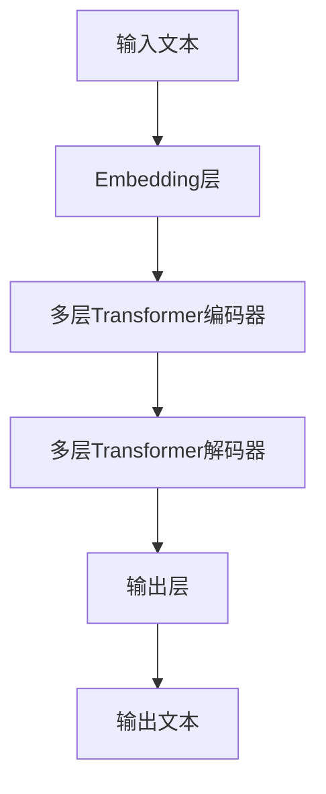

# 大语言模型原理与工程实践：手把手教你训练 7B 大语言模型指令微调实践

## 1.背景介绍

### 1.1 大语言模型的兴起

近年来,大型语言模型(Large Language Models, LLMs)在自然语言处理领域掀起了一场革命。这些模型通过在大规模文本语料库上进行预训练,学习了丰富的语言知识和上下文理解能力,展现出令人惊叹的泛化性能。

领先的大语言模型包括 GPT-3、PaLM、ChatGPT 等,它们能够在广泛的自然语言任务上表现出色,如问答、文本生成、文本摘要等,为人工智能系统赋予了更强大的语言理解和生成能力。

### 1.2 指令微调的重要性

尽管大语言模型在通用领域表现出色,但在特定领域和任务上,它们的性能往往不尽如人意。为了提高大语言模型在特定任务上的表现,需要进行进一步的微调(fine-tuning)。

指令微调(Instruction-tuning)是一种有效的微调方法,它通过在大语言模型上进行少量的继续训练,使模型能够更好地理解和执行特定的指令。这种方法不仅可以提高模型在特定任务上的性能,还能保留模型原有的语言理解和生成能力。

本文将详细介绍指令微调的原理和实践,手把手教你如何训练一个 7B 参数的大语言模型,并对其进行指令微调,以提高其在特定任务上的表现。

## 2.核心概念与联系

### 2.1 大语言模型的架构

大语言模型通常采用基于Transformer的编码器-解码器架构,如下图所示:



其中,Embedding层将输入文本转换为向量表示;多层Transformer编码器捕获输入序列的上下文信息;多层Transformer解码器根据编码器的输出和前一时间步的输出,生成下一个token。

### 2.2 预训练与微调

大语言模型通常采用两阶段训练策略:

1. **预训练(Pre-training)**: 在大规模通用语料库上进行自监督式预训练,学习通用的语言知识和上下文理解能力。常用的预训练目标包括掩码语言模型(Masked Language Modeling)和下一句预测(Next Sentence Prediction)等。

2. **微调(Fine-tuning)**: 在特定任务的标注数据集上进行有监督微调,使模型适应特定任务的需求。微调过程通常只需要少量的训练数据和较少的训练epochs,可以有效地将预训练模型的通用知识迁移到特定任务上。

### 2.3 指令微调

指令微调是一种特殊的微调方式,它的关键在于构造高质量的指令数据集。指令数据集由一系列 (指令, 输入, 输出) 三元组组成,指令描述了需要执行的任务,输入是任务的上下文信息,输出是期望的结果。

通过在指令数据集上进行少量的继续训练,大语言模型可以学习理解和执行各种指令,从而在特定任务上获得更好的性能。与传统的微调方式相比,指令微调保留了模型原有的语言理解和生成能力,同时提高了模型在特定任务上的表现。

## 3.核心算法原理具体操作步骤

### 3.1 指令数据集构建

构建高质量的指令数据集是指令微调的关键步骤。一个优秀的指令数据集应当具备以下特征:

1. **多样性**: 指令数据集应当涵盖各种不同的任务类型和场景,以提高模型的泛化能力。

2. **一致性**: 对于同一个任务,指令的表述方式应当保持一致,避免歧义和混淆。

3. **清晰性**: 指令应当清晰明了,准确描述需要执行的任务及其要求。

4. **平衡性**: 数据集中不同任务类型的样本数量应当保持平衡,避免数据偏倚。

构建指令数据集的具体步骤如下:

1. **确定任务类型**: 根据实际需求,确定需要涵盖的任务类型,如文本生成、问答、文本摘要等。

2. **设计指令模板**: 为每种任务类型设计统一的指令模板,明确描述任务要求和输入输出格式。

3. **数据采集**: 从各种来源采集原始数据,如网络语料、专业数据集等。

4. **数据标注**: 根据指令模板,对原始数据进行人工标注,生成 (指令, 输入, 输出) 三元组。

5. **数据清洗**: 对标注数据进行审核和清洗,剔除低质量样本,保证数据质量。

6. **数据划分**: 将标注数据划分为训练集、验证集和测试集,用于模型训练和评估。

### 3.2 模型训练

在获得高质量的指令数据集后,即可进行模型训练。训练过程包括以下步骤:

1. **选择基础模型**: 选择一个经过预训练的大语言模型作为基础模型,如 GPT-3、PaLM 等。

2. **数据预处理**: 对指令数据集进行必要的预处理,如文本tokenization、padding等。

3. **设置训练参数**: 设置训练超参数,如学习率、批量大小、训练epochs数等。

4. **模型初始化**: 初始化模型权重,可以使用预训练模型的权重,也可以随机初始化。

5. **训练循环**:
    a. 从训练数据集中采样一个批次的数据。
    b. 将指令和输入序列输入模型,获取模型的输出。
    c. 计算模型输出与期望输出之间的损失。
    d. 反向传播计算梯度,并使用优化器更新模型参数。
    e. 在验证集上评估模型性能,根据需要调整超参数。

6. **模型保存**: 在训练结束后,保存微调后的模型权重,用于后续的推理和部署。

### 3.3 模型评估

为了评估指令微调后模型的性能,需要在held-out测试集上进行评估。常用的评估指标包括:

- **精确率(Precision)**: 模型正确预测的样本数占总预测样本数的比例。
- **召回率(Recall)**: 模型正确预测的样本数占总正样本数的比例。
- **F1分数**: 精确率和召回率的调和平均值。
- **BLEU分数**: 用于评估生成文本质量的指标,基于n-gram精确匹配计算。
- **ROUGE分数**: 用于评估文本摘要质量的指标,基于n-gram重叠计算。

除了上述自动评估指标外,也可以进行人工评估,邀请人类评估员对模型输出进行主观评分,从多个维度(如语义一致性、流畅性、信息完整性等)对模型进行综合评估。

## 4.数学模型和公式详细讲解举例说明

### 4.1 Transformer模型

Transformer是大语言模型的核心架构,它完全基于注意力机制,摒弃了传统的循环神经网络和卷积神经网络结构。Transformer的数学模型可以表示为:

$$Y = \text{Transformer}(X)$$

其中,X是输入序列,Y是输出序列。Transformer的具体计算过程可以分为以下几个步骤:

1. **输入嵌入(Input Embeddings)**: 将输入序列X映射到连续的向量空间,得到嵌入表示 $X_\text{emb}$。

2. **位置编码(Positional Encoding)**: 为每个位置添加位置信息,得到 $X_\text{pos} = X_\text{emb} + \text{PE}(pos)$,其中 $\text{PE}(pos)$ 是位置编码函数。

3. **多头注意力(Multi-Head Attention)**: 计算查询(Q)、键(K)和值(V)的注意力分数,并将注意力分数与值向量相结合,得到注意力输出。具体计算公式为:

$$\begin{aligned}
\text{Attention}(Q, K, V) &= \text{softmax}\left(\frac{QK^\top}{\sqrt{d_k}}\right)V \\
\text{MultiHead}(Q, K, V) &= \text{Concat}(\text{head}_1, \ldots, \text{head}_h)W^O\\
\text{where}\,\text{head}_i &= \text{Attention}(QW_i^Q, KW_i^K, VW_i^V)
\end{aligned}$$

其中 $d_k$ 是缩放因子, $W_i^Q$、$W_i^K$、$W_i^V$ 和 $W^O$ 是可学习的线性投影参数。

4. **前馈网络(Feed-Forward Network)**: 对注意力输出进行两层全连接的非线性变换,得到最终的Transformer编码器或解码器输出。

$$\text{FFN}(x) = \max(0, xW_1 + b_1)W_2 + b_2$$

其中 $W_1$、$W_2$、$b_1$、$b_2$ 是可学习的参数。

通过堆叠多个Transformer编码器和解码器层,大语言模型可以捕获长距离的上下文依赖关系,并生成高质量的输出序列。

### 4.2 交叉熵损失函数

在指令微调过程中,常用的损失函数是交叉熵损失函数(Cross-Entropy Loss)。假设模型的输出是一个概率分布 $P(y|x)$,其中 $x$ 是输入序列, $y$ 是期望的输出序列,那么交叉熵损失可以表示为:

$$\mathcal{L}(x, y) = -\sum_{t=1}^{T} \log P(y_t|x, y_{<t})$$

其中 $T$ 是输出序列的长度, $y_{<t}$ 表示输出序列前 $t-1$ 个token。

交叉熵损失函数可以衡量模型输出的概率分布与真实标签之间的差异,并通过梯度下降算法最小化损失函数,从而优化模型参数。

### 4.3 标签平滑

为了提高模型的泛化能力,避免过拟合,通常会在训练过程中引入标签平滑(Label Smoothing)技术。标签平滑的思想是将一次性标签(one-hot label)平滑为一个分布,从而减小模型对于任何特定标签的过度自信。

具体地,对于一个长度为 $V$ 的词表,原始的一次性标签 $y$ 会被替换为:

$$y' = (1 - \epsilon) y + \epsilon / V$$

其中 $\epsilon$ 是平滑系数,通常取值在 $[0.1, 0.2]$ 之间。经过平滑后的标签 $y'$ 不再是一个一次性标签,而是一个分布,其中正确标签的概率为 $1 - \epsilon$,其他标签的概率为 $\epsilon / V$。

使用平滑后的标签 $y'$ 计算交叉熵损失函数,可以有效缓解过拟合问题,提高模型的泛化性能。

## 5.项目实践:代码实例和详细解释说明

在本节中,我们将提供一个使用PyTorch实现的指令微调项目示例,并详细解释每一步的代码。

### 5.1 导入必要的库

```python
import torch
import torch.nn as nn
import torch.optim as optim
from transformers import GPT2LMHeadModel, GPT2Tokenizer
```

我们将使用PyTorch作为深度学习框架,并从Hugging Face的Transformers库中导入预训练的GPT-2语言模型和Tokenizer。

### 5.2 加载数据集

假设我们已经构建好了指令数据集,并将其存储在一个文本文件中,每行包含一个 (指令, 输入, 输出) 三元组,用特殊符号分隔。我们可以使用以下代码加载数据集:

```python
with open('instruction_dataset.txt', 'r', encoding='utf-8') as f:
    dataset = [line.strip().split('<sep>') for line in f]

instructions, inputs, outputs = zip(*dataset)
```

### 5.3 准备数据

接下来,我们需要对数据进行预处理,包括tokenization和padding:

```python
tokenizer = GPT2Tokenizer.from_pretrained('gpt2')

def encode(instructions, inputs, outputs, max_length=1024):
    encodings = tokenizer.batch_encode_plus(
        [(f"{in