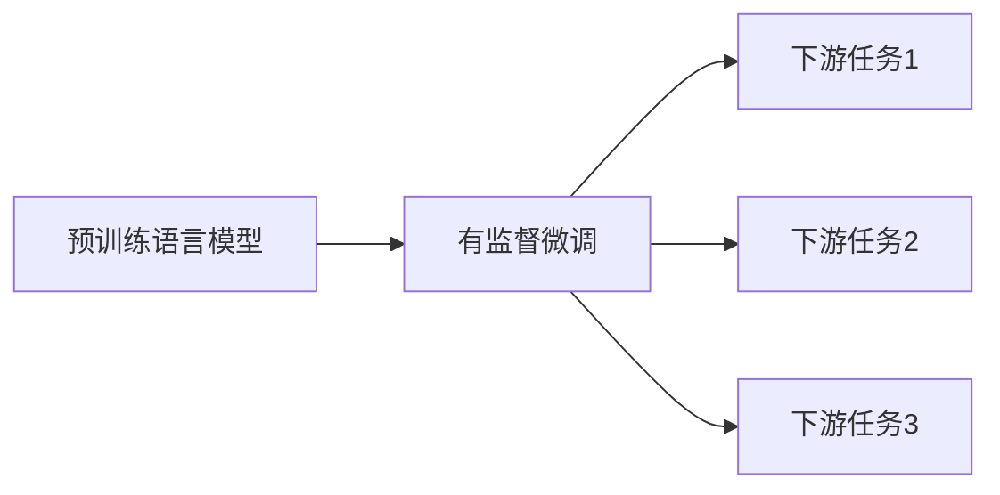

# 大语言模型原理与工程实践：揭开有监督微调的面纱

## 1. 背景介绍
### 1.1 大语言模型的发展历程
#### 1.1.1 早期的语言模型
#### 1.1.2 Transformer的出现
#### 1.1.3 预训练语言模型的崛起
### 1.2 有监督微调的重要性
#### 1.2.1 提高模型在特定任务上的表现
#### 1.2.2 降低训练成本和时间
#### 1.2.3 实现模型的快速适配和部署

## 2. 核心概念与联系
### 2.1 大语言模型
#### 2.1.1 定义和特点
#### 2.1.2 常见的大语言模型
### 2.2 有监督微调
#### 2.2.1 定义和原理
#### 2.2.2 与预训练的区别
### 2.3 迁移学习
#### 2.3.1 定义和分类
#### 2.3.2 在大语言模型中的应用



## 3. 核心算法原理具体操作步骤
### 3.1 预训练阶段
#### 3.1.1 数据准备
#### 3.1.2 模型架构选择
#### 3.1.3 损失函数设计
#### 3.1.4 训练过程
### 3.2 有监督微调阶段  
#### 3.2.1 任务特定数据准备
#### 3.2.2 模型架构调整
#### 3.2.3 损失函数修改
#### 3.2.4 训练过程
### 3.3 推理阶段
#### 3.3.1 模型部署
#### 3.3.2 输入处理
#### 3.3.3 输出解析

## 4. 数学模型和公式详细讲解举例说明
### 4.1 Transformer的数学原理
#### 4.1.1 自注意力机制
$Attention(Q,K,V) = softmax(\frac{QK^T}{\sqrt{d_k}})V$
#### 4.1.2 多头注意力
$MultiHead(Q,K,V) = Concat(head_1, ..., head_h)W^O$
#### 4.1.3 前馈神经网络
$FFN(x) = max(0, xW_1 + b_1)W_2 + b_2$
### 4.2 微调中的损失函数
#### 4.2.1 交叉熵损失
$L_{CE} = -\sum_{i=1}^{N}y_i \log(\hat{y}_i)$
#### 4.2.2 平方损失
$L_{MSE} = \frac{1}{N}\sum_{i=1}^{N}(y_i - \hat{y}_i)^2$

## 5. 项目实践：代码实例和详细解释说明
### 5.1 使用PyTorch实现Transformer
```python
class Transformer(nn.Module):
    def __init__(self, ...):
        super().__init__()
        self.encoder = TransformerEncoder(...)
        self.decoder = TransformerDecoder(...)
    
    def forward(self, src, tgt):
        ...
```
### 5.2 使用Hugging Face的Transformers库进行微调
```python
model = AutoModelForSequenceClassification.from_pretrained(...)
tokenizer = AutoTokenizer.from_pretrained(...)

train_dataset = ...
trainer = Trainer(
    model=model,
    args=TrainingArguments(...),
    train_dataset=train_dataset,
    ...
)
trainer.train()
```

## 6. 实际应用场景
### 6.1 情感分析
#### 6.1.1 任务定义
#### 6.1.2 数据准备
#### 6.1.3 模型选择和微调
#### 6.1.4 效果评估
### 6.2 命名实体识别
#### 6.2.1 任务定义 
#### 6.2.2 数据准备
#### 6.2.3 模型选择和微调
#### 6.2.4 效果评估
### 6.3 机器翻译
#### 6.3.1 任务定义
#### 6.3.2 数据准备
#### 6.3.3 模型选择和微调 
#### 6.3.4 效果评估

## 7. 工具和资源推荐
### 7.1 预训练模型
#### 7.1.1 BERT
#### 7.1.2 GPT系列
#### 7.1.3 T5
### 7.2 微调工具包
#### 7.2.1 Hugging Face的Transformers库
#### 7.2.2 微软的DeepSpeed
#### 7.2.3 谷歌的TensorFlow Model Garden
### 7.3 数据集资源
#### 7.3.1 GLUE基准测试
#### 7.3.2 SuperGLUE基准测试
#### 7.3.3 SQuAD问答数据集

## 8. 总结：未来发展趋势与挑战
### 8.1 大语言模型的发展趋势
#### 8.1.1 模型规模的持续增长
#### 8.1.2 模型效率的不断提升
#### 8.1.3 多模态语言模型的崛起
### 8.2 有监督微调面临的挑战
#### 8.2.1 高质量标注数据的获取
#### 8.2.2 低资源场景下的微调
#### 8.2.3 模型的可解释性和鲁棒性
### 8.3 未来研究方向
#### 8.3.1 数据高效的微调方法
#### 8.3.2 模型压缩和加速技术
#### 8.3.3 大语言模型的理论基础研究

## 9. 附录：常见问题与解答
### 9.1 如何选择合适的预训练模型进行微调？
### 9.2 微调过程中的最佳实践有哪些？
### 9.3 如何处理微调过程中的过拟合问题？
### 9.4 微调后的模型如何进行部署和推理优化？

作者：禅与计算机程序设计艺术 / Zen and the Art of Computer Programming