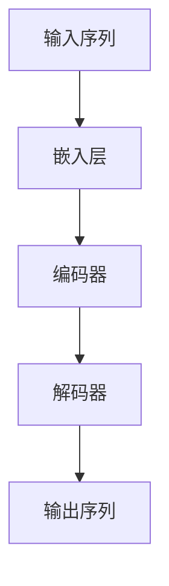
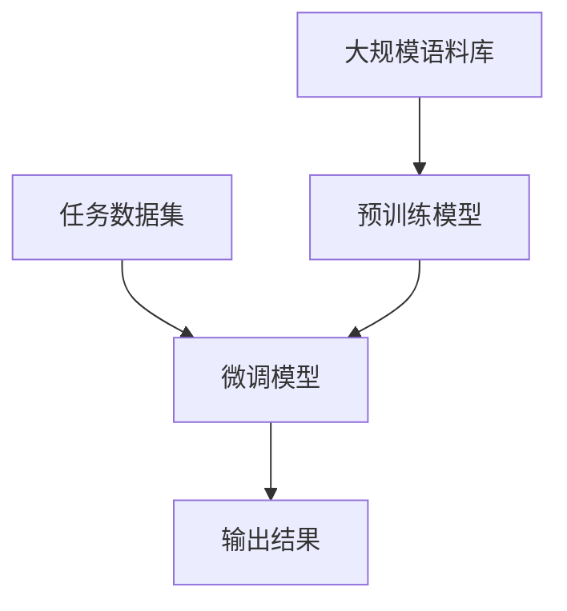

# 大语言模型原理与工程实践：数据瓶颈

## 1. 背景介绍

### 1.1 大语言模型的兴起

近年来,大型语言模型(Large Language Models, LLMs)在自然语言处理(NLP)领域掀起了一场革命。从GPT-3到ChatGPT,这些基于transformer架构的大型预训练模型展现出了令人惊叹的语言生成能力,在多项NLP任务中取得了超越人类的表现。

大语言模型的核心思想是通过在大规模语料库上进行自监督预训练,学习丰富的语言知识和上下文信息,从而为下游任务提供强大的语义表示能力。这种预训练-微调的范式,极大地简化了传统NLP系统的复杂度,使得模型能够通过少量标注数据快速转移到新的任务上。

### 1.2 数据瓶颈的挑战

尽管大语言模型取得了令人瞩目的成就,但它们同时也暴露出了一个关键问题——数据瓶颈。训练这些庞大的模型需要消耗大量的计算资源和存储空间,而且需要海量的高质量语料数据作为输入。以GPT-3为例,它使用了约5000亿个token的文本数据进行预训练,这对于大多数机构来说都是一个不小的挑战。

数据质量也是一个重要问题。由于预训练数据通常来自网络爬取的文本,其中不可避免地包含了噪音、偏差和有害内容。如何有效地清理和过滤这些数据,确保模型不会学习到不当的知识和行为,是一个亟待解决的挑战。

此外,大语言模型在推理阶段也面临着巨大的计算和存储开销。一些工业级应用需要实时响应,但模型的推理速度往往无法满足这一要求,尤其是在资源受限的边缘设备上。

## 2. 核心概念与联系

### 2.1 大语言模型的核心架构

大语言模型通常采用transformer编码器-解码器架构,其核心组件包括:

- **嵌入层(Embedding Layer)**: 将输入token转换为向量表示。
- **编码器(Encoder)**: 由多个transformer编码器块组成,用于捕获输入序列的上下文信息。
- **解码器(Decoder)**: 由多个transformer解码器块组成,用于生成输出序列。
- **自注意力机制(Self-Attention Mechanism)**: 允许模型捕获长距离依赖关系,是transformer架构的核心创新。

### 2.2 预训练与微调

大语言模型通常采用两阶段训练范式:

1. **预训练(Pre-training)**: 在大规模无监督语料库上进行自监督学习,捕获通用的语言知识和上下文信息。常见的预训练目标包括掩码语言模型(Masked Language Modeling)和下一句预测(Next Sentence Prediction)。

2. **微调(Fine-tuning)**: 在特定任务的标注数据上进行监督学习,将预训练模型的知识迁移到目标任务。这一过程通常只需要少量的标注数据和少量的训练步骤。

通过这种预训练-微调范式,大语言模型能够快速适应新的任务,并显著降低了数据标注的成本。

## 3. 核心算法原理具体操作步骤

### 3.1 自注意力机制

自注意力机制是transformer架构的核心创新,它允许模型捕获输入序列中任意两个位置之间的依赖关系,从而更好地建模长距离上下文信息。

自注意力机制的计算过程如下:

1. 将输入序列 $X = (x_1, x_2, \dots, x_n)$ 映射为查询(Query)、键(Key)和值(Value)向量序列:

$$
Q = XW^Q, K = XW^K, V = XW^V
$$

其中 $W^Q, W^K, W^V$ 分别是可学习的查询、键和值的投影矩阵。

2. 计算查询和键之间的相似性分数,得到注意力权重矩阵:

$$
\text{Attention}(Q, K, V) = \text{softmax}\left(\frac{QK^T}{\sqrt{d_k}}\right)V
$$

其中 $d_k$ 是缩放因子,用于防止内积值过大导致梯度饱和。

3. 将注意力权重矩阵与值向量相乘,得到加权和表示:

$$
\text{output} = \text{Attention}(Q, K, V)
$$

自注意力机制允许模型动态地为每个位置分配注意力权重,从而捕获长距离依赖关系。这种灵活的建模方式是transformer架构取得巨大成功的关键所在。

### 3.2 掩码语言模型

掩码语言模型(Masked Language Modeling, MLM)是一种常见的自监督预训练目标,它要求模型预测被掩码的token。具体操作步骤如下:

1. 从语料库中随机采样一个序列 $X = (x_1, x_2, \dots, x_n)$。
2. 以一定概率 $p$ 随机将部分token替换为特殊的掩码token [MASK]。
3. 将掩码后的序列 $X'$ 输入到编码器中,得到上下文表示 $H = (h_1, h_2, \dots, h_n)$。
4. 对于每个被掩码的位置 $i$,使用其上下文表示 $h_i$ 作为查询向量,预测原始token:

$$
\hat{x}_i = \text{softmax}(h_iW^T)
$$

其中 $W$ 是可学习的投影矩阵。

5. 最小化掩码位置的交叉熵损失:

$$
\mathcal{L}_\text{MLM} = -\frac{1}{N}\sum_{i=1}^N \log P(x_i | X')
$$

其中 $N$ 是掩码位置的数量。

通过最小化掩码语言模型的损失函数,模型可以学习到丰富的语言知识和上下文信息,为下游任务提供强大的语义表示能力。

## 4. 数学模型和公式详细讲解举例说明

### 4.1 自注意力机制的数学模型

自注意力机制是transformer架构的核心创新,它允许模型捕获输入序列中任意两个位置之间的依赖关系。我们来详细解释一下自注意力机制的数学模型。

给定一个输入序列 $X = (x_1, x_2, \dots, x_n)$,我们首先将其映射为查询(Query)、键(Key)和值(Value)向量序列:

$$
Q = XW^Q, K = XW^K, V = XW^V
$$

其中 $W^Q, W^K, W^V$ 分别是可学习的查询、键和值的投影矩阵。

接下来,我们计算查询和键之间的相似性分数,得到注意力权重矩阵:

$$
\text{Attention}(Q, K, V) = \text{softmax}\left(\frac{QK^T}{\sqrt{d_k}}\right)V
$$

其中 $d_k$ 是缩放因子,用于防止内积值过大导致梯度饱和。softmax函数用于将相似性分数转换为概率分布,从而获得每个位置对应的注意力权重。

最后,我们将注意力权重矩阵与值向量相乘,得到加权和表示:

$$
\text{output} = \text{Attention}(Q, K, V)
$$

这个加权和表示捕获了输入序列中不同位置之间的依赖关系,并且每个位置的权重是动态计算的,而不是预先固定的。

让我们通过一个简单的例子来理解自注意力机制的工作原理。假设我们有一个长度为4的输入序列 $X = (x_1, x_2, x_3, x_4)$,我们希望计算第三个位置 $x_3$ 的注意力权重。

首先,我们将输入序列映射为查询、键和值向量序列:

$$
Q = \begin{bmatrix}
q_1 \\
q_2 \\
q_3 \\
q_4
\end{bmatrix}, K = \begin{bmatrix}
k_1 \\
k_2 \\
k_3 \\
k_4
\end{bmatrix}, V = \begin{bmatrix}
v_1 \\
v_2 \\
v_3 \\
v_4
\end{bmatrix}
$$

然后,我们计算查询向量 $q_3$ 与所有键向量之间的相似性分数:

$$
\text{score}_i = \frac{q_3 \cdot k_i}{\sqrt{d_k}}, \quad i = 1, 2, 3, 4
$$

接着,我们对这些相似性分数应用softmax函数,得到注意力权重:

$$
\alpha_i = \text{softmax}(\text{score}_i), \quad i = 1, 2, 3, 4
$$

最后,我们将注意力权重与值向量相乘,得到第三个位置的加权和表示:

$$
\text{output}_3 = \sum_{i=1}^4 \alpha_i v_i
$$

这个加权和表示捕获了输入序列中不同位置对第三个位置的影响程度,从而建模了长距离依赖关系。

通过上述例子,我们可以看到自注意力机制是如何动态地为每个位置分配注意力权重,并捕获长距离依赖关系的。这种灵活的建模方式是transformer架构取得巨大成功的关键所在。

### 4.2 掩码语言模型的数学模型

掩码语言模型(Masked Language Modeling, MLM)是一种常见的自监督预训练目标,它要求模型预测被掩码的token。我们来详细解释一下掩码语言模型的数学模型。

给定一个输入序列 $X = (x_1, x_2, \dots, x_n)$,我们首先以一定概率 $p$ 随机将部分token替换为特殊的掩码token [MASK],得到掩码后的序列 $X'$。

接下来,我们将掩码后的序列 $X'$ 输入到编码器中,得到上下文表示 $H = (h_1, h_2, \dots, h_n)$。对于每个被掩码的位置 $i$,我们使用其上下文表示 $h_i$ 作为查询向量,预测原始token:

$$
\hat{x}_i = \text{softmax}(h_iW^T)
$$

其中 $W$ 是可学习的投影矩阵,将上下文表示映射到词汇表的维度。softmax函数用于将logits转换为概率分布。

为了训练掩码语言模型,我们最小化掩码位置的交叉熵损失:

$$
\mathcal{L}_\text{MLM} = -\frac{1}{N}\sum_{i=1}^N \log P(x_i | X')
$$

其中 $N$ 是掩码位置的数量。

让我们通过一个简单的例子来理解掩码语言模型的工作原理。假设我们有一个长度为5的输入序列 $X = (\text{The}, \text{cat}, \text{sat}, \text{on}, \text{the})$,我们以概率 $p = 0.2$ 随机将部分token替换为掩码token [MASK],得到掩码后的序列 $X' = (\text{The}, \text{[MASK]}, \text{sat}, \text{[MASK]}, \text{the})$。

我们将掩码后的序列 $X'$ 输入到编码器中,得到上下文表示 $H = (h_1, h_2, h_3, h_4, h_5)$。对于第二个被掩码的位置,我们使用其上下文表示 $h_2$ 作为查询向量,预测原始token:

$$
\hat{x}_2 = \text{softmax}(h_2W^T)
$$

假设词汇表为 $\{\text{The}, \text{cat}, \text{sat}, \text{on}, \text{the}\}$,则 $\hat{x}_2$ 是一个长度为5的概率分布向量,表示模型预测第二个位置为每个token的概率。

同理,对于第四个被掩码的位置,我们使用其上下文表示 $h_4$ 作为查询向量,预测原始token:

$$
\hat{x}_4 = \text{softmax}(h_4W^T)
$$

我们将掩码位置的预测概率与真实token进行比较,计算交叉熵损失