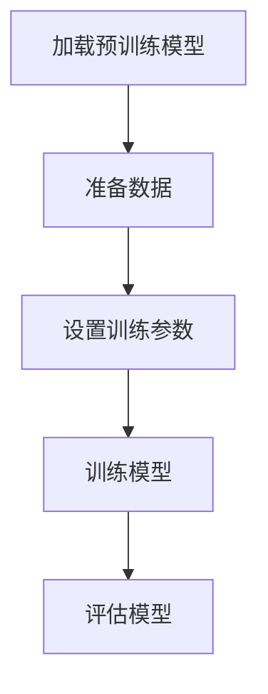

# 大语言模型原理与工程实践：有监督微调的应用场景

## 1.背景介绍

大语言模型（Large Language Models, LLMs）近年来在自然语言处理（NLP）领域取得了显著的进展。自从OpenAI发布了GPT系列模型以来，LLMs在文本生成、翻译、问答系统等多个应用场景中展现了强大的能力。然而，尽管这些模型在无监督学习中表现出色，但在特定任务中，往往需要通过有监督微调来进一步提升其性能。

有监督微调（Supervised Fine-Tuning）是指在预训练模型的基础上，使用特定任务的数据进行进一步训练，以使模型更好地适应该任务的需求。本文将深入探讨大语言模型的原理与工程实践，特别是有监督微调的应用场景。

## 2.核心概念与联系

### 2.1 大语言模型

大语言模型是基于深度学习的模型，通常包含数十亿甚至上千亿个参数。它们通过在大规模文本数据上进行预训练，学习到丰富的语言表示。常见的大语言模型包括GPT-3、BERT、T5等。

### 2.2 有监督学习

有监督学习是一种机器学习方法，其中模型在带有标签的数据上进行训练。目标是使模型能够从输入数据中学习到映射关系，从而在给定新数据时能够准确预测其标签。

### 2.3 微调

微调是指在预训练模型的基础上，使用特定任务的数据进行进一步训练。微调可以显著提升模型在特定任务上的性能，因为它能够使模型更好地适应该任务的特定需求。

### 2.4 核心联系

大语言模型通过无监督学习获得了广泛的语言知识，但在特定任务中，往往需要通过有监督微调来提升其性能。有监督微调利用特定任务的数据，使模型能够更好地理解和处理该任务的需求。

## 3.核心算法原理具体操作步骤

### 3.1 数据准备

在进行有监督微调之前，首先需要准备好特定任务的数据。这些数据通常包括输入文本和对应的标签。例如，在文本分类任务中，数据集可能包括新闻文章和对应的类别标签。

### 3.2 模型选择

选择适合的预训练模型是微调的关键步骤。常见的预训练模型包括GPT-3、BERT、T5等。选择模型时需要考虑任务的需求和模型的特性。

### 3.3 微调过程

微调过程包括以下几个步骤：

1. **加载预训练模型**：从预训练模型库中加载预训练模型。
2. **准备数据**：将特定任务的数据转换为模型可以接受的格式。
3. **设置训练参数**：设置学习率、批量大小、训练轮数等参数。
4. **训练模型**：使用特定任务的数据对模型进行训练。
5. **评估模型**：在验证集上评估模型的性能，调整参数以获得最佳效果。

以下是一个简单的Mermaid流程图，展示了微调过程的主要步骤：



### 3.4 模型优化

在微调过程中，可能需要进行模型优化，以提升模型的性能。常见的优化方法包括调整学习率、使用正则化技术、增加数据增强等。

## 4.数学模型和公式详细讲解举例说明

### 4.1 预训练模型的数学基础

大语言模型通常基于Transformer架构，其核心是自注意力机制。自注意力机制通过计算输入序列中每个位置的注意力权重，来捕捉序列中的长距离依赖关系。

自注意力机制的计算公式如下：

$$
\text{Attention}(Q, K, V) = \text{softmax}\left(\frac{QK^T}{\sqrt{d_k}}\right)V
$$

其中，$Q$、$K$、$V$分别表示查询矩阵、键矩阵和值矩阵，$d_k$表示键矩阵的维度。

### 4.2 有监督微调的损失函数

在有监督微调过程中，常用的损失函数是交叉熵损失函数。交叉熵损失函数用于衡量模型预测的概率分布与真实标签分布之间的差异。

交叉熵损失函数的计算公式如下：

$$
L = -\sum_{i=1}^{N} y_i \log(\hat{y}_i)
$$

其中，$N$表示样本数量，$y_i$表示第$i$个样本的真实标签，$\hat{y}_i$表示模型预测的概率。

### 4.3 举例说明

假设我们有一个文本分类任务，目标是将新闻文章分类为体育、科技、娱乐等类别。我们可以使用BERT模型进行微调，具体步骤如下：

1. **加载预训练模型**：加载预训练的BERT模型。
2. **准备数据**：将新闻文章和对应的类别标签转换为BERT模型可以接受的格式。
3. **设置训练参数**：设置学习率、批量大小、训练轮数等参数。
4. **训练模型**：使用新闻文章和类别标签对BERT模型进行训练。
5. **评估模型**：在验证集上评估模型的性能，调整参数以获得最佳效果。

## 5.项目实践：代码实例和详细解释说明

### 5.1 环境准备

在开始项目实践之前，需要准备好开发环境。以下是所需的主要工具和库：

- Python
- PyTorch
- Transformers库（Hugging Face）

### 5.2 数据集准备

假设我们使用的是一个包含新闻文章和类别标签的数据集。数据集的格式如下：

```
text,label
"这是一篇关于体育的新闻文章",体育
"这是一篇关于科技的新闻文章",科技
...
```

### 5.3 代码实例

以下是一个使用BERT进行文本分类的代码实例：

```python
import torch
from transformers import BertTokenizer, BertForSequenceClassification, Trainer, TrainingArguments
from datasets import load_dataset

# 加载数据集
dataset = load_dataset('csv', data_files={'train': 'train.csv', 'test': 'test.csv'})

# 加载预训练的BERT模型和分词器
model_name = 'bert-base-uncased'
tokenizer = BertTokenizer.from_pretrained(model_name)
model = BertForSequenceClassification.from_pretrained(model_name, num_labels=3)

# 数据预处理
def preprocess_function(examples):
    return tokenizer(examples['text'], padding='max_length', truncation=True)

encoded_dataset = dataset.map(preprocess_function, batched=True)

# 设置训练参数
training_args = TrainingArguments(
    output_dir='./results',
    evaluation_strategy='epoch',
    learning_rate=2e-5,
    per_device_train_batch_size=16,
    per_device_eval_batch_size=16,
    num_train_epochs=3,
    weight_decay=0.01,
)

# 创建Trainer对象
trainer = Trainer(
    model=model,
    args=training_args,
    train_dataset=encoded_dataset['train'],
    eval_dataset=encoded_dataset['test'],
)

# 训练模型
trainer.train()

# 评估模型
trainer.evaluate()
```

### 5.4 详细解释

1. **加载数据集**：使用`load_dataset`函数加载CSV格式的数据集。
2. **加载预训练模型和分词器**：使用`BertTokenizer`和`BertForSequenceClassification`加载预训练的BERT模型和分词器。
3. **数据预处理**：定义`preprocess_function`函数，将文本数据转换为模型可以接受的格式。
4. **设置训练参数**：使用`TrainingArguments`设置训练参数，包括学习率、批量大小、训练轮数等。
5. **创建Trainer对象**：使用`Trainer`类创建Trainer对象，传入模型、训练参数、训练数据和验证数据。
6. **训练模型**：调用`trainer.train()`方法进行模型训练。
7. **评估模型**：调用`trainer.evaluate()`方法在验证集上评估模型的性能。

## 6.实际应用场景

### 6.1 文本分类

文本分类是有监督微调的常见应用场景之一。通过微调预训练模型，可以实现高精度的文本分类任务，如垃圾邮件检测、情感分析、新闻分类等。

### 6.2 问答系统

问答系统是另一个重要的应用场景。通过微调预训练模型，可以实现高效的问答系统，能够在给定问题的情况下，从文本中提取出准确的答案。

### 6.3 机器翻译

机器翻译是自然语言处理中的经典任务。通过微调预训练模型，可以实现高质量的机器翻译系统，能够在不同语言之间进行准确的翻译。

### 6.4 文本生成

文本生成是大语言模型的强项之一。通过微调预训练模型，可以实现高质量的文本生成任务，如自动写作、对话生成等。

## 7.工具和资源推荐

### 7.1 开发工具

- **PyTorch**：一个流行的深度学习框架，支持动态计算图和自动微分。
- **Transformers库**：由Hugging Face提供的预训练模型库，支持多种大语言模型的加载和微调。
- **Jupyter Notebook**：一个交互式的开发环境，适合进行数据分析和模型训练。

### 7.2 数据集

- **GLUE**：一个广泛使用的自然语言理解评估基准，包含多个子任务的数据集。
- **SQuAD**：一个用于问答系统的数据集，包含大量的问题和答案对。
- **IMDB**：一个用于情感分析的数据集，包含大量的电影评论和对应的情感标签。

### 7.3 在线资源

- **Hugging Face Model Hub**：一个预训练模型的在线库，提供多种大语言模型的下载和使用。
- **Kaggle**：一个数据科学竞赛平台，提供大量的数据集和竞赛项目。
- **arXiv**：一个学术论文预印本平台，提供最新的研究论文和技术报告。

## 8.总结：未来发展趋势与挑战

### 8.1 未来发展趋势

大语言模型的发展仍在快速推进，未来可能会出现更大规模、更高性能的模型。以下是一些可能的发展趋势：

- **模型规模继续扩大**：随着计算资源的增加，未来的大语言模型可能会包含更多的参数，能够捕捉到更丰富的语言表示。
- **多模态学习**：未来的大语言模型可能会结合图像、音频等多种模态的数据，提升模型的多模态理解能力。
- **自监督学习**：自监督学习方法可能会进一步发展，使模型能够在无标签数据上进行更有效的学习。

### 8.2 挑战

尽管大语言模型在多个应用场景中表现出色，但仍面临一些挑战：

- **计算资源需求**：大语言模型的训练和微调需要大量的计算资源，可能对小型企业和研究机构造成负担。
- **数据隐私和安全**：在使用大规模数据进行训练时，需要注意数据隐私和安全问题，避免泄露敏感信息。
- **模型解释性**：大语言模型的复杂性使得其内部机制难以解释，可能对模型的可信度和可解释性造成影响。

## 9.附录：常见问题与解答

### 9.1 什么是大语言模型？

大语言模型是基于深度学习的模型，通常包含数十亿甚至上千亿个参数，通过在大规模文本数据上进行预训练，学习到丰富的语言表示。

### 9.2 什么是有监督微调？

有监督微调是指在预训练模型的基础上，使用特定任务的数据进行进一步训练，以使模型更好地适应该任务的需求。

### 9.3 如何选择预训练模型？

选择预训练模型时需要考虑任务的需求和模型的特性。常见的预训练模型包括GPT-3、BERT、T5等。

### 9.4 有监督微调的主要步骤是什么？

有监督微调的主要步骤包括数据准备、模型选择、微调过程和模型优化。

### 9.5 有监督微调的应用场景有哪些？

有监督微调的应用场景包括文本分类、问答系统、机器翻译和文本生成等。

### 9.6 如何评估微调后的模型性能？

可以在验证集上评估微调后的模型性能，常用的评估指标包括准确率、精确率、召回率和F1分数等。

### 9.7 有监督微调面临哪些挑战？

有监督微调面临的挑战包括计算资源需求、数据隐私和安全、模型解释性等。

---

作者：禅与计算机程序设计艺术 / Zen and the Art of Computer Programming