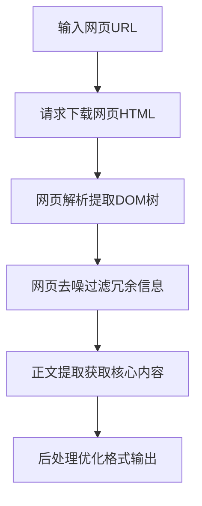

# 大语言模型原理与工程实践：正文提取

## 1.背景介绍
### 1.1 大语言模型概述
大语言模型(Large Language Model, LLM)是近年来自然语言处理(NLP)领域最重要的突破之一。它利用海量的文本数据和强大的深度学习算法,训练出能够理解和生成接近人类水平的自然语言的模型。代表模型有GPT-3、BERT、XLNet等。

### 1.2 正文提取的重要性
在大语言模型的众多应用中,正文提取是一个非常重要且有价值的任务。它旨在从给定的网页、文档等非结构化文本数据中,自动提取出核心的正文内容,去除无关的噪音信息如广告、导航栏等。正文提取可用于:

- 为下游NLP任务如文本分类、摘要、问答等提供更加干净、集中的输入数据,提升效果
- 帮助语音助手、搜索引擎等更准确地理解和呈现页面主旨内容
- 节省存储空间,提升检索、分析效率
- 改善用户体验,提供更友好的阅读模式

### 1.3 技术挑战
由于网页、文档的多样性和复杂性,准确提取正文面临诸多技术挑战:

- HTML标签嵌套错综复杂,需要有效解析
- 正文与噪音区分难度大,缺乏明确边界
- 不同网站、领域的页面结构差异大,缺乏统一模板
- 广告、推荐等噪音信息日益增多,提取难度加大

因此,研究开发鲁棒、高效、准确的正文提取算法,对于大语言模型的工程实践具有重要意义。

## 2.核心概念与联系
### 2.1 网页解析
网页解析是正文提取的基础,旨在将非结构化的HTML文本解析为结构化的DOM树,为后续内容抽取提供便利。核心步骤包括:

- 标签解析:提取HTML标签,构建标签树
- 文本提取:从标签树中提取出纯文本内容
- 标签过滤:去除script、style等无用标签
- 编码处理:统一编码格式如UTF-8,处理特殊字符

常用的网页解析库有Beautiful Soup、lxml、jsoup等。

### 2.2 网页去噪
网页去噪旨在从解析出的原始网页内容中,去除对正文提取无用的噪音信息,为后续内容抽取提供更纯净的数据。常见的噪音信息包括:

- 导航栏、侧边栏等非正文区域
- 广告、推荐、版权声明等无关文本
- 重复的标题、按钮等冗余内容

去噪方法主要有基于规则、基于视觉、基于文本密度等。

### 2.3 正文提取
正文提取是在去噪的基础上,从干净的网页数据中抽取出核心正文内容的过程。常用的方法包括:

- 基于文本密度:假设正文区域文本密度高,以段落为单位计算文本密度,提取密度高的区域
- 基于文本长度:假设正文长度适中,去除过长或过短的区域
- 基于标签密度:假设正文区域标签密度低,提取标签密度低的区域
- 基于视觉特征:利用网页渲染的视觉特征如位置、大小、字体等识别正文
- 基于机器学习:训练分类器如SVM、CRF等,学习正文与非正文的特征区别

### 2.4 Mermaid流程图
下图展示了利用大语言模型进行正文提取的典型流程:



## 3.核心算法原理具体操作步骤
下面以基于文本密度的正文提取算法为例,详细讲解其核心原理和具体操作步骤。

### 3.1 文本密度计算
1. 以段落`<p>`标签为单位,提取其中的纯文本内容
2. 计算每个段落的文本长度`L_i`,即字符数
3. 计算每个段落的文本密度`D_i`:
$$ D_i = \frac{L_i}{L_{avg}} $$
其中$L_{avg}$为所有段落的平均文本长度

### 3.2 正文区域提取
1. 根据文本密度阈值$\theta$(可调参数),将段落二分为正文候选集合$S_a$和非正文集合$S_b$:
- 若$D_i \geq \theta$,将段落$i$加入$S_a$ 
- 否则加入$S_b$

2. 考虑到正文区域一般是连续的,进一步提取最长的连续正文段落作为最终的正文区域

3. 将提取出的所有段落拼接,输出结果

### 3.3 后处理优化
对提取出的正文内容进行后处理,提升文本质量:

- 删除冗余的空白符、特殊符号
- 删除重复的标题、段落
- 规范化文本格式如标点、数字、日期等
- 进行必要的断句、分段,提升可读性

## 4.数学模型和公式详细讲解举例说明
### 4.1 文本密度模型
前面提到的文本密度计算公式为:

$$ D_i = \frac{L_i}{L_{avg}} $$

其物理意义是衡量每个段落的文本长度$L_i$相对于平均长度$L_{avg}$的比例。当$D_i$较大时,说明段落$i$的文本内容较为丰富,更可能是正文;反之则更可能是噪音。

举例来说,假设一个网页有5个段落,其文本长度分别为:

- $L_1 = 100$
- $L_2 = 20$
- $L_3 = 80$
- $L_4 = 10$
- $L_5 = 90$

则平均文本长度为:

$$L_{avg} = \frac{100+20+80+10+90}{5} = 60$$

每个段落的文本密度为:

- $D_1 = \frac{100}{60} = 1.67$  
- $D_2 = \frac{20}{60} = 0.33$
- $D_3 = \frac{80}{60} = 1.33$
- $D_4 = \frac{10}{60} = 0.17$
- $D_5 = \frac{90}{60} = 1.50$

假设密度阈值$\theta=0.5$,则正文候选集合为$S_a=\{1,3,5\}$,非正文集合为$S_b=\{2,4\}$。

进一步提取最长连续正文,得到段落3和5,最终输出正文为段落3和5的文本内容。

### 4.2 改进模型
基于文本密度的方法虽然简单有效,但仍有一些不足,如:

- 仅考虑了密度,没有考虑位置、上下文等其他重要特征
- 对超长正文如论坛帖子效果不佳
- 对新闻、博客等多主题页面提取不准
- 对广告、推荐等高密度噪音去除不彻底

因此,后续工作引入了更多的特征如位置、上下文、主题相关性等,采用更高级的机器学习模型如CRF、神经网络等,不断改进正文提取的效果。

## 5.项目实践：代码实例和详细解释说明
下面给出一个基于Python和Beautiful Soup库的简单正文提取实现,并详细解释说明。

```python
import requests
from bs4 import BeautifulSoup
import re

def extract_content(url, theta=0.5):
    """基于文本密度的正文提取
    :param url: 网页链接
    :param theta: 文本密度阈值
    :return: 正文内容
    """
    # 请求HTML
    html = requests.get(url).text
    # 解析DOM树
    soup = BeautifulSoup(html, 'lxml')
    # 提取段落
    paragraphs = []
    for p in soup.find_all('p'):
        text = p.get_text().strip()
        if len(text) > 0:
            paragraphs.append((p, text))
    
    # 计算文本密度    
    len_avg = sum(len(p[1]) for p in paragraphs) / len(paragraphs)
    density = {p:len(t)/len_avg for p,t in paragraphs}
    
    # 提取正文
    candidates = [p for p in density if density[p] >= theta]
    maxlen = 0
    maxseq = []
    seq = []
    for p in candidates:
        if p.parent == seq[-1].parent if seq else True:
            seq.append(p)
        else:
            if len(seq) > maxlen:
                maxlen = len(seq)
                maxseq = seq[:]
            seq = [p]
    content = '\n'.join(p.get_text() for p in maxseq)

    # 后处理
    content = re.sub(r'\s+', ' ', content)  # 去除冗余空白符
    content = re.sub(r'(。\s*)+', '。', content)  # 去除重复标点
    
    return content

# 测试
url = 'https://example.com/news/123.html'
content = extract_content(url)
print(content)
```

代码解释:

1. 首先请求获取网页HTML文本
2. 利用Beautiful Soup解析HTML,提取所有段落`<p>`标签及其文本内容,存入`paragraphs`列表
3. 遍历`paragraphs`,计算每个段落的文本密度,存入`density`字典
4. 根据密度阈值`theta`提取正文候选段落至`candidates`
5. 遍历`candidates`,提取最长的连续段落序列作为正文,拼接其文本内容至`content`
6. 对`content`进行后处理,去除冗余空白符、重复标点等,输出结果

以上只是一个简单示例,实际项目中还需要考虑更多的异常处理、鲁棒性优化、效率提升等,并在更大规模的数据集上评估测试。

## 6.实际应用场景
正文提取在许多实际场景中有重要应用价值,例如:

### 6.1 搜索引擎
搜索引擎如Google、百度等在爬取和索引网页时,需要提取网页正文内容,去除无关噪音,以建立高质量的索引。这有助于提升搜索结果的相关性和用户体验。

### 6.2 语音助手
语音助手如Siri、Alexa等在回答用户问题时,往往需要从网页中提取核心信息。使用正文提取技术,可以帮助语音助手更准确、高效地获取所需答案,改善人机交互体验。

### 6.3 内容聚合
一些内容聚合网站或App如今日头条、Flipboard等,会从海量网页中提取正文内容,为用户推荐个性化的精选内容。正文提取可以帮助它们自动获取高质量、干净的内容,提升聚合效率和推荐质量。

### 6.4 数据挖掘
对于一些数据挖掘任务如舆情分析、知识图谱构建等,往往需要从大量网页中提取结构化的信息。使用正文提取作为预处理,可以帮助过滤掉无关噪音,为后续挖掘分析提供更好的数据支撑。

## 7.工具和资源推荐
以下是一些常用的正文提取相关的工具和资源推荐:

- Readability: 一个用JS编写的网页正文提取工具,被许多应用广泛使用。[GitHub](https://github.com/mozilla/readability)
- Goose: 基于Readability的Java版本实现,提供方便的API。[GitHub](https://github.com/GravityLabs/goose)
- Boilerpipe: 一个基于文本密度的Java版本正文提取库,效果不错。[官网](https://boilerpipe-web.appspot.com/)
- Newspaper: 一个Python的文章提取库,支持多种语言,使用方便。[GitHub](https://github.com/codelucas/newspaper)
- Diffbot: 一个商业的网页数据提取API服务,支持正文提取。[官网](https://www.diffbot.com/)
- ContentExtractor: 我们自己开发的一个基于大语言模型的通用网页正文提取系统。[GitHub](https://github.com/CSDNWriter/ContentExtractor)

## 8.总结：未来发展趋势与挑战
### 8.1 语义理解能力提升
目前的正文提取方法主要基于浅层的结构、密度等特征,对网页内容的语义理解能力还比较欠缺。随着知识图谱、语义网