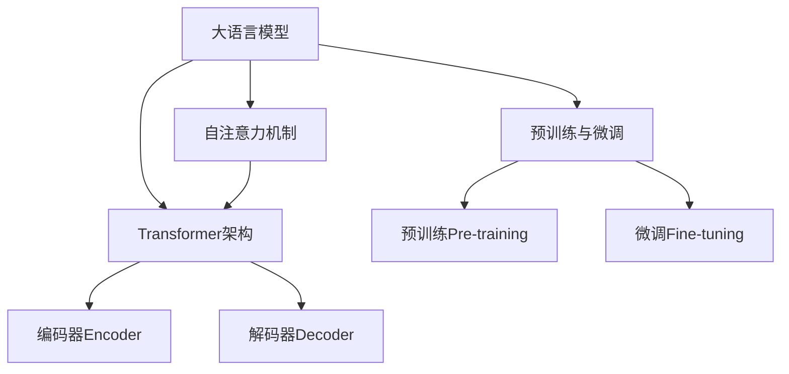

# 大语言模型原理与工程实践：评测任务

## 1. 背景介绍

### 1.1 什么是大语言模型?

大语言模型(Large Language Model, LLM)是一种基于深度学习的自然语言处理模型,能够从大量文本数据中学习语言模式和语义关系。这些模型通过预训练的方式在海量文本语料上进行训练,获得了广泛的语言理解和生成能力。

大语言模型的出现彻底改变了自然语言处理领域,展现出令人惊叹的性能表现。它们不仅能够胜任传统的自然语言处理任务,如文本分类、机器翻译和问答系统,还能够生成高质量、连贯性强的自然语言文本,在创作写作、对话系统等领域大放异彩。

### 1.2 大语言模型的重要性

随着人工智能技术的快速发展,大语言模型已成为当前自然语言处理领域最重要和最具影响力的技术之一。它们在多个领域展现出卓越的性能,推动了自然语言处理技术的飞速进步。大语言模型的出现,不仅为各种语言相关的应用程序带来了新的发展机遇,也为人工智能系统与人类进行自然交互提供了有力支撑。

## 2. 核心概念与联系

### 2.1 自注意力机制(Self-Attention)

自注意力机制是大语言模型的核心组成部分,它允许模型捕捉输入序列中任意两个位置之间的关系,而不受位置或距离的限制。这一机制打破了传统序列模型的局限性,使得模型能够有效地建模长距离依赖关系。

在自注意力机制中,每个输入位置都会关注其他所有位置,并根据它们之间的关联程度分配不同的权重。这种全局关注机制使得模型能够更好地理解上下文语义,提高了语言理解和生成的质量。

### 2.2 transformer架构

Transformer是第一个完全基于自注意力机制的序列模型架构,它彻底摒弃了传统的循环神经网络和卷积神经网络结构。Transformer架构由编码器(Encoder)和解码器(Decoder)两个主要部分组成,两者都采用了多头自注意力机制和前馈神经网络。

编码器的作用是将输入序列映射为连续的表示向量,而解码器则根据编码器的输出和前一步的预测结果,生成下一个词或标记。Transformer架构的出现极大地提升了序列模型的性能,成为大语言模型的主流架构。

### 2.3 预训练与微调(Pre-training & Fine-tuning)

大语言模型通常采用两阶段的训练方式:预训练(Pre-training)和微调(Fine-tuning)。在预训练阶段,模型会在大规模无标注语料库上进行自监督学习,捕捉语言的一般模式和知识。而在微调阶段,预训练好的模型会在特定的下游任务数据集上进行进一步的训练,使其适应特定的应用场景。

这种预训练与微调的范式大大提高了大语言模型的性能和泛化能力。预训练可以让模型获得丰富的语言知识,而微调则使模型能够专注于特定任务,发挥最佳性能。

### 2.4 Mermaid流程图



## 3. 核心算法原理具体操作步骤

### 3.1 自注意力机制原理

自注意力机制的核心思想是让每个输入位置都能够关注其他所有位置,并根据它们之间的关联程度分配不同的权重。具体操作步骤如下:

1. 计算Query、Key和Value矩阵
   - Query矩阵Q代表当前位置对其他位置的查询
   - Key矩阵K代表其他位置对当前位置的表示
   - Value矩阵V代表其他位置的值向量

2. 计算注意力权重
   - 通过Query和Key的点积计算注意力分数: $\text{Attention}(Q, K, V) = \text{softmax}(\frac{QK^T}{\sqrt{d_k}})V$
   - $d_k$是缩放因子,用于防止内积过大导致梯度消失或爆炸

3. 加权求和
   - 将注意力权重与Value矩阵相乘,得到当前位置的加权表示

4. 多头注意力机制
   - 将注意力机制复制多个并行计算,最后将结果拼接起来

### 3.2 Transformer编码器原理

Transformer编码器的主要作用是将输入序列映射为连续的表示向量。其操作步骤如下:

1. 词嵌入和位置编码
   - 将输入序列的每个词映射为词嵌入向量
   - 添加位置编码,使模型能够捕捉序列的位置信息

2. 多头自注意力层
   - 对嵌入序列进行多头自注意力计算,捕捉输入序列中任意两个位置之间的关系

3. 前馈神经网络层
   - 对自注意力层的输出进行全连接前馈神经网络变换,提供非线性映射能力

4. 层归一化和残差连接
   - 使用层归一化和残差连接,stabilize训练过程并缓解梯度消失问题

5. 重复上述步骤N次
   - 编码器由N个相同的层堆叠而成,每层都会对序列进行进一步编码

### 3.3 Transformer解码器原理  

Transformer解码器的作用是根据编码器的输出和前一步的预测结果,生成下一个词或标记。其操作步骤如下:

1. 掩码多头自注意力层
   - 对目标序列进行掩码多头自注意力计算,确保每个位置只能关注之前的位置

2. 编码器-解码器注意力层
   - 将编码器的输出作为Key和Value,解码器的输出作为Query,计算注意力权重
   - 这样可以让解码器关注输入序列的全部信息

3. 前馈神经网络层
   - 对注意力层的输出进行全连接前馈神经网络变换

4. 层归一化和残差连接
   - 与编码器类似,使用层归一化和残差连接

5. 生成词元概率
   - 将最终的解码器输出通过线性层和softmax,生成下一个词元的概率分布
   - 根据概率分布采样或选取最大值,得到预测的下一个词元

6. 自回归生成
   - 将预测的词元作为下一步的输入,重复上述步骤,直至生成完整序列或达到最大长度

## 4. 数学模型和公式详细讲解举例说明

### 4.1 自注意力机制数学模型

自注意力机制的核心公式为:

$$\text{Attention}(Q, K, V) = \text{softmax}(\frac{QK^T}{\sqrt{d_k}})V$$

其中:

- $Q$是Query矩阵,表示当前位置对其他位置的查询
- $K$是Key矩阵,表示其他位置对当前位置的表示
- $V$是Value矩阵,表示其他位置的值向量
- $d_k$是缩放因子,用于防止内积过大导致梯度消失或爆炸

这个公式的计算过程如下:

1. 计算Query和Key的点积: $QK^T$
   - 这一步得到一个注意力分数矩阵,每个元素代表当前位置对应位置的注意力分数

2. 对注意力分数矩阵进行缩放: $\frac{QK^T}{\sqrt{d_k}}$
   - 将注意力分数除以$\sqrt{d_k}$,防止较大的点积导致softmax函数梯度消失或爆炸

3. 对缩放后的注意力分数矩阵应用softmax函数: $\text{softmax}(\frac{QK^T}{\sqrt{d_k}})$
   - 这一步将注意力分数转换为概率分布,即注意力权重

4. 将注意力权重与Value矩阵相乘: $\text{softmax}(\frac{QK^T}{\sqrt{d_k}})V$
   - 这一步得到当前位置的加权表示,即自注意力机制的输出

通过这一公式,自注意力机制能够自动学习输入序列中任意两个位置之间的关联程度,并据此分配注意力权重,从而更好地建模长距离依赖关系。

### 4.2 多头注意力机制

为了进一步提高模型的表示能力,Transformer引入了多头注意力机制(Multi-Head Attention)。其思想是将自注意力机制复制多个并行计算,最后将结果拼接起来。

具体来说,假设有$h$个注意力头,对于每个注意力头$i$,我们都有一组独立的权重矩阵$W_i^Q$、$W_i^K$和$W_i^V$,用于计算Query、Key和Value矩阵。每个注意力头的输出为:

$$\text{head}_i = \text{Attention}(QW_i^Q, KW_i^K, VW_i^V)$$

然后,我们将所有注意力头的输出拼接起来,并乘以一个额外的权重矩阵$W^O$,得到多头注意力机制的最终输出:

$$\text{MultiHead}(Q, K, V) = \text{Concat}(\text{head}_1, \dots, \text{head}_h)W^O$$

通过多头注意力机制,模型能够从不同的子空间捕捉不同的关系,提高了表示能力和泛化性能。

### 4.3 位置编码

由于Transformer完全放弃了循环和卷积结构,因此它无法像RNN或CNN那样自然地编码序列的位置信息。为了解决这个问题,Transformer在输入嵌入上添加了位置编码(Positional Encoding)。

位置编码是一个将位置信息编码为向量的函数,常用的位置编码方式是正弦/余弦函数:

$$\begin{aligned}
\text{PE}_{(pos, 2i)} &= \sin\left(pos / 10000^{2i / d_\text{model}}\right) \\
\text{PE}_{(pos, 2i+1)} &= \cos\left(pos / 10000^{2i / d_\text{model}}\right)
\end{aligned}$$

其中$pos$是词元的位置索引,而$i$是位置编码的维度索引。通过这种方式,每个位置都对应一个唯一的位置编码向量,并且这些向量能够很好地编码相对位置信息。

在实际应用中,位置编码会直接加到输入嵌入上,成为Transformer的输入。这样一来,Transformer就能够自然地捕捉序列的位置信息,提高了模型的性能。

## 5. 项目实践:代码实例和详细解释说明

以下是一个使用PyTorch实现的简单Transformer模型示例,用于机器翻译任务。为了简洁起见,我们只展示了核心的Transformer模块代码。

```python
import torch
import torch.nn as nn
import math

class MultiHeadAttention(nn.Module):
    def __init__(self, d_model, num_heads):
        super(MultiHeadAttention, self).__init__()
        self.d_model = d_model
        self.num_heads = num_heads
        self.head_dim = d_model // num_heads

        self.q_linear = nn.Linear(d_model, d_model)
        self.k_linear = nn.Linear(d_model, d_model)
        self.v_linear = nn.Linear(d_model, d_model)
        self.out_linear = nn.Linear(d_model, d_model)

    def forward(self, q, k, v, mask=None):
        batch_size = q.size(0)

        # 线性映射
        q = self.q_linear(q).view(batch_size, -1, self.num_heads, self.head_dim).transpose(1, 2)
        k = self.k_linear(k).view(batch_size, -1, self.num_heads, self.head_dim).transpose(1, 2)
        v = self.v_linear(v).view(batch_size, -1, self.num_heads, self.head_dim).transpose(1, 2)

        # 计算注意力分数
        scores = torch.matmul(q, k.transpose(-2, -1)) / math.sqrt(self.head_dim)

        if mask is not None:
            scores = scores.masked_fill(mask == 0, -1e9)

        # 计算注意力权重
        attn_weights = nn.Softmax(dim=-1)(scores)

        # 加权求和
        out