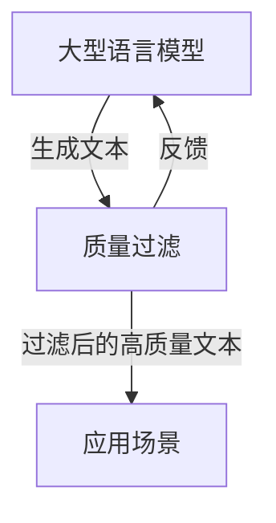

# 大语言模型原理与工程实践：质量过滤

## 1. 背景介绍

随着人工智能技术的不断发展,大型语言模型(Large Language Models, LLMs)已经成为自然语言处理领域的关键技术之一。LLMs通过在海量文本数据上进行预训练,学习到丰富的语言知识和上下文信息,从而可以生成高质量、连贯性强的文本输出。然而,由于训练数据的噪声和模型自身的局限性,LLMs生成的文本往往会存在一些质量问题,如事实错误、不一致性、有害内容等。因此,如何对LLMs的输出进行质量过滤,成为了一个亟待解决的重要问题。

### 1.1 大型语言模型的优势

大型语言模型具有以下优势:

- 强大的生成能力:可以生成流畅、连贯的长文本
- 广泛的知识覆盖范围:涵盖多个领域的知识
- 上下文理解能力:能够理解和捕捉上下文信息

### 1.2 大型语言模型的质量挑战

尽管大型语言模型具有巨大的潜力,但它们也面临着一些质量挑战:

- 事实错误:生成的文本可能包含错误的事实信息
- 不一致性:生成的文本可能与给定的上下文或约束不一致
- 有害内容:生成的文本可能包含有害、不当或违法的内容
- 偏差和公正性:模型可能会反映训练数据中存在的偏差和不公正性

因此,有必要对大型语言模型的输出进行质量过滤,以确保生成的文本是准确、一致、安全和公正的。

## 2. 核心概念与联系

### 2.1 大型语言模型的工作原理

大型语言模型通常采用自回归(Autoregressive)的方式进行文本生成。给定一个起始文本,模型会基于已生成的文本预测下一个单词或标记的概率分布,然后从该分布中采样得到下一个单词或标记。这个过程会一直重复,直到生成完整的文本输出。

该过程可以用下面的公式表示:

$$P(x_1, x_2, ..., x_n) = \prod_{t=1}^{n} P(x_t | x_1, x_2, ..., x_{t-1})$$

其中,$ P(x_1, x_2, ..., x_n) $表示生成整个文本序列的概率,$ P(x_t | x_1, x_2, ..., x_{t-1}) $表示在给定前面的文本时,生成第t个单词或标记的条件概率。

大型语言模型通过在海量文本数据上进行预训练,学习到丰富的语言知识和上下文信息,从而可以生成高质量的文本输出。常见的预训练方法包括掩码语言模型(Masked Language Modeling)和下一句预测(Next Sentence Prediction)等。

### 2.2 质量过滤的核心概念

为了提高大型语言模型输出的质量,需要引入质量过滤的概念。质量过滤旨在检测和过滤掉生成文本中存在的质量问题,如事实错误、不一致性、有害内容等。

质量过滤可以分为以下几个核心步骤:

1. **质量评估**: 对生成的文本进行质量评估,识别潜在的质量问题。这可以通过规则、模型或人工标注等方式实现。
2. **质量分数计算**: 根据评估结果,为每个生成的文本计算一个质量分数,反映其质量水平。
3. **质量阈值设置**: 设置一个质量阈值,低于该阈值的文本将被过滤掉。
4. **质量过滤**: 根据质量分数和阈值,过滤掉低质量的文本输出。

质量过滤可以在不同的阶段应用,如训练时过滤、生成时过滤或后处理过滤等。它与大型语言模型的工作原理密切相关,需要将质量评估和过滤机制有机地集成到模型的生成过程中。

### 2.3 质量过滤与大型语言模型的关系

质量过滤是大型语言模型不可或缺的一个环节,它可以有效提高模型输出的质量和可靠性。同时,高质量的输出也有助于提升大型语言模型在实际应用中的性能和用户体验。

质量过滤与大型语言模型的关系可以用下图表示:

在这个流程中,大型语言模型首先生成初始文本输出,然后质量过滤模块对这些输出进行评估和过滤,得到高质量的文本。这些高质量文本可以应用于各种场景,如问答系统、文本生成、机器翻译等。同时,质量过滤也可以反馈到大型语言模型,帮助模型进一步优化和改进。

因此,质量过滤是大型语言模型不可或缺的一个重要环节,它与模型的生成过程密切相关,对于提高模型输出质量和应用性能至关重要。

## 3. 核心算法原理具体操作步骤

### 3.1 基于规则的质量过滤

基于规则的质量过滤是一种简单而有效的方法,它通过预定义一系列规则来检测和过滤生成文本中的质量问题。这些规则可以基于语言学知识、领域知识或人工经验设计。

基于规则的质量过滤的具体操作步骤如下:

1. **规则设计**: 设计一系列规则,用于检测特定类型的质量问题。例如,可以设计规则来检测事实错误、不一致性、有害内容等。
2. **规则匹配**: 对生成的文本进行规则匹配,识别出与规则相匹配的文本片段。
3. **质量评分**: 根据匹配的规则数量和严重程度,为每个生成的文本计算一个质量分数。
4. **质量阈值设置**: 设置一个质量阈值,低于该阈值的文本将被过滤掉。
5. **质量过滤**: 根据质量分数和阈值,过滤掉低质量的文本输出。

基于规则的质量过滤具有以下优势:

- 简单直观,易于理解和实现
- 可以利用人工专家知识,设计高质量的规则
- 对于一些常见的质量问题,规则可以高效地进行检测和过滤

然而,基于规则的方法也存在一些局限性:

- 规则的设计和维护成本较高,需要持续的人工投入
- 规则的覆盖范围有限,难以捕捉所有可能的质量问题
- 对于复杂的质量问题,规则可能难以准确描述和检测

因此,在实际应用中,基于规则的质量过滤通常与其他方法(如基于模型的质量过滤)结合使用,以提高质量过滤的效果。

### 3.2 基于模型的质量过滤

基于模型的质量过滤利用机器学习模型来自动学习和检测生成文本中的质量问题。这种方法可以克服基于规则方法的局限性,并提供更加灵活和泛化的质量过滤能力。

基于模型的质量过滤的具体操作步骤如下:

1. **数据准备**: 收集和标注一定数量的文本数据,包括高质量和低质量的样本。这些数据将用于训练质量评估模型。
2. **模型训练**: 使用标注数据训练一个质量评估模型,该模型可以预测给定文本的质量分数或质量类别。常见的模型包括分类模型、回归模型或基于预训练语言模型的微调模型等。
3. **质量评分**: 使用训练好的质量评估模型对生成的文本进行质量评分,得到每个文本的质量分数或质量类别。
4. **质量阈值设置**: 设置一个质量阈值,低于该阈值的文本将被过滤掉。
5. **质量过滤**: 根据质量分数或质量类别和阈值,过滤掉低质量的文本输出。

基于模型的质量过滤具有以下优势:

- 可以自动学习质量问题的模式和特征,无需人工设计规则
- 具有更好的泛化能力,可以检测复杂和未知的质量问题
- 随着数据的增加,模型的性能可以不断提高

然而,基于模型的方法也存在一些挑战:

- 需要大量的高质量标注数据,数据准备成本较高
- 模型的性能受限于训练数据的覆盖范围和质量
- 对于一些罕见或极端的质量问题,模型可能难以有效检测

因此,在实际应用中,基于模型的质量过滤通常与基于规则的方法相结合,以发挥两者的优势,提高质量过滤的效果。

### 3.3 基于人工反馈的质量过滤

除了基于规则和基于模型的质量过滤方法,人工反馈也是一种重要的质量过滤途径。通过人工审核和反馈,可以有效地识别和纠正大型语言模型输出中的质量问题。

基于人工反馈的质量过滤的具体操作步骤如下:

1. **人工审核**: 由人工审核员(如语言专家、领域专家或普通用户)审核大型语言模型生成的文本输出,识别其中存在的质量问题。
2. **反馈收集**: 收集人工审核员对质量问题的反馈,包括问题类型、严重程度、修改建议等。
3. **反馈整理**: 对收集到的反馈进行整理和分类,形成结构化的反馈数据。
4. **质量评分**: 根据反馈数据,为每个生成的文本计算一个质量分数或质量类别。
5. **质量阈值设置**: 设置一个质量阈值,低于该阈值的文本将被过滤掉。
6. **质量过滤**: 根据质量分数或质量类别和阈值,过滤掉低质量的文本输出。
7. **模型优化**: 利用人工反馈数据,对大型语言模型进行优化和改进,提高其生成质量。

基于人工反馈的质量过滤具有以下优势:

- 可以利用人类的语言理解能力和领域知识,准确识别各种质量问题
- 反馈数据可以用于持续优化和改进大型语言模型
- 可以捕捉一些规则或模型难以检测的罕见或极端质量问题

然而,这种方法也存在一些局限性:

- 人工审核和反馈的成本较高,需要大量的人力投入
- 反馈的一致性和准确性可能受到人为因素的影响
- 难以快速扩展到大规模的质量过滤场景

因此,在实际应用中,基于人工反馈的质量过滤通常与基于规则和基于模型的方法相结合,形成一个综合的质量过滤解决方案。

## 4. 数学模型和公式详细讲解举例说明

在大型语言模型的质量过滤中,数学模型和公式扮演着重要的角色。它们可以帮助我们更好地理解和优化质量过滤的过程。

### 4.1 质量评分模型

质量评分模型旨在为生成的文本输出计算一个质量分数,反映其质量水平。常见的质量评分模型包括回归模型和分类模型。

#### 4.1.1 回归模型

回归模型将质量评分视为一个回归问题,试图学习一个映射函数 $f$,将输入文本 $x$ 映射到一个连续的质量分数 $y$:

$$y = f(x; \theta)$$

其中 $\theta$ 表示模型的参数。

常见的回归模型包括线性回归、决策树回归、神经网络回归等。这些模型可以在标注的质量数据上进行训练,学习映射函数 $f$。

在训练过程中,我们需要最小化一个损失函数 $\mathcal{L}$,例如均方误差(Mean Squared Error, MSE):

$$\mathcal{L}(\theta) = \frac{1}{N} \sum_{i=1}^{N} (y_i - f(x_i; \theta))^2$$

其中 $N$ 表示训练样本的数量,$(x_i, y_i)$ 表示第 $i$ 个训练样本及其标注的质