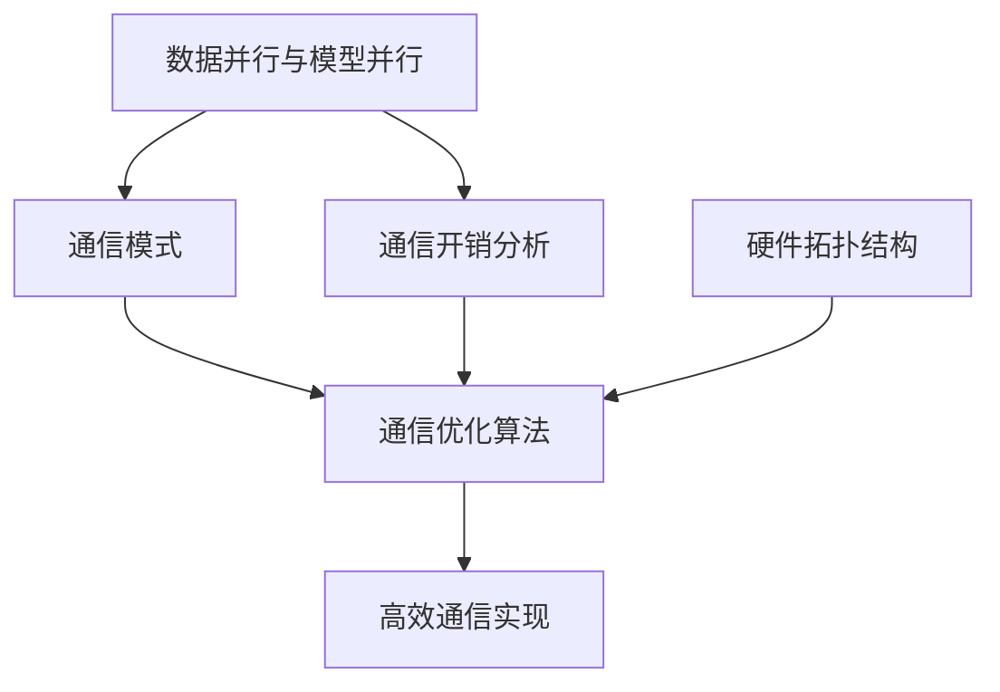

# 大语言模型原理与工程实践：通信优化

## 1. 背景介绍

### 1.1 大语言模型的兴起

近年来,大型语言模型(Large Language Models, LLMs)在自然语言处理(NLP)领域掀起了一场革命。这些模型通过在海量文本数据上进行预训练,学习了丰富的语言知识和上下文关联,从而在下游任务中展现出令人惊叹的性能表现。

大语言模型的兴起主要得益于以下几个关键因素:

1. 计算能力的提升:现代GPU和TPU等专用硬件加速器为训练大规模模型提供了强大的计算支持。
2. 数据量的激增:互联网时代海量文本数据的积累为训练大语言模型奠定了数据基础。
3. 模型架构的创新:Transformer等注意力机制的引入突破了序列建模的瓶颈。
4. 算力资源的集中:云计算和大型AI公司的投入为训练大规模模型提供了必要的算力资源。

代表性的大语言模型包括GPT(Generative Pre-trained Transformer)、BERT(Bidirectional Encoder Representations from Transformers)、T5(Text-to-Text Transfer Transformer)等,它们在自然语言生成、理解、翻译等多个领域展现出卓越的性能。

### 1.2 通信优化的重要性

尽管大语言模型取得了令人瞩目的成就,但它们巨大的模型规模和计算复杂度也带来了严峻的挑战,特别是在分布式训练和推理场景下。高效的通信优化对于充分发挥大语言模型的潜力至关重要,主要有以下几个原因:

1. **降低通信开销**:大语言模型通常包含数十亿甚至上千亿个参数,在分布式训练和推理时需要频繁地在多个设备之间传输这些参数和中间结果,产生了巨大的通信开销。优化通信策略可以显著降低这一开销,提高整体效率。

2. **提高硬件利用率**:由于通信开销的存在,训练和推理过程中往往存在大量的等待时间,导致计算资源利用率低下。通过减少等待时间,可以充分利用昂贵的硬件资源,提高投资回报率。

3. **支持更大规模模型**:通过优化通信策略,可以在现有硬件资源条件下支持更大规模的模型训练和推理,从而进一步提升模型性能。

4. **适应异构环境**:现代分布式系统通常由不同类型的硬件设备组成(如GPU、TPU、CPU等),对通信优化策略的灵活性和可移植性提出了更高要求。

综上所述,通信优化对于大语言模型的高效训练和推理至关重要,是实现其全面商业化落地的关键一环。本文将围绕大语言模型的通信优化问题,深入探讨其原理、算法和工程实践,为读者提供全面的理解和指导。

## 2. 核心概念与联系

在探讨大语言模型通信优化的具体技术之前,我们需要先了解一些核心概念及它们之间的关联。

### 2.1 数据并行与模型并行

在分布式训练和推理中,常见的并行策略包括数据并行(Data Parallelism)和模型并行(Model Parallelism)。

**数据并行**是指将训练数据划分为多个子集,分别在不同的设备上进行前向和反向传播计算,然后汇总梯度并更新模型参数。这种策略可以有效利用多个设备的计算资源,但需要在设备之间频繁传输模型参数和梯度,产生较大的通信开销。

**模型并行**则是将模型的不同层或子模块分配到不同的设备上执行,每个设备只需要处理模型的一部分。这种策略可以支持超大规模模型的训练和推理,但需要在设备之间频繁传输中间计算结果,通信开销也很大。

在实践中,通常需要结合使用数据并行和模型并行,以充分利用硬件资源并支持大规模模型。这就要求通信优化策略能够同时处理这两种并行场景下的通信需求。

### 2.2 通信模式

在分布式系统中,设备之间的通信模式主要包括以下几种:

1. **All-Reduce**:所有设备将本地数据(如梯度)相加,并将结果广播回每个设备。这是实现数据并行中梯度聚合的常用操作。
2. **All-Gather**:每个设备将本地数据发送给其他所有设备,最终每个设备都收集到全部数据。这在模型并行中传输中间结果时很有用。
3. **Reduce-Scatter**:类似All-Reduce,但将结果分散到不同的设备,每个设备只获得结果的一部分。
4. **All-to-All**:每个设备将本地数据分散传输给其他所有设备的不同部分。这在实现模型并行的权重更新时很有用。

不同的通信模式适用于不同的场景,通信优化需要针对特定模式进行优化。例如,环形All-Reduce可以减少All-Reduce的通信开销;张量并行可以减少All-Gather的通信量。

### 2.3 通信开销分析

为了优化通信策略,我们需要首先分析通信开销的来源。通信开销主要包括以下几个部分:

1. **参数传输**:在数据并行中,需要在所有设备之间传输模型参数;在模型并行中,需要在不同设备之间传输各层的权重参数。
2. **梯度聚合**:在数据并行中,需要将每个设备计算出的梯度进行聚合,以更新模型参数。
3. **中间结果传输**:在模型并行中,不同设备需要频繁交换中间计算结果。
4. **同步开销**:分布式系统中,设备之间需要进行同步等待,以确保计算的正确性,这也会产生一定的开销。

通过分析不同场景下的通信开销分布,我们可以确定优化的重点,并采取相应的优化策略。

### 2.4 硬件拓扑结构

通信优化还需要考虑硬件拓扑结构的影响。在现代异构系统中,通常包含多种类型的设备,如GPU、TPU、CPU等,它们之间的带宽和延迟存在差异。此外,设备之间的网络拓扑结构(如环形、树形等)也会影响通信效率。

优化策略需要充分利用硬件拓扑结构的特点,例如在高带宽的设备之间传输更多数据,在低延迟的设备之间进行更频繁的通信等。同时,也需要考虑设备异构性带来的挑战,如不同设备之间的数据格式转换等。

### 2.5 核心概念关系总结

上述核心概念之间存在着密切的关联,如下图所示:

- 数据并行和模型并行决定了通信的发生场景和模式;
- 通信模式和通信开销分析共同指导了通信优化算法的设计;
- 硬件拓扑结构也是优化算法需要考虑的重要因素;
- 最终,优化算法需要在具体的系统和框架中得到高效的实现。

了解这些核心概念及其关联,有助于我们全面把握大语言模型通信优化的本质,为后续的技术探讨奠定基础。

## 3. 核心算法原理具体操作步骤

### 3.1 环形All-Reduce算法

All-Reduce是实现数据并行梯度聚合的关键操作,其通信开销也是整个系统的主要瓶颈之一。传统的All-Reduce算法通常采用树形或双级树形拓扑结构,但在大规模场景下,这种方法的效率较低。

环形All-Reduce算法(Ring All-Reduce)则提供了一种更高效的解决方案。它将所有设备组织成一个环形拓扑,每个设备只需要与相邻两个设备进行通信,就可以完成All-Reduce操作。具体步骤如下:

1. 初始化:每个设备$i$持有一个长度为$n$的向量$x_i$,其中$n$是参与All-Reduce的设备数量。
2. 归约(Reduce)阶段:
   - 设备$i$将$x_i$分成$n$个块$x_i^0, x_i^1, \ldots, x_i^{n-1}$。
   - 设备$i$将$x_i^j$发送给设备$(i+j)\ \mathrm{mod}\ n$,并从设备$(i-1)\ \mathrm{mod}\ n$接收$x_{i-1}^{i}$。
   - 设备$i$对所有接收到的$x_j^i$进行归约(如求和),得到$y_i = \sum_{j=0}^{n-1} x_j^i$。
3. 广播(Broadcast)阶段:
   - 设备$i$将$y_i$分成$n$个块$y_i^0, y_i^1, \ldots, y_i^{n-1}$。
   - 设备$i$将$y_i^j$发送给设备$(i-j)\ \mathrm{mod}\ n$,并从设备$(i+1)\ \mathrm{mod}\ n$接收$y_{i+1}^{i-1}$。
   - 设备$i$对所有接收到的$y_j^k$进行归约(如求和),得到最终结果$z_i = \sum_{j=0}^{n-1} y_j$。

经过上述步骤,每个设备都获得了All-Reduce的结果$z_i$。该算法的通信复杂度为$O(n)$,显著优于树形拓扑的$O(n\log n)$复杂度。

环形All-Reduce算法的优点在于:

1. 通信开销低:每个设备只需要与相邻两个设备进行通信,避免了树形拓扑中的通信瓶颈。
2. 负载均衡:所有设备的通信量基本相同,实现了良好的负载均衡。
3. 拓扑灵活:可以在不同的网络拓扑结构上实现,如环形、二维网格等。

该算法在大规模分布式训练场景中得到了广泛应用,成为提高通信效率的关键技术之一。

### 3.2 张量并行

在模型并行场景下,不同设备需要频繁交换中间计算结果,通信开销也很大。张量并行(Tensor Parallelism)技术可以有效减少这种通信开销。

张量并行的核心思想是将模型中的张量(如权重矩阵)按行或列划分到不同的设备上,每个设备只需要处理张量的一部分。在前向和反向传播过程中,不同设备只需要交换局部计算结果,而不需要传输整个张量,从而大幅减少了通信量。

以矩阵乘法$C = AB$为例,我们可以按行或按列对$A$和$B$进行划分:

- 按行划分$A$和$B$:
  $$A = \begin{bmatrix}A_0\\\A_1\end{bmatrix},\ B = \begin{bmatrix}B_0 & B_1\end{bmatrix}$$
  则$C$可以表示为:
  $$C = \begin{bmatrix}A_0B_0 & A_0B_1\\A_1B_0 & A_1B_1\end{bmatrix}$$
  每个设备只需要计算$C$中的一行,并与其他设备交换局部结果即可。

- 按列划分$A$和$B$:
  $$A = \begin{bmatrix}A_0 & A_1\end{bmatrix},\ B = \begin{bmatrix}B_0\\B_1\end{bmatrix}$$
  则$C$可以表示为:
  $$C = \begin{bmatrix}A_0B_0 + A_1B_1\end{bmatrix}$$
  每个设备只需要计算$C$中的一列,并与其他设备交换局部结果即可。

通过张量并行,我们可以将原本需要传输整个张量的通信量降低到只需要传输局部结果,从而显著降低了通信开销。

张量并行技术可以应用于各种类型的张量运算,如卷积、注意力机制等,是实现大规模模型并行的关键技术之一。它的优点包括:

1. 降低通信量:只需要传输局