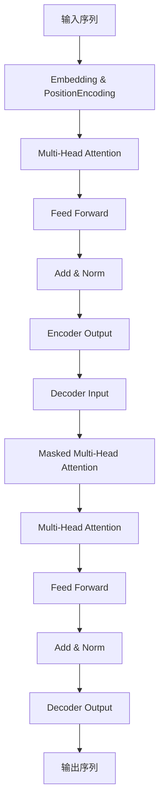

# 大语言模型原理与工程实践：预训练语言模型

## 1. 背景介绍

在自然语言处理领域,预训练语言模型(Pre-trained Language Models, PLMs)已成为一种革命性的技术,极大推动了该领域的发展。传统的NLP模型通常需要针对特定任务进行从头训练,这种方式存在数据效率低下、泛化能力有限等缺陷。而预训练语言模型则通过在大规模无标注语料库上进行自监督训练,学习通用的语言表示,再将这些通用语言知识迁移到下游任务中,从而显著提高了模型性能。

预训练语言模型的核心思想是利用自监督学习的方式,在大量无标注文本数据上学习通用的语言表示,捕捉语言的内在规律和语义信息。通过这种预训练过程,模型可以获得丰富的语言知识,并将其应用于各种自然语言处理任务,如文本分类、机器阅读理解、文本生成等。

### 1.1 预训练语言模型的发展历程

预训练语言模型的发展可以追溯到2018年,当时Transformer模型在机器翻译任务上取得了突破性的成果。随后,研究人员将Transformer应用于语言模型预训练,产生了一系列重要的预训练语言模型,如BERT、GPT、XLNet等。这些模型在多项自然语言处理基准测试中取得了state-of-the-art的性能,引发了学术界和工业界的广泛关注。

2019年,BERT(Bidirectional Encoder Representations from Transformers)的提出标志着预训练语言模型进入了一个新的里程碑。BERT采用了Transformer的编码器结构,并引入了掩码语言模型(Masked Language Model)和下一句预测(Next Sentence Prediction)两种预训练任务,实现了双向语境的建模,大幅提升了语言表示的质量。

随后,GPT(Generative Pre-trained Transformer)家族模型如GPT-2、GPT-3等,采用了自回归(Auto-Regressive)语言模型的预训练方式,专注于生成式任务,展现出了强大的文本生成能力。

近年来,越来越大的预训练语言模型不断问世,如GPT-3拥有1750亿个参数,引发了模型规模对性能影响的广泛讨论。同时,也出现了一些专门针对特定领域或任务进行预训练的语言模型,如生物医学领域的BioBERT、代码领域的CodeBERT等。

### 1.2 预训练语言模型的优势

与传统的NLP模型相比,预训练语言模型具有以下显著优势:

1. **数据高效利用**:预训练语言模型可以在大规模无标注语料库上进行预训练,充分利用了海量的文本数据,学习通用的语言知识。这种自监督的预训练方式,避免了手动标注数据的巨大成本。

2. **泛化能力强**:通过在多种语料上预训练,预训练语言模型可以获得丰富的语言知识,具有很强的泛化能力。这种通用的语言表示可以迁移到各种下游NLP任务中,提高了模型的性能和数据效率。

3. **少样本学习**:由于预训练语言模型已经学习了通用的语言知识,在下游任务上只需要使用少量的标注数据进行微调(fine-tuning),就可以获得良好的性能。这种少样本学习的能力对于数据稀缺的领域尤为宝贵。

4. **多任务能力**:同一个预训练语言模型可以通过简单的微调,应用于多种不同的NLP任务,展现出了强大的多任务能力。这种通用性避免了针对每个任务从头训练模型的繁重工作。

5. **可解释性**:一些研究表明,预训练语言模型在一定程度上捕捉了语言的语义和句法信息,具有一定的可解释性。这为进一步分析和理解模型提供了机会。

总的来说,预训练语言模型极大地提高了自然语言处理模型的性能和数据效率,为NLP领域带来了革命性的变革。

## 2. 核心概念与联系

### 2.1 Transformer

Transformer是预训练语言模型的核心架构,它是一种全新的基于注意力机制(Attention Mechanism)的序列到序列(Seq2Seq)模型。与传统的RNN和CNN不同,Transformer完全摒弃了循环和卷积结构,而是通过自注意力(Self-Attention)机制来捕捉序列中元素之间的长程依赖关系。

Transformer的主要组成部分包括:

- **编码器(Encoder)**:将输入序列映射为高维向量表示。
- **解码器(Decoder)**:根据编码器的输出和目标序列生成输出序列。
- **多头注意力(Multi-Head Attention)**:允许模型从不同的表示子空间关注不同的位置,捕捉更丰富的依赖关系。
- **位置编码(Positional Encoding)**:因为Transformer没有递归和卷积结构,所以引入位置编码来赋予序列元素位置信息。

Transformer架构具有并行计算能力,可以显著加速训练过程。同时,由于消除了循环和卷积结构,也避免了梯度消失和爆炸的问题。这些优势使得Transformer成为预训练语言模型的主流架构选择。

### 2.2 自监督预训练

预训练语言模型的关键在于自监督预训练(Self-Supervised Pretraining)。自监督学习是一种无需人工标注的训练方式,模型通过预测输入数据的一部分,学习数据的内在规律和表示。

在自然语言处理领域,常见的自监督预训练任务包括:

1. **掩码语言模型(Masked Language Model, MLM)**:随机掩码输入序列中的一些词元,模型需要预测被掩码的词元。这种方式可以学习双向语境信息。

2. **下一句预测(Next Sentence Prediction, NSP)**:给定两个句子,模型需要预测第二个句子是否为第一个句子的下一句。这有助于捕捉句子间的关系和语境。

3. **自回归语言模型(Auto-Regressive Language Model, ALM)**:根据前面的词元序列,预测下一个词元。这种方式可以学习单向语境信息,常用于生成式任务。

4. **替换词元预测(Replaced Token Detection, RTD)**:随机替换输入序列中的一些词元,模型需要预测被替换的位置。

5. **词元排序(Permuted Language Modeling)**:打乱输入序列的词元顺序,模型需要恢复原始顺序。

通过这些自监督预训练任务,预训练语言模型可以在大规模无标注语料库上学习通用的语言表示,捕捉语义、句法和语境信息。这种通用的语言知识可以迁移到下游的各种NLP任务中,提高模型的性能和数据效率。

### 2.3 微调

微调(Fine-tuning)是将预训练语言模型应用于下游任务的关键步骤。在微调阶段,我们通常会在特定任务的标注数据上,对预训练模型的部分层或全部层进行进一步训练,使模型适应目标任务。

微调过程通常包括以下步骤:

1. **数据准备**:收集并预处理目标任务的标注数据集。

2. **模型初始化**:加载预训练语言模型的权重,作为微调的初始化参数。

3. **模型修改**:根据目标任务的需求,对预训练模型的输入、输出层进行适当修改。

4. **微调训练**:在目标任务的标注数据上,对预训练模型进行进一步训练,更新模型参数。

5. **模型评估**:在目标任务的测试集上评估微调后模型的性能。

微调过程的关键是在保留预训练模型中学习到的通用语言知识的同时,使模型适应特定任务的特征和需求。通过微调,预训练语言模型可以显著提高在下游任务上的性能,尤其在数据量有限的情况下,效果更加明显。

## 3. 核心算法原理具体操作步骤

### 3.1 Transformer 架构

Transformer 是一种全新的基于注意力机制的序列到序列模型,它完全摒弃了 RNN 和 CNN 的结构,而是通过自注意力机制来捕捉序列中元素之间的长程依赖关系。Transformer 的核心架构包括编码器(Encoder)和解码器(Decoder)两个主要部分。

#### 3.1.1 编码器(Encoder)

编码器的主要作用是将输入序列映射为高维向量表示。它由多个相同的层组成,每一层包含两个子层:多头自注意力机制(Multi-Head Self-Attention)和前馈全连接网络(Feed-Forward Neural Network)。

1. **多头自注意力机制**:自注意力机制允许模型从不同的表示子空间关注不同的位置,捕捉更丰富的依赖关系。它计算输入序列中每个元素与其他元素的相关性,生成注意力权重矩阵,并根据权重矩阵对输入序列进行加权求和,得到新的序列表示。

2. **前馈全连接网络**:前馈全连接网络对自注意力机制的输出进行进一步处理,提供非线性转换能力。它由两个线性变换和一个ReLU激活函数组成。

3. **残差连接和层归一化**:为了提高训练稳定性和加速收敛,Transformer 在每个子层之后应用了残差连接(Residual Connection)和层归一化(Layer Normalization)操作。

编码器的输出是一个序列的向量表示,它捕捉了输入序列中元素之间的依赖关系和上下文信息。

#### 3.1.2 解码器(Decoder)

解码器的作用是根据编码器的输出和目标序列生成输出序列。它也由多个相同的层组成,每一层包含三个子层:掩码多头自注意力机制(Masked Multi-Head Self-Attention)、多头注意力机制(Multi-Head Attention)和前馈全连接网络(Feed-Forward Neural Network)。

1. **掩码多头自注意力机制**:与编码器的自注意力机制类似,但在计算注意力权重时,会掩码掉当前位置之后的元素,确保模型只关注当前位置之前的上下文信息,避免了未来信息的泄露。

2. **多头注意力机制**:该机制计算解码器输入序列与编码器输出序列之间的注意力权重,捕捉输入和输出序列之间的依赖关系。

3. **前馈全连接网络**:与编码器中的前馈网络结构相同,提供非线性转换能力。

4. **残差连接和层归一化**:同样应用了残差连接和层归一化操作,提高训练稳定性和加速收敛。

解码器的输出是生成的目标序列,它综合了编码器的输出和目标序列的上下文信息。

### 3.2 自监督预训练任务

预训练语言模型通过自监督预训练任务在大规模无标注语料库上学习通用的语言表示。常见的自监督预训练任务包括:

#### 3.2.1 掩码语言模型(Masked Language Model, MLM)

掩码语言模型是 BERT 等双向预训练模型采用的主要预训练任务。它的具体操作步骤如下:

1. 从语料库中随机采样一个序列(句子或段落)。
2. 在该序列中随机选择 15% 的词元进行掩码,即用特殊的 [MASK] 标记替换这些词元。
3. 将掩码后的序列输入到预训练模型中,模型需要预测被掩码的词元。
4. 将预测的词元与原始词元进行比较,计算交叉熵损失,并基于该损失函数更新模型参数。

通过掩码语言模型预训练,模型可以学习到双向语境信息,捕捉词元与上下文之间的关系。这种预训练方式使得模型在下游任务中具有更强的语义理解能力。

#### 3