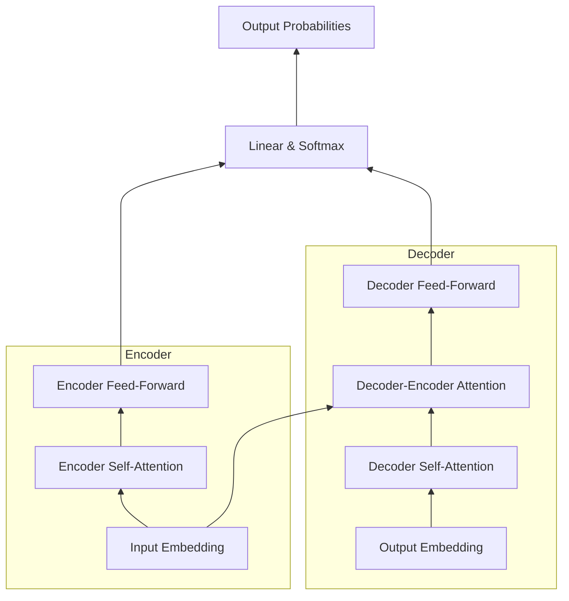

# 大语言模型原理基础与前沿 Transformer

## 1. 背景介绍

### 1.1 大语言模型的兴起
大语言模型(Large Language Model, LLM)是近年来自然语言处理(NLP)领域最为瞩目的研究方向之一。随着深度学习的发展,尤其是Transformer[1]等注意力机制模型的提出,以及预训练技术的成熟,大语言模型取得了突破性的进展。从2018年的BERT[2]、GPT[3],到2020年的GPT-3[4],再到2021年的PaLM[5]等,大语言模型展现出了惊人的自然语言理解和生成能力,在问答、对话、摘要、翻译等多个NLP任务上取得了超越人类的表现。

### 1.2 Transformer的重要地位
在众多大语言模型中,Transformer无疑是最为关键的底层架构。自从2017年由Google提出后,Transformer迅速成为了NLP领域的主流模型。它抛弃了此前主流的RNN、CNN等结构,完全基于注意力机制来学习文本表示,大幅提升了并行计算效率和长距离依赖建模能力。此后的BERT、GPT、T5[6]等大语言模型无一例外都是以Transformer为基础。可以说,Transformer是大语言模型的根基所在。

### 1.3 本文的主要内容
鉴于Transformer在大语言模型中的核心地位,本文将重点介绍Transformer的原理和应用。内容涵盖:

1. Transformer的核心概念,如注意力机制、自注意力、多头注意力等。  
2. Transformer的整体架构和各个组件的作用原理。
3. Transformer的核心创新点,如位置编码、残差连接、Layer Normalization等。
4. Transformer的训练方法,包括预训练和微调两个阶段。
5. Transformer在NLP各大任务中的应用实践。
6. Transformer面临的挑战和未来的发展方向。

通过本文的学习,读者将建立对Transformer的全面认知,为进一步探索大语言模型打下坚实基础。

## 2. 核心概念与联系

### 2.1 注意力机制(Attention Mechanism)
注意力机制的核心思想是,在生成每个输出时,用不同的权重去聚合输入序列的信息。形式化地,对于输入序列$\boldsymbol{x}=(x_1,\cdots,x_n)$和输出序列$\boldsymbol{y}=(y_1,\cdots,y_m)$,注意力机制用下式计算每个输出$y_i$:

$$
y_i = f(\sum_{j=1}^n \alpha_{ij} x_j)
$$

其中$\alpha_{ij}$是第$i$个输出对第$j$个输入的注意力权重,$f$是变换函数。直观地看,注意力机制让模型有能力专注于输入中与当前输出最相关的部分。

### 2.2 自注意力(Self-Attention)
自注意力是注意力机制的一种特殊形式,它用序列自身来计算注意力权重。具体地,对于输入序列$\boldsymbol{x}=(x_1,\cdots,x_n)$,自注意力的计算公式为:

$$
\alpha_{ij} = \frac{\exp(e_{ij})}{\sum_{k=1}^n \exp(e_{ik})}, \quad  e_{ij} = \frac{(W_q x_i)^T(W_k x_j)}{\sqrt{d}}
$$

$W_q$和$W_k$是可学习的权重矩阵,$d$是向量维度。自注意力让序列中的每个元素都能与其他所有元素建立联系,极大地增强了模型捕捉长距离依赖的能力。

### 2.3 多头注意力(Multi-Head Attention)
多头注意力是将自注意力扩展到多个子空间的机制。它将输入序列投影到$h$个不同的子空间,在每个子空间分别进行自注意力计算,然后将结果拼接起来。公式表示为:

$$
\text{MultiHead}(X) = \text{Concat}(\text{head}_1, \cdots, \text{head}_h) W^O \\
\text{head}_i = \text{Attention}(XW_i^Q, XW_i^K, XW_i^V)
$$

多头注意力让模型能在不同的表示子空间捕捉输入的不同方面信息,提升了模型的表达能力。

### 2.4 前馈神经网络(Feed-Forward Network)
前馈神经网络在Transformer中用于对自注意力的输出进行非线性变换。它由两层全连接网络组成,中间加了ReLU激活函数:

$$
\text{FFN}(x) = \max(0, xW_1 + b_1) W_2 + b_2
$$

前馈神经网络增加了Transformer的容量和非线性,使其能学习更加复杂的映射。

### 2.5 残差连接(Residual Connection)和Layer Normalization
残差连接和Layer Normalization是Transformer的两个重要细节。残差连接让信息能够直接从底层传递到高层,缓解了深度网络的优化难题。Layer Normalization在Transformer的每个子层后进行特征归一化,有助于稳定训练。二者的结合公式为:

$$
\text{Output} = \text{LayerNorm}(x + \text{Sublayer}(x))
$$

其中$\text{Sublayer}$可以是自注意力层或前馈神经网络层。

### 2.6 位置编码(Positional Encoding)
由于Transformer没有RNN那样的顺序结构,为了让模型感知输入序列的顺序信息,它在输入嵌入中加入了位置编码。位置编码可以是可学习的,也可以是固定的三角函数形式:

$$
PE_{(pos,2i)} = \sin(pos/10000^{2i/d}) \\
PE_{(pos,2i+1)} = \cos(pos/10000^{2i/d})
$$

其中$pos$是位置,$i$是维度,$d$是嵌入维度。位置编码与词嵌入相加作为Transformer的输入。

### 2.7 Transformer的整体架构
有了以上核心概念,我们可以总览Transformer的整体架构了。Transformer由编码器和解码器组成,每个编码器层包含两个子层:自注意力层和前馈神经网络层。每个解码器层包含三个子层:自注意力层、编码-解码注意力层和前馈神经网络层。所有子层都用残差连接和Layer Normalization包裹。

下图展示了Transformer的架构示意:

## 3. 核心算法原理具体操作步骤

Transformer的核心是自注意力机制和多头注意力机制。下面我们详细讲解它们的计算步骤。

### 3.1 标准的注意力(Attention)计算步骤
1. 将输入序列$X$通过三个线性变换得到查询矩阵$Q$、键矩阵$K$和值矩阵$V$:
   
$$
Q = XW^Q, \quad K = XW^K, \quad V = XW^V
$$

2. 计算查询矩阵和键矩阵的点积并除以$\sqrt{d}$($d$为嵌入维度),然后通过softmax归一化得到注意力权重矩阵$A$:

$$
A = \text{softmax}(\frac{QK^T}{\sqrt{d}})
$$

3. 用注意力权重矩阵$A$对值矩阵$V$加权求和,得到输出$Z$:

$$
Z = AV
$$

### 3.2 多头注意力(Multi-Head Attention)计算步骤

1. 将输入$X$分别通过$h$组不同的线性变换$W_i^Q, W_i^K, W_i^V$得到$h$组查询矩阵、键矩阵和值矩阵:

$$
Q_i = XW_i^Q, \quad K_i = XW_i^K, \quad V_i = XW_i^V, \quad i=1,\cdots,h
$$

2. 对每组$Q_i, K_i, V_i$分别进行注意力计算,得到$h$个输出$Z_i$:

$$
Z_i = \text{Attention}(Q_i, K_i, V_i), \quad i=1,\cdots,h
$$

3. 将$h$个输出$Z_i$拼接起来并通过另一个线性变换$W^O$得到最终的多头注意力输出$Z$:

$$
Z = \text{Concat}(Z_1, \cdots, Z_h) W^O
$$

可见,多头注意力其实就是将单头注意力扩展到多个子空间并行计算,然后再融合的过程。

### 3.3 Transformer的编码器计算步骤
现在我们可以总结Transformer编码器的完整计算步骤:

1. 将输入序列$X$与位置编码相加得到输入嵌入$E$。

2. 对$E$进行多头自注意力计算:

$$
A = \text{MultiHead}(E, E, E)
$$

3. 对多头自注意力输出$A$进行残差连接和Layer Normalization:

$$
B = \text{LayerNorm}(A + E)
$$

4. 对$B$进行前馈神经网络变换:

$$
C = \text{FFN}(B)
$$

5. 对前馈输出$C$进行残差连接和Layer Normalization得到编码器最终输出$H$:

$$
H = \text{LayerNorm}(C + B)
$$

编码器可以堆叠多层,每层的输出作为下一层的输入。

### 3.4 Transformer的解码器计算步骤
Transformer的解码器与编码器类似,只是在编码-解码注意力层引入了编码器的输出。设编码器输出为$H$,解码器的计算步骤为:

1. 将输出序列$Y$与位置编码相加得到输出嵌入$S$。

2. 对$S$进行多头自注意力计算,但只能看到当前及之前的位置:

$$
A = \text{MultiHead}(S, S, S)
$$

3. 对多头自注意力输出$A$进行残差连接和Layer Normalization:

$$
B = \text{LayerNorm}(A + S)
$$

4. 在$B$和编码器输出$H$之间进行多头注意力计算:

$$
C = \text{MultiHead}(B, H, H)
$$

5. 对编码-解码注意力输出$C$进行残差连接和Layer Normalization:

$$
D = \text{LayerNorm}(C + B)
$$

6. 对$D$进行前馈神经网络变换:

$$
E = \text{FFN}(D)
$$

7. 对前馈输出$E$进行残差连接和Layer Normalization得到解码器最终输出$O$:

$$
O = \text{LayerNorm}(E + D)
$$

解码器的输出$O$经过一个线性变换和softmax后,就得到了下一个词的概率分布。

## 4. 数学模型和公式详细讲解举例说明

本节我们将详细推导Transformer中的几个关键公式,并给出具体的例子帮助理解。

### 4.1 标准注意力(Attention)的公式推导
回顾标准注意力的计算公式:

$$
A = \text{softmax}(\frac{QK^T}{\sqrt{d}}), \quad Z = AV
$$

其中$Q=XW^Q, K=XW^K, V=XW^V$。我们来看看这个公式是如何得到的。

首先,对于查询矩阵$Q$中的每个查询向量$q_i$,我们想要计算它与键矩阵$K$中所有键向量$k_j$的相似度。一个常见的相似度度量是点积:

$$
e_{ij} = q_i^T k_j
$$

直观上,$e_{ij}$衡量了查询$q_i$与键$k_j$的匹配程度。我们在$e_{ij}$上除以$\sqrt{d}$,是为了缓解点积的量级随嵌入维度$d$增长而增大的问题[1]。

得到所有的$e_{ij}$后,我们通过softmax函数将它们归一化为权重:

$$
\alpha_{ij} = \frac{\exp(e_{ij})}{\sum_k \exp(e_{ik})}
$$

$\alpha_{ij}$代表了查询$q_i$分配给键$k_j$的注意力权重。最后,我们用这些权重对值向量$v_j$进行加权求和,得到查询