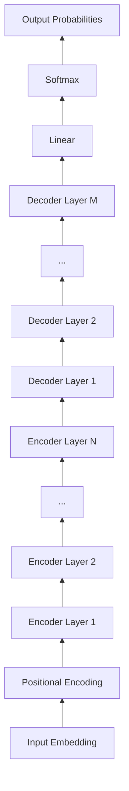
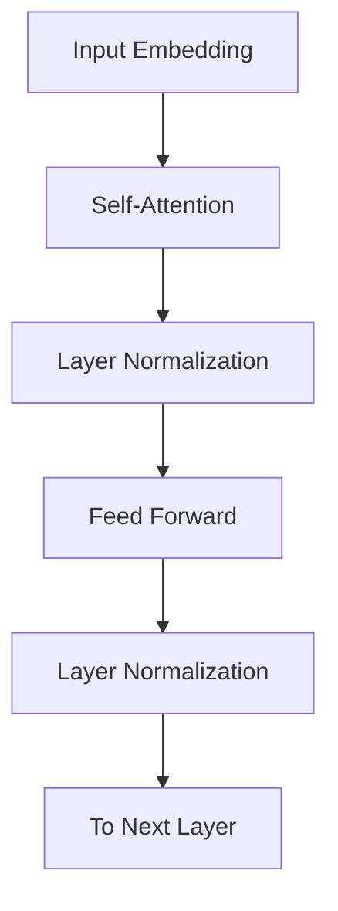

# 大语言模型原理基础与前沿 Transformer编码器模块

## 1. 背景介绍
### 1.1 大语言模型的兴起
近年来,随着深度学习技术的飞速发展,自然语言处理领域取得了突破性的进展。尤其是以Transformer为代表的大语言模型,以其强大的语言理解和生成能力,在机器翻译、对话系统、文本摘要等诸多任务上取得了令人瞩目的成绩。大语言模型已经成为NLP领域的研究热点和业界竞相追逐的目标。

### 1.2 Transformer模型的重要地位
在众多大语言模型中,Transformer无疑是其中的佼佼者。自从2017年谷歌提出Transformer模型以来,基于Transformer的各种衍生模型如雨后春笋般涌现,如BERT、GPT、XLNet等,它们纷纷在多个NLP任务上取得了SOTA的成绩。可以说,Transformer模型引领了NLP领域的一场革命,奠定了大语言模型时代的基础。

### 1.3 编码器-解码器架构
Transformer采用了编码器-解码器(Encoder-Decoder)的架构,编码器负责对输入序列进行特征提取和语义编码,解码器则根据编码器的输出生成目标序列。编码器和解码器内部都由若干个相同的层(Layer)堆叠而成,每一层包含了自注意力机制(Self-Attention)和前馈神经网络(Feed-Forward Network)两个子层。其中,编码器是Transformer的核心组件,对于模型的性能起着至关重要的作用。

### 1.4 本文的主要内容
本文将重点介绍Transformer模型编码器模块的原理和实现。我们将从编码器的整体架构出发,详细讲解其内部的自注意力机制、前馈神经网络等关键组件,并给出相应的数学模型和代码实现。同时,本文还将讨论Transformer编码器的一些前沿改进和优化技术,如预训练、知识蒸馏等,为读者全面深入地理解Transformer编码器提供参考。

## 2. 核心概念与联系
### 2.1 Transformer的整体架构
Transformer采用了编码器-解码器的架构,如下图所示:

可以看到,Transformer主要由编码器(Encoder)、解码器(Decoder)两大模块组成,外加输入嵌入(Input Embedding)和位置编码(Positional Encoding)。其中,编码器和解码器内部都由若干个相同的层堆叠而成。

### 2.2 编码器内部结构
我们进一步看编码器内部的结构:

编码器的每一层主要包含两个子层:
1. 多头自注意力(Multi-Head Self-Attention):通过自注意力机制捕捉输入序列内部的依赖关系,生成上下文相关的特征表示。
2. 前馈神经网络(Feed-Forward Network):对自注意力的输出进行非线性变换,提取高阶特征。

此外,每个子层之后都接一个Layer Normalization和残差连接,有助于稳定训练和加快收敛。

### 2.3 自注意力机制
自注意力是Transformer的核心,它的作用是学习输入序列内部的依赖关系,捕捉上下文信息。具体来说,自注意力将每个位置的向量与所有位置的向量进行注意力加权,得到该位置的上下文表示。其数学公式为:

$$
Attention(Q,K,V) = softmax(\frac{QK^T}{\sqrt{d_k}})V
$$

其中,$Q$,$K$,$V$分别表示Query,Key,Value向量,$d_k$为Key向量的维度。自注意力的计算过程可以分为以下几步:
1. 将输入向量$X$通过三个线性变换得到$Q$,$K$,$V$
2. 计算$Q$和$K$的点积并除以$\sqrt{d_k}$,得到注意力分数
3. 对注意力分数应用softmax函数,得到注意力权重
4. 将注意力权重与$V$相乘并求和,得到输出向量

### 2.4 多头注意力
为了捕捉不同子空间的信息,Transformer在自注意力的基础上引入了多头注意力机制。具体做法是将$Q$,$K$,$V$通过不同的线性变换投影到$h$个子空间,然后在每个子空间分别计算自注意力,最后将所有头的输出拼接起来并经过另一个线性变换得到最终的多头注意力输出。公式如下:

$$
\begin{aligned}
MultiHead(Q,K,V) &= Concat(head_1,...,head_h)W^O \\
head_i &= Attention(QW_i^Q, KW_i^K, VW_i^V)
\end{aligned}
$$

其中$W_i^Q \in \mathbb{R}^{d_{model} \times d_k}, W_i^K \in \mathbb{R}^{d_{model} \times d_k}, W_i^V \in \mathbb{R}^{d_{model} \times d_v}, W^O \in \mathbb{R}^{hd_v \times d_{model}}$

### 2.5 前馈神经网络
除了自注意力子层,编码器的每一层还包含一个前馈全连接子层。前馈网络可以看作两层的全连接网络,对自注意力的输出进行非线性变换,提取高阶特征。公式如下:

$$FFN(x) = max(0, xW_1 + b_1)W_2 + b_2$$

其中$W_1 \in \mathbb{R}^{d_{model} \times d_{ff}}, W_2 \in \mathbb{R}^{d_{ff} \times d_{model}}$, $d_{ff}$通常取$4d_{model}$。

## 3. 核心算法原理具体操作步骤
本节我们将详细介绍Transformer编码器的核心算法实现步骤。
### 3.1 输入嵌入和位置编码
1. 将输入单词(或字符)映射为固定维度的嵌入向量,形成输入嵌入矩阵$X \in \mathbb{R}^{n \times d_{model}}$
2. 由于Transformer不包含递归和卷积结构,为了引入位置信息,需要对输入嵌入加上位置编码向量。位置编码可以采用不同的方式,如正弦曲线编码:
$$
PE_{(pos,2i)} = sin(pos / 10000^{2i/d_{model}})
$$
$$
PE_{(pos,2i+1)} = cos(pos / 10000^{2i/d_{model}})
$$
其中$pos$为位置索引,$i$为嵌入向量维度索引。
3. 将输入嵌入与位置编码相加,得到最终的输入表示$X+PE$

### 3.2 自注意力计算
对于编码器的每一层,首先计算自注意力:
1. 将上一层的输出$X$通过三个线性变换得到$Q,K,V$矩阵:
$$
Q = XW^Q, K = XW^K, V = XW^V
$$
2. 将$Q,K,V$按照头数$h$分割为大小为$d_k,d_k,d_v$的子矩阵:
$$
Q = [Q_1,Q_2,...,Q_h], K = [K_1,K_2,...,K_h], V = [V_1,V_2,...,V_h]
$$
3. 对每个头$i$,计算注意力分数,注意力权重和注意力输出:
$$
Attention(Q_i,K_i,V_i) = softmax(\frac{Q_iK_i^T}{\sqrt{d_k}})V_i
$$
4. 将所有头的输出拼接起来并乘以输出矩阵$W^O$:
$$
MultiHead(Q,K,V) = Concat(head_1,...,head_h)W^O
$$

### 3.3 Layer Normalization和残差连接
1. 对多头注意力的输出进行Layer Normalization,并与输入进行残差连接:
$$
X' = LayerNorm(MultiHead(Q,K,V) + X)
$$
2. 对前馈网络的输出进行Layer Normalization,并与上一步的输出进行残差连接:
$$
X'' = LayerNorm(FFN(X') + X')
$$

### 3.4 堆叠多层编码器
重复以上步骤,堆叠$N$层编码器,即可得到Transformer编码器的最终输出。

## 4. 数学模型和公式详细讲解举例说明
本节我们将详细推导Transformer编码器涉及的关键数学公式,并给出一些具体的例子加以说明。

### 4.1 Scaled Dot-Product Attention
自注意力的核心是Scaled Dot-Product Attention,其数学公式为:

$$
Attention(Q,K,V) = softmax(\frac{QK^T}{\sqrt{d_k}})V
$$

其中,$Q \in \mathbb{R}^{n \times d_k}, K \in \mathbb{R}^{n \times d_k}, V \in \mathbb{R}^{n \times d_v}$分别表示Query,Key,Value矩阵,$n$为序列长度,$d_k$为Query/Key的维度,$d_v$为Value的维度。

下面我们来详细分析这个公式的物理意义。$QK^T$计算Query和Key的点积,可以看作计算每个Query与所有Key的相似度。除以$\sqrt{d_k}$是为了缓解点积结果过大的问题。Softmax函数将点积结果归一化为权重分布。最后将权重分布与Value相乘并求和,得到加权的上下文表示。

举个例子,假设有一个长度为4的输入序列"I love machine learning",其中"machine"这个词的Query向量为$q$,4个词的Key向量分别为$k_1,k_2,k_3,k_4$,Value向量为$v_1,v_2,v_3,v_4$。则"machine"的注意力输出为:

$$
\begin{aligned}
Attention(q) &= \sum_{i=1}^4 \alpha_i v_i \\
\alpha_i &= \frac{exp(q \cdot k_i / \sqrt{d_k})}{\sum_{j=1}^4 exp(q \cdot k_j / \sqrt{d_k})}
\end{aligned}
$$

其中$\alpha_i$表示"machine"对第$i$个词的注意力权重。直观地看,与"machine"语义相关的词如"learning"会分配到较大的权重,而不相关的词如"I"的权重则较小。

### 4.2 Multi-Head Attention
多头注意力将输入$Q,K,V$通过线性变换投影到$h$个不同的子空间,然后在每个子空间并行地计算注意力,最后将所有头的输出拼接起来并经过另一个线性变换得到最终输出。公式如下:

$$
\begin{aligned}
MultiHead(Q,K,V) &= Concat(head_1,...,head_h)W^O \\
head_i &= Attention(QW_i^Q, KW_i^K, VW_i^V)
\end{aligned}
$$

其中$W_i^Q \in \mathbb{R}^{d_{model} \times d_k}, W_i^K \in \mathbb{R}^{d_{model} \times d_k}, W_i^V \in \mathbb{R}^{d_{model} \times d_v}, W^O \in \mathbb{R}^{hd_v \times d_{model}}$为可学习的投影矩阵。

直观上看,多头注意力允许模型在不同的子空间学习到不同的语义信息。例如,在英语到法语的机器翻译任务中,有的头可能专注于学习两种语言词汇之间的对齐关系,有的头可能侧重于句法结构的对应。将不同头的输出组合起来,模型能够获得更加全面丰富的表示。

举个例子,假设输入向量$x \in \mathbb{R}^{512}$,模型维度$d_{model}=512$,头数$h=8$,则每个头的维度为$d_k=d_v=d_{model}/h=64$。8个头的Query,Key,Value矩阵分别为:

$$
\begin{aligned}
Q_i &= xW_i^Q, W_i^Q \in \mathbb{R}^{512 \times 64} \\
K_i &= xW_i^K, W_i^K \in \mathbb{R}^{512 \times 64} \\