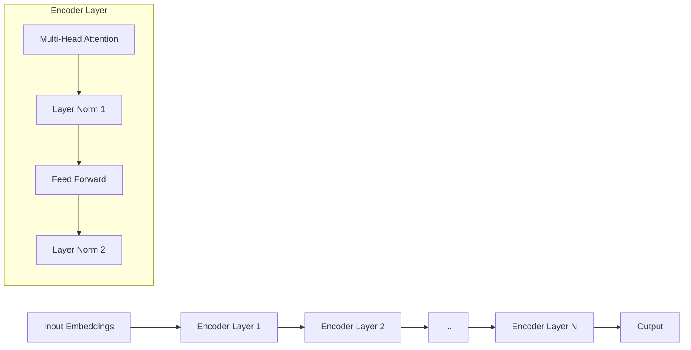

# 大语言模型原理基础与前沿：作为大语言模型提示的视觉输入

## 1.背景介绍

### 1.1 大语言模型的兴起

近年来,大型语言模型(Large Language Models, LLMs)在自然语言处理领域取得了令人瞩目的成就。这些模型通过在海量文本数据上进行预训练,学习了丰富的语言知识和上下文关联能力,从而在广泛的自然语言任务中展现出卓越的表现。

代表性的大语言模型包括GPT(Generative Pre-trained Transformer)系列、BERT(Bidirectional Encoder Representations from Transformers)、XLNet、T5(Text-to-Text Transfer Transformer)等。它们的出现极大推动了自然语言处理技术的发展,为诸多领域带来了新的机遇和挑战。

### 1.2 视觉输入的重要性

尽管大语言模型在处理文本数据方面表现出色,但仅依赖文本信息难以全面理解复杂的语义和上下文。视觉信息作为人类认知世界的重要渠道,对于提高语言理解能力至关重要。将视觉输入与语言模型相结合,可以增强模型对真实世界的理解,提高模型的泛化能力。

近年来,研究人员开始探索如何将视觉输入融入大语言模型中,以提升模型的多模态理解能力。这种融合视觉和语言的方法被称为视觉语言模型(Vision-Language Models, VLMs),它们在图像描述、视觉问答、图文理解等任务中展现出了优异的性能。

本文将重点探讨将视觉输入作为大语言模型提示的方法,阐述其基本原理、关键技术和实际应用,并展望未来的发展趋势和挑战。

## 2.核心概念与联系

### 2.1 大语言模型与提示学习

大语言模型通过在海量文本数据上进行自监督预训练,学习了丰富的语言知识和上下文关联能力。然而,直接将预训练模型应用于特定任务往往需要大量的标注数据进行微调(fine-tuning),这种方式存在数据标注成本高、泛化能力有限等问题。

提示学习(Prompt Learning)是一种新兴的范式,它通过设计合适的提示(Prompt),将任务转化为模型在预训练过程中已经学习过的形式,从而实现零样本或少样本学习。提示可以是一段自然语言文本、一组离散标记或者一个连续的向量表示。

提示学习的核心思想是利用大语言模型在预训练过程中学习到的知识,通过设计恰当的提示,引导模型生成所需的输出,从而避免了昂贵的微调过程。这种方法具有数据高效、泛化能力强等优势,在自然语言处理领域受到广泛关注。

### 2.2 视觉语言模型与多模态学习

视觉语言模型(VLMs)是一种融合视觉和语言的多模态模型,旨在实现对图像和文本的联合理解和生成。这些模型通常包含两个主要组件:一个用于编码视觉信息的视觉编码器,以及一个用于编码和生成语言的语言编码器/解码器。

视觉编码器通常采用卷积神经网络(CNN)或视觉转换器(ViT)等模型,将图像编码为一系列视觉特征向量。语言编码器/解码器则基于自然语言处理中常用的模型,如BERT、GPT等。两个模态的特征通过特定的融合机制进行交互和融合,实现对图像和文本的联合建模。

多模态学习旨在从多个模态(如视觉、语言、音频等)中捕获信息,并学习它们之间的关联和互补关系。相比于单一模态,多模态学习能够提供更丰富的信息,有助于提高模型的理解和生成能力。将视觉输入融入大语言模型中,就是一种典型的多模态学习范式。

## 3.核心算法原理具体操作步骤

### 3.1 视觉提示的生成

将视觉输入作为大语言模型的提示,首先需要将原始图像转换为适合语言模型的表示形式。常见的方法包括:

1. **视觉特征提取**:使用预训练的视觉编码器(如VGG、ResNet等)提取图像的视觉特征向量。

2. **图像标题生成**:利用图像描述模型(如Show and Tell、Bottom-Up and Top-Down Attention等)生成图像的文本描述,作为视觉提示。

3. **区域标注**:对图像中的物体、人物等进行区域标注,将标注信息作为视觉提示。

4. **布局解析**:分析图像的布局结构,如对象位置、大小、相对关系等,将解析结果作为视觉提示。

生成的视觉提示可以是一个连续的向量表示,也可以是一段自然语言文本。无论采用何种形式,视觉提示都应该能够捕获图像的关键信息,并与语言模型的输入格式相兼容。

### 3.2 视觉提示与语言模型融合

将视觉提示融入大语言模型中,需要设计合适的融合机制,以实现视觉和语言信息的有效交互和融合。常见的融合方法包括:

1. **前馈融合**:将视觉提示作为额外的输入,连接到语言模型的输入embeddings中。这种方式简单直接,但视觉和语言信息的交互较为有限。

2. **交互融合**:在语言模型的Transformer层中,引入视觉和语言信息之间的交互机制,如交叉注意力(Cross-Attention)、门控融合(Gated Fusion)等,实现两个模态的动态交互。

3. **双流融合**:维护两个独立的视觉和语言流,在特定层次进行融合,如最后一层的融合或者中间层的交互融合。

4. **参数高效微调**:在预训练的语言模型基础上,只对部分参数(如输出层)进行微调,将视觉提示融入模型中。这种方式参数高效,但融合程度有限。

不同的融合方式在计算复杂度、模型容量和性能之间存在权衡。选择合适的融合机制,对于充分利用视觉信息、提高模型性能至关重要。

### 3.3 视觉提示与语言任务

将视觉提示融入大语言模型后,可以应用于多种视觉语言任务,如图像描述、视觉问答、图文理解等。以视觉问答任务为例,其基本流程如下:

1. 将输入图像转换为视觉提示表示。

2. 将视觉提示与问题文本连接,作为语言模型的输入。

3. 语言模型基于融合的视觉语言表示,生成回答。

4. 对生成的回答进行后处理(如去重、过滤等),得到最终结果。

在实际应用中,还需要考虑任务的特殊性,设计合适的提示模板、损失函数等,以提高模型的性能和泛化能力。

## 4.数学模型和公式详细讲解举例说明

### 4.1 Transformer模型

Transformer是大语言模型的核心模块,其基于自注意力(Self-Attention)机制,能够有效捕获长距离依赖关系。Transformer的基本结构如下所示:



其中,输入embeddings首先通过N个编码器层(Encoder Layer)进行处理,每个编码器层包含两个子层:多头自注意力(Multi-Head Attention)和前馈神经网络(Feed Forward)。层归一化(Layer Normalization)和残差连接(Residual Connection)用于stabilizing和shortcut。

多头自注意力的计算公式如下:

$$\begin{aligned}
\text{MultiHead}(Q, K, V) &= \text{Concat}(\text{head}_1, \dots, \text{head}_h)W^O\\
\text{where\ head}_i &= \text{Attention}(QW_i^Q, KW_i^K, VW_i^V)
\end{aligned}$$

其中,Q、K、V分别表示查询(Query)、键(Key)和值(Value)。$W_i^Q$、$W_i^K$、$W_i^V$和$W^O$是可学习的线性投影参数。

scaled dot-product attention的计算公式为:

$$\text{Attention}(Q, K, V) = \text{softmax}(\frac{QK^T}{\sqrt{d_k}})V$$

其中,$$d_k$$是缩放因子,用于防止内积值过大导致softmax饱和。

Transformer的自注意力机制赋予了模型强大的建模能力,使其能够有效捕获长距离依赖关系,并在各种自然语言处理任务中取得卓越表现。

### 4.2 视觉语言融合模型

将视觉信息融入语言模型中,需要设计合适的融合机制。一种常见的方法是在Transformer的自注意力层中引入视觉和语言信息之间的交互,实现两个模态的动态融合。

具体来说,在计算自注意力时,除了查询(Query)、键(Key)和值(Value)之间的点积注意力之外,还需要计算视觉特征(Visual Features)与Query之间的交叉注意力(Cross-Attention),从而融入视觉信息。交叉注意力的计算公式如下:

$$\text{CrossAttention}(Q, V_v) = \text{softmax}(\frac{QV_v^T}{\sqrt{d_k}})V_v$$

其中,$$V_v$$表示视觉特征向量。

将自注意力和交叉注意力结合,可以得到融合了视觉和语言信息的注意力输出:

$$\text{FusedAttention} = \text{MultiHead}(Q, K, V) + \text{CrossAttention}(Q, V_v)$$

通过这种融合机制,语言模型不仅能够捕获文本信息中的依赖关系,还能够利用视觉信息进行辅助,从而提高模型的理解和生成能力。

该融合模型可以应用于各种视觉语言任务,如图像描述、视觉问答等。在实际应用中,还需要根据具体任务设计合适的损失函数、优化策略等,以提高模型的性能和泛化能力。

## 5.项目实践:代码实例和详细解释说明

为了更好地理解视觉语言融合模型的实现细节,我们将提供一个基于PyTorch的代码示例,并对关键部分进行详细解释。

### 5.1 数据预处理

首先,我们需要对输入的图像和文本进行预处理,将它们转换为模型可以接受的格式。

```python
import torchvision.transforms as transforms

# 图像预处理
image_transform = transforms.Compose([
    transforms.Resize((224, 224)),
    transforms.ToTensor(),
    transforms.Normalize(mean=[0.485, 0.456, 0.406], std=[0.229, 0.224, 0.225])
])

# 文本预处理
tokenizer = BertTokenizer.from_pretrained('bert-base-uncased')

def preprocess_data(image, text):
    image_tensor = image_transform(image)
    text_tokens = tokenizer.encode_plus(text, padding='max_length', max_length=512, return_tensors='pt')
    return image_tensor, text_tokens
```

在这个示例中,我们使用torchvision.transforms对图像进行预处理,包括调整大小、转换为张量和标准化。对于文本,我们使用BERT的tokenizer对其进行编码,并填充到固定长度。

### 5.2 视觉编码器

我们使用预训练的ResNet作为视觉编码器,提取图像的视觉特征。

```python
import torchvision.models as models

class VisualEncoder(nn.Module):
    def __init__(self, pretrained=True):
        super(VisualEncoder, self).__init__()
        resnet = models.resnet152(pretrained=pretrained)
        modules = list(resnet.children())[:-2]
        self.resnet = nn.Sequential(*modules)

    def forward(self, images):
        features = self.resnet(images)
        features = features.permute(0, 2, 3, 1)
        return features
```

在这个示例中,我们使用ResNet-152作为视觉编码器的骨干网络。我们移除了最后两层(全连接层和平均池化层),保留了卷积和池化层。在前向传播时,我们