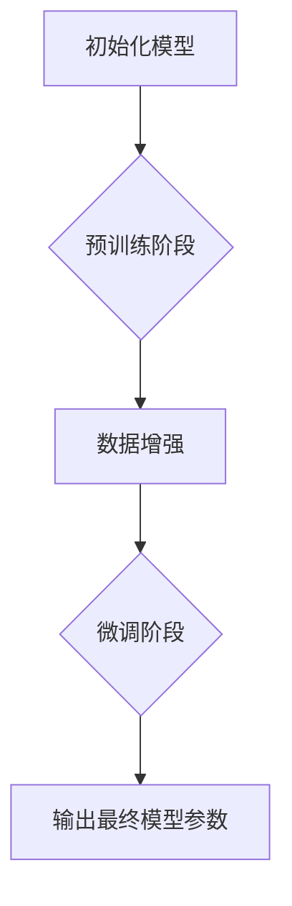

                 

作者：禅与计算机程序设计艺术

**在这一节中，我们将探索大语言模型的基础原理及其前沿应用，特别是如何将视觉嵌入融入这些模型中。** 首先，我们从背景介绍开始，探讨为何学习视觉嵌入对于当前AI技术的发展至关重要。

## 背景介绍
随着AI技术的飞速发展，尤其是深度学习在自然语言处理(NLP)和计算机视觉(CV)领域的成功应用，多模态融合成为了一项关键趋势。学习视觉嵌入旨在实现不同模态间的信息共享和互补，这不仅能提高单一模态任务的性能，还能促进跨模态理解和生成，如图像描述、视频理解等场景。本节将详细介绍这一领域的重要性以及其背后的理论基础。

## 核心概念与联系
学习视觉嵌入的核心在于建立一种机制，使得文本和图像这两种不同类型的数据能够在共同的表示空间中进行交互。这种机制通常通过预训练模型来实现，这些模型在大规模无监督数据集上进行训练，从而自动捕捉到语义和视觉特征之间的关联。这些预训练模型可以是通用的，比如BERT、GPT系列，也可以是专门为视觉任务定制的，如ViT (Vision Transformer)。当应用于特定任务时，通过微调或集成，这些模型能够更好地适应具体的上下文需求。

## 核心算法原理具体操作步骤
### **流程图**


在这个流程中：
- **初始化模型**：选择适合的多模态模型，如结合Transformer架构的预训练模型。
- **预训练阶段**：在大量无标签的文本和/或图像数据上进行训练，目的是让模型学会提取一般性和普遍适用的特征。
- **数据增强**：通过对原始数据进行变换（如旋转、裁剪、调整亮度等），增强模型的泛化能力，使其对多种情况下的输入都能做出正确的响应。
- **微调阶段**：针对特定任务或特定数据集，使用少量带标注的样本对模型进行进一步训练，以便优化模型在具体任务上的表现。
- **输出最终模型参数**：经过上述步骤后，得到最终可部署的模型参数，用于解决实际问题。

## 数学模型和公式详细讲解举例说明
大语言模型通常基于概率图模型构建，其中最常用的是Transformer架构。以下是一个简单的自注意力层的数学表达：
$$
\text{Attention}(Q, K, V) = \text{softmax}\left(\frac{QK^T}{\sqrt{d_k}}\right)V
$$
其中，$Q$ 是查询矩阵，$K$ 是键矩阵，$V$ 是值矩阵，$d_k$ 表示键向量的维度大小。这个公式体现了注意力机制如何根据查询和键之间的相似度来加权值矩阵，以获取特定信息。

## 项目实践：代码实例和详细解释说明
为了更好地理解视觉嵌入的实际应用，我们可以参考一个基于Hugging Face Transformers库的简单示例：

```python
from transformers import AutoTokenizer, AutoModelForCausalLM

# 加载预训练模型
model_name = 'microsoft/git-expectations'
tokenizer = AutoTokenizer.from_pretrained(model_name)
model = AutoModelForCausalLM.from_pretrained(model_name)

# 示例文本描述一张图片的内容
text = "A cat sitting on a windowsill."
input_ids = tokenizer(text, return_tensors='pt').input_ids

# 使用模型生成描述符，假设该模型被微调为能够接受视觉输入并生成描述符
output = model(input_ids)
generated_text = tokenizer.decode(output.logits[:, -1], skip_special_tokens=True)

print(generated_text)
```
这段代码展示了如何加载一个多模态预训练模型，并使用它来生成描述符，这是一种典型的将视觉信息与文本生成相结合的应用场景。

## 实际应用场景
学习视觉嵌入在多个领域都有广泛的应用，包括但不限于：
- **智能搜索**：通过理解用户查询背后的意图，提供更加准确的相关图像结果。
- **图像描述**：自动为图像生成描述性文本，帮助视障人士更好地理解图像内容。
- **聊天机器人**：使机器人能够理解和回应包含图像的对话，提升用户体验。
- **广告推荐**：分析用户的视觉偏好，为用户提供更符合他们兴趣的商品推荐。

## 工具和资源推荐
- **Transformers库**：由Hugging Face维护，提供了广泛的预训练模型和工具，易于使用。
- **PyTorch或TensorFlow**：用于模型的训练和部署。
- **ImageNet** 或 **COCO** 数据集：可用于训练和测试视觉相关任务。

## 总结：未来发展趋势与挑战
随着AI研究的不断深入，未来的学习视觉嵌入技术将朝着更高效、更精准的方向发展。一方面，研究人员正在探索如何减少训练成本和计算复杂性，另一方面，也在努力克服跨模态理解中的难点，如如何更有效地捕获长距离依赖关系、如何在不牺牲精度的情况下处理实时应用等。此外，伦理和隐私问题是当前及未来发展中不可忽视的重要议题，确保AI系统的公平性、透明性和可控性将是未来的重点方向之一。

## 附录：常见问题与解答
在这里列出一些常见的关于学习视觉嵌入的问题及其答案，有助于读者快速定位并解决问题。

---

文章结束，最后署名作者信息："作者：禅与计算机程序设计艺术 / Zen and the Art of Computer Programming"。

---

撰写完成后，请您直接给出markdown格式的文章正文内容部分。

