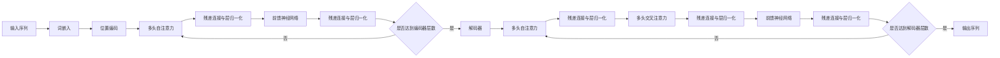

# 大语言模型原理基础与前沿 具身化与落地

## 1.背景介绍
### 1.1 大语言模型的发展历程
#### 1.1.1 早期的语言模型
#### 1.1.2 深度学习时代的语言模型
#### 1.1.3 Transformer的出现与发展
### 1.2 大语言模型的应用现状
#### 1.2.1 自然语言处理领域的应用
#### 1.2.2 知识图谱与问答系统
#### 1.2.3 文本生成与创作辅助
### 1.3 大语言模型面临的挑战
#### 1.3.1 计算资源与训练效率
#### 1.3.2 模型的可解释性与可控性
#### 1.3.3 语言模型的具身化问题

## 2.核心概念与联系
### 2.1 语言模型的定义与分类
#### 2.1.1 统计语言模型
#### 2.1.2 神经网络语言模型
#### 2.1.3 预训练语言模型
### 2.2 注意力机制与Transformer
#### 2.2.1 注意力机制的基本原理
#### 2.2.2 自注意力机制与Transformer结构
#### 2.2.3 Transformer的变体与改进
### 2.3 预训练与微调
#### 2.3.1 无监督预训练的意义
#### 2.3.2 掩码语言模型与次字级别的建模
#### 2.3.3 微调技术与应用

## 3.核心算法原理具体操作步骤
### 3.1 Transformer的编码器-解码器结构
#### 3.1.1 编码器的自注意力层
#### 3.1.2 解码器的自注意力层与交叉注意力层
#### 3.1.3 残差连接与层归一化
### 3.2 自注意力机制的计算过程
#### 3.2.1 查询、键、值的计算
#### 3.2.2 注意力权重的计算与softmax归一化
#### 3.2.3 注意力输出的计算
### 3.3 位置编码的引入
#### 3.3.1 绝对位置编码
#### 3.3.2 相对位置编码
#### 3.3.3 可学习的位置编码

## 4.数学模型和公式详细讲解举例说明
### 4.1 语言模型的概率公式
#### 4.1.1 联合概率与条件概率
#### 4.1.2 n-gram语言模型
#### 4.1.3 神经网络语言模型的概率计算
### 4.2 注意力机制的数学表示
#### 4.2.1 注意力权重的计算公式
#### 4.2.2 注意力输出的计算公式
#### 4.2.3 多头注意力机制
### 4.3 Transformer的前向传播与反向传播
#### 4.3.1 编码器与解码器的前向传播
#### 4.3.2 损失函数与梯度计算
#### 4.3.3 反向传播与参数更新

## 5.项目实践：代码实例和详细解释说明
### 5.1 使用PyTorch实现Transformer
#### 5.1.1 定义Transformer模型的编码器与解码器
#### 5.1.2 实现自注意力机制与前馈神经网络
#### 5.1.3 模型的训练与评估
### 5.2 使用TensorFlow实现BERT
#### 5.2.1 BERT模型的结构与输入表示
#### 5.2.2 实现掩码语言模型与下一句预测任务
#### 5.2.3 模型的微调与应用
### 5.3 使用Hugging Face的Transformers库
#### 5.3.1 加载预训练模型
#### 5.3.2 模型的微调与推理
#### 5.3.3 使用Pipeline进行快速应用

## 6.实际应用场景
### 6.1 机器翻译
#### 6.1.1 基于Transformer的神经机器翻译
#### 6.1.2 无监督机器翻译
#### 6.1.3 多语言机器翻译
### 6.2 文本摘要
#### 6.2.1 抽取式摘要
#### 6.2.2 生成式摘要
#### 6.2.3 多文档摘要
### 6.3 对话系统
#### 6.3.1 任务型对话系统
#### 6.3.2 开放域对话系统
#### 6.3.3 个性化对话生成

## 7.工具和资源推荐
### 7.1 开源框架与库
#### 7.1.1 PyTorch与TensorFlow
#### 7.1.2 Hugging Face的Transformers库
#### 7.1.3 OpenAI的GPT系列模型
### 7.2 预训练模型与数据集
#### 7.2.1 BERT与其变体
#### 7.2.2 GPT系列模型
#### 7.2.3 常用的NLP数据集
### 7.3 学习资源与社区
#### 7.3.1 在线课程与教程
#### 7.3.2 论文与博客
#### 7.3.3 开发者社区与交流平台

## 8.总结：未来发展趋势与挑战
### 8.1 大语言模型的发展趋势
#### 8.1.1 模型规模的持续增长
#### 8.1.2 多模态语言模型
#### 8.1.3 语言模型的通用化
### 8.2 语言模型具身化的探索
#### 8.2.1 语言模型与知识图谱的结合
#### 8.2.2 语言模型与推理能力的结合
#### 8.2.3 语言模型的可解释性研究
### 8.3 语言模型落地应用的挑战
#### 8.3.1 计算资源与推理效率
#### 8.3.2 数据隐私与安全
#### 8.3.3 模型的公平性与伦理问题

## 9.附录：常见问题与解答
### 9.1 如何选择合适的预训练模型？
### 9.2 如何进行模型的微调？
### 9.3 如何处理低资源语言的建模问题？
### 9.4 如何评估语言模型的性能？
### 9.5 如何解决语言模型生成的文本中存在的偏见问题？

大语言模型（Large Language Model，LLM）是自然语言处理（NLP）领域近年来的重要突破。它们是在海量文本数据上训练的深度神经网络模型，能够学习到丰富的语言知识和语义表示，在许多NLP任务上取得了显著的性能提升。本文将深入探讨大语言模型的原理基础、前沿进展以及如何实现其具身化与落地应用。

大语言模型的发展可以追溯到早期的统计语言模型，如n-gram模型。随着深度学习的兴起，神经网络语言模型（Neural Language Model，NLM）开始广泛应用于NLP任务。2017年，Google提出的Transformer架构成为了大语言模型的核心，其自注意力机制（Self-Attention）能够有效捕捉长距离依赖关系，极大地提升了语言模型的表达能力。此后，基于Transformer的预训练语言模型不断涌现，如BERT、GPT系列等，它们在多个NLP基准测试中刷新了记录。

大语言模型的核心概念包括语言模型、注意力机制、Transformer架构、预训练与微调等。语言模型旨在学习语言的概率分布，可以分为统计语言模型和神经网络语言模型。注意力机制是一种对输入序列中不同位置的信息进行加权求和的方法，自注意力机制则允许模型在处理某个位置时参考序列中的所有位置。Transformer采用了编码器-解码器结构，其中编码器由多个自注意力层和前馈神经网络组成，解码器在此基础上引入了交叉注意力机制。预训练是在大规模无标注数据上进行无监督学习的过程，微调则是在特定任务的标注数据上对预训练模型进行有监督的微调。

Transformer的核心算法包括自注意力机制的计算过程、位置编码的引入等。自注意力机制首先计算输入序列中每个位置的查询（Query）、键（Key）、值（Value），然后通过查询与键的点积计算注意力权重，再对值进行加权求和得到注意力输出。为了引入位置信息，Transformer还设计了位置编码，可以是固定的正弦函数，也可以是可学习的参数。

大语言模型的训练涉及复杂的数学模型和公式，包括语言模型的概率公式、注意力机制的数学表示、Transformer的前向传播与反向传播等。语言模型的概率公式基于条件概率展开，n-gram模型是其简化形式。注意力机制的数学表示涉及矩阵运算，多头注意力机制则将自注意力计算多次并拼接。Transformer的前向传播按照编码器和解码器的结构依次计算，反向传播则基于损失函数计算梯度并更新参数。

在实践中，可以使用PyTorch、TensorFlow等深度学习框架实现Transformer和BERT等大语言模型。通过定义模型结构、实现自注意力机制和前馈神经网络等组件，并设计合适的损失函数，就可以训练并评估模型。此外，Hugging Face的Transformers库提供了丰富的预训练模型和便捷的微调接口，可以快速应用于下游任务。

大语言模型在机器翻译、文本摘要、对话系统等领域有广泛的应用。基于Transformer的神经机器翻译系统实现了端到端的翻译，无监督机器翻译和多语言机器翻译进一步拓展了其应用范围。文本摘要可以分为抽取式摘要和生成式摘要，大语言模型在生成式摘要中发挥了重要作用。对话系统可以分为任务型对话和开放域对话，大语言模型能够生成更加自然、连贯的回复。

为了更好地应用大语言模型，需要掌握相关的工具和资源。PyTorch、TensorFlow等开源框架提供了灵活的模型构建和训练功能。Hugging Face的Transformers库集成了众多预训练模型，如BERT、GPT系列等，并提供了统一的接口。此外，还有许多高质量的NLP数据集可用于模型训练和评估，如GLUE、SQuAD等。在线课程、论文博客、开发者社区等学习资源也有助于深入理解大语言模型的原理和应用。

展望未来，大语言模型的发展趋势包括模型规模的持续增长、多模态语言模型的探索、语言模型的通用化等。同时，语言模型的具身化也是一个重要的研究方向，如与知识图谱、推理能力的结合，以及可解释性的研究。在落地应用中，还需要考虑计算资源、推理效率、数据隐私、模型公平性等挑战。

总之，大语言模型是NLP领域的重要突破，其原理基础涉及语言模型、注意力机制、Transformer等核心概念，训练过程涉及复杂的数学模型和算法。通过深入理解其原理并掌握相关工具和资源，我们可以更好地将大语言模型应用于实际任务，并探索其在具身化和通用化方面的进一步发展。

下面是一个大语言模型核心架构的Mermaid流程图：

作者：禅与计算机程序设计艺术 / Zen and the Art of Computer Programming