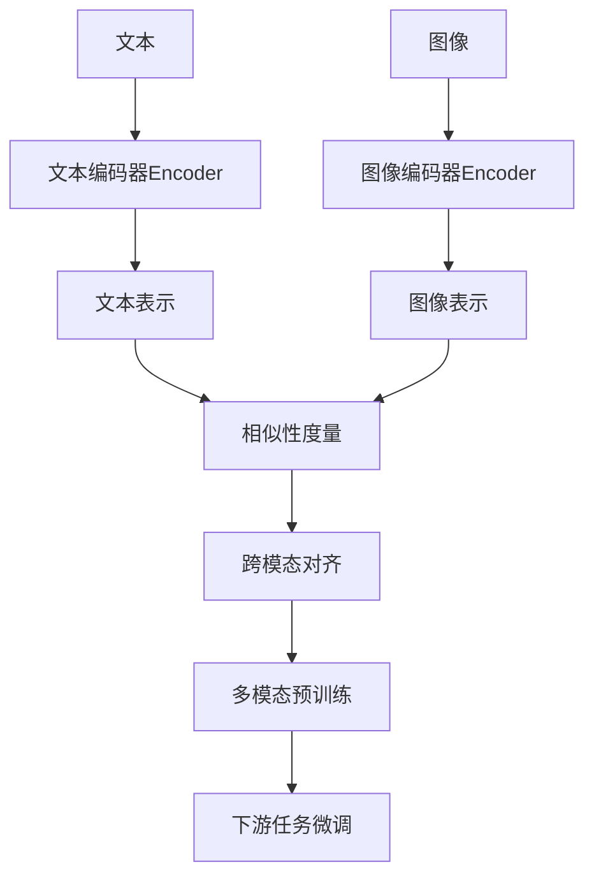

# 大语言模型原理基础与前沿 基于相似性搜索的多模态对齐

## 1. 背景介绍

近年来，大语言模型(Large Language Models, LLMs)在自然语言处理(Natural Language Processing, NLP)领域取得了显著的进展。LLMs 通过在海量文本数据上进行预训练，学习到了丰富的语言知识和生成能力，在许多 NLP 任务上表现出色，如问答、摘要、翻译等。然而，LLMs 目前主要局限于单一模态，即文本。在现实世界中，信息通常以多种模态形式存在，如图像、音频、视频等。因此，如何将 LLMs 拓展到多模态场景，实现不同模态之间的对齐和融合，成为了一个重要的研究方向。

本文将重点探讨基于相似性搜索的多模态对齐技术在大语言模型中的应用。我们首先介绍多模态对齐的核心概念和意义，然后详细阐述相似性搜索在多模态对齐中的核心算法原理和操作步骤。接着，我们给出相关的数学模型和公式，并结合代码实例进行详细解释说明。此外，我们还将讨论该技术的实际应用场景，推荐相关的工具和资源，展望未来的发展趋势与挑战，并在附录中解答一些常见问题。

## 2. 核心概念与联系

### 2.1 多模态学习

多模态学习(Multimodal Learning)旨在利用不同模态的信息，如文本、图像、音频等，来增强机器学习模型的性能和泛化能力。不同模态的数据蕴含着互补的信息，多模态学习通过将它们有效融合，可以更全面地理解和表征现实世界的复杂语义。

### 2.2 跨模态对齐 

跨模态对齐(Cross-modal Alignment)是实现多模态学习的关键技术之一。其目标是在不同模态的表示空间中建立语义上的对应关系，使得不同模态的数据在语义层面上对齐。这样，我们就可以利用一种模态的信息去检索、生成或增强另一种模态的内容。

### 2.3 相似性搜索

相似性搜索(Similarity Search)是跨模态对齐的重要手段。给定一个查询(如一段文本)，相似性搜索旨在从另一模态的数据集(如一组图像)中找到与查询在语义上最相关的样本。通过衡量不同模态表示之间的相似性，我们可以建立起跨模态的语义连接。

### 2.4 大语言模型

大语言模型是以 Transformer 为代表的深度神经网络模型，通过在大规模文本语料上进行预训练，学习到了丰富的语言知识和生成能力。将相似性搜索引入大语言模型，可以实现文本与其他模态(如图像)的对齐，拓展 LLMs 的应用边界。

下图展示了基于相似性搜索的多模态对齐在大语言模型中的整体架构：



## 3. 核心算法原理和操作步骤

### 3.1 多模态双塔模型

实现跨模态对齐的一种常见方法是双塔模型(Dual-tower Model)。它由两个并行的塔(Tower)组成，分别对应不同的模态。每个塔都是一个编码器网络，将原始的模态数据映射到一个共享的语义空间。

以文本-图像对齐为例，双塔模型的核心步骤如下：

1. 分别将文本和图像输入到各自的编码器中，得到它们的特征表示。
2. 通过相似性度量(如点积、余弦相似度)计算文本和图像表示之间的相似性分数。
3. 利用对比学习的思想，最大化正样本对的相似性，最小化负样本对的相似性，从而实现跨模态对齐。

### 3.2 对比学习

对比学习(Contrastive Learning)是双塔模型训练的核心。其基本思想是从数据中构建正负样本对，通过最大化正样本对的相似性和最小化负样本对的相似性，学习到有区分性的特征表示。

在跨模态对齐中，我们通常将不同模态的数据组合成正负样本对。例如，给定一个文本-图像对 $(t, i)$，我们可以构建以下样本对：

- 正样本对：$(t, i)$
- 负样本对：$(t, i')$，其中 $i'$ 是随机采样的另一个图像

对比学习的目标函数可以表示为：

$$
\mathcal{L} = -\log \frac{\exp(\text{sim}(t, i))}{\exp(\text{sim}(t, i)) + \sum_{i' \in \mathcal{N}} \exp(\text{sim}(t, i'))}
$$

其中，$\text{sim}(\cdot, \cdot)$ 表示相似性度量函数，$\mathcal{N}$ 表示负样本集合。通过最小化该损失函数，模型可以学习到跨模态对齐的特征表示。

### 3.3 相似性搜索

在训练好双塔模型后，我们可以利用相似性搜索来实现跨模态检索。给定一个查询(如一段文本)，我们可以通过以下步骤在另一模态的数据集(如图像集)中找到与其最相关的样本：

1. 将查询文本输入到文本编码器中，得到其特征表示。
2. 将图像集中的每个图像输入到图像编码器中，得到它们的特征表示。
3. 计算查询文本表示与每个图像表示之间的相似性分数。
4. 根据相似性分数排序，选取得分最高的若干图像作为检索结果。

相似性搜索使得我们能够利用一种模态的信息去检索另一种模态的相关内容，实现了跨模态的信息融合和检索。

## 4. 数学模型和公式详细讲解

### 4.1 编码器模型

双塔模型中的编码器可以采用各种神经网络架构，如 CNN、RNN、Transformer 等。以 Transformer 为例，其编码过程可以表示为：

$$
\begin{aligned}
\mathbf{h}_0 &= \text{Embedding}(x) \\
\mathbf{h}_l &= \text{TransformerBlock}(\mathbf{h}_{l-1}), \quad l = 1, \dots, L \\
\mathbf{z} &= \text{Pooling}(\mathbf{h}_L)
\end{aligned}
$$

其中，$x$ 表示输入的文本或图像，$\mathbf{h}_l$ 表示第 $l$ 层 Transformer Block 的输出，$L$ 是 Transformer 的层数，$\mathbf{z}$ 是最终的特征表示，通过对最后一层的输出进行池化(如平均池化)得到。

### 4.2 相似性度量

常见的相似性度量包括点积(Dot Product)和余弦相似度(Cosine Similarity)。

点积计算两个向量 $\mathbf{u}$ 和 $\mathbf{v}$ 的相似性：

$$
\text{sim}(\mathbf{u}, \mathbf{v}) = \mathbf{u}^\top \mathbf{v}
$$

余弦相似度计算两个向量的夹角余弦值：

$$
\text{sim}(\mathbf{u}, \mathbf{v}) = \frac{\mathbf{u}^\top \mathbf{v}}{\|\mathbf{u}\| \|\mathbf{v}\|}
$$

其中，$\|\cdot\|$ 表示向量的 L2 范数。余弦相似度取值范围在 $[-1, 1]$ 之间，值越大表示两个向量方向越接近。

### 4.3 对比损失函数

前面提到的对比学习损失函数可以进一步写成：

$$
\mathcal{L} = -\log \frac{\exp(\text{sim}(\mathbf{z}_t, \mathbf{z}_i) / \tau)}{\exp(\text{sim}(\mathbf{z}_t, \mathbf{z}_i) / \tau) + \sum_{i' \in \mathcal{N}} \exp(\text{sim}(\mathbf{z}_t, \mathbf{z}_{i'}) / \tau)}
$$

其中，$\mathbf{z}_t$ 和 $\mathbf{z}_i$ 分别表示文本和图像的特征表示，$\tau$ 是一个温度超参数，用于控制softmax函数的平滑度。

通过最小化该损失函数，模型可以学习到跨模态对齐的特征表示，使得正样本对的相似性最大化，负样本对的相似性最小化。

## 5. 项目实践：代码实例和详细解释

下面是一个基于 PyTorch 实现文本-图像对齐的双塔模型的简化代码示例：

```python
import torch
import torch.nn as nn

# 文本编码器
class TextEncoder(nn.Module):
    def __init__(self, vocab_size, embed_dim, hidden_dim):
        super().__init__()
        self.embedding = nn.Embedding(vocab_size, embed_dim)
        self.fc = nn.Linear(embed_dim, hidden_dim)
    
    def forward(self, x):
        x = self.embedding(x)
        x = torch.mean(x, dim=1)  # 平均池化
        x = self.fc(x)
        return x

# 图像编码器
class ImageEncoder(nn.Module):
    def __init__(self, input_dim, hidden_dim):
        super().__init__()
        self.fc1 = nn.Linear(input_dim, hidden_dim)
        self.fc2 = nn.Linear(hidden_dim, hidden_dim)
    
    def forward(self, x):
        x = self.fc1(x)
        x = nn.ReLU()(x)
        x = self.fc2(x)
        return x

# 双塔模型
class DualTowerModel(nn.Module):
    def __init__(self, text_encoder, image_encoder):
        super().__init__()
        self.text_encoder = text_encoder
        self.image_encoder = image_encoder
    
    def forward(self, text, image):
        text_embed = self.text_encoder(text)
        image_embed = self.image_encoder(image)
        return text_embed, image_embed

# 对比损失函数
class ContrastiveLoss(nn.Module):
    def __init__(self, temp=0.1):
        super().__init__()
        self.temp = temp
    
    def forward(self, text_embed, image_embed):
        sim_matrix = torch.matmul(text_embed, image_embed.t())
        sim_matrix = sim_matrix / self.temp
        
        labels = torch.arange(sim_matrix.size(0)).to(sim_matrix.device)
        loss = nn.CrossEntropyLoss()(sim_matrix, labels)
        
        return loss
```

代码解释：

1. `TextEncoder` 和 `ImageEncoder` 分别定义了文本和图像的编码器模型。这里使用简单的全连接层实现，实际应用中可以替换为更复杂的模型，如 Transformer、ResNet 等。

2. `DualTowerModel` 将文本编码器和图像编码器组合成双塔模型，并返回文本和图像的特征表示。

3. `ContrastiveLoss` 实现了对比损失函数。它首先计算文本和图像特征表示之间的相似性矩阵，然后将相似性矩阵除以温度参数 `temp` 进行缩放。

4. 接着，使用 `torch.arange` 生成正样本对的标签，即对角线位置的索引。

5. 最后，使用 `nn.CrossEntropyLoss` 计算交叉熵损失，将相似性矩阵作为预测值，正样本对的标签作为真实值。这样可以最大化正样本对的相似性，同时最小化负样本对的相似性。

在训练过程中，我们可以使用以下步骤：

1. 构建文本编码器和图像编码器，并组合成双塔模型。
2. 定义对比损失函数和优化器。
3. 迭代训练数据，将文本和图像输入到双塔模型中，得到它们的特征表示。
4. 计算对比损失，并进行反向传播和梯度更新。
5. 重复步骤 3-4，直到模型收敛。

训练完成后，我们可以使用双塔模型进行跨模态检索。给定一个查询文本，我们可以将其编码为特征表示，然后与图像库中所有图像的特征表示计算相似性分数，选取得分最高的图像作为检索结果。

## 6. 实际应用场景

基于相似性搜索的