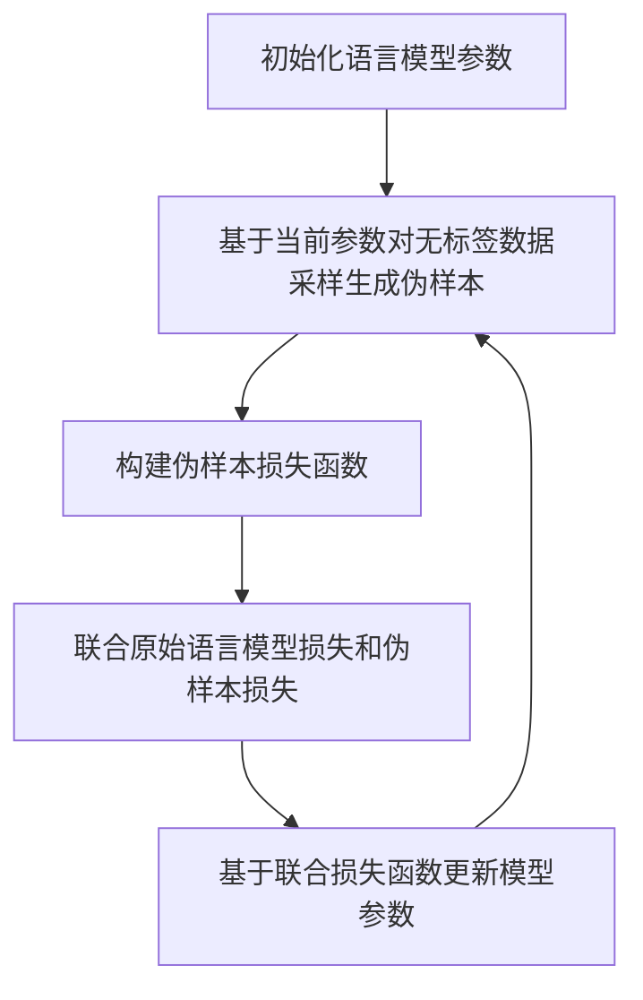

# 大语言模型原理基础与前沿 基于自我反馈进行迭代优化

## 1. 背景介绍
### 1.1 大语言模型概述
大语言模型(Large Language Model, LLM)是近年来自然语言处理(NLP)领域最为瞩目的研究方向之一。LLM 通过在海量文本语料上进行预训练,学习到丰富的语言知识和常识,可以应用于各种下游 NLP 任务,如问答、对话、文本分类、机器翻译等,在提升模型性能和泛化能力方面取得了重大突破。

### 1.2 自我反馈优化的意义
尽管 LLM 展现出了强大的语言理解和生成能力,但仍面临着诸多挑战,如训练和推理的高昂计算开销、模型泛化和鲁棒性不足、缺乏可解释性等。其中一个关键问题是,现有的 LLM 大多采用基于监督学习的预训练范式,难以充分利用模型自身已经学到的知识。为了进一步提升 LLM 的性能和效率,亟需探索创新的训练优化方法。

自我反馈优化(Self-Feedback Optimization)是一种全新的迭代式训练范式,旨在充分挖掘 LLM 的内在潜力。通过引入模型自身生成的伪样本作为新的训练数据,利用模型的输出反过来指导和优化模型,从而实现闭环的自我强化学习。这种范式有望在不增加外部监督数据的情况下,持续提升模型性能,并减少对人工标注数据的依赖。

### 1.3 本文的主要内容
本文将重点探讨大语言模型中基于自我反馈优化的最新研究进展。首先,我们将介绍 LLM 的核心概念、基本架构以及面临的关键挑战。其次,详细阐述自我反馈优化的基本原理、核心算法和关键实现技术。然后,通过实际项目案例和代码实践,演示如何将自我反馈优化应用于 LLM 的训练流程。最后,展望 LLM 结合自我反馈优化的未来发展方向和应用前景。

## 2. 核心概念与联系
### 2.1 语言模型与预训练范式
语言模型是 NLP 的核心,旨在学习语言的内在统计规律和结构特征。传统的语言模型大多基于 n-gram 等方法,难以捕捉长距离依赖和语义信息。近年来,深度学习特别是 Transformer 等注意力机制为语言模型带来了革命性变革。

预训练是当前 NLP 的主流范式,通过在大规模无标注语料上进行自监督学习,让模型习得通用的语言表示。代表性的预训练模型有 BERT、GPT、T5 等,展现出了强大的迁移学习能力,可以应用于下游的各种 NLP 任务。

### 2.2 大语言模型的特点与挑战  
LLM 是预训练语言模型的进一步延伸和发展,具有参数量大(数十亿到上万亿)、训练语料丰富(TB 到 PB 级)、学习能力强(涵盖语法、语义、常识、推理等多个层面)等特点。代表性的 LLM 包括 GPT-3、PaLM、Megatron-Turing NLG 等。

但 LLM 的训练和应用也面临诸多挑战:
1. 计算资源要求高,训练成本昂贵
2. 模型体积庞大,推理速度慢
3. 泛化能力有限,容易过拟合
4. 鲁棒性不足,容易受对抗样本攻击
5. 可解释性差,难以分析内部工作机制
6. 难以持续学习,需要大量人工标注数据

因此,亟需创新的优化方法来进一步提升 LLM 的性能和效率。

### 2.3 自我反馈优化的核心思想
自我反馈优化的核心思想是:利用模型自身生成的伪样本,构建新的损失函数,引导模型学习自我修正和强化,从而在无需额外标注数据的情况下持续提升性能。

具体来说,自我反馈优化包含三个关键步骤:
1. 伪样本生成:利用模型自身在无标签数据上的输出,构建伪样本
2. 损失函数设计:基于伪样本,设计反映模型优劣的损失函数 
3. 参数更新:基于损失函数,更新模型参数,实现自我强化

通过迭代执行上述三个步骤,模型可以不断挖掘自身已学知识,实现闭环的自我进化。

## 3. 核心算法原理具体操作步骤
自我反馈优化可以用于 LLM 的预训练和微调阶段,下面我们以预训练为例,详细介绍其核心算法原理和具体操作步骤。

### 3.1 原始的语言模型预训练
传统的语言模型预训练通常基于自回归或自编码的框架。以 GPT 为例,其预训练目标是最大化文本序列 $x=(x_1,\dots,x_T)$ 的似然概率:

$$\mathcal{L}_{\text{LM}}=-\sum_{t=1}^T \log p(x_t|x_{<t})$$

其中 $p(x_t|x_{<t})=\text{softmax}(h_t^TW_e)$, $h_t$ 是第 $t$ 个 token 的隐藏层表示,$W_e$ 是词嵌入矩阵。

### 3.2 引入自我反馈信号 
自我反馈优化的关键是利用模型自身的输出作为伪样本,引入新的损失函数。具体步骤如下:

1. 伪样本生成:在每个训练步骤,基于当前模型参数 $\theta$,对一批无标签数据 $\mathcal{X}$ 进行采样,得到伪样本 $\hat{x}$。采样策略可以是贪心搜索、束搜索或随机采样等。

2. 构建伪样本损失:基于伪样本 $\hat{x}$,构建新的损失函数 $\mathcal{L}_{\text{pseudo}}$。一种常见的做法是最小化伪样本和原始样本的交叉熵:

$$\mathcal{L}_{\text{pseudo}}=-\sum_{t=1}^T \hat{x}_t \log p(x_t|x_{<t})$$

直观地,这个损失函数惩罚了伪样本和真实样本的差异,促使模型向着更贴近真实数据分布的方向优化。

3. 联合优化目标:将原始的语言模型损失和伪样本损失结合,得到新的联合优化目标:

$$\mathcal{L}=\lambda\mathcal{L}_{\text{LM}} + (1-\lambda)\mathcal{L}_{\text{pseudo}}$$

其中 $\lambda \in (0,1)$ 为平衡两个损失的权重系数。

4. 参数更新:基于联合优化目标,对模型参数 $\theta$ 执行梯度下降更新:

$$\theta \leftarrow \theta - \eta \nabla_{\theta} \mathcal{L}$$

其中 $\eta$ 为学习率。

通过迭代执行上述步骤,模型可以持续学习和强化,不断提升语言建模和生成的质量。

### 3.3 算法流程总结
下面我们用一个 Mermaid 流程图来直观地总结自我反馈优化在 LLM 预训练中的核心算法流程:



## 4. 数学模型和公式详细讲解举例说明
在本节,我们将详细讲解自我反馈优化中涉及的几个关键数学模型和公式,并给出具体的举例说明。

### 4.1 语言模型的概率公式
如前所述,语言模型的目标是估计一个文本序列 $x=(x_1,\dots,x_T)$ 的概率。根据概率论的链式法则,这个概率可以分解为:

$$p(x)=\prod_{t=1}^T p(x_t|x_{<t})$$

其中 $p(x_t|x_{<t})$ 表示在给定前 $t-1$ 个 token 的条件下,第 $t$ 个 token 为 $x_t$ 的条件概率。语言模型的任务就是学习这个条件概率分布。

以 GPT 为例,它使用 Transformer 的解码器结构来建模这个条件概率:

$$p(x_t|x_{<t})=\text{softmax}(h_t^TW_e)$$

其中 $h_t$ 是第 $t$ 个 token 的隐藏层表示,$W_e$ 是词嵌入矩阵。$h_t$ 的计算公式为:

$$h_t=\text{Transformer}(x_{<t})$$

直观地,Transformer 编码了输入序列 $x_{<t}$ 的上下文信息,从而可以预测下一个 token $x_t$。

### 4.2 交叉熵损失函数
在训练语言模型时,我们通常使用交叉熵损失函数来衡量模型预测的条件概率分布与真实数据分布之间的差异。对于一个长度为 $T$ 的文本序列 $x$,其交叉熵损失定义为:

$$\mathcal{L}_{\text{LM}}=-\sum_{t=1}^T \log p(x_t|x_{<t})$$

这个损失函数可以理解为模型在每个位置上的预测与真实 token 之间的负对数似然。最小化交叉熵损失等价于最大化文本序列的似然概率。

举个例子,假设一个文本序列为 "I love machine learning",模型在第三个位置上的预测概率分布为:

$$p(x_3|x_{<3})=[0.1, 0.2, 0.5, 0.2]$$

其中第三个位置对应 "machine" 这个词。那么在这个位置上的交叉熵损失为:

$$-\log p(x_3=\text{machine}|x_{<3})=-\log 0.5 \approx 0.69$$

直观地,如果模型对正确答案的预测概率越高,损失就越小;反之则损失越大。

### 4.3 伪样本损失函数
在自我反馈优化中,我们利用模型自身生成的伪样本 $\hat{x}$ 来构建新的损失函数 $\mathcal{L}_{\text{pseudo}}$,用于衡量伪样本与真实样本之间的差异。一种常见的做法是最小化伪样本和原始样本的交叉熵:

$$\mathcal{L}_{\text{pseudo}}=-\sum_{t=1}^T \hat{x}_t \log p(x_t|x_{<t})$$

这里 $\hat{x}_t$ 是伪样本在第 $t$ 个位置上的 token,$p(x_t|x_{<t})$ 是基于原始数据训练的语言模型在第 $t$ 个位置上的预测概率。

直观地,这个损失函数惩罚了伪样本与真实样本的不一致性。如果伪样本越接近真实数据分布,那么语言模型对伪样本的预测概率就越高,损失就越小;反之则损失越大。

举个例子,假设原始样本为 "I love machine learning",语言模型对其第三个位置 "machine" 的预测概率为0.5。现在模型生成了一个伪样本 "I love deep learning",其第三个位置为 "deep"。假设语言模型对 "deep" 的预测概率为0.3,那么在这个位置上的伪样本损失为:

$$-\mathbf{1}(\hat{x}_3=\text{deep}) \log p(x_3=\text{machine}|x_{<3})=-1 \times \log 0.5 \approx 0.69$$

可以看到,由于伪样本与原始样本在第三个位置上的 token 不一致("deep" vs. "machine"),导致了较大的损失值。这促使模型去学习生成与真实样本更相似的伪样本。

## 5. 项目实践：代码实例和详细解释说明
下面我们通过一个简化的代码实例,演示如何将自我反馈优化应用于 GPT 模型的预训练过程。

```python
import torch
import torch.nn as nn
import torch.optim as optim

class GPT(nn.Module):
    def __init__(self, vocab_size, hidden_size,