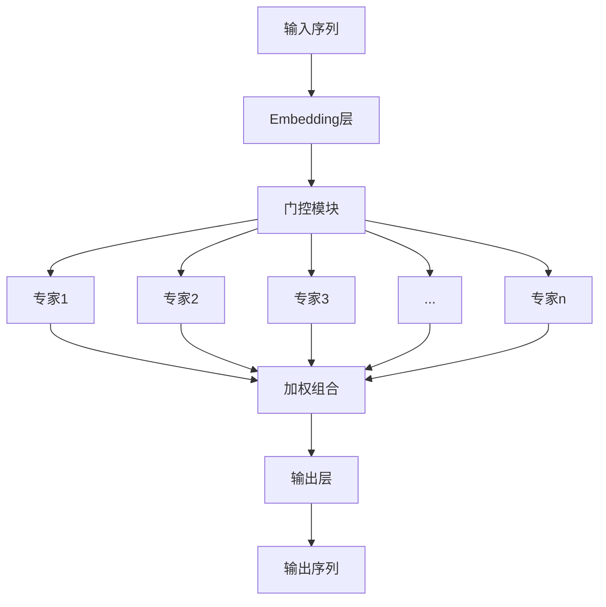

# 大语言模型原理基础与前沿 每个词元选择top-k个专家

## 1.背景介绍

### 1.1 大语言模型的兴起

近年来,随着深度学习技术的飞速发展,大型神经网络模型在自然语言处理(NLP)领域取得了令人瞩目的成就。其中,大型语言模型(Large Language Model,LLM)凭借其强大的文本生成和理解能力,成为了NLP领域的关键突破。

传统的NLP系统往往基于规则或统计方法,需要大量的人工特征工程,且难以捕捉语言的深层次语义。而大型语言模型通过在海量文本数据上进行自监督预训练,能够自动学习语言的内在规律和语义表示,从而在下游任务中表现出卓越的性能。

### 1.2 大语言模型的挑战

尽管大型语言模型取得了巨大成功,但它们也面临着一些挑战和局限性。其中,模型的计算复杂度和内存需求是一个主要瓶颈。随着模型规模的不断扩大,训练和推理过程变得越来越昂贵和低效。此外,大型语言模型往往存在一致性和可解释性差的问题,生成的文本可能包含矛盾或不合理的内容。

为了应对这些挑战,研究人员提出了多种优化和改进方法,其中一种创新性的方法就是"每个词元选择top-k个专家"(Mixture of Experts,MoE)。这种方法旨在提高模型的计算效率和可扩展性,同时保持或提升模型性能。

## 2.核心概念与联系

### 2.1 Mixture of Experts(MoE)概念

Mixture of Experts(MoE)是一种机器学习模型架构,它将整个模型分解为多个专家(expert)模块,每个专家模块负责处理输入数据的一个子集。在推理过程中,一个门控(gating)模块会根据输入数据选择最合适的专家模块,并将它们的输出进行加权组合,得到最终的预测结果。

MoE架构的核心思想是将复杂的任务分解为多个相对简单的子任务,由不同的专家模块专门处理。这种分而治之的策略可以提高模型的计算效率和可扩展性,因为在任何给定的时间点,只有一小部分专家模块需要被激活和计算。

### 2.2 MoE在大语言模型中的应用

在大型语言模型中,MoE架构被用于优化模型的计算和内存效率。具体来说,每个词元(token)的表示会被送入一个门控模块,该模块会根据词元的上下文信息选择一组top-k个最相关的专家模块。然后,这些专家模块会并行地处理该词元的表示,生成相应的输出。最后,门控模块会将这些输出进行加权组合,得到该词元的最终表示。

通过这种方式,大型语言模型可以在保持性能的同时,显著降低计算和内存需求。因为在任何给定的时间点,只有一小部分专家模块需要被激活和计算,从而避免了对所有参数进行计算的需求。

## 3.核心算法原理具体操作步骤

### 3.1 MoE语言模型的整体架构

MoE语言模型的整体架构可以分为三个主要部分:输入embedding层、MoE层和输出层。

1. 输入embedding层: 将输入序列(如文本)转换为向量表示。
2. MoE层:
   - 门控模块: 根据输入向量选择top-k个最相关的专家模块。
   - 专家模块: 并行处理输入向量,生成相应的输出向量。
   - 加权组合: 将专家模块的输出进行加权组合,得到最终的向量表示。
3. 输出层: 将MoE层的输出向量映射到目标空间(如下一个词的概率分布)。

### 3.2 门控模块的工作原理

门控模块是MoE架构中的关键部分,它决定了哪些专家模块应该被激活和计算。门控模块的工作原理如下:

1. 计算输入向量与每个专家模块的相关性分数。
2. 选择top-k个相关性分数最高的专家模块。
3. 将输入向量发送给选定的专家模块进行计算。
4. 收集专家模块的输出,并根据相关性分数进行加权组合。

门控模块通常使用一个小型的前馈神经网络来计算相关性分数。具体来说,给定输入向量 $\boldsymbol{x}$ 和第 $i$ 个专家模块的权重向量 $\boldsymbol{w}_i$,相关性分数 $s_i$ 可以计算如下:

$$s_i = \boldsymbol{w}_i^\top \boldsymbol{x} + b_i$$

其中 $b_i$ 是一个可学习的偏置项。然后,门控模块选择具有最高 $k$ 个相关性分数的专家模块进行计算。

### 3.3 专家模块的设计

专家模块是MoE架构中执行实际计算的部分。每个专家模块通常是一个前馈神经网络或transformer编码器,它接收输入向量并生成相应的输出向量。

专家模块的设计需要考虑以下几个因素:

1. **专家模块的数量**: 专家模块的数量决定了模型的并行度和计算效率。一般来说,专家模块的数量应该比选择的top-k值大得多,以确保足够的专家多样性。
2. **专家模块的容量**: 每个专家模块的容量(如层数和隐藏单元数)应该根据任务的复杂度和可用计算资源进行调整。过大的专家模块可能会导致过拟合,而过小的专家模块可能无法学习到足够的表示能力。
3. **专家模块的初始化**: 专家模块的初始化策略对模型的收敛性和性能有重要影响。一种常见的做法是使用相同的初始化权重,然后在训练过程中让专家模块自动分化。
4. **专家模块的正则化**: 为了防止过拟合和提高泛化能力,可以在专家模块中应用dropout、权重衰减等正则化技术。

### 3.4 加权组合策略

在MoE架构中,门控模块选择的top-k个专家模块的输出需要进行加权组合,以得到最终的向量表示。加权组合策略对模型的性能和计算效率有重要影响。

常见的加权组合策略包括:

1. **相关性分数加权**: 使用门控模块计算的相关性分数作为权重,对专家模块的输出进行加权求和。这是最直接的方式,但可能会导致权重分布不均匀。
2. **softmax加权**: 将相关性分数通过softmax函数转换为概率分布,然后使用这些概率作为权重进行加权求和。这种方式可以确保权重的和为1,但可能会导致权重分布过于集中。
3. **学习加权**: 引入可学习的加权参数,在训练过程中同时优化这些参数和模型参数。这种方式更加灵活,但也增加了训练的复杂度。

除了加权组合策略,还需要考虑如何高效地实现加权组合操作。一种常见的做法是利用稀疏张量运算,只计算选定的top-k个专家模块的输出,从而减少计算开销。

## 4.数学模型和公式详细讲解举例说明

### 4.1 MoE语言模型的数学表示

为了更好地理解MoE语言模型的工作原理,我们可以使用数学符号对其进行形式化描述。

假设输入序列为 $\boldsymbol{X} = (\boldsymbol{x}_1, \boldsymbol{x}_2, \dots, \boldsymbol{x}_T)$,其中 $\boldsymbol{x}_t$ 表示第 $t$ 个词元的embedding向量。我们的目标是预测下一个词元 $\boldsymbol{y}_{t+1}$ 的概率分布 $P(\boldsymbol{y}_{t+1} | \boldsymbol{X})$。

在MoE语言模型中,我们首先使用门控模块计算每个词元与专家模块的相关性分数:

$$\boldsymbol{s}_t = f_\text{gate}(\boldsymbol{x}_t, \boldsymbol{W}_\text{gate})$$

其中 $f_\text{gate}$ 是门控模块的函数(通常是一个前馈神经网络), $\boldsymbol{W}_\text{gate}$ 是门控模块的参数。$\boldsymbol{s}_t$ 是一个向量,其第 $i$ 个元素表示第 $t$ 个词元与第 $i$ 个专家模块的相关性分数。

然后,我们选择top-k个相关性分数最高的专家模块,并将输入向量 $\boldsymbol{x}_t$ 发送给这些专家模块进行计算:

$$\boldsymbol{z}_t^{(i)} = f_\text{expert}^{(i)}(\boldsymbol{x}_t, \boldsymbol{W}_\text{expert}^{(i)})$$

其中 $f_\text{expert}^{(i)}$ 是第 $i$ 个专家模块的函数(如前馈神经网络或transformer编码器), $\boldsymbol{W}_\text{expert}^{(i)}$ 是第 $i$ 个专家模块的参数, $\boldsymbol{z}_t^{(i)}$ 是第 $i$ 个专家模块对输入 $\boldsymbol{x}_t$ 的输出向量。

接下来,我们使用加权组合策略将专家模块的输出进行融合,得到最终的向量表示 $\boldsymbol{h}_t$:

$$\boldsymbol{h}_t = \sum_{i \in \text{top-k}} \alpha_t^{(i)} \boldsymbol{z}_t^{(i)}$$

其中 $\alpha_t^{(i)}$ 是第 $i$ 个专家模块的权重,可以根据相关性分数或其他策略进行计算。

最后,我们将 $\boldsymbol{h}_t$ 输入到输出层,预测下一个词元的概率分布:

$$P(\boldsymbol{y}_{t+1} | \boldsymbol{X}) = f_\text{output}(\boldsymbol{h}_t, \boldsymbol{W}_\text{output})$$

其中 $f_\text{output}$ 是输出层的函数(如softmax层), $\boldsymbol{W}_\text{output}$ 是输出层的参数。

在训练过程中,我们可以使用最大似然估计或其他目标函数,通过反向传播算法优化模型参数 $\boldsymbol{W}_\text{gate}$, $\boldsymbol{W}_\text{expert}^{(i)}$ 和 $\boldsymbol{W}_\text{output}$。

### 4.2 门控模块的数学模型

门控模块是MoE语言模型中的关键部分,它决定了哪些专家模块应该被激活和计算。我们可以使用数学符号对门控模块的工作原理进行描述。

假设输入向量为 $\boldsymbol{x}$,门控模块需要计算每个专家模块与输入向量的相关性分数。对于第 $i$ 个专家模块,相关性分数 $s_i$ 可以表示为:

$$s_i = \boldsymbol{w}_i^\top \boldsymbol{x} + b_i$$

其中 $\boldsymbol{w}_i$ 是第 $i$ 个专家模块的权重向量, $b_i$ 是一个可学习的偏置项。

为了选择top-k个相关性分数最高的专家模块,我们可以对相关性分数进行排序,并选择前 $k$ 个最大值对应的专家模块。这个过程可以用数学符号表示为:

$$\text{top-k} = \text{argtopk}(\boldsymbol{s}, k)$$

其中 $\boldsymbol{s}$ 是所有专家模块的相关性分数向量, $\text{argtopk}$ 是一个函数,它返回 $\boldsymbol{s}$ 中最大的 $k$ 个元素对应的索引。

在加权组合阶段,我们需要对选定的top