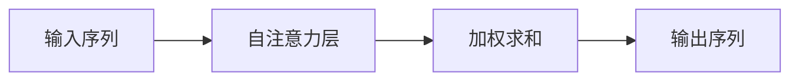

# 大语言模型原理基础与前沿 评估语言模型

## 1. 背景介绍

随着人工智能技术的飞速发展，大型语言模型（Large Language Models，LLMs）已成为自然语言处理（NLP）领域的重要研究方向。从早期的统计机器翻译到现在的深度学习模型，语言模型的发展历程反映了计算机对人类语言理解能力的逐步提升。特别是近年来，随着计算能力的增强和数据量的爆炸式增长，基于Transformer架构的模型如GPT-3、BERT等在多项NLP任务中取得了令人瞩目的成绩。

## 2. 核心概念与联系

### 2.1 语言模型的定义
语言模型是用于计算一段文本序列出现概率的模型，它能够捕捉语言的统计规律，为诸如文本生成、机器翻译、语音识别等任务提供基础。

### 2.2 大语言模型的特点
大语言模型通常指的是参数量巨大、训练数据庞大、计算资源密集的语言模型。这类模型通常具有更好的泛化能力和更强的语言理解能力。

### 2.3 Transformer架构
Transformer架构是当前大型语言模型的核心，它通过自注意力（Self-Attention）机制有效地处理序列数据，捕捉长距离依赖关系。

## 3. 核心算法原理具体操作步骤

### 3.1 自注意力机制
自注意力机制通过计算序列中各个元素之间的关系，为每个元素分配不同的权重，从而实现对信息的动态编码。



### 3.2 多头注意力
多头注意力是将自注意力分为多个“头”，每个头学习序列的不同部分，然后将结果拼接起来，增强模型的表达能力。

### 3.3 位置编码
由于自注意力机制本身不具备捕捉位置信息的能力，位置编码通过向输入序列中添加位置信息，使模型能够理解词语的顺序。

## 4. 数学模型和公式详细讲解举例说明

### 4.1 自注意力公式
$$
\text{Attention}(Q, K, V) = \text{softmax}\left(\frac{QK^T}{\sqrt{d_k}}\right)V
$$
其中，$Q,K,V$ 分别代表查询（Query）、键（Key）、值（Value），$d_k$ 是键的维度。

### 4.2 位置编码公式
$$
PE_{(pos,2i)} = \sin(pos/10000^{2i/d_{model}})
$$
$$
PE_{(pos,2i+1)} = \cos(pos/10000^{2i/d_{model}})
$$
其中，$pos$ 是位置，$i$ 是维度，$d_{model}$ 是模型的维度。

## 5. 项目实践：代码实例和详细解释说明

### 5.1 Transformer模型构建
以下是一个简化的Transformer模型构建代码示例，使用PyTorch框架。

```python
import torch
import torch.nn as nn
import torch.nn.functional as F

class TransformerModel(nn.Module):
    def __init__(self, ntoken, ninp, nhead, nhid, nlayers, dropout=0.5):
        super(TransformerModel, self).__init__()
        from torch.nn import TransformerEncoder, TransformerEncoderLayer
        self.model_type = 'Transformer'
        self.pos_encoder = PositionalEncoding(ninp, dropout)
        encoder_layers = TransformerEncoderLayer(ninp, nhead, nhid, dropout)
        self.transformer_encoder = TransformerEncoder(encoder_layers, nlayers)
        self.encoder = nn.Embedding(ntoken, ninp)
        self.ninp = ninp
        self.decoder = nn.Linear(ninp, ntoken)

        self.init_weights()

    def generate_square_subsequent_mask(self, sz):
        mask = (torch.triu(torch.ones(sz, sz)) == 1).transpose(0, 1)
        mask = mask.float().masked_fill(mask == 0, float('-inf')).masked_fill(mask == 1, float(0.0))
        return mask

    def init_weights(self):
        initrange = 0.1
        self.encoder.weight.data.uniform_(-initrange, initrange)
        self.decoder.bias.data.zero_()
        self.decoder.weight.data.uniform_(-initrange, initrange)

    def forward(self, src, src_mask):
        src = self.encoder(src) * math.sqrt(self.ninp)
        src = self.pos_encoder(src)
        output = self.transformer_encoder(src, src_mask)
        output = self.decoder(output)
        return output
```

### 5.2 位置编码实现
```python
class PositionalEncoding(nn.Module):
    def __init__(self, d_model, dropout=0.1, max_len=5000):
        super(PositionalEncoding, self).__init__()
        self.dropout = nn.Dropout(p=dropout)

        pe = torch.zeros(max_len, d_model)
        position = torch.arange(0, max_len, dtype=torch.float).unsqueeze(1)
        div_term = torch.exp(torch.arange(0, d_model, 2).float() * (-math.log(10000.0) / d_model))
        pe[:, 0::2] = torch.sin(position * div_term)
        pe[:, 1::2] = torch.cos(position * div_term)
        pe = pe.unsqueeze(0).transpose(0, 1)
        self.register_buffer('pe', pe)

    def forward(self, x):
        x = x + self.pe[:x.size(0), :]
        return self.dropout(x)
```

## 6. 实际应用场景

大型语言模型在多个领域都有广泛的应用，包括但不限于：

### 6.1 机器翻译
利用语言模型的强大生成能力，实现高质量的机器翻译。

### 6.2 文本生成
从新闻撰写到创意写作，语言模型能够生成连贯、有逻辑的文本。

### 6.3 问答系统
通过理解自然语言问题并提供准确答案，语言模型在问答系统中扮演着关键角色。

## 7. 工具和资源推荐

为了更好地研究和使用大型语言模型，以下是一些推荐的工具和资源：

### 7.1 Hugging Face Transformers
一个广泛使用的开源库，提供了多种预训练语言模型的实现。

### 7.2 TensorFlow和PyTorch
这两个深度学习框架是研究和部署语言模型的主要工具。

### 7.3 OpenAI API
提供了GPT-3等模型的API接口，方便开发者进行应用集成。

## 8. 总结：未来发展趋势与挑战

大型语言模型的发展前景广阔，但也面临着诸多挑战，如计算资源的巨大需求、模型的可解释性、以及伦理和偏见问题。未来的研究将致力于提高模型的效率、透明度和公平性。

## 9. 附录：常见问题与解答

### 9.1 如何评估语言模型的性能？
通常通过困惑度（Perplexity）、BLEU分数等指标来评估语言模型的性能。

### 9.2 大型语言模型训练的成本如何？
训练大型语言模型需要大量的计算资源和电力，成本非常高昂。

### 9.3 如何解决模型偏见问题？
通过多样化的数据集、公平性评估和模型修正等方法来减少模型偏见。

作者：禅与计算机程序设计艺术 / Zen and the Art of Computer Programming