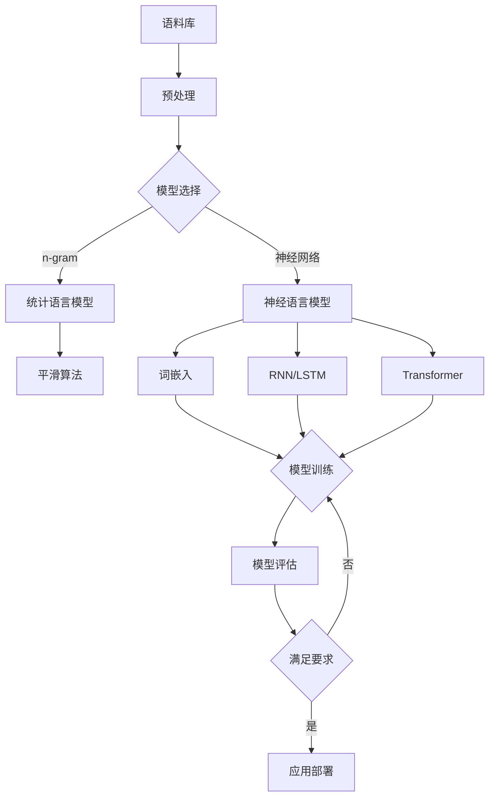

# 大语言模型原理基础与前沿 语言模型和分词

## 1. 背景介绍
### 1.1 大语言模型的发展历程
### 1.2 语言模型在自然语言处理中的重要性
### 1.3 分词在语言模型中的作用

## 2. 核心概念与联系
### 2.1 语言模型
#### 2.1.1 定义与目的
#### 2.1.2 n-gram语言模型
#### 2.1.3 神经网络语言模型
### 2.2 分词
#### 2.2.1 中文分词的难点
#### 2.2.2 分词算法分类
#### 2.2.3 分词与语言模型的关系
### 2.3 大语言模型
#### 2.3.1 Transformer架构
#### 2.3.2 预训练与微调
#### 2.3.3 主流大语言模型介绍

## 3. 核心算法原理具体操作步骤
### 3.1 基于统计的分词算法
#### 3.1.1 基于字符串匹配的分词
#### 3.1.2 基于n-gram的分词
#### 3.1.3 基于HMM的分词
### 3.2 基于深度学习的分词算法
#### 3.2.1 基于BiLSTM-CRF的分词
#### 3.2.2 基于Transformer的分词
### 3.3 大语言模型的训练流程
#### 3.3.1 数据准备与预处理
#### 3.3.2 模型构建与训练
#### 3.3.3 模型评估与优化

## 4. 数学模型和公式详细讲解举例说明
### 4.1 n-gram语言模型的数学表示
### 4.2 神经网络语言模型的数学原理
#### 4.2.1 词嵌入
#### 4.2.2 RNN语言模型
#### 4.2.3 Transformer语言模型
### 4.3 分词算法中的数学原理
#### 4.3.1 HMM分词的数学推导
#### 4.3.2 CRF分词的数学推导

## 5. 项目实践：代码实例和详细解释说明
### 5.1 基于jieba的中文分词实践
### 5.2 基于BERT的中文分词实践
### 5.3 使用GPT-3进行文本生成实践

## 6. 实际应用场景
### 6.1 搜索引擎中的应用
### 6.2 智能问答系统中的应用
### 6.3 机器翻译中的应用
### 6.4 文本分类与情感分析中的应用

## 7. 工具和资源推荐
### 7.1 主流分词工具
#### 7.1.1 jieba
#### 7.1.2 THULAC
#### 7.1.3 LTP
### 7.2 主流大语言模型及其开源实现
#### 7.2.1 BERT
#### 7.2.2 GPT系列
#### 7.2.3 T5
### 7.3 相关学习资源
#### 7.3.1 论文
#### 7.3.2 教程
#### 7.3.3 开源项目

## 8. 总结：未来发展趋势与挑战
### 8.1 大语言模型的发展趋势
### 8.2 分词技术的发展趋势
### 8.3 面临的挑战与机遇

## 9. 附录：常见问题与解答
### 9.1 如何处理未登录词？
### 9.2 如何平衡分词的召回率和精确率？
### 9.3 大语言模型的训练需要哪些硬件资源？
### 9.4 如何选择适合的大语言模型进行下游任务？

语言模型是自然语言处理领域的重要基础，它旨在通过对大规模语料库的学习，建立一个能够刻画自然语言规律的概率统计模型。传统的语言模型主要基于n-gram等统计方法，通过计算词序列的条件概率来预测下一个词。然而，这类方法难以捕捉长距离依赖关系，且面临数据稀疏问题。

随着深度学习的发展，神经网络语言模型逐渐成为主流。相比传统方法，神经语言模型能够学习词语的分布式表示（词嵌入），并利用RNN、LSTM等结构建模长距离依赖。以Transformer为代表的注意力机制更进一步提升了语言模型的性能，使其能够更好地理解语义信息。

大语言模型是近年来自然语言处理领域的重大突破。它们通过在海量语料上进行预训练，学习到丰富的语言知识，再通过微调适应下游任务。代表模型如BERT、GPT系列、T5等，在多个任务上取得了显著进步。这些模型能够生成连贯、流畅的文本，在问答、对话、摘要等应用中展现出强大的能力。

分词是语言模型的重要预处理步骤，尤其对于中文等没有明显词界标识的语言而言。传统的分词算法主要基于字符串匹配、n-gram统计和HMM等方法。近年来，基于深度学习的分词算法，如BiLSTM-CRF、Transformer等，通过引入上下文信息和端到端学习，进一步提升了分词的准确性。

在实践中，jieba、THULAC、LTP等工具已被广泛应用于中文分词任务。基于大语言模型的分词方法，如BERT-WWM等，能够更好地处理歧义和未登录词。此外，大语言模型在搜索引擎、智能问答、机器翻译、文本分类等场景中发挥着重要作用。

未来，大语言模型将向更大规模、更多语言、更多模态发展。同时，如何提高模型的解释性、减少偏见、保护隐私等也是亟待解决的问题。分词技术将进一步融合知识图谱、情感计算等技术，提供更精准、更智能的文本处理能力。

总之，语言模型和分词技术的发展为自然语言处理领域带来了革命性变化。从传统的统计方法到神经网络，再到大语言模型，我们见证了这一领域的不断进步。展望未来，语言模型和分词技术必将在人工智能的发展中扮演更加重要的角色，为人机交互、知识挖掘等应用提供更强大的支持。

作者：禅与计算机程序设计艺术 / Zen and the Art of Computer Programming