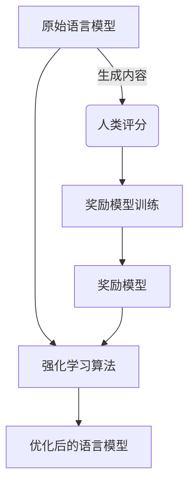
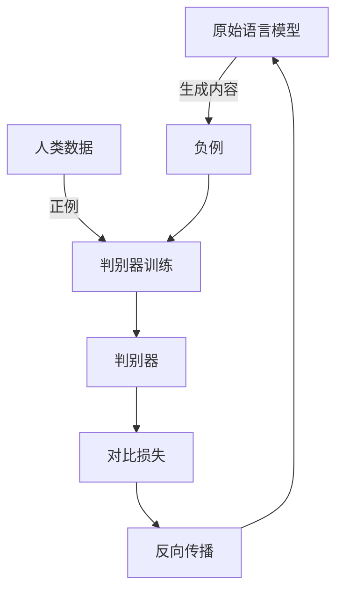
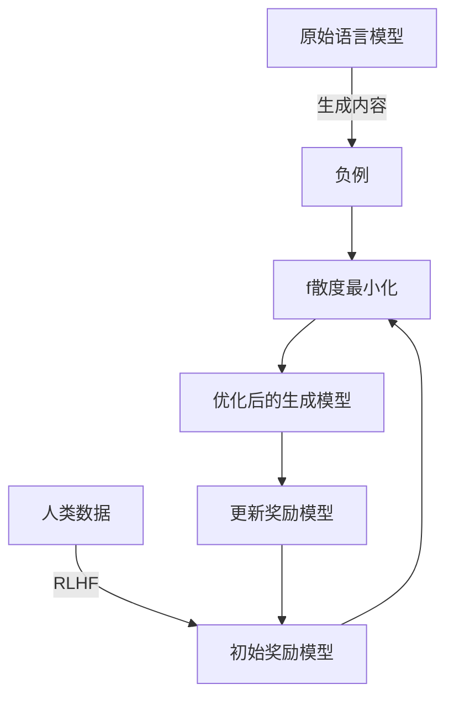

# 大语言模型原理基础与前沿 通过f散度最小化统一RLHF和GDC方法

## 1.背景介绍

### 1.1 大语言模型的兴起

近年来,大型语言模型(Large Language Models, LLMs)在自然语言处理(NLP)领域取得了令人瞩目的成就。这些模型通过在海量文本数据上进行预训练,学习到了丰富的语言知识和上下文信息,从而在下游任务中表现出惊人的泛化能力。

代表性的大语言模型包括GPT-3、PaLM、Chinchilla等,它们在文本生成、问答、总结、翻译等任务中展现出了超越人类的能力。这些模型的出现,推动了人工智能领域的快速发展,为各种应用场景带来了新的可能性。

### 1.2 大语言模型的挑战

尽管取得了巨大的成功,但大语言模型仍然面临着诸多挑战:

1. **可解释性**:大语言模型是一个黑盒子,其内部机理难以解释,存在安全隐患。
2. **可控性**:生成的内容可能包含有害、不当或不合法的内容,缺乏有效的控制机制。
3. **鲁棒性**:模型容易受到对抗性攻击,生成内容的稳定性和一致性有待提高。
4. **效率**:大规模参数和计算量使得模型的部署和应用成本高昂。

为了解决这些挑战,研究人员提出了多种优化和改进方法,其中两种备受关注的方法是RLHF(Reinforcement Learning from Human Feedback)和GDC(Generative Discriminative Contrastive)。

## 2.核心概念与联系

### 2.1 RLHF(Reinforcement Learning from Human Feedback)

RLHF是一种基于人类反馈的强化学习方法,旨在使语言模型生成的内容更加符合人类偏好和价值观。其核心思想是:

1. 收集人类对模型生成内容的评分反馈数据。
2. 使用这些反馈数据训练一个奖励模型(Reward Model),用于评估生成内容的质量。
3. 将奖励模型与原始语言模型结合,通过强化学习算法(如PPO)优化模型参数,使其生成的内容获得更高的奖励分数。

RLHF的优点是可以有效地将人类偏好融入模型,提高生成内容的质量和可控性。但缺点是需要大量的人工标注数据,成本较高,且模型训练过程复杂。

### 2.2 GDC(Generative Discriminative Contrastive)

GDC是一种基于对比学习的方法,通过最大化模型生成内容与人类生成内容之间的对比损失,来提高模型的生成质量。其核心步骤包括:

1. 收集人类生成的高质量文本作为正例。
2. 使用原始语言模型生成文本作为负例。
3. 训练一个判别器(Discriminator)来区分正负例。
4. 将判别器的梯度反向传播到生成模型,最小化正负例的对比损失,从而提高生成质量。

GDC的优点是无需人工标注数据,可以自动从人类数据中学习偏好,训练过程相对简单。但缺点是生成质量的提升有限,且存在模式崩溃(Mode Collapse)的风险。

### 2.3 f散度最小化统一RLHF和GDC

RLHF和GDC分别解决了大语言模型的不同挑战,但它们之间存在一定的矛盾和冲突。为了统一这两种方法的优点,研究人员提出了一种基于f散度最小化的新方法。

f散度(f-Divergence)是一种衡量两个概率分布差异的统计量,它可以用于度量模型生成分布与目标分布(人类偏好分布)之间的差距。通过最小化f散度,我们可以使模型生成分布尽可能地接近目标分布,从而实现RLHF和GDC的目标。

具体来说,该方法的核心思路是:

1. 使用RLHF方法训练一个初始的奖励模型,作为目标分布的近似。
2. 将f散度最小化作为目标函数,通过对比学习的方式训练生成模型,使其生成分布逼近奖励模型所描述的目标分布。
3. 迭代地交替优化奖励模型和生成模型,直至收敛。

该方法结合了RLHF和GDC的优点,可以有效地将人类偏好融入模型,同时避免了大量人工标注的成本。此外,它还提供了一个统一的理论框架,有助于深入理解和分析这两种方法的本质联系。

## 3.核心算法原理具体操作步骤

### 3.1 RLHF训练初始奖励模型

第一步是使用RLHF方法训练一个初始的奖励模型,作为目标分布的近似。具体步骤如下:

1. **收集人类评分数据**:让人类对模型生成的文本进行评分,构建一个评分数据集。
2. **训练奖励模型**:使用评分数据集训练一个奖励模型,该模型能够预测给定文本的人类评分。
3. **强化学习优化**:将奖励模型与原始语言模型结合,通过强化学习算法(如PPO)优化模型参数,使其生成的内容获得更高的奖励分数。

经过这一步骤,我们得到了一个初始的奖励模型,它可以近似地描述人类对于高质量文本的偏好。

### 3.2 f散度最小化对比学习

接下来,我们将f散度最小化作为目标函数,通过对比学习的方式训练生成模型,使其生成分布逼近奖励模型所描述的目标分布。具体步骤如下:

1. **采样负例**:使用原始语言模型生成一批文本作为负例。
2. **采样正例**:从人类数据中采样一批高质量文本作为正例。
3. **计算f散度**:使用奖励模型对正负例进行评分,计算它们与目标分布之间的f散度。
4. **对比学习优化**:将f散度作为损失函数,通过对比学习算法(如对抗训练)优化生成模型的参数,使其生成分布尽可能地接近目标分布。

通过上述步骤,我们可以使生成模型的输出逐渐符合人类偏好,同时避免了大量人工标注的成本。

### 3.3 迭代优化

为了进一步提高模型的性能,我们可以交替优化奖励模型和生成模型,形成一个迭代的过程:

1. 使用优化后的生成模型生成新的文本样本。
2. 让人类对这些样本进行评分,更新奖励模型。
3. 使用更新后的奖励模型作为新的目标分布,重复步骤3.2进行对比学习优化生成模型。
4. 迭代上述过程,直至模型收敛。

通过这种方式,奖励模型和生成模型可以相互促进,逐步逼近真实的人类偏好分布,从而获得更高质量的生成结果。

## 4.数学模型和公式详细讲解举例说明

### 4.1 f散度

f散度是一种衡量两个概率分布差异的统计量,它是通过一个凸函数f来定义的。给定两个概率分布P和Q,它们的f散度定义为:

$$D_f(P||Q) = \int_\Omega Q(x)f\left(\frac{P(x)}{Q(x)}\right)dx$$

其中,Ω是样本空间,f是一个凸函数,满足f(1)=0。

常用的f散度包括:

- **KL散度**:当f(x)=xlnx时,得到KL散度(Kullback-Leibler Divergence)。
- **逆KL散度**:当f(x)=-lnx时,得到逆KL散度。
- **Pearson χ^2散度**:当f(x)=(x-1)^2时,得到Pearson χ^2散度。

在本文的方法中,我们使用f散度来衡量模型生成分布P与目标分布Q(由奖励模型近似)之间的差距。通过最小化f散度,我们可以使P尽可能地接近Q,从而实现生成高质量文本的目标。

### 4.2 对比学习目标函数

在对比学习中,我们将f散度最小化作为目标函数,具体形式如下:

$$\min_\theta L(\theta) = D_f(P_\theta||Q)$$

其中,θ是生成模型的参数,P_θ是生成模型的输出分布,Q是由奖励模型近似的目标分布。

为了优化这个目标函数,我们可以使用对抗训练的思路。具体来说,我们引入一个判别器D,其目标是最大化正负例之间的对比损失:

$$\max_D \mathbb{E}_{x\sim P_\theta}[f(D(x))] + \mathbb{E}_{x\sim Q}[f(1-D(x))]$$

根据对抗训练的理论,当判别器D达到最优时,上式的值就等于f散度D_f(P_θ||Q)。因此,我们可以通过最小化这个对比损失来间接地最小化f散度。

具体的优化步骤如下:

1. 从P_θ和Q中分别采样负例和正例。
2. 更新判别器D,使其能够很好地区分正负例。
3. 固定D,反向传播其梯度,更新生成模型P_θ的参数θ,使对比损失最小化。

通过不断迭代上述步骤,生成模型P_θ的输出分布就会逐渐逼近目标分布Q,从而生成高质量的文本。

### 4.3 示例:使用KL散度

为了更好地理解f散度最小化的思路,我们以KL散度为例进行说明。

当f(x)=xlnx时,f散度就变成了KL散度:

$$D_{KL}(P_\theta||Q) = \int_\Omega Q(x)\ln\frac{Q(x)}{P_\theta(x)}dx$$

对应的对比学习目标函数为:

$$\min_\theta L(\theta) = D_{KL}(P_\theta||Q)$$

$$\max_D \mathbb{E}_{x\sim P_\theta}[\ln D(x)] + \mathbb{E}_{x\sim Q}[\ln(1-D(x))]$$

在实际操作中,我们可以使用蒙特卡罗采样来近似计算上述期望,具体步骤如下:

1. 从P_θ中采样一批负例X^-,从Q中采样一批正例X^+。
2. 更新判别器D,使其能够很好地区分X^-和X^+,即最大化:
   $$\frac{1}{m}\sum_{x\in X^-}\ln D(x) + \frac{1}{n}\sum_{x\in X^+}\ln(1-D(x))$$
3. 固定D,反向传播其梯度,更新生成模型P_θ的参数θ,使对比损失最小化:
   $$\frac{1}{m}\sum_{x\in X^-}\ln(1-D(x))$$

通过不断迭代上述步骤,生成模型P_θ的输出分布就会逐渐逼近目标分布Q,从而生成高质量的文本。

## 5.项目实践:代码实例和详细解释说明

为了更好地理解f散度最小化方法的实现细节,我们提供了一个基于PyTorch的代码示例。该示例使用KL散度作为f散度,并基于对抗训练的思路进行优化。

### 5.1 定义模型

首先,