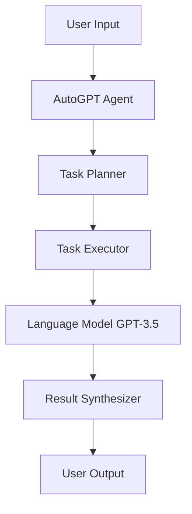

# 大语言模型应用指南：AutoGPT

## 1. 背景介绍
### 1.1 大语言模型的发展历程
#### 1.1.1 早期的语言模型
#### 1.1.2 Transformer的出现
#### 1.1.3 GPT系列模型的演进

### 1.2 AutoGPT的诞生
#### 1.2.1 GPT-3的局限性
#### 1.2.2 AutoGPT的设计理念
#### 1.2.3 AutoGPT的优势

## 2. 核心概念与联系
### 2.1 大语言模型
#### 2.1.1 定义与特点  
#### 2.1.2 训练方法
#### 2.1.3 应用场景

### 2.2 自主代理系统
#### 2.2.1 定义与特点
#### 2.2.2 与传统系统的区别 
#### 2.2.3 AutoGPT中的应用

### 2.3 AutoGPT的系统架构
#### 2.3.1 整体架构图

#### 2.3.2 各模块功能介绍
#### 2.3.3 模块间的交互流程

## 3. 核心算法原理具体操作步骤
### 3.1 Prompt工程
#### 3.1.1 Prompt的构建方法
#### 3.1.2 Few-shot learning
#### 3.1.3 Prompt优化技巧

### 3.2 任务规划算法
#### 3.2.1 基于规则的任务分解
#### 3.2.2 基于强化学习的任务规划
#### 3.2.3 任务依赖关系建模

### 3.3 任务执行流程
#### 3.3.1 任务分发与调度
#### 3.3.2 子任务的执行与监控
#### 3.3.3 任务结果的合成

## 4. 数学模型和公式详细讲解举例说明
### 4.1 Transformer模型
#### 4.1.1 Self-Attention机制
$Attention(Q,K,V) = softmax(\frac{QK^T}{\sqrt{d_k}})V$
#### 4.1.2 Multi-Head Attention
$$MultiHead(Q,K,V) = Concat(head_1, ..., head_h)W^O$$
$$head_i = Attention(QW_i^Q, KW_i^K, VW_i^V)$$
#### 4.1.3 位置编码
$PE_{(pos,2i)} = sin(pos/10000^{2i/d_{model}})$
$PE_{(pos,2i+1)} = cos(pos/10000^{2i/d_{model}})$

### 4.2 强化学习模型 
#### 4.2.1 马尔可夫决策过程
#### 4.2.2 Q-Learning算法
$$Q(s_t,a_t) \leftarrow Q(s_t,a_t)+\alpha[r_{t+1}+\gamma \max_{a}Q(s_{t+1},a)-Q(s_t,a_t)]$$
#### 4.2.3 策略梯度算法
$$\nabla_\theta J(\theta) = \mathbb{E}_{\tau \sim \pi_\theta}[\sum_{t=0}^{T}\nabla_\theta \log \pi_\theta(a_t|s_t)A^{\pi_\theta}(s_t,a_t)]$$

## 5. 项目实践：代码实例和详细解释说明
### 5.1 安装与环境配置
#### 5.1.1 Python环境准备
#### 5.1.2 依赖库的安装
#### 5.1.3 AutoGPT代码获取

### 5.2 AutoGPT的使用示例
#### 5.2.1 定义任务目标
```python
objective = "请写一篇关于AutoGPT的科技博客"
```
#### 5.2.2 配置AutoGPT参数
```python
config = AutoGPTConfig(
  objective=objective, 
  model="gpt-3.5-turbo",
  task_decomposition=True,
  task_decomposition_depth=2,
  task_planning_method="rule_based"
)
```
#### 5.2.3 运行AutoGPT
```python
autogpt = AutoGPT(config)
result = autogpt.run()
print(result)
```

### 5.3 定制化开发
#### 5.3.1 自定义Prompt模板
#### 5.3.2 扩展任务执行器
#### 5.3.3 引入外部工具API

## 6. 实际应用场景
### 6.1 智能写作助手
#### 6.1.1 自动生成文章框架
#### 6.1.2 辅助创作内容
#### 6.1.3 改进文章质量

### 6.2 代码生成与分析
#### 6.2.1 根据需求生成代码
#### 6.2.2 智能代码补全
#### 6.2.3 自动代码审查

### 6.3 智能客服系统
#### 6.3.1 理解用户意图
#### 6.3.2 自动生成回复
#### 6.3.3 个性化服务推荐

## 7. 工具和资源推荐
### 7.1 AutoGPT官方资源
#### 7.1.1 Github仓库
#### 7.1.2 官方文档
#### 7.1.3 示例项目

### 7.2 相关开源项目
#### 7.2.1 LangChain
#### 7.2.2 JARVIS
#### 7.2.3 BabyAGI

### 7.3 学习资料
#### 7.3.1 论文与博客
#### 7.3.2 视频教程
#### 7.3.3 社区与讨论组

## 8. 总结：未来发展趋势与挑战
### 8.1 AutoGPT的优势与局限
#### 8.1.1 自主性与灵活性
#### 8.1.2 可解释性不足
#### 8.1.3 数据安全与隐私

### 8.2 未来发展方向 
#### 8.2.1 多模态AutoGPT
#### 8.2.2 知识增强AutoGPT
#### 8.2.3 人机协作范式

### 8.3 面临的挑战
#### 8.3.1 长期任务规划
#### 8.3.2 因果推理能力
#### 8.3.3 安全性与伦理问题

## 9. 附录：常见问题与解答
### 9.1 AutoGPT与ChatGPT的区别？
### 9.2 如何选择合适的任务分解粒度？
### 9.3 AutoGPT能否用于商业项目？
### 9.4 AutoGPT的训练成本有多高？
### 9.5 如何避免AutoGPT生成有害内容？

作者：禅与计算机程序设计艺术 / Zen and the Art of Computer Programming