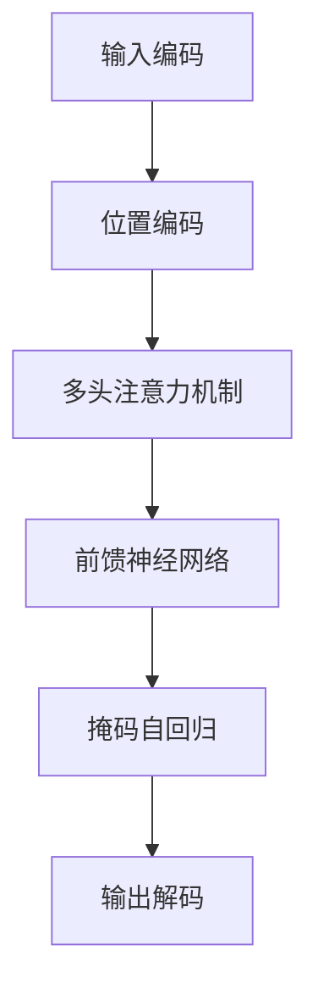

# 大语言模型应用指南：GPT商店介绍

## 1. 背景介绍

在过去几年中,大型语言模型(Large Language Models,LLMs)在自然语言处理(NLP)领域取得了令人瞩目的进展。这些模型通过在海量文本数据上进行预训练,学习了丰富的语言知识和上下文信息,从而能够生成高质量、连贯的文本输出。

其中,OpenAI推出的GPT(Generative Pre-trained Transformer)系列模型,尤其是GPT-3,凭借其惊人的语言生成能力,引发了广泛关注。GPT-3拥有1750亿个参数,是当时最大的语言模型。它能够根据给定的提示(Prompt),生成看似人类编写的文本,包括新闻报道、小说、代码等多种形式。

随着大型语言模型的不断发展,人们开始探索如何将其应用于各种场景,以提高工作效率、降低成本。GPT商店(GPT Store)应运而生,旨在为用户提供基于GPT模型的各种应用和服务,从而充分释放大型语言模型的潜力。

## 2. 核心概念与联系

### 2.1 大型语言模型(LLMs)

大型语言模型是指具有数十亿甚至上千亿参数的神经网络模型,通过在海量文本数据上进行预训练,学习了丰富的语言知识和上下文信息。这些模型能够生成高质量、连贯的文本输出,在自然语言处理任务中表现出色。

### 2.2 GPT(Generative Pre-trained Transformer)

GPT是OpenAI开发的一系列大型语言模型,其中GPT-3是该系列中最知名的模型。GPT模型采用Transformer架构,通过自回归(Autoregressive)方式生成文本,即根据前面的文本预测下一个词或字符。GPT模型的优势在于其强大的语言生成能力,可以根据给定的提示生成看似人类编写的高质量文本。

### 2.3 GPT商店(GPT Store)

GPT商店是一个集成了各种基于GPT模型的应用和服务的平台。它旨在为用户提供便捷的方式,利用GPT模型的强大能力解决实际问题,提高工作效率。GPT商店中的应用涵盖了多个领域,如内容创作、代码生成、问答系统等。用户可以根据自身需求选择合适的应用,或者开发自己的应用并部署到GPT商店。

## 3. 核心算法原理具体操作步骤

GPT模型的核心算法原理是基于Transformer架构和自回归(Autoregressive)生成方式。具体操作步骤如下:

1. **输入编码(Input Encoding)**:将输入文本(如提示)转换为模型可以理解的数字序列,通常采用子词(Subword)编码方式。

2. **位置编码(Positional Encoding)**:由于Transformer模型没有捕捉序列顺序的能力,需要通过位置编码将位置信息注入到输入序列中。

3. **多头注意力机制(Multi-Head Attention)**:模型通过注意力机制捕捉输入序列中不同位置之间的依赖关系,并计算出每个位置的注意力分数。

4. **前馈神经网络(Feed-Forward Neural Network)**:对注意力输出进行非线性变换,提取更高层次的特征表示。

5. **掩码自回归(Masked Autoregressive)**:在生成过程中,模型根据已生成的文本预测下一个词或字符,并将预测结果作为输入,重复该过程直到生成完整的输出序列。

6. **输出解码(Output Decoding)**:将模型生成的数字序列解码为可读的文本输出。

该算法原理通过编码-注意力-解码的过程,实现了高质量的文本生成。值得注意的是,GPT模型还采用了一些技术来提高生成质量和效率,如Top-K/Top-P采样、批生成等。



## 4. 数学模型和公式详细讲解举例说明

GPT模型的核心是基于Transformer架构,其中注意力机制(Attention Mechanism)是关键组成部分。注意力机制能够捕捉输入序列中不同位置之间的依赖关系,并为每个位置分配注意力分数。

在多头注意力机制(Multi-Head Attention)中,注意力计算过程可以表示为:

$$
\begin{aligned}
\text{MultiHead}(Q, K, V) &= \text{Concat}(\text{head}_1, \dots, \text{head}_h)W^O\\
\text{where } \text{head}_i &= \text{Attention}(QW_i^Q, KW_i^K, VW_i^V)
\end{aligned}
$$

其中:

- $Q$、$K$、$V$分别表示查询(Query)、键(Key)和值(Value)矩阵
- $W_i^Q$、$W_i^K$、$W_i^V$是可学习的投影矩阵,用于将$Q$、$K$、$V$投影到不同的子空间
- $\text{Attention}(\cdot)$是计算注意力权重的函数,常用的是缩放点积注意力(Scaled Dot-Product Attention):

$$
\text{Attention}(Q, K, V) = \text{softmax}(\frac{QK^T}{\sqrt{d_k}})V
$$

其中$d_k$是缩放因子,用于避免内积值过大导致梯度消失或爆炸。

在自回归(Autoregressive)生成过程中,GPT模型会根据已生成的文本预测下一个词或字符。这可以通过掩码(Masking)机制实现,即在计算注意力时,将未生成的位置对应的键(Key)和值(Value)设置为0,从而只关注已生成的文本。

例如,假设我们要生成句子"今天天气很好"。在预测"好"这个词时,模型只考虑前面已生成的"今天天气很"作为上下文,忽略未生成的位置。这种掩码自回归(Masked Autoregressive)方式确保了模型只依赖于已知的信息进行预测,从而实现了高质量的文本生成。

## 5. 项目实践:代码实例和详细解释说明

为了更好地理解GPT模型的工作原理,我们可以使用Hugging Face的Transformers库来实现一个简单的文本生成示例。以下是Python代码:

```python
from transformers import GPT2LMHeadModel, GPT2Tokenizer

# 加载预训练模型和分词器
model = GPT2LMHeadModel.from_pretrained('gpt2')
tokenizer = GPT2Tokenizer.from_pretrained('gpt2')

# 设置生成参数
max_length = 100
top_k = 50
top_p = 0.95
num_return_sequences = 1

# 输入提示
prompt = "今天天气很"

# 对提示进行编码
input_ids = tokenizer.encode(prompt, return_tensors='pt')

# 生成文本
output = model.generate(input_ids, max_length=max_length, do_sample=True, top_k=top_k, top_p=top_p, num_return_sequences=num_return_sequences)

# 解码输出
generated_text = tokenizer.decode(output[0], skip_special_tokens=True)

print(f"输入提示: {prompt}")
print(f"生成的文本: {generated_text}")
```

代码解释:

1. 首先,我们加载预训练的GPT-2模型和分词器。
2. 设置生成参数,包括最大生成长度、Top-K采样和Top-P采样等,用于控制生成质量和多样性。
3. 定义输入提示,例如"今天天气很"。
4. 使用分词器将提示编码为模型可以理解的数字序列。
5. 调用模型的`generate`方法,传入编码后的提示和生成参数,获得生成的数字序列。
6. 使用分词器将生成的数字序列解码为可读的文本输出。

运行该代码,您可能会得到类似"今天天气很好,阳光明媚,适合外出活动。"这样的生成结果。

需要注意的是,这只是一个简单的示例,实际应用中可能需要进一步调整生成参数、处理长文本等。但它展示了如何使用Transformers库来利用GPT模型进行文本生成。

## 6. 实际应用场景

GPT商店中的应用涵盖了多个领域,为用户提供了丰富的选择。以下是一些典型的应用场景:

### 6.1 内容创作

利用GPT模型的强大语言生成能力,可以为内容创作者提供辅助,如生成文章大纲、撰写初稿、续写故事情节等。这有助于提高创作效率,克服写作障碍。

### 6.2 代码生成

GPT模型不仅能生成自然语言文本,还能生成编程代码。开发人员可以使用GPT模型来自动生成代码片段、函数或甚至整个程序,从而加快开发速度。

### 6.3 问答系统

GPT模型在理解和生成自然语言方面表现出色,因此可以用于构建智能问答系统。用户可以提出自然语言问题,系统则根据知识库生成相应的回答。

### 6.4 文本摘要

GPT模型能够捕捉文本的语义信息,因此可以用于自动生成文本摘要。这对于处理大量文本数据非常有用,可以提高效率,节省时间。

### 6.5 机器翻译

虽然GPT模型本身不是专门为机器翻译而设计的,但它在语言生成方面的出色表现使其成为一种潜在的翻译方法。通过提供源语言文本和目标语言提示,GPT模型可以尝试生成目标语言的翻译结果。

### 6.6 个性化对话

GPT模型能够根据上下文生成连贯的响应,因此可以用于构建个性化对话系统。这种系统可以模拟真实的人际交互,为用户提供更自然、更人性化的体验。

以上只是GPT商店中应用的一小部分,随着技术的不断进步,GPT模型的应用场景将会越来越广泛。

## 7. 工具和资源推荐

如果您希望深入了解和使用GPT模型,以下是一些推荐的工具和资源:

### 7.1 Hugging Face Transformers

Hugging Face Transformers是一个流行的开源库,提供了对各种预训练语言模型(包括GPT)的支持。它提供了易于使用的API,方便开发人员快速集成和fine-tune这些模型。官方网站提供了丰富的文档、教程和示例代码。

### 7.2 OpenAI API

OpenAI提供了一系列基于GPT模型的API服务,包括文本生成、代码生成、问答等。开发人员可以通过这些API将GPT模型的能力集成到自己的应用中,无需自行训练模型。

### 7.3 GPT-3 Playground

GPT-3 Playground是一个在线工具,允许用户直接与GPT-3模型进行交互,输入提示并查看生成的输出。这是一个探索GPT-3能力的好方法,也可以用于测试和调试。

### 7.4 AI21 Studio

AI21 Studio是一个基于GPT-3的低代码开发平台,提供了多种预构建的应用模板,如文本生成、问答系统、文本摘要等。用户可以通过可视化界面定制和部署这些应用,无需编写大量代码。

### 7.5 GPT-NeoX

GPT-NeoX是一个开源的大型语言模型,由EleutherAI组织开发。它旨在提供一个高性能、可扩展的GPT模型,供研究人员和开发人员使用。GPT-NeoX的代码和预训练模型都可在GitHub上获取。

这些工具和资源为开发人员和研究人员提供了丰富的选择,帮助他们充分利用GPT模型的强大能力。

## 8. 总结:未来发展趋势与挑战

大型语言模型,尤其是GPT系列模型,已经在自然语言处理领域取得了巨大成功。它们展现出惊人的语言生成能力,为各种应用场景带来了新的可能性。然而,这些模型也面临着一些挑战和限制,需要在未来进一步改进和发展。

### 8.1 模型规模与效率

随着模型规模不断增大,训练和部署这些模型变得越来越昂贵和耗能。未来需要探索如何提高模型的计算效率,降低资