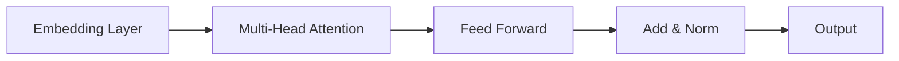

# 大语言模型应用指南：GPT商店介绍

## 1. 背景介绍

随着人工智能技术的不断发展,大型语言模型(Large Language Models,LLMs)已经成为当前最热门的研究领域之一。这些模型通过在海量文本数据上进行训练,掌握了丰富的语言知识和推理能力,可以用于多种自然语言处理任务,如机器翻译、文本摘要、问答系统等。

其中,OpenAI推出的GPT(Generative Pre-trained Transformer)系列模型无疑是最具代表性的大型语言模型之一。GPT-3作为该系列的最新版本,拥有1750亿个参数,在各项自然语言处理基准测试中表现出色,引起了学术界和工业界的广泛关注。

为了更好地利用GPT-3强大的语言生成能力,OpenAI推出了GPT-3商店(GPT-3 Playground),允许开发者和用户通过简单的API调用,将GPT-3集成到自己的应用程序中。本文将详细介绍GPT-3商店的使用方法,以及如何基于GPT-3构建实用的应用程序。

## 2. 核心概念与联系

### 2.1 大型语言模型(LLMs)

大型语言模型是一种基于神经网络的机器学习模型,通过在大量文本数据上进行无监督预训练,获取丰富的语言知识。这些模型通常采用Transformer等注意力机制,能够有效捕获文本中的长程依赖关系,从而生成高质量的文本输出。

LLMs的核心思想是:通过在海量文本数据上进行预训练,模型可以学习到语言的统计规律和语义知识。然后,我们只需要对预训练模型进行少量的微调(fine-tuning),就可以将其应用于特定的自然语言处理任务,如机器翻译、文本摘要、问答系统等。

### 2.2 GPT(Generative Pre-trained Transformer)

GPT是OpenAI开发的一系列大型语言生成模型,其中GPT-3是该系列的最新版本。GPT-3采用了Transformer解码器结构,并在大约5亿万个单词的文本数据上进行了预训练。通过这种自监督学习方式,GPT-3掌握了丰富的语言知识和推理能力。

GPT-3的核心思想是:给定一个文本提示(prompt),模型可以基于预训练获得的语言知识,生成与提示相关的连贯、通顺的文本输出。这种生成式的语言模型可以用于多种自然语言处理任务,如机器翻译、文本摘要、问答系统、内容创作等。

### 2.3 GPT-3商店(GPT-3 Playground)

为了方便开发者和用户利用GPT-3的强大能力,OpenAI推出了GPT-3商店,提供了一个友好的Web界面,用户可以通过输入文本提示,直接查看GPT-3生成的输出结果。同时,GPT-3商店还提供了API接口,允许开发者将GPT-3集成到自己的应用程序中。

GPT-3商店的核心功能包括:

1. 提供文本提示输入框,用户可以输入任意文本作为提示。
2. 设置GPT-3模型的参数,如温度(temperature)、最大输出长度等。
3. 查看GPT-3生成的文本输出结果。
4. 提供API接口,开发者可以通过编程方式调用GPT-3模型。

通过GPT-3商店,用户和开发者可以快速体验GPT-3的强大语言生成能力,并将其应用于实际的项目和应用程序中。

## 3. 核心算法原理具体操作步骤

### 3.1 Transformer架构

GPT-3采用了Transformer的解码器架构,该架构是一种基于注意力机制的序列到序列模型。Transformer的核心思想是通过自注意力(Self-Attention)机制,捕获输入序列中任意两个位置之间的依赖关系,从而更好地建模长期依赖。

Transformer的基本结构如下所示:



1. **Embedding Layer**:将输入的单词或子词(subword)映射为向量表示。
2. **Multi-Head Attention**:通过多个注意力头(Attention Head)捕获输入序列中不同位置之间的依赖关系。
3. **Feed Forward**:对注意力输出进行非线性变换,提取更高级的特征表示。
4. **Add & Norm**:残差连接(Residual Connection)和层归一化(Layer Normalization),用于提高模型的稳定性和收敛速度。

Transformer的解码器部分还引入了掩码多头注意力(Masked Multi-Head Attention),用于防止注意力机制关注到未来的位置,从而保证了模型的自回归性质。

### 3.2 GPT-3训练过程

GPT-3的训练过程主要分为两个阶段:

1. **预训练(Pre-training)**:在大量无监督文本数据上进行自监督学习,获取通用的语言知识。
2. **微调(Fine-tuning)**:在特定任务的标注数据上进行监督学习,使模型适应具体的应用场景。

在预训练阶段,GPT-3采用了自回归语言模型(Autoregressive Language Modeling)的训练目标,即根据前面的文本,预测下一个单词或子词的概率分布。具体来说,给定一个长度为n的文本序列$X = (x_1, x_2, \dots, x_n)$,模型需要最大化该序列的条件概率:

$$
P(X) = \prod_{i=1}^{n}P(x_i|x_1, x_2, \dots, x_{i-1})
$$

通过这种自监督学习方式,GPT-3可以从大量文本数据中学习到语言的统计规律和语义知识。

在微调阶段,GPT-3会根据具体的任务,在相应的标注数据上进行监督学习。例如,在机器翻译任务中,微调的目标是最大化翻译结果与参考译文的相似度;在问答任务中,则是最大化回答的正确率。通过微调,GPT-3可以将预训练获得的通用语言知识迁移到特定的应用场景中。

### 3.3 GPT-3生成过程

在实际应用中,我们可以通过提供一个文本提示(prompt),让GPT-3生成与提示相关的文本输出。生成过程可以概括为以下几个步骤:

1. **编码(Encoding)**:将输入的文本提示编码为Transformer可以理解的向量表示。
2. **注意力计算(Attention Computation)**:通过Transformer的注意力机制,捕获提示中单词之间的依赖关系。
3. **解码(Decoding)**:基于注意力输出,通过掩码多头注意力和前馈神经网络,预测下一个单词或子词的概率分布。
4. **采样(Sampling)**:根据预测的概率分布,采样出下一个单词或子词,作为输出序列的一部分。
5. **迭代(Iteration)**:重复步骤3和4,直到达到预设的最大输出长度或生成结束标记。

在生成过程中,我们还可以调整一些超参数,如温度(temperature)、频率惩罚(frequency penalty)等,来控制输出文本的多样性和连贯性。

总的来说,GPT-3的生成过程是一个自回归(Autoregressive)的过程,模型根据已生成的文本,不断预测并采样下一个单词或子词,最终生成与提示相关的完整文本输出。

## 4. 数学模型和公式详细讲解举例说明

### 4.1 Transformer注意力机制

Transformer的核心是注意力机制(Attention Mechanism),它允许模型在编码输入序列时,捕获任意两个位置之间的依赖关系。

给定一个长度为n的输入序列$X = (x_1, x_2, \dots, x_n)$,我们首先将其映射为一系列向量表示$H = (h_1, h_2, \dots, h_n)$,其中$h_i \in \mathbb{R}^{d_{\text{model}}}$是第i个位置的向量表示。

然后,我们计算查询向量(Query)$Q$、键向量(Key)$K$和值向量(Value)$V$,它们都是通过线性变换得到的:

$$
Q = H \cdot W_Q \\
K = H \cdot W_K \\
V = H \cdot W_V
$$

其中,$W_Q, W_K, W_V \in \mathbb{R}^{d_{\text{model}} \times d_k}$是可学习的权重矩阵。

接下来,我们计算注意力分数(Attention Scores)$S$,它表示查询向量$Q$与每个键向量$K$之间的相似度:

$$
S = \text{softmax}\left(\frac{Q \cdot K^T}{\sqrt{d_k}}\right)
$$

其中,$\sqrt{d_k}$是一个缩放因子,用于避免梯度过大或过小的问题。

最后,我们根据注意力分数$S$和值向量$V$,计算注意力输出$O$:

$$
O = S \cdot V
$$

注意力输出$O$是一个加权和,它捕获了输入序列中不同位置之间的依赖关系。通过多头注意力(Multi-Head Attention)机制,Transformer可以从不同的子空间捕获不同类型的依赖关系,进一步提高模型的表现力。

### 4.2 GPT语言模型

GPT采用了自回归语言模型(Autoregressive Language Model)的训练目标,即根据前面的文本,预测下一个单词或子词的概率分布。

给定一个长度为n的文本序列$X = (x_1, x_2, \dots, x_n)$,我们需要最大化该序列的条件概率:

$$
P(X) = \prod_{i=1}^{n}P(x_i|x_1, x_2, \dots, x_{i-1})
$$

其中,$P(x_i|x_1, x_2, \dots, x_{i-1})$表示在已知前面的文本$x_1, x_2, \dots, x_{i-1}$的情况下,预测第i个单词或子词$x_i$的概率。

为了计算这个条件概率,GPT采用了Transformer解码器的架构。具体来说,对于每个位置i,我们将前面的文本$x_1, x_2, \dots, x_{i-1}$编码为一系列向量表示$H = (h_1, h_2, \dots, h_{i-1})$,然后通过Transformer的注意力机制和前馈神经网络,计算出第i个位置的输出向量$o_i$。

最后,我们将输出向量$o_i$输入到一个线性层和softmax层,得到第i个位置的单词或子词概率分布:

$$
P(x_i|x_1, x_2, \dots, x_{i-1}) = \text{softmax}(W_o \cdot o_i + b_o)
$$

其中,$W_o$和$b_o$是可学习的权重和偏置。

在训练过程中,我们最小化负对数似然损失函数:

$$
\mathcal{L} = -\sum_{i=1}^{n}\log P(x_i|x_1, x_2, \dots, x_{i-1})
$$

通过这种自监督学习方式,GPT可以从大量文本数据中学习到语言的统计规律和语义知识。

## 5. 项目实践:代码实例和详细解释说明

在本节中,我们将通过一个实际的代码示例,演示如何使用Python调用GPT-3 API,生成与提示相关的文本输出。

首先,我们需要安装OpenAI的Python库:

```
pip install openai
```

然后,我们需要设置OpenAI API密钥,以便进行身份验证:

```python
import openai
openai.api_key = "YOUR_API_KEY"
```

接下来,我们定义一个函数`generate_text`,用于调用GPT-3 API并生成文本输出:

```python
def generate_text(prompt, max_tokens=500, temperature=0.7, top_p=1.0, frequency_penalty=0.0, presence_penalty=0.0):
    response = openai.Completion.create(
        engine="text-davinci-003",
        prompt=prompt,
        max_tokens=max_tokens,
        temperature=temperature,
        top_p=top_p,
        frequency_penalty=frequency_penalty,
        presence_penalty=presence_penalty
    )
    
    return response.choices[0].text
```

这个函数接受以下参数:

- `prompt`(str):输入的文本提示。
- `max_tokens`(int):生成文本的最大长度,以单词或子词的数量计算。
- `temperature`(float):控制输出文本多样性的参数,取值