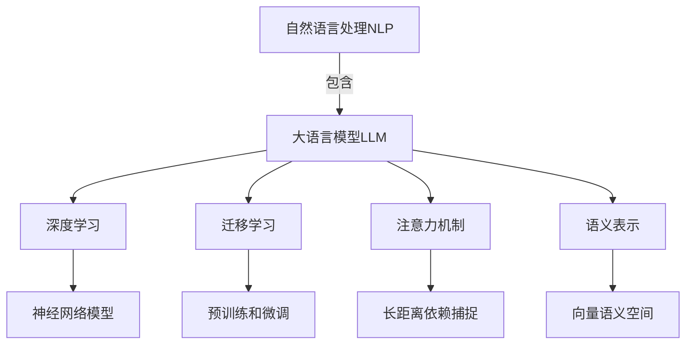
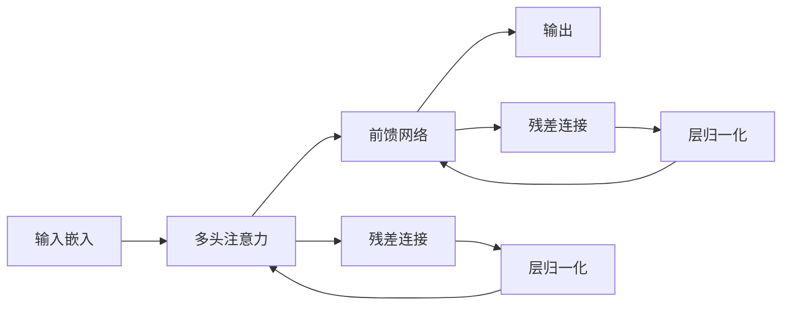
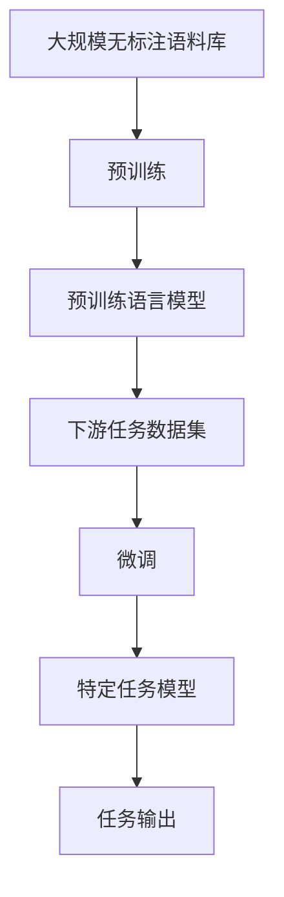

# 大语言模型应用指南：入门

## 1. 背景介绍

### 1.1 什么是大语言模型?

大语言模型(Large Language Model, LLM)是一种基于深度学习的自然语言处理(NLP)模型,能够理解和生成人类语言。它通过在海量文本数据上训练,学习语言的模式和规则,从而获得对语言的深入理解和生成能力。

大语言模型的出现,标志着人工智能在自然语言处理领域取得了重大突破。传统的NLP方法通常依赖于手工设计的规则和特征,效果有限。而大语言模型则是通过自动从数据中学习,无需人工干预,能够自主获取语言知识,从而在许多NLP任务上展现出超越人类的性能。

### 1.2 大语言模型的重要性

大语言模型在自然语言处理领域扮演着越来越重要的角色,影响深远:

- 推动了NLP技术的飞速发展,为众多应用场景带来了革命性的变化。
- 为人机交互提供了新的可能,使得人类能够以更自然、高效的方式与计算机进行交互。
- 促进了人工智能系统对自然语言的理解和生成能力,为实现真正的人工通用智能(AGI)迈出了关键一步。
- 推动了计算机视觉、多模态等其他人工智能领域的发展,为各领域的融合应用奠定基础。

### 1.3 大语言模型的发展历程

大语言模型的发展可以追溯到20世纪90年代,当时的统计语言模型已经展现出一定的语言理解和生成能力。但真正的突破是在2018年,Transformer模型的提出使得大语言模型的性能得到了质的飞跃。

此后,GPT、BERT、T5等一系列大型预训练语言模型相继问世,模型规模和性能不断刷新记录。到2022年,大语言模型已经能够在多项基准测试上超越人类水平,展现出了惊人的语言理解和生成能力。

## 2. 核心概念与联系

### 2.1 自然语言处理(NLP)

自然语言处理是人工智能领域的一个重要分支,旨在使计算机能够理解和生成人类语言。NLP技术广泛应用于机器翻译、问答系统、文本分类、信息检索等领域。

大语言模型是NLP领域的一项重大突破,它通过在海量文本数据上训练,自主学习语言知识,从而获得出色的语言理解和生成能力。

### 2.2 深度学习

深度学习是机器学习的一个新兴热点方向,它通过构建深层神经网络模型,从数据中自动学习特征表示,在计算机视觉、自然语言处理等领域取得了卓越的成就。

大语言模型的核心就是基于深度学习技术,通过构建巨大的神经网络模型,在海量文本数据上进行训练,从而获得对语言的深入理解和生成能力。

### 2.3 迁移学习

迁移学习是机器学习中的一种重要范式,它允许将在一个领域学习到的知识迁移到另一个领域,从而加速新领域的学习过程。

大语言模型就是迁移学习的典型应用。模型首先在通用语料库上进行大规模预训练,获得通用的语言知识。然后,可以在特定任务的数据上进行微调(fine-tuning),将通用知识迁移并应用到目标任务中,从而大幅提高任务性能。

### 2.4 注意力机制

注意力机制是深度学习中的一种关键技术,它允许模型在处理序列数据时,动态地关注输入序列的不同部分,并据此分配计算资源。

Transformer模型的提出,使得注意力机制在大语言模型中得到了广泛应用。注意力机制使得模型能够更好地捕捉长距离依赖关系,从而提高了对语言的理解和生成能力。

### 2.5 语义表示

语义表示是指将自然语言的含义用数学形式(如向量或张量)表示出来,这是自然语言处理的一个核心问题。

大语言模型通过在海量文本数据上训练,自主学习了丰富的语义知识,能够将自然语言映射到高质量的语义表示空间中,为下游的NLP任务提供有力支持。

### 2.6 Mermaid流程图

上图展示了大语言模型与自然语言处理、深度学习、迁移学习、注意力机制和语义表示之间的关系。大语言模型作为自然语言处理的一个重要组成部分,与这些核心概念密切相关并相互影响。

## 3. 核心算法原理具体操作步骤

### 3.1 Transformer模型

Transformer是大语言模型的核心算法模型,它完全基于注意力机制,摒弃了传统的循环神经网络和卷积神经网络结构,展现出了卓越的并行计算能力。

Transformer的主要组成部分包括:

1. **嵌入层(Embedding Layer)**: 将输入的文本序列转换为向量表示。
2. **多头注意力层(Multi-Head Attention)**: 捕捉输入序列中不同位置之间的依赖关系。
3. **前馈神经网络(Feed-Forward Network)**: 对注意力层的输出进行进一步处理和表示学习。
4. **规范化层(Normalization Layer)**: 对输入进行归一化处理,提高模型的训练稳定性。

Transformer的核心在于自注意力机制,它允许模型在计算目标位置的表示时,关注输入序列的所有位置,并据此分配注意力权重。这种全局依赖性捕捉能力,使得Transformer能够更好地学习长距离语义依赖关系,从而在语言建模任务上取得了突破性进展。

上图展示了Transformer的基本结构,包括嵌入层、多头注意力层、前馈网络、残差连接和层归一化等组件。通过这些组件的协同工作,Transformer能够高效地对输入序列进行编码和建模。

### 3.2 预训练与微调

大语言模型通常采用预训练与微调(Pre-training and Fine-tuning)的范式进行训练和应用。这种方法的核心思想是:

1. **预训练(Pre-training)**: 在大规模通用语料库上进行无监督训练,学习通用的语言表示和知识。
2. **微调(Fine-tuning)**: 在特定的下游任务数据上,基于预训练模型进行有监督微调,将通用知识迁移并应用到目标任务中。

预训练阶段通常采用自监督学习(Self-Supervised Learning)的方式,通过设计合适的预训练目标(如掩码语言模型、下一句预测等),引导模型从大量无标注数据中学习语言的内在规律和知识。

微调阶段则是在有标注的下游任务数据上,对预训练模型的部分参数进行微调,使其适应特定任务的需求。由于预训练模型已经学习了通用的语言知识,因此微调阶段只需要对模型进行适当的调整,就能快速收敛并取得良好的性能表现。

预训练与微调范式的优势在于:

1. 充分利用了大规模无标注数据的知识,提高了模型的泛化能力。
2. 降低了下游任务的数据需求,提高了数据利用效率。
3. 实现了知识迁移,加速了模型在新任务上的收敛速度。

### 3.3 Mermaid流程图

上图展示了大语言模型的预训练与微调流程。首先,在大规模无标注语料库上进行预训练,获得通用的预训练语言模型。然后,将预训练模型在特定下游任务的数据集上进行微调,得到适用于该任务的特定模型。最后,特定任务模型可以对新的输入进行预测和处理,产生所需的任务输出。

## 4. 数学模型和公式详细讲解举例说明

### 4.1 Transformer的注意力机制

注意力机制是Transformer模型的核心,它允许模型在计算目标位置的表示时,关注输入序列的所有位置,并据此分配注意力权重。具体来说,给定一个查询向量 $q$ 和一组键值对 $(k_i, v_i)$,注意力机制计算注意力权重 $\alpha_i$ 和加权和表示 $z$ 如下:

$$\alpha_i = \mathrm{softmax}\left(\frac{q^Tk_i}{\sqrt{d_k}}\right)$$
$$z = \sum_{i=1}^n \alpha_i v_i$$

其中, $d_k$ 是缩放因子,用于防止点积的值过大导致softmax的梯度饱和。

在多头注意力机制中,查询 $Q$、键 $K$ 和值 $V$ 首先通过线性变换分别映射到不同的子空间,然后在每个子空间中并行计算注意力,最后将所有子空间的注意力输出进行拼接:

$$\mathrm{MultiHead}(Q, K, V) = \mathrm{Concat}(head_1, \ldots, head_h)W^O$$
$$\text{where } head_i = \mathrm{Attention}(QW_i^Q, KW_i^K, VW_i^V)$$

其中, $W_i^Q \in \mathbb{R}^{d_\text{model} \times d_k}$, $W_i^K \in \mathbb{R}^{d_\text{model} \times d_k}$, $W_i^V \in \mathbb{R}^{d_\text{model} \times d_v}$ 和 $W^O \in \mathbb{R}^{hd_v \times d_\text{model}}$ 是可学习的线性变换参数。

通过注意力机制,Transformer能够捕捉输入序列中任意两个位置之间的依赖关系,从而更好地学习长距离语义依赖,提高了语言建模的性能。

### 4.2 掩码语言模型(Masked Language Modeling)

掩码语言模型是大语言模型预训练的一种常用目标,它的思想是在输入序列中随机掩码一部分词元,然后让模型基于上下文预测被掩码的词元。形式化地,给定一个长度为 $n$ 的输入序列 $\boldsymbol{x} = (x_1, x_2, \ldots, x_n)$,我们随机选择一些位置 $\mathcal{M} \subseteq \{1, 2, \ldots, n\}$ 进行掩码,得到掩码后的序列 $\boldsymbol{\hat{x}}$。模型的目标是最大化掩码位置的条件概率:

$$\mathcal{L}_\text{MLM} = \mathbb{E}_{\boldsymbol{x}, \mathcal{M}} \left[ -\log P(\boldsymbol{x}_\mathcal{M} | \boldsymbol{\hat{x}}) \right]$$

其中, $\boldsymbol{x}_\mathcal{M}$ 表示掩码位置的原始词元。

掩码语言模型的优点是:

1. 通过预测被掩码的词元,模型被迫学习上下文语义信息,从而获得更好的语言理解能力。
2. 掩码机制引入了噪声,增强了模型的泛化能力,提高了鲁棒性。
3. 与传统语言模型相比,掩码语言模型能够更好地利用双向上下文信息。

掩码语言模型是BERT等大语言模型预训练的核心目标之一,它在无监督场景下就能够学习到丰富的语言知识,为下游任务