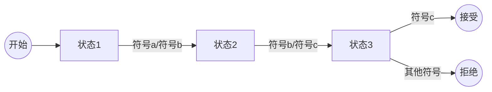
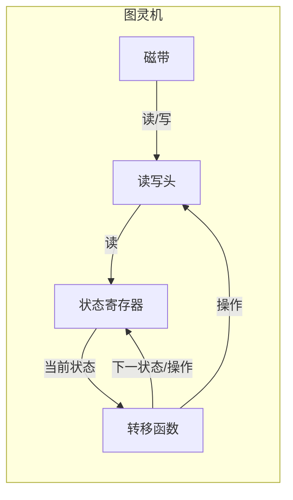
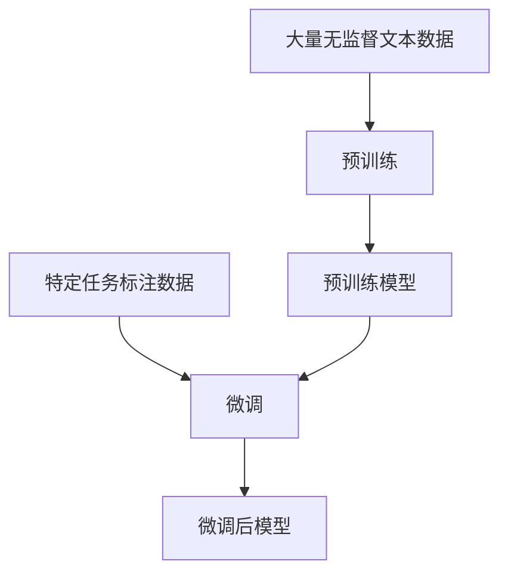

# 大语言模型应用指南：图灵机与大语言模型：可计算性与时间复杂度

## 1. 背景介绍

### 1.1 图灵机的诞生

在20世纪30年代,数学家阿兰·图灵(Alan Turing)提出了一种理论计算模型,被称为"图灵机"。图灵机是一种抽象的计算机模型,用于研究计算的本质和计算机能够计算的极限。它由一个无限长的磁带、一个读写头和一组规则组成。读写头可以读取磁带上的符号,根据规则进行操作,并移动到磁带的下一个位置。

图灵机的核心思想是将计算过程分解为一系列简单的步骤,每个步骤都由一组有限的规则控制。虽然图灵机看起来非常简单,但它却具有强大的计算能力,可以模拟任何可编程计算机。事实上,任何可计算的函数都可以由图灵机来计算。

### 1.2 大语言模型的兴起

随着深度学习技术的快速发展,大型神经网络模型在自然语言处理(NLP)领域取得了令人瞩目的成就。其中,大语言模型(Large Language Model,LLM)是一种基于transformer架构的大型神经网络模型,被广泛应用于各种NLP任务,如机器翻译、文本生成、问答系统等。

大语言模型通过在大量文本数据上进行预训练,学习到丰富的语言知识和上下文信息。这些模型具有惊人的泛化能力,可以在看似无关的任务上表现出色。著名的大语言模型包括GPT-3、PaLM、Chinchilla等。

### 1.3 图灵机与大语言模型的联系

尽管图灵机和大语言模型看似毫无关联,但它们之间存在着一些有趣的联系。首先,它们都旨在模拟和理解人类智能的不同方面。图灵机关注的是计算的本质和极限,而大语言模型则专注于语言理解和生成。

其次,它们都依赖于一系列规则或模式来执行计算或生成语言。图灵机遵循一组有限的规则,而大语言模型则通过从数据中学习模式来生成语言。

最后,它们都面临着可计算性和复杂性的挑战。图灵机虽然理论上可以计算任何可计算的函数,但在实践中,许多问题由于时间和空间复杂度的限制而无法有效计算。同样,大语言模型虽然具有强大的语言生成能力,但也存在一些局限性,如偏差、不一致性和缺乏常识推理能力。

通过探索图灵机与大语言模型之间的联系,我们可以更好地理解计算和语言的本质,并为设计更强大、更智能的系统提供启示。

## 2. 核心概念与联系

### 2.1 图灵机的核心概念

#### 2.1.1 有限状态自动机

图灵机的核心概念之一是有限状态自动机(Finite State Automaton,FSA)。FSA是一种数学模型,用于识别和生成正则语言。它由一组有限的状态、一组输入符号、一组转移函数和一组接受状态组成。

FSA的工作原理是:从初始状态开始,根据当前状态和输入符号,通过转移函数转移到下一个状态。如果最终到达接受状态,则认为该输入字符串被接受。否则,被拒绝。

#### 2.1.2 图灵机的构成

图灵机由以下几个部分组成:

1. **磁带(Tape)**: 一个无限长的磁带,磁带上的每个单元格都包含一个符号。
2. **读写头(Read/Write Head)**: 用于读取和写入磁带上的符号。
3. **状态寄存器(State Register)**: 存储当前状态。
4. **转移函数(Transition Function)**: 根据当前状态和读取的符号,确定下一个状态和操作。

#### 2.1.3 图灵机的工作过程

图灵机的工作过程如下:

1. 初始化磁带、读写头位置和状态寄存器。
2. 读取当前读写头下的符号。
3. 根据当前状态和读取的符号,通过转移函数确定下一个状态和操作(写入新符号、移动读写头)。
4. 执行操作,转移到下一个状态。
5. 重复步骤2-4,直到达到停止状态或进入无限循环。

通过这种简单而精确的方式,图灵机可以模拟任何算法,成为研究计算理论和可计算性的基础模型。

### 2.2 大语言模型的核心概念

#### 2.2.1 transformer架构

大语言模型通常基于transformer架构,该架构由编码器(Encoder)和解码器(Decoder)组成。编码器将输入序列(如文本)映射为连续的向量表示,解码器则根据这些向量表示生成输出序列。

transformer架构的关键创新是引入了自注意力(Self-Attention)机制,它允许模型捕捉输入序列中任意两个位置之间的依赖关系,而不受序列长度的限制。这种全局依赖性使得transformer能够更好地建模长距离依赖关系,从而在许多NLP任务上取得了出色的性能。

#### 2.2.2 预训练与微调

大语言模型通常采用预训练与微调(Pre-training and Fine-tuning)的范式。在预训练阶段,模型在大量无监督文本数据上进行训练,学习到通用的语言表示。在微调阶段,预训练模型被进一步在特定任务的标注数据上进行训练,使其适应特定任务。

这种范式的优势在于,预训练可以捕获通用的语言知识,而微调则使模型专门化于特定任务。通过这种方式,大语言模型可以在各种下游任务上取得出色的性能,而无需从头开始训练。

#### 2.2.3 生成式大语言模型

生成式大语言模型(Generative Language Model)是一种特殊类型的大语言模型,它专门用于生成自然语言文本。这种模型通过学习文本数据中的统计模式,可以生成看似人类写作的连贯文本。

生成式大语言模型的应用包括文本续写、创意写作、对话系统等。著名的生成式大语言模型包括GPT-3、PaLM等。这些模型展示了惊人的语言生成能力,但也存在一些局限性,如偏差、不一致性和缺乏常识推理能力。

### 2.3 图灵机与大语言模型的联系

尽管图灵机和大语言模型看似毫无关联,但它们之间存在着一些有趣的联系:

1. **计算模型与语言模型**: 图灵机是一种计算模型,用于研究计算的本质和极限;而大语言模型是一种语言模型,专注于语言理解和生成。它们分别模拟了人类智能的不同方面。

2. **规则与模式**: 图灵机遵循一组有限的规则进行计算,而大语言模型则通过从数据中学习模式来生成语言。它们都依赖于一定的规则或模式来执行相应的任务。

3. **可计算性与复杂性**: 图灵机虽然理论上可以计算任何可计算的函数,但在实践中,许多问题由于时间和空间复杂度的限制而无法有效计算。同样,大语言模型虽然具有强大的语言生成能力,但也存在一些局限性,如偏差、不一致性和缺乏常识推理能力。它们都面临着可计算性和复杂性的挑战。

通过探索图灵机与大语言模型之间的联系,我们可以更好地理解计算和语言的本质,并为设计更强大、更智能的系统提供启示。

## 3. 核心算法原理具体操作步骤

### 3.1 图灵机的算法原理

#### 3.1.1 图灵机的形式化定义

形式上,一个图灵机可以定义为一个7元组:

$$M = (Q, \Gamma, b, \Sigma, \delta, q_0, F)$$

其中:

- $Q$ 是一个有限的状态集合
- $\Gamma$ 是磁带字母表,包括输入符号和特殊空白符号 $b$
- $\Sigma \subseteq \Gamma$ 是输入字母表
- $\delta: Q \times \Gamma \rightarrow Q \times \Gamma \times \{L, R\}$ 是转移函数
- $q_0 \in Q$ 是初始状态
- $F \subseteq Q$ 是接受状态集合

#### 3.1.2 图灵机的工作过程

图灵机的工作过程可以描述为以下算法:

1. 初始化磁带,将输入字符串写入磁带,并将读写头指向第一个符号。
2. 将状态设置为初始状态 $q_0$。
3. 重复以下步骤,直到进入接受状态或停止状态:
    a. 读取当前读写头下的符号 $s$。
    b. 根据当前状态 $q$ 和读取的符号 $s$,通过转移函数 $\delta(q, s)$ 确定下一个状态 $q'$、要写入的符号 $s'$ 和读写头移动方向 $d$。
    c. 将当前读写头下的符号替换为 $s'$。
    d. 根据移动方向 $d$,将读写头移动到磁带的下一个位置。
    e. 将当前状态更新为 $q'$。
4. 如果当前状态是接受状态,则接受输入;否则,拒绝输入。

通过这种简单而精确的算法,图灵机可以模拟任何算法,成为研究计算理论和可计算性的基础模型。

### 3.2 大语言模型的算法原理

#### 3.2.1 transformer架构

transformer架构是大语言模型的核心,它由编码器(Encoder)和解码器(Decoder)组成。编码器将输入序列映射为连续的向量表示,解码器则根据这些向量表示生成输出序列。

transformer的关键创新是引入了自注意力(Self-Attention)机制,它允许模型捕捉输入序列中任意两个位置之间的依赖关系,而不受序列长度的限制。自注意力机制的计算过程如下:

1. 计算查询(Query)、键(Key)和值(Value)向量:

$$\begin{aligned}
Q &= XW^Q \\
K &= XW^K \\
V &= XW^V
\end{aligned}$$

其中 $X$ 是输入序列的embedding表示,而 $W^Q$、$W^K$ 和 $W^V$ 是可学习的权重矩阵。

2. 计算注意力分数:

$$\text{Attention}(Q, K, V) = \text{softmax}\left(\frac{QK^T}{\sqrt{d_k}}\right)V$$

其中 $d_k$ 是缩放因子,用于防止内积过大导致的梯度饱和问题。

3. 通过多头注意力(Multi-Head Attention)机制,将多个注意力头的结果拼接起来,捕捉不同的依赖关系。

4. 最后,