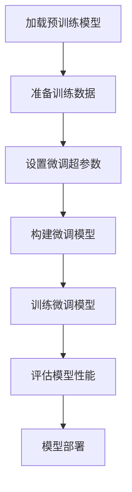

# 大语言模型应用指南：基于微调的工具

## 1. 背景介绍

### 1.1 大语言模型的兴起

近年来,自然语言处理(NLP)领域取得了长足的进步,很大程度上归功于大型语言模型(Large Language Models, LLMs)的兴起。大语言模型是一种基于深度学习的技术,通过在海量文本数据上进行预训练,学习语言的语义和上下文关系。这些模型具有极强的语言理解和生成能力,可以应用于诸如机器翻译、问答系统、文本摘要等各种自然语言处理任务。

代表性的大语言模型包括 GPT (Generative Pre-trained Transformer)、BERT (Bidirectional Encoder Representations from Transformers)、XLNet、RoBERTa 等。它们通过自监督学习的方式在大规模语料库上预训练,获得了极为丰富的语言知识。

### 1.2 微调在大语言模型中的作用

尽管大语言模型在通用语言理解方面表现出色,但直接将它们应用于特定的下游任务往往会达不到最佳效果。这是因为预训练语料与下游任务存在分布差异,导致模型在新领域的泛化能力不足。为了解决这一问题,研究人员提出了"微调"(Fine-tuning)的方法。

微调是一种迁移学习技术,它的思路是:首先在大规模语料上预训练一个通用的语言模型,获取丰富的语言知识;然后在特定任务的少量标注数据上继续训练(Fine-tune),使模型适应该任务的特征分布。通过这种方式,大语言模型可以快速地转移到新的领域,同时保留了在预训练阶段获得的语言理解能力。

本文将重点介绍如何基于微调技术,将大语言模型应用于实际任务,并探讨相关的工具和最佳实践。

## 2. 核心概念与联系

### 2.1 迁移学习与微调

迁移学习(Transfer Learning)是机器学习领域的一个重要概念。它的核心思想是将在某个领域学习到的知识迁移到另一个领域,从而加速新领域的学习过程。在深度学习时代,迁移学习主要通过网络微调(Network Fine-tuning)的方式实现。

网络微调的基本流程如下:

1. 在源领域(Source Domain)的大规模数据上预训练一个深度神经网络模型。
2. 将预训练模型作为初始化参数,在目标领域(Target Domain)的少量标注数据上继续训练(Fine-tune),使模型适应新领域的特征分布。

这种方法可以大幅减少目标领域所需的标注数据量,同时保留了预训练模型在源领域学习到的丰富知识。因此,迁移学习在数据量有限的场景下尤为有效。

对于大语言模型而言,预训练阶段相当于在通用语料库(源领域)上学习语言知识,而微调阶段则是将这些知识迁移到特定的自然语言处理任务(目标领域)上。通过微调,大语言模型可以快速适应新任务,发挥出卓越的性能表现。

### 2.2 微调策略

微调大语言模型时,需要考虑以下几个关键策略:

1. **训练数据**:微调所需的标注数据量通常远小于预训练阶段,但数据质量对模型性能有重要影响。因此,应尽可能准备高质量、与任务相关的训练数据。

2. **学习率**:微调时的学习率通常比预训练阶段的学习率小得多,以防止"灾难性遗忘"(Catastrophic Forgetting),即过度微调导致预训练知识被抹去。一种常见做法是对不同层使用不同的学习率。

3. **训练步数**:微调的训练步数通常较少,以避免过度拟合。可以根据验证集上的性能来选择最佳的训练步数。

4. **层级微调**:除了对整个模型进行微调外,也可以只微调特定的层(如输出层),以减少计算开销。不同层可以采用不同的微调策略。

5. **数据增强**:通过数据增强技术(如回译、同义替换等)扩充训练数据,可以提高模型的泛化能力。

6. **prompt tuning**:一种新兴的微调策略,通过设计任务prompt而非修改模型参数来适应新任务,可显著降低计算开销。

上述策略的选择需要根据具体任务和资源情况进行权衡。合理的微调策略对于充分发挥大语言模型的潜力至关重要。

## 3. 核心算法原理具体操作步骤

微调大语言模型的核心算法原理可以概括为以下几个步骤:



### 3.1 加载预训练模型

第一步是加载一个在大规模语料库上预训练好的大语言模型,如 BERT、GPT-2 等。这些模型通常以张量(Tensor)的形式存储在磁盘上,可以使用深度学习框架(如 PyTorch、TensorFlow)直接加载。

### 3.2 准备训练数据

接下来需要准备用于微调的训练数据集。这些数据应该与目标任务相关,格式需要符合预训练模型的输入要求。通常需要进行数据清洗、标注和切分等预处理步骤。

### 3.3 设置微调超参数

微调过程中需要设置一些重要的超参数,如学习率、批次大小、训练步数等。不同的任务和模型可能需要不同的超参数配置,因此通常需要进行一定的调优。

### 3.4 构建微调模型

根据目标任务的性质,在预训练模型的基础上构建微调模型。这可能需要添加新的输出层、修改损失函数等。同时,还需要决定是对整个模型进行微调,还是只微调部分层。

### 3.5 训练微调模型

使用准备好的训练数据和超参数,在目标任务上训练微调模型。训练过程中,模型将逐步适应新任务的特征分布,学习到与该任务相关的知识。

### 3.6 评估模型性能

在验证集或测试集上评估微调模型的性能表现,确定是否达到了预期效果。如果效果不理想,可以尝试调整超参数、增加训练数据等策略。

### 3.7 模型部署

一旦获得了满意的模型,就可以将其部署到实际的生产环境中,为最终用户提供服务。

以上步骤概括了微调大语言模型的基本流程。在实际操作中,可能还需要考虑诸如模型压缩、在线学习等优化策略,以提高模型的效率和适用性。

## 4. 数学模型和公式详细讲解举例说明

大语言模型的核心是基于自注意力(Self-Attention)机制的Transformer架构。我们将介绍Transformer中的几个关键数学模型。

### 4.1 缩放点积注意力(Scaled Dot-Product Attention)

注意力机制是Transformer的核心所在,它能够自动捕获输入序列中不同位置之间的依赖关系。缩放点积注意力是注意力机制的一种实现方式,其数学表达式如下:

$$\mathrm{Attention}(Q, K, V) = \mathrm{softmax}\left(\frac{QK^T}{\sqrt{d_k}}\right)V$$

其中:
- $Q$ 为查询(Query)向量
- $K$ 为键(Key)向量
- $V$ 为值(Value)向量
- $d_k$ 为缩放因子,通常为键向量的维度

该公式首先计算查询向量与所有键向量的点积,并除以缩放因子 $\sqrt{d_k}$ (以防止过大的点积导致softmax函数的梯度较小)。然后,对点积结果应用softmax函数得到注意力权重。最后,将注意力权重与值向量相乘,得到加权后的值向量。

通过这种方式,模型可以自动学习到输入序列中不同位置之间的相关性,并对序列进行编码。

### 4.2 多头注意力(Multi-Head Attention)

为了捕捉不同的相关模式,Transformer采用了多头注意力机制。多头注意力的计算过程如下:

$$\begin{aligned}
\mathrm{MultiHead}(Q, K, V) &= \mathrm{Concat}(\mathrm{head}_1, \ldots, \mathrm{head}_h)W^O\\
\mathrm{where}\  \mathrm{head}_i &= \mathrm{Attention}(QW_i^Q, KW_i^K, VW_i^V)
\end{aligned}$$

其中:
- $h$ 为头数(Head Number)
- $W_i^Q \in \mathbb{R}^{d_\text{model} \times d_k}, W_i^K \in \mathbb{R}^{d_\text{model} \times d_k}, W_i^V \in \mathbb{R}^{d_\text{model} \times d_v}$ 为线性投影矩阵
- $W^O \in \mathbb{R}^{hd_v \times d_\text{model}}$ 为输出线性投影矩阵

多头注意力机制首先将查询、键和值向量分别投影到不同的子空间,然后在每个子空间中计算缩放点积注意力。最后,将所有子空间的注意力结果拼接起来,并通过一个线性投影得到最终的输出向量。

通过这种方式,模型可以同时关注不同的相关模式,从而提高表示能力。

### 4.3 前馈神经网络(Feed-Forward Neural Network)

除了注意力子层,Transformer的编码器和解码器中还包含前馈神经网络子层,用于对序列进行非线性映射。前馈神经网络的计算过程如下:

$$\mathrm{FFN}(x) = \max(0, xW_1 + b_1)W_2 + b_2$$

其中:
- $W_1 \in \mathbb{R}^{d_\text{model} \times d_\text{ff}}, W_2 \in \mathbb{R}^{d_\text{ff} \times d_\text{model}}$ 为线性变换矩阵
- $b_1 \in \mathbb{R}^{d_\text{ff}}, b_2 \in \mathbb{R}^{d_\text{model}}$ 为偏置向量
- $d_\text{ff}$ 为前馈神经网络的隐层维度

前馈神经网络首先对输入向量进行线性变换,然后应用ReLU激活函数,再进行另一个线性变换得到输出。这种结构可以有效捕捉输入序列中的非线性特征。

通过自注意力机制和前馈神经网络的交替堆叠,Transformer能够学习到输入序列的深层次表示,从而完成各种自然语言处理任务。

## 5. 项目实践:代码实例和详细解释说明

在本节中,我们将使用PyTorch框架,通过一个实例项目来演示如何对BERT模型进行微调,应用于文本分类任务。

### 5.1 准备数据

我们使用来自AG News的新闻文本数据集,该数据集包含4种新闻主题:World(世界新闻)、Sports(体育新闻)、Business(商业新闻)和Sci/Tech(科技新闻)。我们的目标是根据新闻正文,预测其所属的主题类别。

```python
from datasets import load_dataset

dataset = load_dataset("ag_news")
```

### 5.2 数据预处理

我们需要对数据进行一些预处理,如将文本tokenize为模型可接受的输入格式、将标签转换为数值等。

```python
from transformers import BertTokenizer

tokenizer = BertTokenizer.from_pretrained('bert-base-uncased')

def preprocess_function(examples):
    return tokenizer(examples["text"], truncation=True, padding='max_length', max_length=512)

tokenized_datasets = dataset.map(preprocess_function, batched=True)
```

### 5.3 加载预训练模型

我们从Hugging Face模型库中加载BERT的预训练权重。

```python
from transformers import BertForSequenceClassification

model = BertForSequenceClassification.from_pretrained('bert-base-uncased', num_labels=4)
```

### 5.4 设置微调超参数

我们设置一些超参数,如学习率、批次大小等。

```python
batch_size = 16
learning_rate = 2e-5
num_epochs = 3
```

### 5