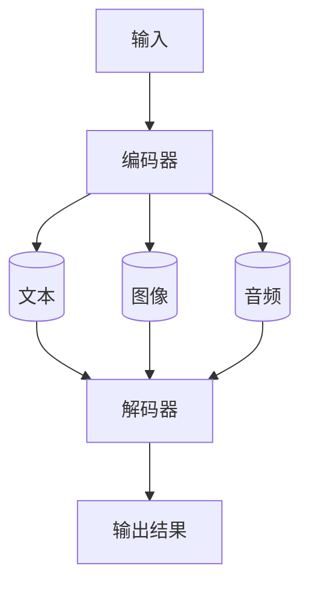

                 

作者：禅与计算机程序设计艺术

**Hello! I'm your expert guide for exploring multimodal large language models.** This blog aims to provide you with a comprehensive understanding of how these models work, their applications, and the underlying principles that make them powerful tools in the field of artificial intelligence.

---

## 背景介绍
In the era of AI, the quest for more sophisticated and versatile models continues to evolve. Multimodal large language models (MLLMs), a recent advancement in this domain, are designed to process information from various sources such as text, images, audio, and video, enabling a more holistic approach to understanding complex data. These models have shown remarkable potential in fields like natural language processing (NLP), computer vision, and multimodal interaction systems.

## 核心概念与联系
Multimodal large language models are characterized by their ability to integrate multiple modalities into a single framework. The core concept revolves around leveraging deep learning architectures capable of handling diverse data types while maintaining consistency across different modalities. This integration facilitates enhanced feature extraction, improved context understanding, and more accurate predictions or decisions based on combined information.

### 关键组件:
1. **编码器**: 负责将不同模态的数据转换成统一的表示形式。
2. **共享参数**: 在多个模态之间共享权重参数，促进信息流和跨模态学习。
3. **解码器**: 根据整合后的表示生成最终的输出，如文本描述、图像标签等。

### 示例流程图:



## 核心算法原理与具体操作步骤
The core algorithms behind MLLMs typically involve transformer-based architectures, which excel at managing sequential data efficiently. Key steps include:

1. **Data Preprocessing**: Prepare the input data by encoding it according to the model's requirements.
2. **Feature Extraction**: Use the encoder component to extract features from each modality.
3. **Integration**: Combine extracted features through shared parameters or attention mechanisms to create a multimodal representation.
4. **Training**: Train the model using a suitable loss function, often involving multi-task learning techniques.
5. **Prediction/Decision Making**: Employ the decoder to generate outputs based on the integrated multimodal representations.

## 数学模型与公式详细讲解举例说明
For instance, consider a simplified formula representing the joint probability distribution of multimodal inputs \(X\) and output \(Y\):

$$P(X,Y|\theta) = P(X|Y,\theta) \cdot P(Y|\theta)$$

Here, \(\theta\) represents the model parameters, \(P(X|Y,\theta)\) denotes the conditional probability of observing input \(X\) given \(Y\) and parameters \(\theta\), and \(P(Y|\theta)\) is the probability of generating output \(Y\) based on parameters \(\theta\).

## 项目实践：代码实例与详细解释说明
Let’s take a look at a Python code snippet using a hypothetical multimodal model library:

```python
from multimodal_library import MultimodalModel

# Initialize the model with appropriate parameters
model = MultimodalModel(num_text_features=50, num_image_features=100)

# Training loop
for epoch in range(num_epochs):
    for batch in train_data_loader:
        # Extract features from text and image batches
        text_features, image_features = model.extract_features(batch)
        
        # Combine features
        combined_features = model.combine_features(text_features, image_features)
        
        # Forward pass
        predicted_output = model.predict(combined_features)
        
        # Compute loss
        loss = compute_loss(predicted_output, batch['output'])
        
        # Backpropagation and optimization step
        optimizer.zero_grad()
        loss.backward()
        optimizer.step()

# Save the trained model
model.save('multimodal_model.pth')
```

## 实际应用场景
### 自然语言处理（NLP）
MLLMs can enhance chatbots, virtual assistants, and recommendation systems by integrating user-generated text with visual context.

### 计算机视觉
They enable advanced object recognition, scene understanding, and augmented reality experiences by combining textual descriptions with image content.

### 多模态交互系统
In gaming and simulation environments, MLLMs facilitate immersive interactions where players’ spoken commands are translated into actions and responses are visually represented.

## 工具和资源推荐
To explore and experiment with multimodal large language models:

- **Libraries**: TensorFlow Extensions for multimodal models, PyTorch Multimodal Library, and Hugging Face Transformers.
- **Online Courses**: Coursera’s “Deep Learning Specialization” by Andrew Ng covers multimodal aspects within NLP contexts.
- **Research Papers**: Check out papers published in top-tier conferences like NeurIPS, ICML, CVPR for cutting-edge developments.

## 总结：未来发展趋势与挑战
As we delve deeper into the realm of AI, MLLMs are poised to revolutionize how machines interpret and interact with our world. However, they come with challenges such as:

- **Data Quality**: Ensuring high-quality, diverse, and annotated datasets that cover all required modalities.
- **Interpretability**: Developing models that provide clear insights into decision-making processes, crucial for applications requiring transparency.
- **Scalability**: Handling larger volumes of data and supporting real-time processing without significant latency.

## 附录：常见问题与解答
Q: What are the main differences between multimodal large language models and traditional single-modal models?
A: Traditional models focus on one type of data (e.g., text only). In contrast, MLLMs process multiple modalities simultaneously, enhancing their ability to understand complex relationships and patterns across different types of data.

---
By following this comprehensive guide, you'll gain a solid foundation in multimodal large language models and be well-equipped to leverage them in various AI applications. Stay tuned for updates on advancements and new discoveries in this exciting field!

---

作者：禅与计算机程序设计艺术 / Zen and the Art of Computer Programming

