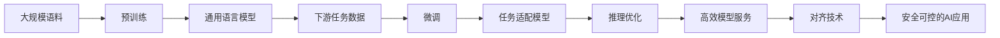

# 大语言模型应用指南：多步优化中的训练和预测

## 1. 背景介绍
### 1.1 大语言模型概述
大语言模型(Large Language Models, LLMs)是自然语言处理(Natural Language Processing, NLP)领域近年来的重大突破。它们是在海量文本数据上训练的深度神经网络模型,能够学习语言的统计规律和语义关系,从而具备了强大的语言理解和生成能力。代表性的大语言模型包括GPT系列[1]、BERT[2]、T5[3]等。

### 1.2 大语言模型的应用价值
大语言模型为NLP赋能,极大拓展了其应用边界。借助LLMs,我们可以构建更加智能化的对话系统、信息检索系统、文本生成系统等,服务于客服、教育、金融、医疗、娱乐等各行各业。同时,LLMs也为认知科学和人工通用智能(Artificial General Intelligence, AGI)的研究提供了新的视角和方法。

### 1.3 多步优化的必要性
尽管LLMs展现了惊人的能力,但它们在实际应用中仍面临诸多挑战:
1. 训练和推理的高昂算力开销
2. 模型更新迭代周期长
3. 推理效率和响应速度不足
4. 可解释性和可控性有待提高

因此,我们需要对LLMs进行多步优化,从模型训练到推理部署的各个环节入手,最大限度地挖掘其应用潜力,实现高效、经济、可靠、可控的大模型应用。这是LLMs走向产业化落地的必由之路。

## 2. 核心概念与联系
### 2.1 预训练(Pre-training)
预训练是指在大规模无标注语料上,以自监督学习的方式训练语言模型。通过掩码语言建模(Masked Language Modeling, MLM)[2]、因果语言建模(Causal Language Modeling, CLM)[1]、文本填空(Text Infilling)等预训练任务,模型可以学习到语言的通用表征,捕捉词汇、语法、语义、常识等多层次的语言知识。预训练是LLMs的基础,奠定了其卓越的语言理解和生成能力。

### 2.2 微调(Fine-tuning) 
微调是指在下游任务的标注数据上,以监督学习的方式对预训练模型进行参数调优,使其适应特定任务。相比从头训练,微调可以显著减少所需的数据量和计算资源,实现更快的模型开发迭代。微调使LLMs具备了完成各类NLP任务的能力,如文本分类、序列标注、阅读理解、机器翻译等。

### 2.3 推理优化(Inference Optimization)
推理优化是指在部署阶段,通过算法和工程手段提升模型推理的效率和性能,如模型量化、剪枝、知识蒸馏、张量加速等。推理优化可以降低模型的存储和计算开销,加快推理速度,实现实时响应。同时还可以探索模型压缩、模型分割、增量计算等技术,突破硬件算力瓶颈,实现更大规模的模型应用。

### 2.4 对齐技术(Alignment Techniques)
对齐技术旨在使LLMs的行为与人类价值观和意图相一致,提高其可解释性、可控性和安全性。主要方法包括:
- 基于人类反馈的强化学习(Reinforcement Learning from Human Feedback, RLHF)[4]
- 基于自然语言的模型指令微调(Instruction Tuning)[5] 
- 基于因果推理的模型编辑(Model Editing)[6]

通过对齐优化,我们可以让LLMs更好地理解人类需求,规避有害输出,提供个性化服务。这是开发负责任、可信赖的AI系统的关键。

### 2.5 概念联系
下图展示了以上核心概念在LLMs应用流程中的位置和联系:



可以看到,预训练、微调、推理优化、对齐技术构成了LLMs应用的核心环节,缺一不可。它们相互配合,多步优化,最终实现高效、经济、可靠、可控的大模型应用,造福人类社会。

## 3. 核心算法原理与操作步骤
本节将重点介绍预训练、微调、推理优化、对齐技术的核心算法原理和操作步骤。

### 3.1 预训练算法
#### 3.1.1 掩码语言建模(MLM)
MLM[2]是BERT等双向语言模型采用的预训练任务。其核心思想是随机掩盖(mask)输入文本的部分token,让模型根据上下文去预测被掩盖的token。具体步骤如下:
1. 随机选择15%的token进行掩码
2. 将80%的掩码token替换为特殊符号[MASK]
3. 将10%的掩码token替换为随机token
4. 保留10%的掩码token不变
5. 让模型预测所有掩码位置的原始token,并计算交叉熵损失
6. 利用反向传播算法更新模型参数,最小化预测损失

通过MLM,模型可以学习到上下文相关的词汇语义表征。

#### 3.1.2 因果语言建模(CLM)
CLM[1]是GPT等单向语言模型采用的预训练任务。其核心思想是根据前文token序列,让模型预测下一个token的概率分布。具体步骤如下:
1. 将输入文本进行token化,得到token序列 $\mathbf{x}=(x_1,\cdots,x_T)$
2. 计算token序列的条件概率:
$$p(\mathbf{x})=\prod_{t=1}^T p(x_t|x_1,\cdots,x_{t-1})$$
3. 最大化上述条件概率,即最小化负对数似然损失:
$$\mathcal{L}=-\sum_{t=1}^T \log p(x_t|x_1,\cdots,x_{t-1})$$
4. 利用反向传播算法更新模型参数,最小化预测损失

通过CLM,模型可以学习到语言的生成式知识和长程依赖关系。

### 3.2 微调算法
微调本质上是一个监督学习过程。以文本分类任务为例,其主要步骤如下:
1. 在预训练模型的顶层添加一个线性分类器,其输入为文本的表征向量,输出为类别的概率分布
2. 利用有标注的文本数据对模型进行训练,最小化交叉熵损失:
$$\mathcal{L}=-\sum_{i=1}^N \sum_{c=1}^C y_{i,c} \log p(c|\mathbf{x}_i)$$
其中$N$为训练样本数,$C$为类别数,$y_{i,c}$为样本$i$在类别$c$上的标签,$p(c|\mathbf{x}_i)$为模型预测样本$i$属于类别$c$的概率。
3. 利用反向传播算法更新模型参数,最小化分类损失
4. 重复步骤2-3,直到模型收敛或达到预设的迭代次数

微调的关键在于设计合适的下游任务和损失函数,充分利用预训练模型学到的语言知识,快速适应新任务。

### 3.3 推理优化技术
#### 3.3.1 模型量化
模型量化[7]是指将模型参数和激活值从浮点数(FP32)转换为低比特数的定点数(如INT8),从而减小模型尺寸和加速矩阵运算。其核心步骤如下:
1. 确定量化位宽(如8-bit)和量化方案(对称量化或非对称量化)
2. 对模型参数进行量化,并将量化参数保存为模型文件
3. 在推理时,将输入数据量化为与模型参数相同的位宽和范围
4. 用定点数矩阵乘法取代浮点数矩阵乘法,得到输出结果
5. 将输出结果反量化为浮点数,作为下一层的输入

量化可以将模型体积压缩4倍,推理速度提升2-4倍,且精度损失可控(一般在1%以内)。

#### 3.3.2 知识蒸馏
知识蒸馏[8]是指用大模型(教师模型)的知识来指导小模型(学生模型)的训练,使其在参数量减少的情况下,仍能接近大模型的性能。以软化温度(Temperature)蒸馏为例,其主要步骤如下:
1. 训练得到教师模型和学生模型的初始参数
2. 固定教师模型参数,用教师模型对训练数据做前向推理,得到软化后的预测概率分布:
$$p_\tau(\mathbf{y}|\mathbf{x})=\text{softmax}(\frac{\mathbf{z}}{\tau})$$
其中$\mathbf{z}$为教师模型的logits输出,$\tau$为温度超参数。
3. 训练学生模型,最小化其预测分布与教师模型软化分布的KL散度:
$$\mathcal{L}_\text{KD}=\tau^2\cdot\text{KL}(p_\tau(\mathbf{y}|\mathbf{x})\|q_\tau(\mathbf{y}|\mathbf{x}))$$
其中$q_\tau(\mathbf{y}|\mathbf{x})$为学生模型的软化预测分布。
4. 重复步骤2-3,直到学生模型收敛

蒸馏可以将模型体积压缩10倍以上,且在部分任务上甚至超越教师模型。但蒸馏需要额外的数据和计算资源。

### 3.4 对齐优化技术 
#### 3.4.1 基于人类反馈的强化学习(RLHF)
RLHF[4]旨在通过人类交互数据来指导模型对齐优化。其主要步骤如下:
1. 收集一批人类书写的prompt-response对作为初始数据集$\mathcal{D}$
2. 用$\mathcal{D}$训练一个奖励模型$r_\theta(\mathbf{x},\mathbf{y})$,用于评估response $\mathbf{y}$对prompt $\mathbf{x}$的质量
3. 用$\mathcal{D}$训练一个初始策略模型$\pi_\phi(\mathbf{y}|\mathbf{x})$(如微调GPT-3)
4. 用策略模型$\pi_\phi$生成一批response,让人类标注其好坏,并计算每个样本的奖励值
5. 结合新增标注数据,训练更新奖励模型$r_\theta$
6. 用奖励模型$r_\theta$指导策略模型$\pi_\phi$的强化学习(如PPO算法):
$$\mathcal{L}_\text{RL}=-\mathbb{E}_{\mathbf{y}\sim\pi_\phi}[r_\theta(\mathbf{x},\mathbf{y})]$$
7. 重复步骤4-6,直到策略模型收敛或达到预期性能

RLHF可以有效提高模型输出的可控性和安全性,但需要大量高质量的人类反馈数据,成本较高。

#### 3.4.2 基于指令的模型微调(Instruction Tuning)
Instruction Tuning[5]是一种更轻量级的对齐方法。其核心思想是将任务指令嵌入到输入文本中,引导模型进行特定的推理。例如:
```
指令:请用一句话总结以下文本的主要内容。
文本:自然语言处理是人工智能的一个重要分支,旨在赋予计算机理解和生成人类语言的能力。它包括机器翻译、信息抽取、文本分类、问答系统等多个任务。近年来,以Transformer为代表的深度学习模型在NLP领域取得了突破性进展。
总结:
```
模型输出:
```
自然语言处理是人工智能的重要分支,基于深度学习取得了突破性进展,可用于机器翻译、信息抽取等任务。
```
通过模板化的指令引导,模型可以快速适应不同的任务,减少了对大规模标注数据的依赖。但Instruction Tuning对指令的设计和表述有较高要求,需要精心调教。

## 4. 数学模型与公式详解
本节将