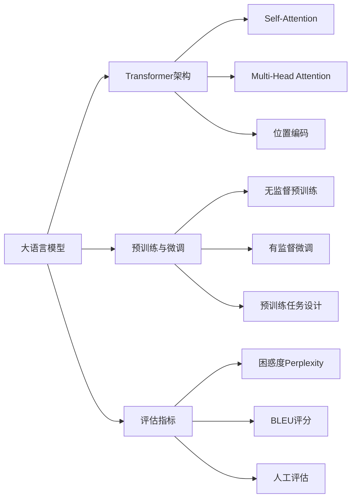

# 大语言模型应用指南：大语言模型的生态与未来

## 1. 背景介绍
### 1.1 大语言模型的发展历程
#### 1.1.1 早期的语言模型
#### 1.1.2 Transformer的出现
#### 1.1.3 预训练语言模型的兴起

### 1.2 大语言模型的定义与特点 
#### 1.2.1 大语言模型的定义
#### 1.2.2 大语言模型的关键特点
#### 1.2.3 大语言模型与传统语言模型的区别

### 1.3 大语言模型的应用前景
#### 1.3.1 自然语言处理领域的应用
#### 1.3.2 知识图谱与问答系统
#### 1.3.3 内容生成与创意辅助

## 2. 核心概念与联系
### 2.1 Transformer架构
#### 2.1.1 Self-Attention机制
#### 2.1.2 Multi-Head Attention
#### 2.1.3 位置编码

### 2.2 预训练与微调
#### 2.2.1 无监督预训练
#### 2.2.2 有监督微调
#### 2.2.3 预训练任务设计

### 2.3 语言模型评估指标
#### 2.3.1 困惑度(Perplexity)
#### 2.3.2 BLEU评分
#### 2.3.3 人工评估与对比



## 3. 核心算法原理具体操作步骤
### 3.1 Transformer的编码器
#### 3.1.1 输入嵌入
#### 3.1.2 位置编码
#### 3.1.3 Self-Attention计算
#### 3.1.4 前馈神经网络

### 3.2 Transformer的解码器  
#### 3.2.1 目标序列嵌入
#### 3.2.2 Masked Self-Attention
#### 3.2.3 Encoder-Decoder Attention
#### 3.2.4 前馈神经网络

### 3.3 预训练与微调流程
#### 3.3.1 大规模无标注语料的准备
#### 3.3.2 预训练目标的设定
#### 3.3.3 模型参数的微调
#### 3.3.4 下游任务的适配

## 4. 数学模型和公式详细讲解举例说明
### 4.1 Self-Attention的数学表示
给定一个由n个d维向量组成的序列 $X=(x_1,\dots,x_n),x_i \in \mathbb{R}^d$，Self-Attention的计算过程如下：

$$
\begin{aligned}
Q &= XW^Q \\
K &= XW^K \\
V &= XW^V \\
\text{Attention}(Q,K,V) &= \text{softmax}(\frac{QK^T}{\sqrt{d_k}})V
\end{aligned}
$$

其中，$W^Q,W^K,W^V \in \mathbb{R}^{d \times d_k}$ 是可学习的参数矩阵，$d_k$是一个缩放因子，通常取$d_k=d$。

### 4.2 Multi-Head Attention
Multi-Head Attention将Self-Attention进行了扩展，引入了多个独立的Attention Head：

$$
\begin{aligned}
\text{MultiHead}(Q,K,V) &= \text{Concat}(\text{head}_1,\dots,\text{head}_h)W^O \\
\text{head}_i &= \text{Attention}(QW_i^Q,KW_i^K,VW_i^V)
\end{aligned}
$$

其中，$W_i^Q \in \mathbb{R}^{d \times d_k}, W_i^K \in \mathbb{R}^{d \times d_k}, W_i^V \in \mathbb{R}^{d \times d_v}, W^O \in \mathbb{R}^{hd_v \times d}$。

### 4.3 位置编码
为了引入序列的位置信息，Transformer在输入嵌入中加入了位置编码。对于位置$pos$和维度$i$，位置编码定义为：

$$
\begin{aligned}
PE_{(pos,2i)} &= \sin(pos/10000^{2i/d}) \\
PE_{(pos,2i+1)} &= \cos(pos/10000^{2i/d})
\end{aligned}
$$

其中，$d$是嵌入维度。位置编码与词嵌入相加作为Transformer的输入。

## 5. 项目实践：代码实例和详细解释说明
下面以PyTorch为例，给出Transformer中Self-Attention的简要实现：

```python
import torch
import torch.nn as nn

class SelfAttention(nn.Module):
    def __init__(self, embed_dim, num_heads):
        super().__init__()
        self.embed_dim = embed_dim
        self.num_heads = num_heads
        self.head_dim = embed_dim // num_heads
        
        self.query = nn.Linear(embed_dim, embed_dim)
        self.key = nn.Linear(embed_dim, embed_dim)
        self.value = nn.Linear(embed_dim, embed_dim)
        
        self.softmax = nn.Softmax(dim=-1)
    
    def forward(self, x):
        batch_size, seq_len, embed_dim = x.size()
        
        q = self.query(x).view(batch_size, seq_len, self.num_heads, self.head_dim).transpose(1, 2)
        k = self.key(x).view(batch_size, seq_len, self.num_heads, self.head_dim).transpose(1, 2)
        v = self.value(x).view(batch_size, seq_len, self.num_heads, self.head_dim).transpose(1, 2)
        
        attn_scores = torch.matmul(q, k.transpose(-2, -1)) / (self.head_dim ** 0.5)
        attn_probs = self.softmax(attn_scores)
        
        output = torch.matmul(attn_probs, v).transpose(1, 2).contiguous().view(batch_size, seq_len, embed_dim)
        return output
```

这段代码实现了以下功能：
1. 初始化三个线性变换矩阵(query、key、value)，将输入映射到相应的空间。
2. 将输入张量x通过线性变换并reshape，得到q、k、v三个张量。
3. 计算注意力分数(attention scores)，即q与k的点积，并除以缩放因子。
4. 对注意力分数应用softmax，得到注意力概率分布。
5. 将注意力概率与值张量v相乘，得到加权后的输出表示。

通过这种方式，Self-Attention能够捕捉序列内的长距离依赖关系，成为Transformer的核心组件。在实际应用中，还需要搭配前馈神经网络、残差连接和Layer Normalization等组件，构建完整的Transformer模型。

## 6. 实际应用场景
### 6.1 机器翻译
大语言模型在机器翻译领域取得了显著进展。基于Transformer的神经机器翻译系统，如Google的GNMT和微软的MASS，在多个翻译任务上达到了业界领先水平。这些系统通过预训练和微调的方式，在大规模双语语料上学习语言间的映射关系，实现了高质量的翻译结果。

### 6.2 文本摘要
文本摘要旨在自动生成简明扼要的文本概括。基于Transformer的预训练语言模型，如BART和T5，在文本摘要任务上表现出色。通过在大规模文本语料上进行预训练，这些模型能够很好地理解和概括文本内容，生成流畅、连贯的摘要。在新闻、专利、学术文献等领域，文本摘要技术有广泛的应用前景。

### 6.3 对话系统
大语言模型为构建智能对话系统提供了新的思路。GPT系列模型展示了在开放域对话中生成流畅、自然的回复的能力。微软的DialoGPT和Google的Meena等对话模型，通过在大规模对话数据上进行预训练，能够进行多轮交互，理解上下文，并给出恰当的回应。这为客服机器人、智能助手等应用场景带来了新的机遇。

## 7. 工具和资源推荐
### 7.1 开源框架
- Hugging Face Transformers：包含多种SOTA语言模型的统一接口，方便模型的使用和微调。
- FairSeq：由Facebook开源的序列建模工具包，支持多种预训练模型。
- OpenAI GPT-2/GPT-3：OpenAI发布的强大语言模型，GPT-3在Few-shot学习上表现突出。

### 7.2 预训练模型
- BERT：Google发布的深度双向语言表示模型，在多个NLP任务上取得SOTA效果。
- RoBERTa：Facebook对BERT的改进版，通过更大的数据量和更多的训练时间获得更好的性能。
- XLNet：结合了自回归语言模型和BERT的优点，在多个任务上超越BERT。

### 7.3 评测基准
- GLUE：通用语言理解评测基准，包含9个自然语言理解任务。
- SuperGLUE：更具挑战性的自然语言理解评测基准，对模型的鲁棒性提出更高要求。
- SQuAD：大规模阅读理解数据集，要求模型根据给定问题从文章中找出答案。

## 8. 总结：未来发展趋势与挑战
### 8.1 模型的持续增大与优化
大语言模型的参数规模不断增长，从BERT的3.4亿到GPT-3的1750亿，模型容量的扩大带来了性能的提升。未来，如何在更大规模语料上训练更大的模型，同时兼顾效率和成本，是一个重要的研究方向。模型压缩、知识蒸馏等技术有望在此领域发挥作用。

### 8.2 低资源语言与多语言建模
大多数语言模型仍集中在英语等高资源语言上，对于许多低资源语言而言，缺乏足够的训练数据。如何利用多语言语料进行迁移学习，提高低资源语言的建模效果，是一个值得关注的问题。多语言预训练模型如XLM和mBART等，为这一方向提供了有益的探索。

### 8.3 知识融合与推理能力
尽管大语言模型展示了强大的语言理解和生成能力，但在复杂推理和知识融合方面仍有不足。如何将结构化知识与语言模型相结合，赋予模型更强的逻辑推理和常识判断能力，是自然语言理解领域的一大挑战。基于知识图谱的语言模型、神经符号推理等方向值得进一步探索。

### 8.4 可解释性与可控性
大语言模型的内部工作机制仍然是一个"黑箱"，缺乏可解释性。深入理解模型的决策过程，提供可解释的推理链条，有助于提高模型的可信度和适用性。此外，对于内容生成等任务，如何对模型的输出进行有效引导和控制，避免生成不当内容，也是亟待解决的问题。

## 9. 附录：常见问题与解答
### 9.1 预训练和微调的区别是什么？
预训练是在大规模无标注语料上进行的自监督学习过程，旨在学习通用的语言表示。微调是在特定任务的标注数据上进行的有监督学习，使预训练模型适应具体任务。预训练解决了语言模型的通用性，微调解决了模型的专用性。

### 9.2 Transformer相比RNN/LSTM有何优势？
Transformer通过Self-Attention机制实现了并行计算，克服了RNN/LSTM的顺序依赖问题，大大提高了训练效率。此外，Transformer能够更好地捕捉长距离依赖关系，在语言理解任务上取得了更优的效果。

### 9.3 如何处理预训练模型的泛化问题？
预训练模型在应用于下游任务时，可能面临泛化不足的问题。可以通过以下方法缓解：1)在目标领域数据上进行二次预训练；2)使用更多样化的微调数据；3)引入对抗训练、数据增强等正则化手段；4)进行模型集成，结合多个预训练模型的结果。

### 9.4 大语言模型在实际部署中的挑战有哪些？
大语言模型往往参数量巨大，推理速度较慢，给实际部署带来挑战。可以通过以下方式优化：