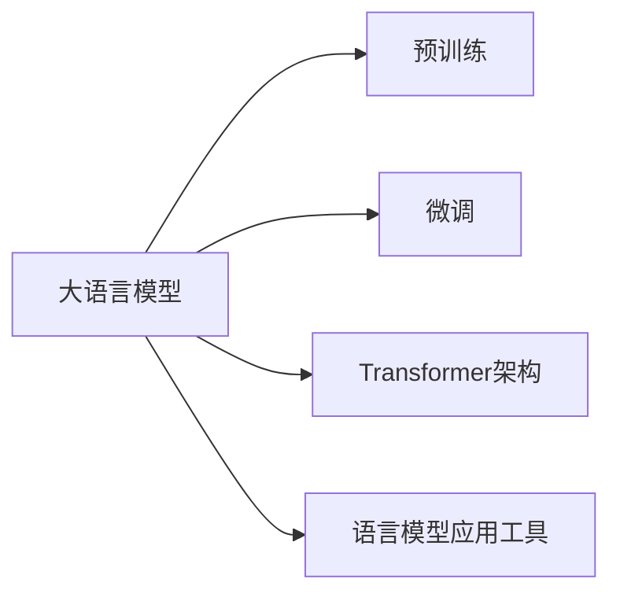

# 大语言模型应用指南：工具

## 1. 背景介绍

### 1.1 大语言模型的兴起

近年来,随着深度学习技术的快速发展,自然语言处理(NLP)领域取得了突破性进展。其中,大语言模型(Large Language Model,LLM)的出现标志着NLP进入了一个新的时代。大语言模型通过在海量文本数据上进行预训练,学习到了丰富的语言知识和通用语言表征,展现出了强大的语言理解和生成能力。

### 1.2 大语言模型的应用潜力

大语言模型为各种NLP应用任务提供了新的解决方案。传统的NLP任务如文本分类、命名实体识别、情感分析等,都可以利用大语言模型的语言理解能力来提升性能。此外,大语言模型还可以应用于对话系统、文本生成、知识问答等领域,极大地拓展了NLP技术的应用范围。大语言模型蕴含着巨大的应用潜力,正在推动NLP技术的快速发展和广泛应用。

### 1.3 大语言模型应用面临的挑战

尽管大语言模型展现出了令人瞩目的能力,但在实际应用中仍然面临着诸多挑战。首先,大语言模型通常包含海量的参数,训练和推理都需要大量的计算资源,这对于普通开发者和中小企业来说是一个障碍。其次,大语言模型虽然掌握了丰富的语言知识,但在特定领域的应用中可能缺乏专业知识,需要进行适当的微调和知识注入。此外,大语言模型生成的文本可能存在事实错误、逻辑不一致等问题,需要采取一定的策略来提高生成质量。

### 1.4 大语言模型应用工具的重要性

为了帮助开发者更好地利用大语言模型,涌现出了一系列大语言模型应用工具。这些工具旨在降低大语言模型的使用门槛,提供便捷的开发接口和丰富的功能,使得开发者无需深入了解模型细节就能快速构建基于大语言模型的应用。大语言模型应用工具的出现极大地促进了大语言模型在各个领域的应用,为NLP技术的普及和发展做出了重要贡献。

## 2. 核心概念与联系

### 2.1 大语言模型

大语言模型是指在大规模文本数据上预训练得到的语言模型。通过自监督学习的方式,大语言模型学习到了丰富的语言知识和通用语言表征,具备强大的语言理解和生成能力。代表性的大语言模型包括BERT、GPT、T5等。

### 2.2 预训练与微调

预训练是大语言模型的关键步骤,通过在海量无标注文本数据上进行自监督学习,模型学习到了通用的语言表征。微调是将预训练好的大语言模型应用于特定任务的过程,通过在任务相关的标注数据上进行监督学习,使模型适应特定任务的需求。

### 2.3 Transformer架构

Transformer是大语言模型的核心架构,由自注意力机制和前馈神经网络组成。自注意力机制允许模型在处理输入序列时考虑序列中不同位置之间的依赖关系,捕捉长距离的语义信息。Transformer架构的引入极大地提升了语言模型的性能。

### 2.4 语言模型应用工具

语言模型应用工具是为了方便开发者使用大语言模型而开发的软件工具和框架。这些工具通常提供了易用的API接口、丰富的功能模块以及预训练好的模型权重,使得开发者可以快速构建基于大语言模型的应用。



## 3. 核心算法原理具体操作步骤

### 3.1 大语言模型的预训练

1. 准备大规模无标注文本数据集
2. 对文本数据进行预处理,如分词、构建词典等
3. 根据Transformer架构构建语言模型
4. 定义预训练任务,如掩码语言模型(MLM)、下一句预测(NSP)等
5. 在文本数据上进行自监督学习,优化语言模型参数
6. 保存预训练好的语言模型权重

### 3.2 大语言模型的微调

1. 准备特定任务的标注数据集
2. 加载预训练好的语言模型权重
3. 根据任务需求修改模型结构,如添加分类头、序列标注头等
4. 在标注数据集上进行监督学习,优化模型参数
5. 评估微调后的模型在任务上的性能
6. 保存微调后的模型权重

### 3.3 语言模型应用工具的使用

1. 安装语言模型应用工具及其依赖
2. 加载预训练好的语言模型权重或使用工具提供的API接口
3. 根据任务需求选择合适的功能模块,如文本分类、命名实体识别等
4. 准备任务相关的输入数据
5. 调用工具提供的API接口,传入输入数据并获取输出结果
6. 对输出结果进行后处理和应用

## 4. 数学模型和公式详细讲解举例说明

### 4.1 Transformer的自注意力机制

Transformer的自注意力机制是其核心组件之一。给定一个输入序列$X = (x_1, x_2, ..., x_n)$,自注意力机制的计算过程如下:

1. 将输入序列$X$通过三个线性变换得到查询矩阵$Q$、键矩阵$K$和值矩阵$V$:

$$
Q = XW^Q, K = XW^K, V = XW^V
$$

其中,$W^Q$、$W^K$和$W^V$是可学习的参数矩阵。

2. 计算查询矩阵$Q$和键矩阵$K$的注意力分数:

$$
A = \text{softmax}(\frac{QK^T}{\sqrt{d_k}})
$$

其中,$d_k$是查询和键向量的维度,用于缩放点积结果。

3. 将注意力分数$A$与值矩阵$V$相乘,得到自注意力的输出:

$$
\text{Attention}(Q, K, V) = AV
$$

通过自注意力机制,模型可以学习到输入序列中不同位置之间的依赖关系,捕捉长距离的语义信息。

### 4.2 掩码语言模型(MLM)

掩码语言模型是大语言模型预训练的常用任务之一。给定一个输入序列,随机掩盖其中的一部分词元,然后让模型预测被掩盖的词元。假设输入序列为$X = (x_1, x_2, ..., x_n)$,掩码后的序列为$\tilde{X} = (\tilde{x}_1, \tilde{x}_2, ..., \tilde{x}_n)$,其中被掩盖的词元用特殊符号[MASK]表示。模型的目标是最大化被掩盖词元的对数似然概率:

$$
\mathcal{L}_{\text{MLM}} = -\sum_{i=1}^{n} m_i \log P(x_i | \tilde{X})
$$

其中,$m_i$是指示变量,表示第$i$个词元是否被掩盖,$P(x_i | \tilde{X})$是模型预测第$i$个词元为$x_i$的概率。通过优化MLM任务,模型可以学习到词元之间的上下文关系,掌握语言的语法和语义知识。

## 5. 项目实践:代码实例和详细解释说明

下面是使用Hugging Face的Transformers库进行大语言模型微调的示例代码:

```python
from transformers import AutoTokenizer, AutoModelForSequenceClassification, TrainingArguments, Trainer
from datasets import load_dataset

# 加载预训练的tokenizer和模型
model_name = "bert-base-uncased"
tokenizer = AutoTokenizer.from_pretrained(model_name)
model = AutoModelForSequenceClassification.from_pretrained(model_name, num_labels=2)

# 加载数据集
dataset = load_dataset("glue", "mrpc")

# 定义数据预处理函数
def preprocess_function(examples):
    return tokenizer(examples["sentence1"], examples["sentence2"], truncation=True, padding=True)

# 对数据集应用预处理函数
encoded_dataset = dataset.map(preprocess_function, batched=True)

# 定义训练参数
training_args = TrainingArguments(
    output_dir="./results",
    evaluation_strategy="epoch",
    learning_rate=2e-5,
    per_device_train_batch_size=16,
    per_device_eval_batch_size=16,
    num_train_epochs=3,
)

# 定义Trainer
trainer = Trainer(
    model=model,
    args=training_args,
    train_dataset=encoded_dataset["train"],
    eval_dataset=encoded_dataset["validation"],
)

# 开始微调
trainer.train()
```

以上代码的详细解释如下:

1. 首先,我们加载了预训练的BERT tokenizer和模型。这里使用的是"bert-base-uncased"模型,它是一个基于英文语料预训练的BERT模型。
2. 接着,我们加载了GLUE数据集中的MRPC任务数据集,该任务是一个句子对分类任务,用于判断两个句子是否是语义相似的。
3. 定义了一个数据预处理函数`preprocess_function`,该函数接受一个样本,对句子对进行tokenize,并进行截断和填充,返回编码后的输入。
4. 使用`map`函数对整个数据集应用预处理函数,得到编码后的数据集。
5. 定义了训练参数`TrainingArguments`,包括输出目录、评估策略、学习率、批大小和训练轮数等。
6. 定义了`Trainer`对象,传入模型、训练参数、训练集和验证集。
7. 调用`trainer.train()`开始微调过程,模型将在训练集上进行训练,并在每个epoch结束后在验证集上进行评估。

通过以上步骤,我们就可以使用预训练的BERT模型在特定任务上进行微调,从而获得针对该任务的高性能模型。

## 6. 实际应用场景

大语言模型及其应用工具在各个领域都有广泛的应用,下面列举几个典型的应用场景:

### 6.1 智能客服

利用大语言模型的语言理解和生成能力,可以构建智能客服系统。客服机器人可以自动理解用户的问题,并根据知识库生成恰当的回答,提供24小时不间断的客户服务。大语言模型还可以通过学习历史客服记录,不断优化回答质量。

### 6.2 内容生成

大语言模型强大的文本生成能力可以应用于内容生成领域。例如,可以利用大语言模型自动生成新闻摘要、产品描述、广告文案等。通过微调技术,可以使生成的内容符合特定领域或风格的要求。大语言模型还可以辅助创作,为作家提供写作灵感和素材。

### 6.3 知识问答

大语言模型可以用于构建知识问答系统。通过在海量文本数据上预训练,大语言模型学习到了丰富的世界知识。结合知识图谱等技术,可以实现对复杂问题的理解和回答。大语言模型还可以通过持续学习,不断扩充和更新知识库。

### 6.4 情感分析

大语言模型可以应用于情感分析任务,自动判断文本中蕴含的情感倾向。通过在情感标注数据上微调,大语言模型可以学习到情感表达的特征和规律。情感分析可以用于舆情监测、产品评论分析、客户反馈分析等场景,帮助企业及时了解用户的情感反馈。

### 6.5 机器翻译

大语言模型可以用于构建高质量的机器翻译系统。通过在大规模双语语料上预训练,大语言模型可以学习到语言之间的对应关系和翻译规律。结合注意力机制和编解码器架构,大语言模型可以生成流畅自然的译文。大语言模型还可以通过持续学习,不断提升翻译质量。

## 7. 工具和资源推荐

### 7.1 开源大语言模型

- BERT: Google开源的预训练语言模型,支持多种语言,在各种NLP任务上取得了state-of-the-art的结果。
- GPT系列: OpenAI开发