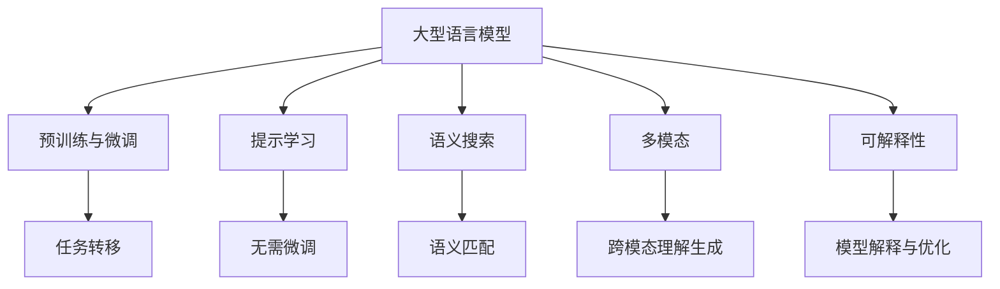

# 大语言模型应用指南：工具

## 1.背景介绍

随着人工智能和机器学习技术的不断发展,大型语言模型(Large Language Models, LLMs)已成为当前最炙手可热的技术之一。这些模型通过在海量文本数据上进行训练,掌握了丰富的自然语言理解和生成能力,可以用于多种自然语言处理任务,如机器翻译、文本摘要、问答系统等。

大型语言模型的核心是基于Transformer架构的深度神经网络,通过自注意力机制捕捉文本中的长程依赖关系,从而更好地理解和生成上下文连贯的自然语言。代表性模型包括GPT(Generative Pre-trained Transformer)系列、BERT(Bidirectional Encoder Representations from Transformers)、T5(Text-to-Text Transfer Transformer)等。

这些模型在学术界和工业界均有广泛应用,为各种智能化应用提供了强大的自然语言处理能力。然而,训练和部署大型语言模型也面临诸多挑战,如庞大的计算资源需求、隐私和安全风险等。因此,如何高效利用和管理这些模型,成为当前研究的重点课题。

## 2.核心概念与联系

### 2.1 预训练与微调(Pre-training & Fine-tuning)

大型语言模型通常采用两阶段训练策略:

1. **预训练(Pre-training)**: 在海量无标注文本数据上进行自监督训练,学习通用的语言表示能力。
2. **微调(Fine-tuning)**: 在特定任务的标注数据上进行进一步训练,将通用语言表示能力转移到目标任务。

预训练和微调的分离使得大型语言模型可以在不同任务之间灵活转移,提高了训练效率和性能表现。

### 2.2 提示学习(Prompt Learning)

提示学习是一种将任务指令编码为文本提示,输入给大型语言模型的新范式。通过设计合理的提示模板,可以指导模型生成所需的输出,而无需对模型进行昂贵的从头微调训练。

提示学习的关键在于如何构建高质量的提示,以充分利用模型的语言理解能力。常见的提示构建方法包括手工设计、自动搜索等。

### 2.3 语义搜索(Semantic Search)

大型语言模型擅长捕捉文本的语义信息,可用于构建高效的语义搜索引擎。通过将查询和文档映射到共同的语义空间,可以根据语义相似性进行匹配和排序,显著提高搜索质量。

语义搜索的优势在于可以跨越词汇差异,理解查询意图,从而返回更相关的结果。这对于处理自然语言查询和查找语义相关文档特别有用。

### 2.4 多模态(Multimodality)

除了处理文本数据,一些新兴的大型语言模型还集成了对图像、视频等多模态数据的处理能力。这种多模态模型可以同时理解和生成不同类型的数据,为多模态智能系统的构建提供了强大的基础。

多模态模型通常采用统一的Transformer编码器-解码器架构,将不同模态的数据映射到共同的表示空间,从而实现跨模态的理解和生成。典型模型包括DALL-E、Flamingo等。

### 2.5 可解释性(Interpretability)

虽然大型语言模型表现出惊人的语言理解和生成能力,但它们的内部工作机制往往是一个"黑箱"。提高模型的可解释性,有助于我们理解模型是如何捕捉和利用语言知识的,从而进一步优化模型设计和训练过程。

可解释性研究通常从模型参数、注意力机制、语言探测等多个角度入手,试图解开模型内部的"神秘面纱"。这不仅有助于我们更好地理解和控制模型行为,还可以提高模型的可靠性和公平性。

## 3.核心算法原理具体操作步骤

### 3.1 Transformer架构

Transformer是大型语言模型的核心架构,由编码器(Encoder)和解码器(Decoder)组成。它通过自注意力机制捕捉输入序列中的长程依赖关系,从而更好地理解和生成上下文连贯的文本。

1. **编码器(Encoder)**
   - 将输入序列(如句子)映射到连续的向量表示
   - 由多个相同的层组成,每层包含两个子层:
     - 多头自注意力(Multi-Head Attention)
     - 前馈全连接网络(Feed-Forward Neural Network)
   - 自注意力机制使每个位置的向量可以关注整个输入序列的信息

2. **解码器(Decoder)**
   - 将编码器输出和输入序列(如前文)映射到目标序列(如翻译结果)
   - 类似于编码器,也由多个相同层组成
   - 除了编码器的两个子层,还包含一个对编码器输出的注意力子层

3. **注意力机制(Attention Mechanism)**
   - 自注意力(Self-Attention): 计算当前位置与输入序列其他位置的相关性
   - 编码器-解码器注意力(Encoder-Decoder Attention): 计算解码器当前位置与编码器输出的相关性
   - 多头注意力(Multi-Head Attention): 从不同"注视角度"捕捉不同的相关模式

4. **位置编码(Positional Encoding)**
   - 因为Transformer没有递归或卷积结构,无法直接获取序列的位置信息
   - 通过将位置编码相加到输入的嵌入向量,赋予每个位置的向量位置信息

5. **掩码(Masking)**
   - 在训练时,对未预测的目标序列位置进行掩码,确保模型不会违反自回归属性
   - 在推理时,对已生成的序列进行掩码,防止模型利用未来信息

通过上述机制,Transformer架构可以高效地捕捉长程依赖关系,从而在各种序列到序列的任务上取得优异表现。

### 3.2 自监督预训练

大型语言模型通常采用自监督预训练的方式,在大规模无标注文本数据上学习通用的语言表示能力。常见的预训练目标包括:

1. **掩码语言模型(Masked Language Modeling, MLM)**
   - 随机掩码部分输入token
   - 根据上下文,预测被掩码的token
   - 例如BERT模型采用该目标

2. **下一句预测(Next Sentence Prediction, NSP)** 
   - 判断两个句子是否为连续句子
   - 辅助模型捕捉句子间的连贯性
   - 例如BERT模型同时使用MLM和NSP目标

3. **因果语言模型(Causal Language Modeling, CLM)**
   - 基于前文,预测下一个token
   - 例如GPT模型采用该目标

4. **蒸馏(Distillation)**
   - 使用一个大模型(Teacher)指导另一个小模型(Student)
   - 通过知识蒸馏,压缩大模型,获得小型高效模型

5. **对比学习(Contrastive Learning)**
   - 最大化正样本对的相似度,最小化负样本对的相似度
   - 学习文本的有效语义表示

通过自监督预训练,大型语言模型可以从海量无标注数据中学习丰富的语言知识,为下游任务奠定基础。

### 3.3 微调策略

在完成自监督预训练后,大型语言模型通常需要在特定任务的标注数据上进行进一步微调,将通用语言表示能力转移到目标任务。常见的微调策略包括:

1. **全模型微调(Full Model Fine-tuning)**
   - 对整个预训练模型的所有参数进行微调
   - 计算成本较高,但性能通常最优

2. **前馈层微调(Featurized Fine-tuning)**
   - 只微调模型的前馈层,保持其他层(如Transformer层)冻结
   - 计算成本较低,适合小数据集场景

3. **前缀微调(Prefix-tuning)**
   - 在输入序列前添加一个小的前缀(Prefix),将其作为新参数进行微调
   - 无需修改预训练模型参数,更新代价小

4. **提示微调(Prompt-tuning)**
   - 将任务指令编码为文本提示,输入给预训练模型
   - 通过微调提示模板参数,指导模型生成所需输出

5. **示例微调(Instruction-tuning)**
   - 在训练数据中加入任务示例(Instructions)
   - 模型通过学习示例,自动生成任务提示

不同的微调策略在计算资源需求、性能表现等方面有所权衡。合理选择策略对于充分利用大型语言模型至关重要。

### 3.4 生成策略

在自然语言生成任务中,大型语言模型需要根据上下文生成连贯、流畅的文本输出。常见的生成策略包括:

1. **贪婪搜索(Greedy Search)**
   - 每个时间步选择概率最大的token
   - 简单高效,但可能导致次优解

2. **Beam Search**
   - 每个时间步保留概率最高的k个候选序列
   - 通过扩展搜索空间,提高生成质量

3. **Top-k/Top-p采样(Top-k/Top-p Sampling)**
   - 从概率分布的前k个token或累积概率达到p的token中采样
   - 增加生成的多样性,避免重复性

4. **温度采样(Temperature Sampling)**
   - 对概率分布进行重新缩放,控制生成的随机性
   - 高温度增加多样性,低温度增加确定性

5. **无偏对数采样(Unbiased Logit Sampling)**
   - 对概率分布进行无偏修正,减少生成的重复性
   - 常与温度采样等策略结合使用

6. **层次生成(Hierarchical Generation)**
   - 先生成高层次的文本大纲,再逐步细化生成段落和句子
   - 有利于生成长文本,保持连贯性和逻辑性

选择合适的生成策略对于控制大型语言模型的输出质量至关重要,需要根据具体任务和要求进行权衡。

## 4.数学模型和公式详细讲解举例说明

### 4.1 Transformer架构

Transformer架构的核心是自注意力机制,它能够捕捉输入序列中任意两个位置之间的依赖关系。给定一个长度为n的输入序列$X = (x_1, x_2, \dots, x_n)$,自注意力机制计算每个位置$i$与所有位置$j$的注意力权重$\alpha_{ij}$,并据此生成该位置的表示向量$z_i$:

$$z_i = \sum_{j=1}^n \alpha_{ij} (Wx_j)$$

其中$W$是一个可学习的权重矩阵,用于将输入向量$x_j$映射到注意力空间。注意力权重$\alpha_{ij}$通过以下公式计算:

$$\alpha_{ij} = \frac{exp(e_{ij})}{\sum_{k=1}^n exp(e_{ik})}$$
$$e_{ij} = \frac{(Wx_i)^T(Wx_j)}{\sqrt{d}}$$

这里$d$是注意力空间的维度,用于缩放点积值,防止过大或过小的值导致梯度消失或梯度爆炸。

多头注意力机制(Multi-Head Attention)则是将多个注意力子空间的结果拼接,以捕捉不同的依赖关系模式:

$$\text{MultiHead}(Q, K, V) = \text{Concat}(head_1, \dots, head_h)W^O$$
$$\text{where } head_i = \text{Attention}(QW_i^Q, KW_i^K, VW_i^V)$$

其中$Q$、$K$、$V$分别表示查询(Query)、键(Key)和值(Value)向量,通过不同的投影矩阵$W_i^Q$、$W_i^K$、$W_i^V$得到每个头的子空间表示,最后通过$W^O$进行线性变换。

### 4.2 预训练目标

掩码