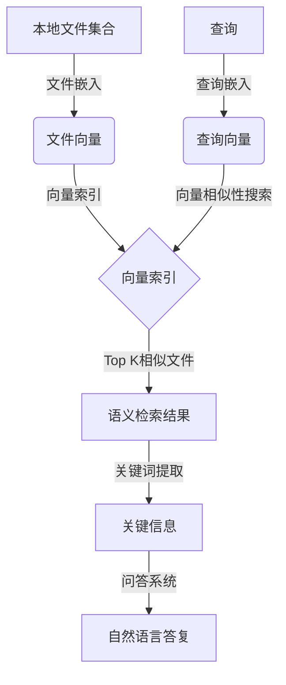

# 大语言模型应用指南：本地文件浏览

## 1.背景介绍

随着人工智能技术的不断发展,大型语言模型(Large Language Models, LLM)近年来取得了长足的进步,其强大的文本生成和理解能力正在为各个领域带来革命性的变化。其中,本地文件浏览是一个非常实用且具有广泛应用前景的场景。

本地文件通常包括个人电脑、移动设备或企业服务器上的文档、电子表格、PDF文件、图像等多种格式的数据。由于隐私和安全的考虑,这些文件往往无法上传到云端进行处理。因此,如何在本地高效地利用大语言模型的能力来处理和管理这些文件,成为了一个亟待解决的问题。

### 1.1 本地文件处理的挑战

相比于云端数据,本地文件处理面临以下几个主要挑战:

1. **隐私和安全**: 许多文件包含敏感信息,不能上传到云端,需要在本地进行处理。
2. **多种文件格式**: 文档、电子表格、PDF、图像等多种格式的文件需要进行统一处理。
3. **数据量大**: 个人或企业往往拥有大量的本地文件,需要高效的索引和检索方式。
4. **上下文理解**: 理解文件内容的上下文语义,提供准确的查询和分析。

### 1.2 大语言模型的优势

大语言模型具有以下优势,可以很好地应对本地文件处理的挑战:

1. **强大的文本理解能力**: 能够深入理解文本的语义,提取关键信息。
2. **多模态处理能力**: 最新模型能够同时处理文本、图像等多种模态数据。
3. **泛化能力强**: 可以在有限的训练数据上学习知识,并应用到新的场景。
4. **高效的检索能力**: 支持语义级别的相似性匹配和检索。

## 2.核心概念与联系

### 2.1 文件嵌入(File Embedding)

文件嵌入是将文件的内容映射到一个固定长度的向量空间中,使得语义相似的文件在向量空间中距离更近。这是实现高效文件检索和语义理解的基础。常用的文件嵌入方法有:

- 基于Transformer模型的文本嵌入,如BERT、RoBERTa等
- 基于视觉Transformer模型的图像/PDF嵌入,如ViT、CLIP等
- 融合文本和视觉信息的多模态嵌入,如DALL-E、Flamingo等

### 2.2 向量相似性搜索(Vector Similarity Search)

向量相似性搜索是指在向量空间中快速找到与查询向量最相似的若干个向量。这是实现高效文件检索的关键技术。常用的相似性度量方法有:

- 余弦相似度(Cosine Similarity)
- 内积(Inner Product)
- 欧氏距离(Euclidean Distance)

常用的高效向量相似性搜索算法有:

- 基于树的算法,如球树(Ball Tree)、KD树等
- 基于哈希的算法,如局部敏感哈希(LSH)、随机投影等
- 基于图的算法,如邻居敏感哈希(NSW)、HNSW等
- 基于矩阵分解的算法,如SVD、PCA等

### 2.3 语义检索(Semantic Retrieval)

语义检索是指根据查询的语义,从文件集合中检索出最相关的文件。这需要结合文件嵌入和向量相似性搜索技术。典型的语义检索流程包括:

1. 对文件集合进行文件嵌入,获得文件向量
2. 构建高效的向量索引
3. 将查询转换为查询向量
4. 在向量索引中搜索与查询向量最相似的文件向量
5. 返回对应的文件作为检索结果

### 2.4 关键词提取(Keyword Extraction)

关键词提取是从文本中自动识别出最能概括文本主题的一些词语或短语。这对于快速浏览和理解文件内容非常有帮助。常用的关键词提取方法有:

- 基于统计的方法,如TF-IDF、TextRank等
- 基于主题模型的方法,如LDA等
- 基于深度学习的方法,如序列标注模型、Transformer等

### 2.5 问答系统(Question Answering)

问答系统能够根据用户的自然语言问题,从文件集合中检索相关的片段,并生成准确的答案。这需要结合语义检索、关键词提取、阅读理解等多种技术。常用的问答系统架构有:

- 检索式问答(Retrieval-based QA)
- 生成式问答(Generative QA)
- 混合式问答(Hybrid QA)



上图展示了本地文件浏览的核心流程,包括文件嵌入、向量索引、语义检索、关键词提取和问答系统等关键环节。通过有机结合这些技术,可以高效地检索和理解本地文件的内容,为用户提供自然语言的交互方式。

## 3.核心算法原理具体操作步骤

### 3.1 文件嵌入

文件嵌入的目标是将文件的内容映射到一个固定长度的向量空间中,使得语义相似的文件在向量空间中距离更近。常用的文件嵌入方法包括:

#### 3.1.1 基于Transformer的文本嵌入

对于文本文件,我们可以使用预训练的Transformer模型(如BERT、RoBERTa等)来获取文本的嵌入向量。具体步骤如下:

1. 对文本进行分词和标记化处理
2. 将分词后的文本输入到Transformer模型中
3. 从Transformer的最后一层获取[CLS]标记对应的向量作为文本嵌入

例如,使用HuggingFace的Transformers库,我们可以如下获取文本嵌入:

```python
from transformers import AutoTokenizer, AutoModel

tokenizer = AutoTokenizer.from_pretrained("bert-base-uncased")
model = AutoModel.from_pretrained("bert-base-uncased")

text = "This is a sample text for embedding."
inputs = tokenizer(text, return_tensors="pt")
outputs = model(**inputs)
embedding = outputs.last_hidden_state[:, 0, :]
```

#### 3.1.2 基于视觉Transformer的图像/PDF嵌入

对于图像或PDF文件,我们可以使用预训练的视觉Transformer模型(如ViT、CLIP等)来获取图像的嵌入向量。具体步骤如下:

1. 对图像进行预处理,如缩放、归一化等
2. 将预处理后的图像输入到视觉Transformer模型中
3. 从Transformer的最后一层获取[CLS]标记对应的向量作为图像嵌入

例如,使用PyTorch的timm库,我们可以如下获取图像嵌入:

```python
import timm
import torch
from PIL import Image

model = timm.create_model('vit_base_patch16_224', pretrained=True)
image = Image.open("sample.jpg")
inputs = timm.data.resolve_data_config({}, model=model)['input_size'][-2:]
transform = timm.data.create_transform(**inputs)
tensor = transform(image).unsqueeze(0)
with torch.no_grad():
    embedding = model(tensor).last_hidden_state[:, 0]
```

#### 3.1.3 基于多模态模型的融合嵌入

对于包含文本和图像的多模态文件,我们可以使用预训练的多模态模型(如DALL-E、Flamingo等)来同时获取文本和图像的融合嵌入向量。具体步骤如下:

1. 对文本和图像进行预处理
2. 将预处理后的文本和图像输入到多模态模型中
3. 从模型的最后一层获取融合后的嵌入向量

例如,使用HuggingFace的Transformers库,我们可以如下获取多模态嵌入:

```python
from transformers import AutoTokenizer, AutoModel

tokenizer = AutoTokenizer.from_pretrained("google/vit-base-patch16-224")
model = AutoModel.from_pretrained("google/vit-base-patch16-224")

text = "This is a sample text."
image = Image.open("sample.jpg")
inputs = tokenizer(text, images=image, return_tensors="pt")
outputs = model(**inputs)
embedding = outputs.last_hidden_state[:, 0, :]
```

### 3.2 向量相似性搜索

向量相似性搜索是指在向量空间中快速找到与查询向量最相似的若干个向量。这是实现高效文件检索的关键技术。常用的相似性度量方法和高效搜索算法包括:

#### 3.2.1 相似性度量

- **余弦相似度(Cosine Similarity)**

余弦相似度衡量两个向量的方向夹角,取值范围在[-1, 1]之间,值越大表示两个向量越相似。计算公式如下:

$$\text{CosineSimilarity}(u, v) = \frac{u \cdot v}{\|u\| \|v\|}$$

其中$u$和$v$分别表示两个向量,$\cdot$表示向量点积,$ \| \cdot \|$表示向量的$L_2$范数。

- **内积(Inner Product)**

内积直接计算两个向量的乘积,值越大表示两个向量越相似。计算公式如下:

$$\text{InnerProduct}(u, v) = u \cdot v$$

- **欧氏距离(Euclidean Distance)**

欧氏距离衡量两个向量在空间中的直线距离,值越小表示两个向量越相似。计算公式如下:

$$\text{EuclideanDistance}(u, v) = \sqrt{\sum_{i=1}^{n}(u_i - v_i)^2}$$

其中$n$表示向量的维度。

#### 3.2.2 高效搜索算法

- **基于树的算法**

基于树的算法将向量空间划分为多个区域,每个区域由一个节点表示。在搜索时,可以根据查询向量的位置快速剪枝,减少搜索空间。常用的算法包括球树(Ball Tree)、KD树等。

- **基于哈希的算法**

基于哈希的算法将向量映射到一个短的二进制码(哈希值),相似的向量会被映射到相同或相近的哈希值。在搜索时,只需要比较哈希值,大大减少了计算量。常用的算法包括局部敏感哈希(LSH)、随机投影等。

- **基于图的算法**

基于图的算法将向量表示为图中的节点,相似的向量通过边相连。在搜索时,可以从查询向量出发,沿着边遍历相似的向量。常用的算法包括邻居敏感哈希(NSW)、HNSW等。

- **基于矩阵分解的算法**

基于矩阵分解的算法将向量空间分解为多个低维子空间,在低维空间中进行搜索,然后将结果映射回原始空间。常用的算法包括SVD、PCA等。

下面以基于图的HNSW算法为例,介绍具体的搜索步骤:

1. **构建HNSW图**

   - 初始化一个空图
   - 遍历所有向量,将其插入图中
   - 对于每个新插入的向量,找到其最近邻居,并建立边连接

2. **搜索最近邻向量**

   - 从图的入口节点开始
   - 遍历当前节点的邻居,找到距离查询向量最近的节点
   - 重复上一步,直到找到足够多的最近邻向量

上述算法的时间复杂度约为$O(n^{0.5})$,比暴力搜索的$O(n)$更高效。通过调节算法参数,可以在搜索精度和速度之间进行权衡。

### 3.3 语义检索

语义检索是指根据查询的语义,从文件集合中检索出最相关的文件。这需要结合文件嵌入和向量相似性搜索技术。典型的语义检索流程包括:

1. **文件嵌入**

   - 对文件集合进行文件嵌入,获得文件向量
   - 可以使用上述介绍的文本嵌入、图像嵌入或多模态嵌入方法

2. **构建向量索引**

   - 使