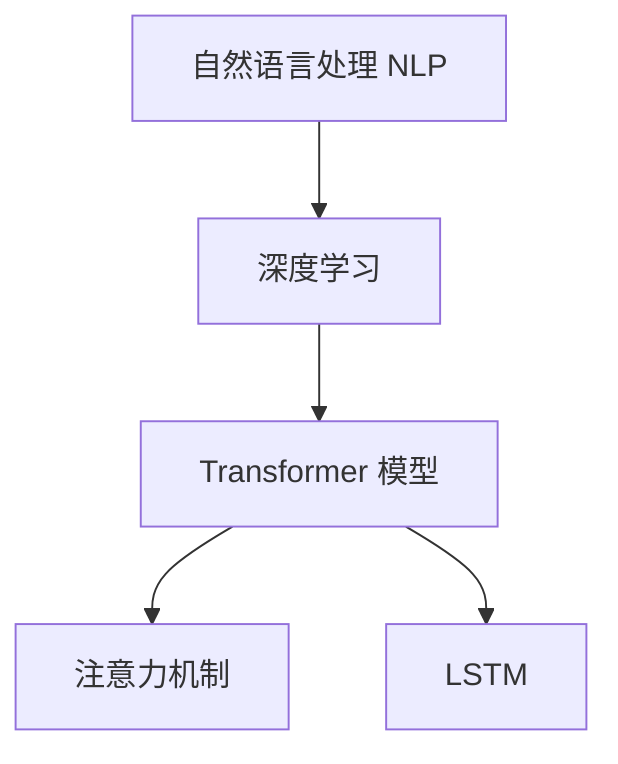
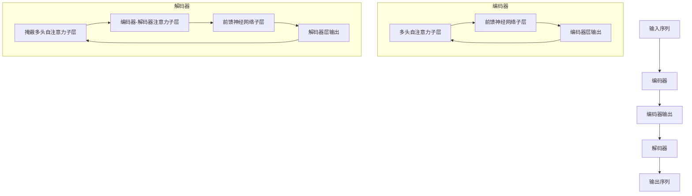

# 大语言模型应用指南：长短期记忆

## 1.背景介绍

### 1.1 什么是大语言模型?

大语言模型(Large Language Model, LLM)是一种基于深度学习的自然语言处理(NLP)模型,能够理解和生成人类语言。它们通过在大量文本数据上进行训练,学习语言的模式和规则,从而获得对语言的深入理解。

大语言模型的规模通常由它们包含的参数数量来衡量,参数越多,模型就越大、能力越强。例如,GPT-3 拥有 1750 亿个参数,而之前的语言模型通常只有几十亿个参数。

### 1.2 为什么需要大语言模型?

传统的 NLP 系统通常专注于特定任务,如机器翻译、问答系统或文本摘要等。然而,大语言模型具有通用性,可以在训练后应用于广泛的 NLP 任务,而无需为每个任务重新训练模型。这种通用性使得大语言模型成为 NLP 领域的重大突破。

大语言模型还展现出惊人的语言理解和生成能力,可以产生看似人类水平的文本输出。这为智能助手、内容创作、代码生成等应用带来了新的可能性。

## 2.核心概念与联系

### 2.1 自然语言处理(NLP)

自然语言处理是人工智能的一个分支,旨在使计算机能够理解和生成人类语言。NLP 技术广泛应用于机器翻译、问答系统、文本摘要、情感分析等领域。

### 2.2 深度学习

深度学习是机器学习的一种技术,它使用具有多个隐藏层的人工神经网络来模拟人脑的工作原理,从而实现对复杂数据的学习和模式识别。

### 2.3 transformer 模型

Transformer 是一种革命性的深度学习模型,它完全基于注意力机制,不需要复杂的递归或卷积结构。Transformer 模型在 2017 年被提出,用于机器翻译任务,后来也被应用于其他 NLP 任务。

大语言模型通常采用 Transformer 的编码器-解码器架构,其中编码器负责理解输入,解码器负责生成输出。

### 2.4 注意力机制(Attention Mechanism)

注意力机制是 Transformer 模型的核心,它允许模型在处理序列数据时,动态地关注输入序列的不同部分,并捕捉它们之间的长期依赖关系。这使得模型能够更好地理解和生成长序列的文本。

### 2.5 长短期记忆(LSTM)

长短期记忆(Long Short-Term Memory, LSTM)是一种特殊的递归神经网络,它旨在解决传统递归神经网络在处理长序列数据时容易出现的梯度消失或爆炸问题。

虽然大语言模型通常采用 Transformer 架构,但 LSTM 在一些特定任务中仍然有应用,例如语音识别和机器翻译。



## 3.核心算法原理具体操作步骤

### 3.1 Transformer 模型架构

Transformer 模型由编码器(Encoder)和解码器(Decoder)两个主要部分组成。

#### 3.1.1 编码器(Encoder)

编码器的主要作用是处理输入序列,并构建其语义表示。它由多个相同的层组成,每一层都包含两个子层:

1. **多头自注意力子层(Multi-Head Attention Sublayer)**
   - 这个子层执行自注意力操作,允许每个单词关注整个输入序列的其他单词,捕捉它们之间的依赖关系。
   - 多头注意力机制可以从不同的表示子空间关注不同的位置,这有助于捕捉更复杂的模式。

2. **前馈神经网络子层(Feed-Forward Neural Network Sublayer)**
   - 这个子层对每个单词的表示应用两个线性变换,并在中间使用 ReLU 激活函数。
   - 它可以被视为对输入进行非线性变换,以获得更高级的特征表示。

编码器的每一层都会产生一个新的表示,并将其传递给下一层,直到最后一层输出最终的编码表示。

#### 3.1.2 解码器(Decoder)

解码器的作用是基于编码器的输出和目标序列的前缀,生成目标序列的输出。它也是由多个相同的层组成,每一层包含三个子层:

1. **掩蔽多头自注意力子层(Masked Multi-Head Attention Sublayer)**
   - 这个子层执行自注意力操作,但会掩蔽掉当前位置之后的所有单词,以确保模型只能关注已生成的单词。

2. **编码器-解码器注意力子层(Encoder-Decoder Attention Sublayer)**
   - 这个子层执行注意力操作,关注编码器的输出,以捕捉输入序列和输出序列之间的依赖关系。

3. **前馈神经网络子层(Feed-Forward Neural Network Sublayer)**
   - 与编码器中的子层相同,对每个单词的表示应用非线性变换。

解码器的每一层都会产生一个新的表示,并将其传递给下一层,直到最后一层输出预测的单词概率分布。

总的来说,Transformer 模型通过自注意力机制和编码器-解码器架构,能够有效地捕捉输入和输出序列之间的长期依赖关系,从而实现高质量的序列到序列的转换。



### 3.2 注意力机制(Attention Mechanism)

注意力机制是 Transformer 模型的核心,它允许模型在处理序列数据时,动态地关注输入序列的不同部分,并捕捉它们之间的长期依赖关系。

#### 3.2.1 缩放点积注意力(Scaled Dot-Product Attention)

缩放点积注意力是 Transformer 中使用的基本注意力机制。它包括以下步骤:

1. 计算查询(Query)、键(Key)和值(Value)的表示:
   - 查询 $Q$ 表示当前单词
   - 键 $K$ 和值 $V$ 表示整个输入序列

2. 计算注意力权重:
   - 注意力权重 $\text{Attention}(Q, K, V) = \text{softmax}(\frac{QK^T}{\sqrt{d_k}})V$
   - 其中 $d_k$ 是缩放因子,用于防止点积过大导致梯度消失或爆炸

3. 将注意力权重与值 $V$ 相乘,得到加权和表示。

通过这种方式,模型可以动态地关注输入序列的不同部分,并捕捉它们之间的依赖关系。

#### 3.2.2 多头注意力(Multi-Head Attention)

多头注意力是对基本注意力机制的扩展,它允许模型从不同的表示子空间关注不同的位置,从而捕捉更复杂的模式。

具体来说,多头注意力将查询、键和值线性投影到不同的子空间,然后在每个子空间中执行缩放点积注意力操作。最后,将所有子空间的注意力输出进行拼接,并通过另一个线性投影得到最终的多头注意力输出。

$$\begin{aligned}
\text{MultiHead}(Q, K, V) &= \text{Concat}(\text{head}_1, \ldots, \text{head}_h)W^O\\
\text{where\ head}_i &= \text{Attention}(QW_i^Q, KW_i^K, VW_i^V)
\end{aligned}$$

其中 $W_i^Q$、$W_i^K$、$W_i^V$ 和 $W^O$ 是可学习的线性投影参数。

通过多头注意力机制,模型可以从不同的表示子空间关注不同的位置,从而捕捉更丰富和复杂的依赖关系。

## 4.数学模型和公式详细讲解举例说明

在大语言模型中,通常使用自回归(Autoregressive)语言模型来生成文本。自回归语言模型的目标是最大化给定上下文的条件概率:

$$P(x_1, x_2, \ldots, x_n) = \prod_{t=1}^n P(x_t | x_1, \ldots, x_{t-1})$$

其中 $x_1, x_2, \ldots, x_n$ 是输出序列的单词。

为了计算条件概率 $P(x_t | x_1, \ldots, x_{t-1})$,我们可以使用神经网络模型,例如 Transformer 解码器。解码器会根据上下文 $x_1, \ldots, x_{t-1}$ 生成一个隐藏状态表示 $h_t$,然后将其输入到一个线性层和 softmax 层,以获得下一个单词 $x_t$ 的概率分布:

$$P(x_t | x_1, \ldots, x_{t-1}) = \text{softmax}(W_o h_t + b_o)$$

其中 $W_o$ 和 $b_o$ 是可学习的参数。

在训练过程中,我们最小化模型在训练数据上的交叉熵损失:

$$\mathcal{L} = -\frac{1}{N} \sum_{i=1}^N \sum_{t=1}^{n_i} \log P(x_t^{(i)} | x_1^{(i)}, \ldots, x_{t-1}^{(i)})$$

其中 $N$ 是训练样本数, $n_i$ 是第 $i$ 个样本的长度。

通过梯度下降算法优化模型参数,我们可以获得一个能够很好地生成文本的大语言模型。

在生成文本时,我们可以使用贪婪搜索或束搜索等解码策略,从模型预测的概率分布中选择最可能的下一个单词,直到生成完整的序列。

## 5.项目实践：代码实例和详细解释说明

在这一部分,我们将展示如何使用 Hugging Face 的 Transformers 库来加载和微调一个预训练的大语言模型,以完成文本生成任务。

### 5.1 安装依赖库

首先,我们需要安装 Transformers 库和其他必要的依赖项:

```bash
pip install transformers
```

### 5.2 加载预训练模型

我们将使用 GPT-2 作为示例模型。GPT-2 是一个基于 Transformer 的大型语言模型,由 OpenAI 开发。

```python
from transformers import GPT2LMHeadModel, GPT2Tokenizer

# 加载预训练模型和分词器
model = GPT2LMHeadModel.from_pretrained('gpt2')
tokenizer = GPT2Tokenizer.from_pretrained('gpt2')
```

### 5.3 准备数据

我们将使用一些示例文本作为输入,并让模型基于这些输入生成新的文本。

```python
input_text = "写一篇关于人工智能的文章。人工智能是"
input_ids = tokenizer.encode(input_text, return_tensors='pt')
```

### 5.4 文本生成

我们可以使用模型的 `generate` 方法来生成新的文本。这个方法接受输入 ID 和一些参数,如生成的最大长度和随机种子。

```python
output_ids = model.generate(
    input_ids,
    max_length=100,
    num_beams=5,
    early_stopping=True
)

output_text = tokenizer.decode(output_ids[0], skip_special_tokens=True)
print(output_text)
```

这将输出一篇关于人工智能的文章,由模型生成。

### 5.5 微调模型

如果我们想在特定的数据集上微调模型以获得更好的性能,我们可以使用 Transformers 库提供的训练脚本。以下是一个示例:

```python
from transformers import TrainingArguments, Trainer

# 准备数据集
train_dataset = ...  # 你的训练数据集
eval_dataset = ...   # 你的评估数据集

# 定义训